= ComfyUI Nunchaku
:toc: left
:toclevels: 3
:sectnums:
:stylesheet: myAdocCss.css

'''

[.small]
[options="autowidth" cols="1a,1a"]

|===
|Header 1 |Header 2

|1.安装插件
|在 custom_nodes 目录中， 按cmd打开dos窗口， 输入下面的命令：

....
git clone https://github.com/mit-han-lab/ComfyUI-nunchaku nunchaku_nodes
....

|2.安装轮子文件
|地址是： https://huggingface.co/mit-han-lab/nunchaku/tree/main

需要根据自己的comfyUi 所使用的Pytorch 和Python的版本，来选择对应型号的轮子文件.

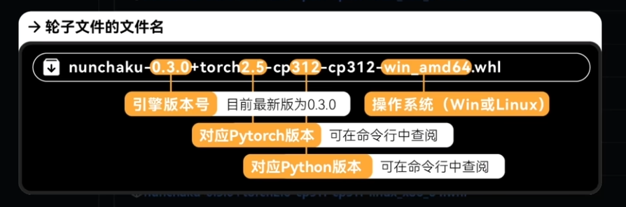

其中“Torch”代表Pytorch版本， "cp"就是Python版本

你可以做 comfyui启动时，看到这些信息：

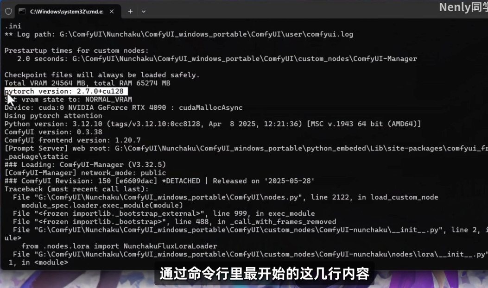

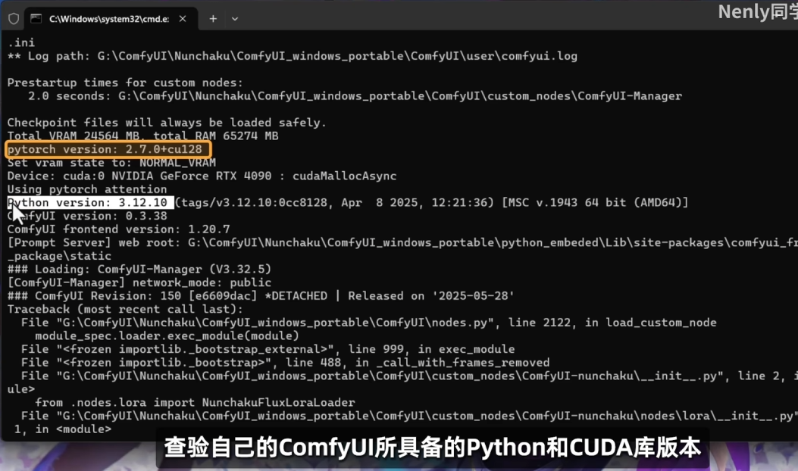

比如上面两张图， 教程作者的Python是3.12版本的，Pytorch是2.7.0版本的， 那我要找的轮子文件后面应该标注的就是“torch2.7-cp312"

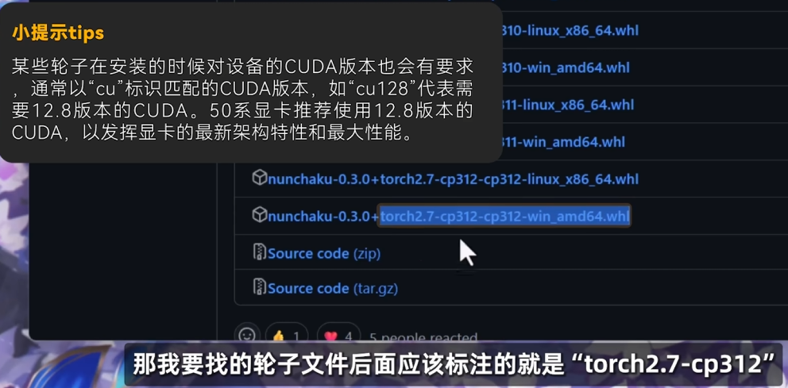

我自己的是：

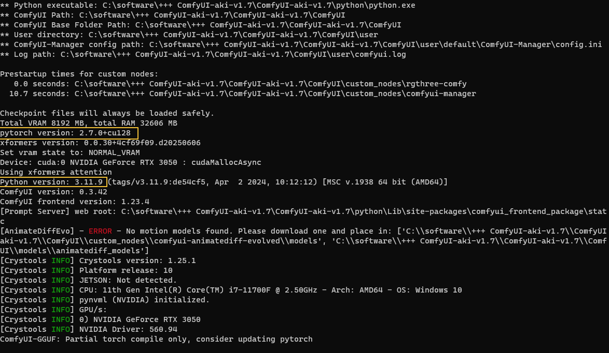

下载

https://huggingface.co/mit-han-lab/nunchaku/blob/main/nunchaku-0.3.1%2Btorch2.7-cp311-cp311-win_amd64.whl

然后， 把这个 nunchaku-0.3.1+torch2.7-cp311-cp311-win_amd64.whl 文件， 拷贝到 C:\software\+++ ComfyUI-aki-v1.7\ComfyUI-aki-v1.7\python 目录下

在该目录下， 按 cmd 打开dos， 输入以下命令来安装这个轮子文件 (即最新版)

....
python.exe -m pip install "C:\software\+++ ComfyUI-aki-v1.7\ComfyUI-aki-v1.7\python\nunchaku-0.3.1+torch2.7-cp311-cp311-win_amd64.whl"
....

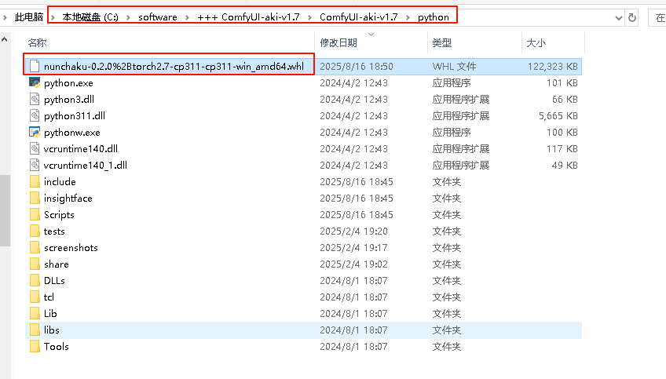

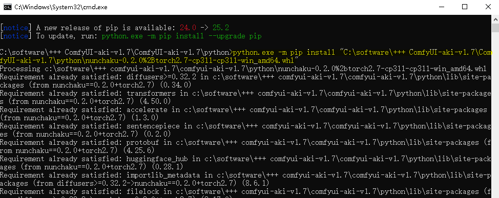

下面, 再次重启 comfyui, 就能 输入 nunchaku 节点了.

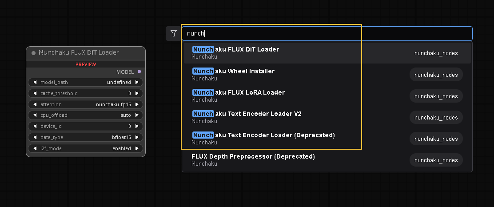

|3.下载模型
|地址 https://huggingface.co/collections/mit-han-lab/nunchaku-6837e7498f680552f7bbb5ad

flux模型Flux.1 Schnell和Flux. 1 Dev 有什麽區别？

- Flux.1 Schnell 專注于減少創建圖像所花費的時間, 但圖像的細節或複雜性會有所減少.
- Flux.1 Dev “Dev”代表“Developer”，意思是開發人員，它被認爲是爲那些想要深入使用 AI 模型的人設計的. 用于創建最高質量的圖像.

....
下载 Flux.1 模型
FLUX 模型有四个可选，FLUX.1 [dev] 、FLUX.1 [dev] fp8、FLUX.1 [schnell]、FLUX.1 [schnell] fp8；

FLUX.1 [dev] ：官方版本满配版，最低显存要求24G；下载地址： https://huggingface.co/black-forest-labs/FLUX.1-dev/tree/main

FLUX.1 [dev] fp8：大佬优化 [dev] 后版本，建议选择此版本，最低 12G 显存可跑；下载地址： https://huggingface.co/Kijai/flux-fp8/blob/main/flux1-dev-fp8.safetensors

FLUX.1 [schnell]：4步蒸馏模型，大多数显卡可跑。 下载地址： https://hf-mirror.com/black-forest-labs/FLUX.1-schnell/tree/main

FLUX.1 [schnell] fp8：优化 版本，适应更低的显卡配置。下载地址： https://huggingface.co/Kijai/flux-fp8/blob/main/flux1-schnell-fp8.safetensors
....

进入下面的链接: +
https://huggingface.co/nunchaku-tech/nunchaku-flux.1-schnell

每一个模型都提供了fp4 和 int4 两种量化格式的不同版本. *40系显卡及以前的显卡, 需要下载int4型号.*

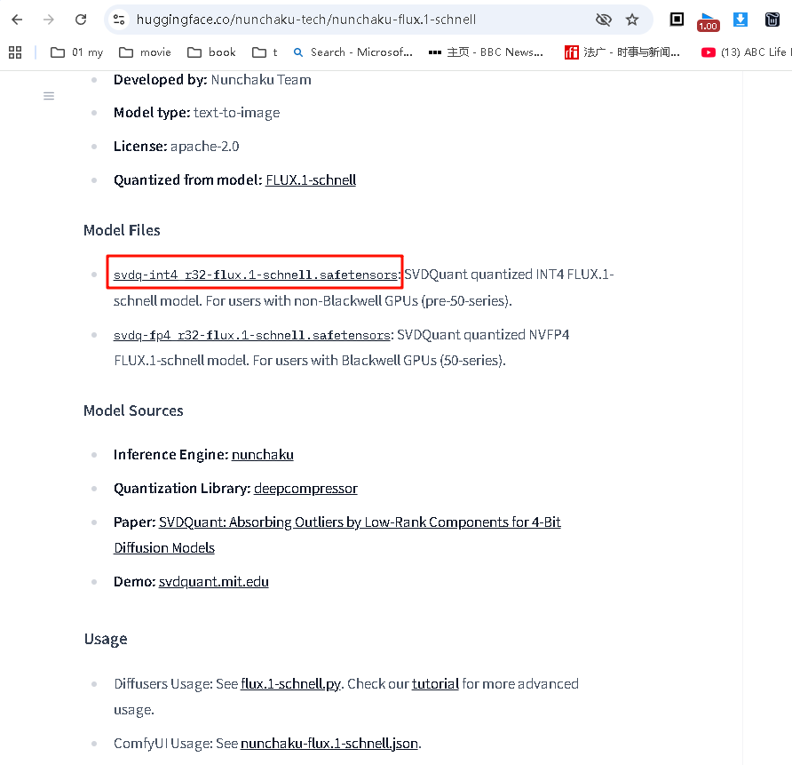

把模型放到下面的目录  C:\software\+++ ComfyUI-aki-v1.7\ComfyUI-aki-v1.7\ComfyUI\models\diffusion_models

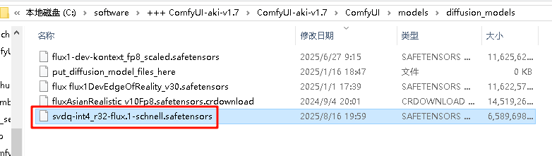

|官方工作流
|https://nunchaku.tech/docs/ComfyUI-nunchaku/workflows/toc.html

下载这个来试用 :

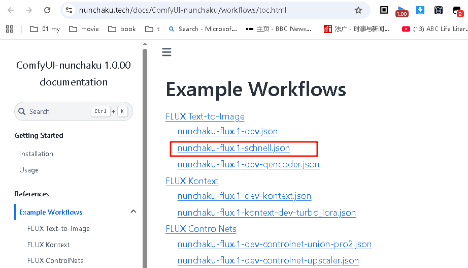

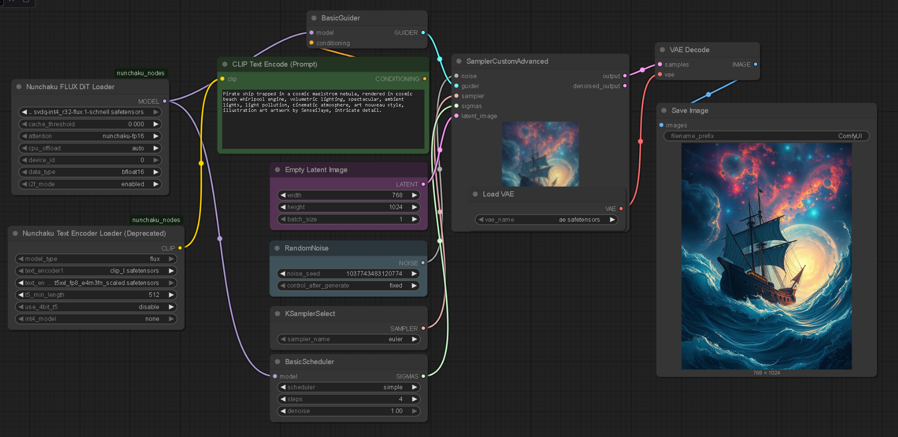

|===
