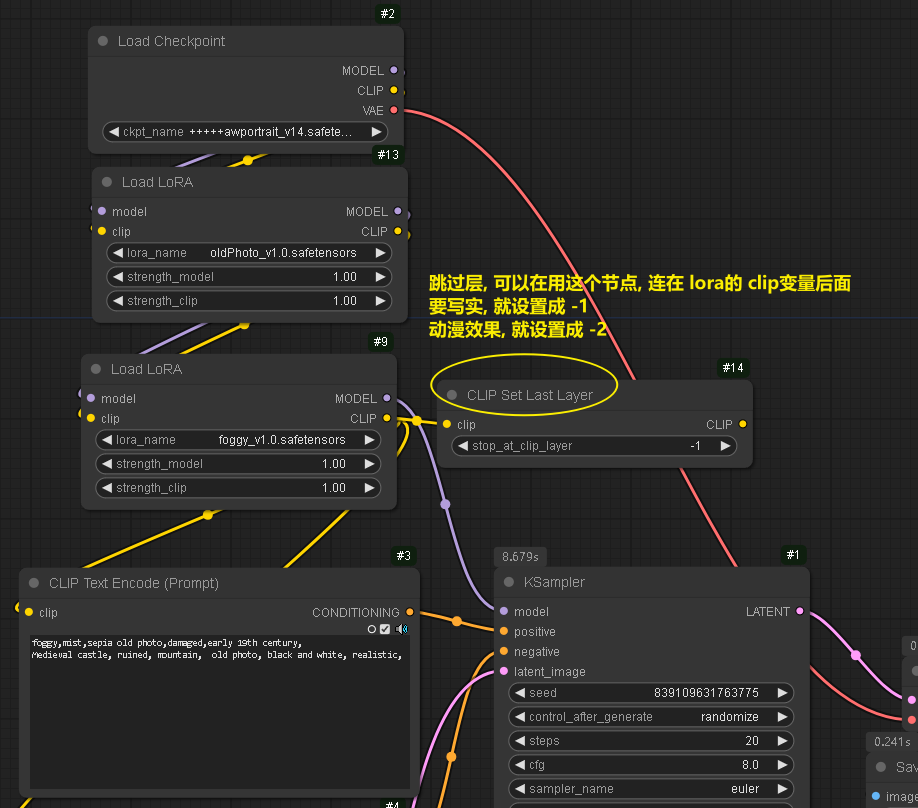
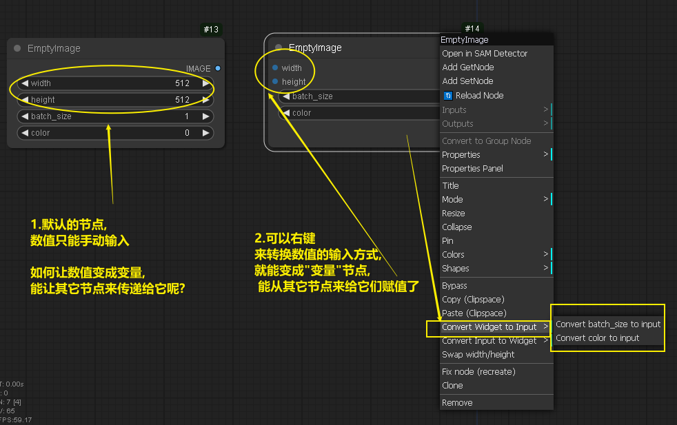
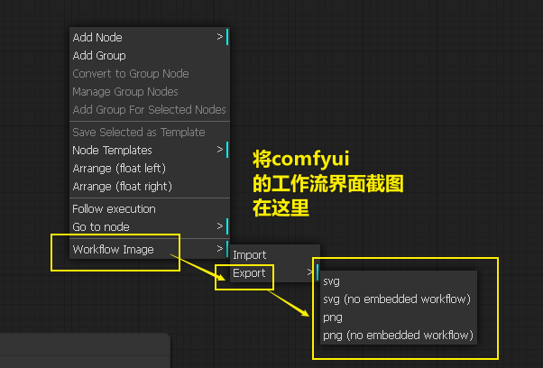

= comfyUI 001
:toc: left
:toclevels: 3
:sectnums:
//:stylesheet: myAdocCss.css

'''

==== 肖像大师

原版 +
https://github.com/florestefano1975/comfyui-portrait-master/

汉化版 +
https://github.com/ZHO-ZHO-ZHO/comfyui-portrait-master-zh-cn

'''

== 第一课: 生成一张图片 (没用到lora)

image:img/0003.png[,]

image:img/0004.png[,]

image:img/0005.png[,]

image:img/0006.png[,]

image:img/0007.png[,]

image:img/0008.png[,]

image:img/0009.png[,]

image:img/0010.png[,]

image:img/0011.png[,]

image:img/0012.png[,]

'''

== 第二课: 控制画面上元素的生成位置

image:img/0013.png[,]

image:img/0014.png[,]

image:img/0015.png[,]

image:img/0016.png[,]

image:img/0017.png[,]

image:img/0018.png[,]

注意: 负向提示词节点, 也要添加

image:img/0019.png[,]

image:img/0020.png[,]

image:img/0021.png[,]

image:img/0022.png[,]

image:img/0023.png[,]

image:img/0024.png[,]

image:img/0025.png[,]

image:img/0026.png[,]

image:img/0027.png[,]

image:img/0028.png[,]

'''

== 添加 lora 模型

image:img/0029.png[,]

image:img/0030.png[,]

image:img/0029.png[,]

image:img/0030.png[,]

image:img/0031.png[,]

image:img/0032.png[,]

现在, 就能运行了.

'''

== clip 跳过层 的设置

'''

== workflow 工作流

当你下载了一个workflow并加载后，如果发现有大量的红色节点, 这是因为缺失了一些custom node，并且ComfyUI已经把缺的列出来了. 这时只需打开Manager，点击Install Missing Custom Nodes, 它会自动把这个workflow需要补充的插件摆好.

image:img/0036.png[,]

'''

== 将手动输入中输入框, 变成变量节点, 能从其它节点来赋值给它们

'''

== 截图整个工作流

