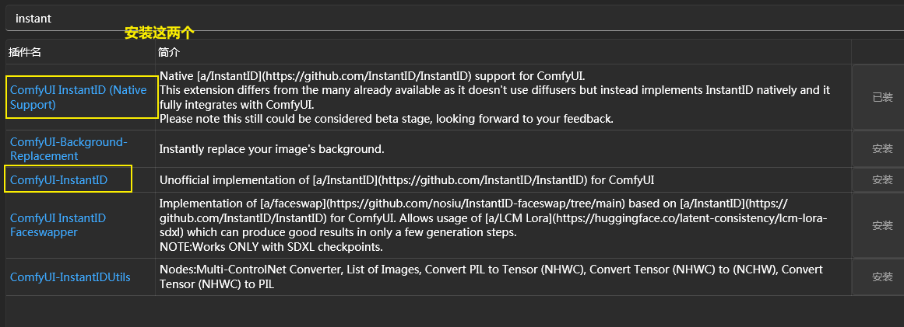
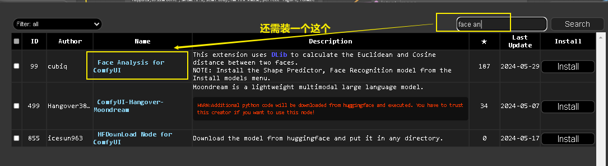
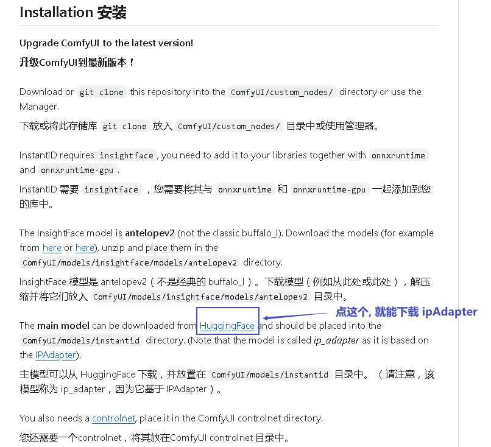
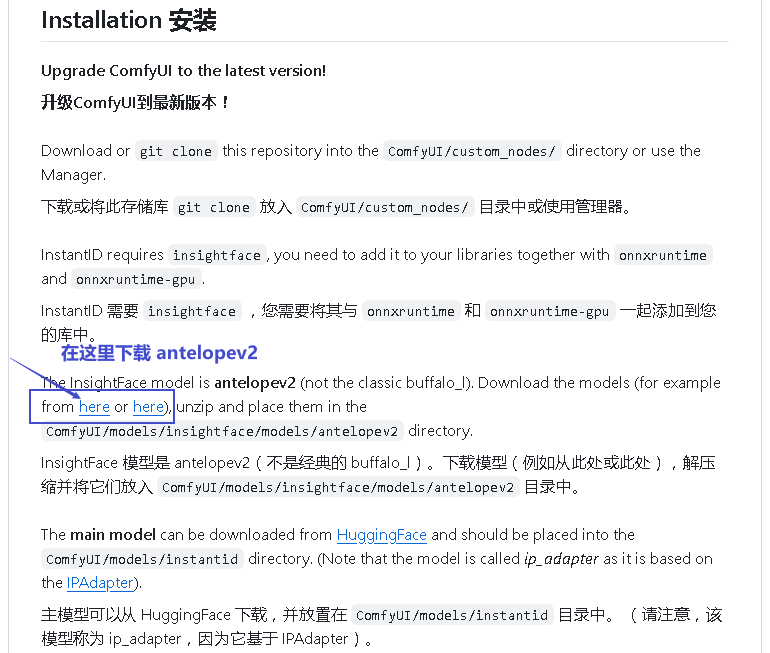
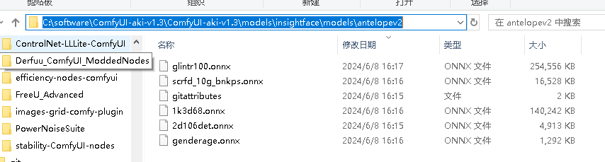
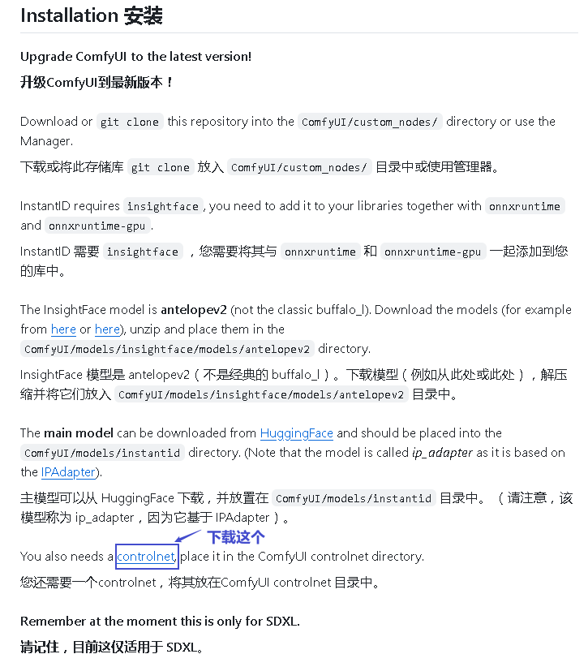

= instant id
:toc: left
:toclevels: 3
:sectnums:
:stylesheet: myAdocCss.css

'''

== comfyui版 instant id

官网
https://github.com/cubiq/ComfyUI_InstantID

https://github.com/ZHO-ZHO-ZHO/ComfyUI-InstantID/blob/main/README.md

[.small]
[options="autowidth" cols="1a,1a"]
|===
|Header 1 |Header 2

|安装节点 instant id
|

| 下载 IPAdapter
|地址是 https://github.com/cubiq/ComfyUI_InstantID

然后把下载下来的文件, 放入下面的目录中 +
C:\software\ComfyUI-aki-v1.3\ComfyUI-aki-v1.3\models\instantid

|下载 antelopev2
|

放入这个目录中: +
C:\software\ComfyUI-aki-v1.3\ComfyUI-aki-v1.3\models\insightface\models\antelopev2

|下载 controlnet 文件
|放入下面的目录中
C:\software\ComfyUI-aki-v1.3\ComfyUI-aki-v1.3\models\controlnet

|===

工作流如图: +

