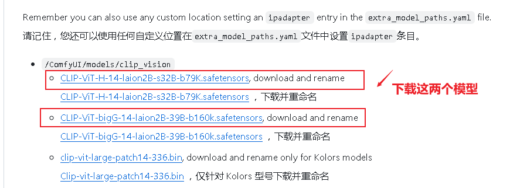
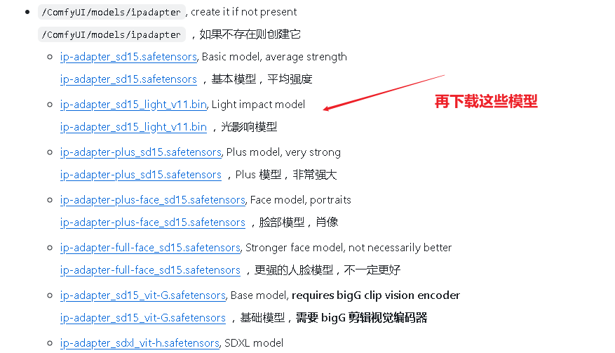
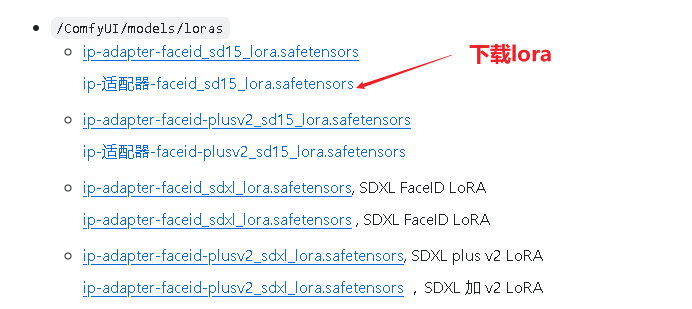
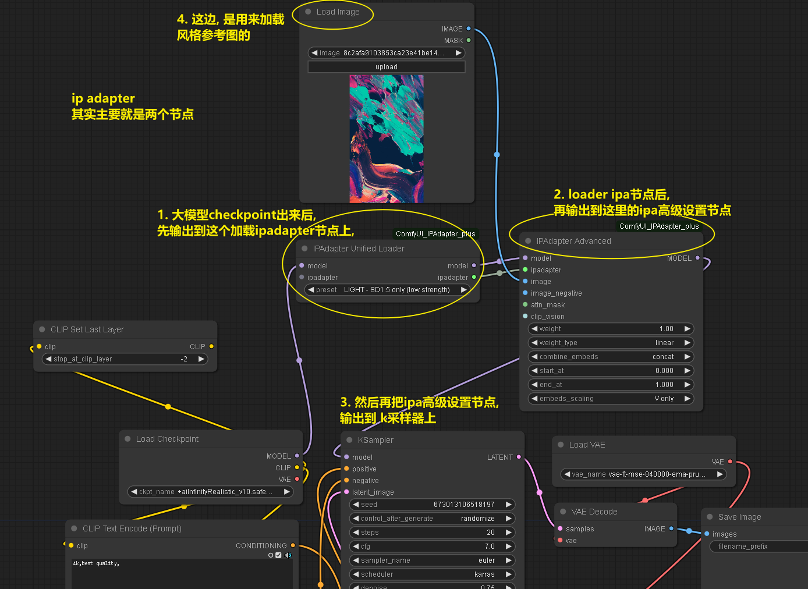

= comfyui IPAdapter
:toc: left
:toclevels: 3
:sectnums:
:stylesheet: myAdocCss.css

'''

== 安装

https://github.com/cubiq/ComfyUI_IPAdapter_plus

[.small]
[options="autowidth" cols="1a,1a"]
|===
|Header 1 |Header 2

|1.下载这两个模型
|

放到你的这个目录中: +
/ComfyUI/models/clip_vision

|2.下载
|

存放到 +
/ComfyUI/models/ipadapter ，如果不存在则创建它

|3.下载lora
|

放到这个目录 +
/ComfyUI/models/loras

|===

让后就能用 IPAdapter 了

注意: 强烈推荐用 controlnet 来固定住画面深度, 这样人物才会保持固定姿势

