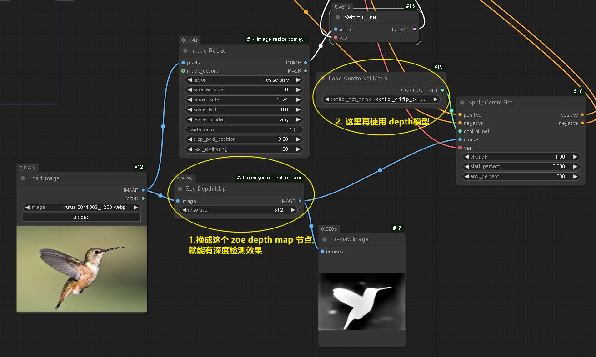

= comfyui controlnet
:toc: left
:toclevels: 3
:sectnums:
:stylesheet: myAdocCss.css

'''

== controlnet 模型的存放位置

C:\software\+++ComfyUI-aki-v1.3\ComfyUI-aki-v1.3\models\controlnet

'''

== ★ controlNet Openpose

image:img/0088.png[,]

下面的不用看了

image:img/0037.png[,]

'''

== ★ controlNet Depth 深度

直接修改上面的 openpose 工作流就行了,

'''

