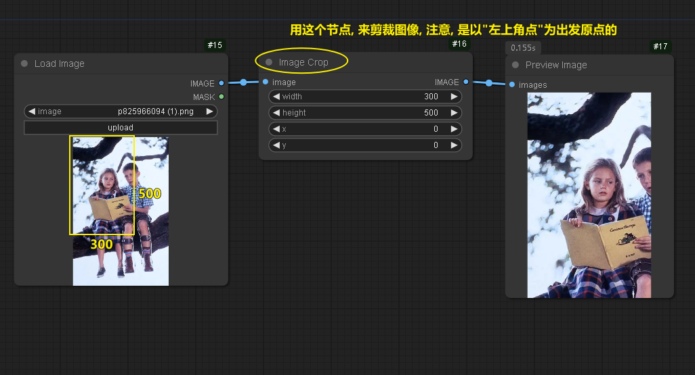
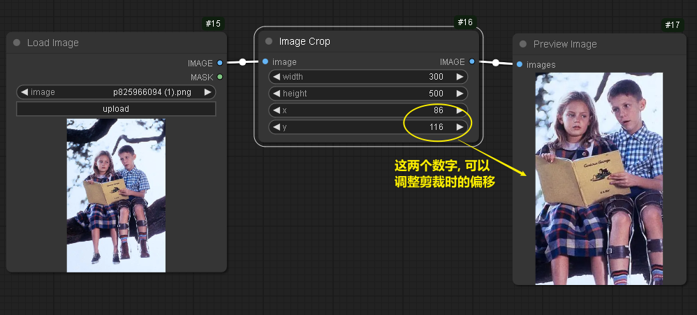
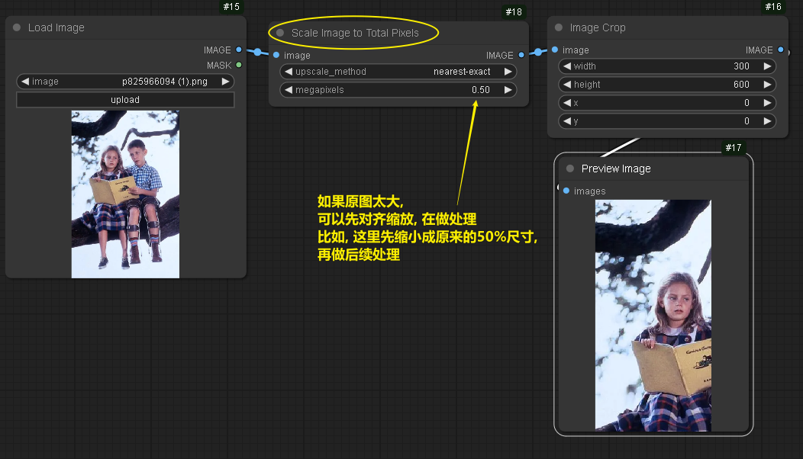

= comfyui 图片处理
:toc: left
:toclevels: 3
:sectnums:
:stylesheet: myAdocCss.css

'''

== 剪裁图片 -> image crop 节点

'''

== 缩小原始图片 -> scale image to total pixels 节点

'''

== comfyui 放大图片

=== 方法1 : 先放大图片, 再送到潜空间中处理 (亲测放大效果不自然)

[.small]
[options="autowidth" cols="1a,1a"]
|===
|Header 1 |Header 2

|1.需要先下载一个 stable-diffusion-x4-upscaler 模型
|地址是: +
https://huggingface.co/stabilityai/stable-diffusion-x4-upscaler

image:/img/0105.png[,]

image:/img/0106.png[,]

image:/img/0107.png[,]

|2.使用 sd 4x upscale conditioning 节点
|image:/img/0108.png[,]

|===

'''

=== ★★ 方法2, #潜空间内放大 (推荐) , 需要二次采样#

image:/img/0118.png[,]

'''

=== 方法3: 潜空间外放大

注意: 下面的放大模型, 不要选截图中的那个, 效果不好. 可以用其它的任意模型都行.

image:/img/0119.png[,]

'''

=== #方法4: 分块放大图片#

[.small]
[options="autowidth" cols="1a,1a"]
|===
|Header 1 |Header 2

|1.首先, 我们要安装这个模型
|image:/img/0120.png[,]

|2.
|image:/img/0121.png[,]
|===

