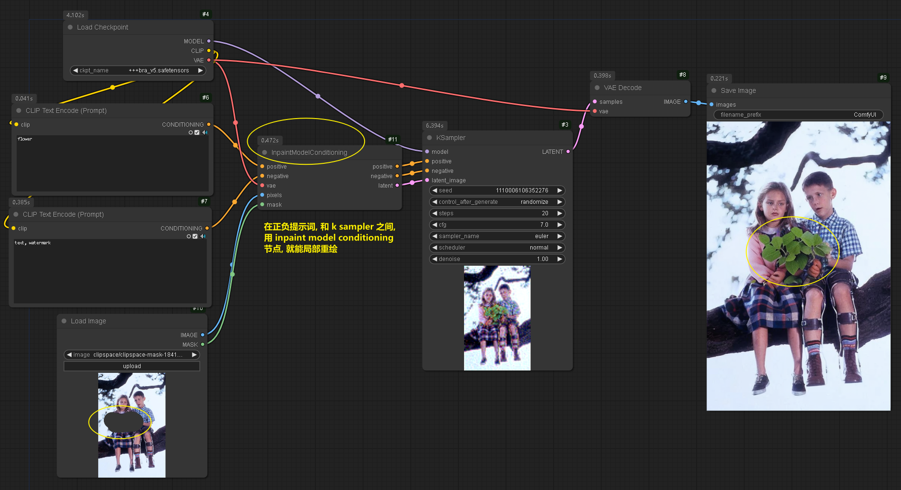
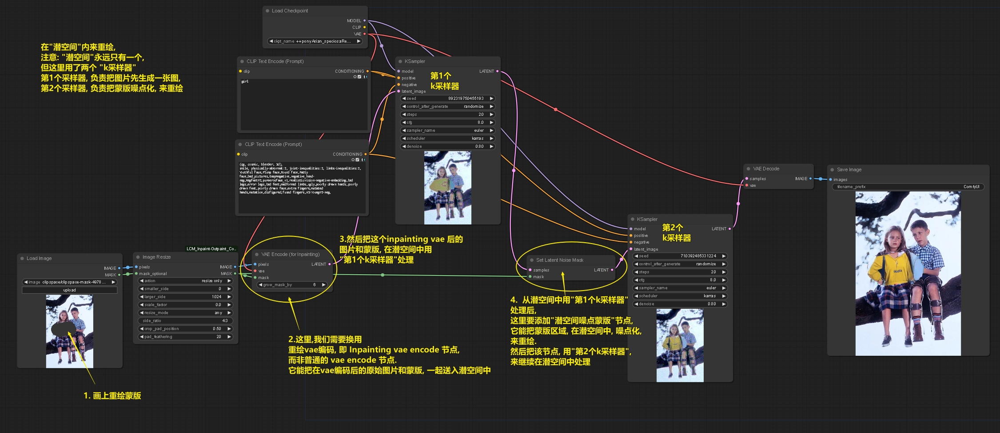
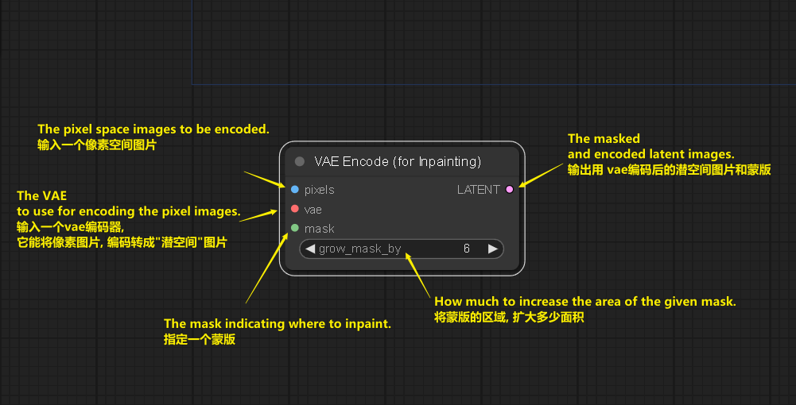
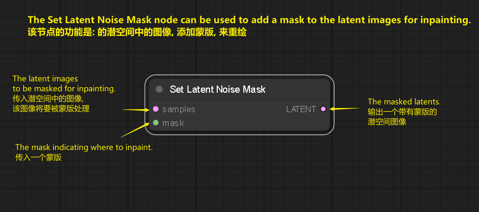
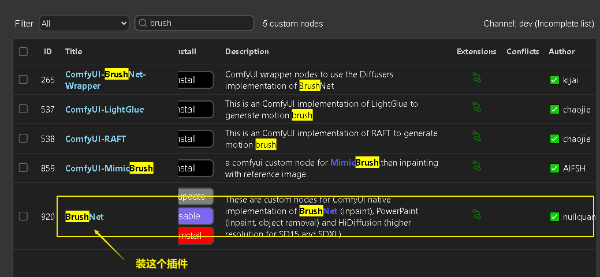
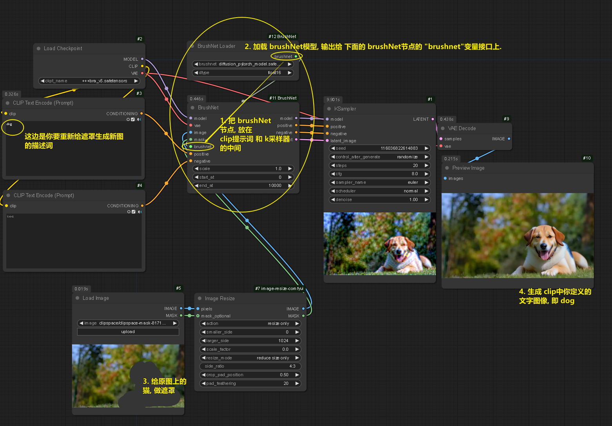

= comfyui 局部重绘
:toc: left
:toclevels: 3
:sectnums:
:stylesheet: /myAdocCss.css

'''

== 方法1 -> 使用 in paint model conditioning 节点

== 方法2

'''

==== vae encode for inpainting 节点说明

官方说明: +
https://blenderneko.github.io/ComfyUI-docs/Core%20Nodes/Latent/inpaint/VAEEncodeForInpainting/

The _VAE Encode For Inpainting_ node can be used to encode (v.) _pixel space_ images into _latent space_ images, using the provided VAE. It also takes a mask for inpainting, indicating to _a sampler node_ which parts of the image should be denoised. The area of the mask can be increased using _grow_mask_by_ to provide the inpainting process with some additional padding to work with.

VAE Encode For Inpainting 节点, 用来将"像素空间"的图片, 转成"潜空间"中的图片, 并且它还带有蒙版区域. 该蒙版在潜在空间中, 会被噪点化. 这块蒙版区域, 能用 grow_mask_by 来增加蒙版的面积.

'''

==== Set Latent Noise Mask 节点说明

官方说明: +
https://blenderneko.github.io/ComfyUI-docs/Core%20Nodes/Latent/inpaint/SetLatentNoiseMask/

'''

== brushNet 插件

官网 +
https://github.com/nullquant/ComfyUI-BrushNet

[.small]
[options="autowidth" cols="1a,1a"]
|===
|Header 1 |Header 2

|1.下载 brushNet 插件
|

|2.下载模型
| - ① `diffusion_pytorch_model.safetensors` 模型, 和 ② `pytorch_model.bin` 模型, 放入 C:\software\+++ComfyUI-aki-v1.3\ComfyUI-aki-v1.3\models\inpaint 目录中 +
模型下载地址: https://huggingface.co/JunhaoZhuang/PowerPaint-v2-1/tree/main/PowerPaint_Brushnet

- ③ `model.safetensors` 模型, 放到 C:\software\+++ComfyUI-aki-v1.3\ComfyUI-aki-v1.3\models\clip 目录中 +
模型下载地址:  https://huggingface.co/ashllay/stable-diffusion-v1-5-archive/tree/main/text_encoder

|使用方法
|第1步: 把 brushnet节点, 放到 clip提示词, 和 k sample 采样器中间就行了.  +
第2步: 然后别忘了给 brushNet节点, 加载一个 brushNet 模型.

|===

'''

