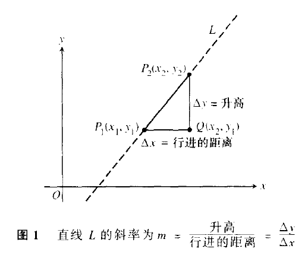
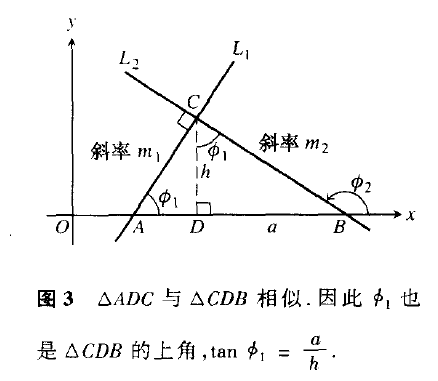
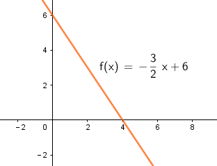
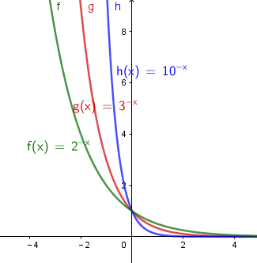
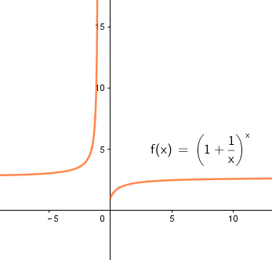
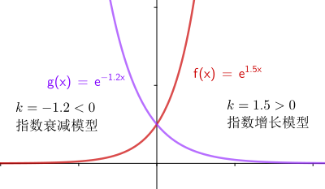
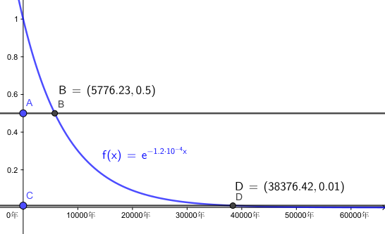

= 直线
:toc:
---

== 直线

==== 斜率 -> stem:[  m = \frac{\Delta y}{\Delta x}]
斜率 slope (数学中用 m 表示):: 每进行单位距离时, 高度的变化称为直线的"斜率".

\begin{align}
\boxed{
m = \frac{升高}{行进的距离} = \frac{\Delta y}{\Delta x} = \frac{y_2 - y_1}{x_2 - x_1}
}
\end{align}

- 直线与 x轴的夹角小于90度，斜率为“正”. 正斜率表示匀速增加。
- 直线与 x轴的夹角大于90度，斜率为“负”. 负斜率表示匀速减 (随着x的增加, y减小)。

---

==== 两条互相垂直的直线的斜率 -> stem:[  m_1 * m_2 = -1]

两条互相垂直的直线 stem:[ L_1 ] 和 stem:[  L_2], 其斜率满足:
\begin{align}
m_1 * m_2 = -1
\end{align}

即: 每个斜率是另一个斜率的"负倒数":

\begin{align}
m_1 = \frac{1}{m_2}, \\
m_2 = \frac{1}{m_1}
\end{align}

论证如下:

\begin{align}
& L_1的斜率 m_1 = tan \phi_1 = \frac{a}{h} \\
& L_2的斜率 m_2 = tan \phi_2 = - \frac{h}{a} \\
& \therefore m_1 * m_2 = -1
\end{align}

---

==== 直线的方程 : 点斜式 -> stem:[  y =  m(x - x_1) + y_1 ]

只要我们知道两点信息: 1. 直线的斜率, 2. 直线上的任意一点P的坐标 (stem:[ P_1 (x_1, y_1) ]), 就能写出它的方程:
\begin{align}
& \because \frac{y - y_1}{x - x_1} = m \\
& \therefore (y - y_1) = m(x - x_1) \\
& y =  m(x - x_1) + y_1 <- 即 "点斜式"方程
\end{align}

点斜式:
\begin{align}
\boxed{
y =  m(x - x_1) + y_1 \\
m: 是直线的斜率 \\
(x_1, x_2) : 是直线上的任意一点的坐标
}
\end{align}

.标题
====
例如： 某直线过点(2,3), 且斜率是 stem:[ - 3/2 ], 该直线方程是什么?

根据点斜式:
\begin{align}
& y =  m(x - x_1) + y_1  \\
& y = -\frac{3}{2}(x-2) + 3 \\
& y = -\frac{3}{2}x + 6
\end{align}

====

---

==== 直线的方程: 斜截式 -> stem:[ y = mx + y轴截距b  ]

斜截式:
\begin{align}
\boxed{
y = mx + b \\
m: 斜率 \\
b : 是直线在y轴上的截距
}
\end{align}

---

==== 直线的方程: 一般线性方程 -> stem:[Ax +By = C  ]

一般线性方程
\begin{align}
\boxed{
Ax +By = C \quad (A和B 不全为0)
}
\end{align}

.标题
====
例如： 直线 stem:[ 8x + 5y = 20] 的斜率和 y轴上的截距是多少?

思考: 为了知道该直线的斜率和y轴截距, 我们先把它写成"斜截式" stem:[ y = mx + y轴截距b] :

\begin{align}
& 8x + 5y = 20 \\
& 5y = 20 - 8x \\
& y = -\frac{8}{5}x + 4 <- 斜截式 y = mx + y轴截距b
\end{align}

所以, 斜率就是 stem:[ m =  -8/5 ], y轴截距 stem:[ b=4]
====

---

== 绝对值函数 -> stem:[ y = |x| ]

\begin{align}
|x| = \begin{cases}
-x, \quad x<0 \\
x, \quad x \ge 0
\end{cases}
\end{align}

图像是y轴以上的部分, 因为它是 f(x) = |x|, y值是>0 的.

image:img_thomas_calculus/calculus_004.png[]

可以看出, 绝对值函数是"偶函数", 图像关于y轴对称.

---

==== 绝对值的性质

\begin{align}
& |-a| = |a| \\
& |ab| = |a| * |b| \\
& |\frac{a}{b}| = \frac{|a|}{|b|} \\
& |a+b| \le |a| + |b| <- 比如: |-2+1| \le |-2| + |1|
\end{align}

---

== 位移图像 -> y = f(x+水平位移) + 垂直位移

[options="autowidth" cols="1a,1a"]
|===
|Header 1 |Header 2

|\begin{align}
y = f(x) + 垂直位移vertical
\end{align}
|- v > 0 : 图像"向上"移位 v 个单位. +
- v < 0 : 图像"向下"移位 \|v\| 个单位. +

image:img_thomas_calculus/calculus_005.png[300,300]

|\begin{align}
y = f(x + 水平位移horizontal)
\end{align}
|- h > 0 : 图像"向左"移位 h 个单位. +
- h < 0 : 图像"向右"移位 \|h\| 个单位. +

image:img_thomas_calculus/calculus_006.png[]
|===

---

== 复合函数 -> stem:[  f(g(x))] <- 其实就是编程中的嵌套函数. 一个函数的输出值, 作为另一个函数的输入值

\begin{align}
f(g(x)) = (f \circ g)(x)
\end{align}

---

== 指数函数(x在指数上) -> stem:[ f(x) = a^x ] <- 即 常数a 自己乘以自己 x 次

image:img_thomas_calculus/calculus_007.png[]

可以看出, x在0两边时, 即x是正数或负数, 对于y值的大小影响, 完全不同:

- 当x >0 时,  常数a越大, y值越大
- 当x <0 时,  常数a越大, y值越小

如果 x 是负数的话, 图形就相当于是 x是正数时的 沿y轴对称的图像.

==== 指数法则:

若 a>0, b>0 , 对所有实数 x, y, 以下结果成立:

\begin{align}
\boxed{
a^x * a^y = a^{x+y} \\
\frac{a^x} {a^y} =  a^{x-y} \\
(a^x) ^y = (a^y) ^x = a^{xy} \\
a^x * b^x = (ab)^x \\
\frac{a^x} {b^x} =  (\frac{a}{b})^x
}
\end{align}

---

== 自然指数函数 stem:[ e^x], stem:[ e = \lim_{n \to \infty}(1+ \frac{1}{n})^n]

对自然, 物理和经济现象的建模中, 用到的最重要的指数函数, 是"自然指数函数" : 它的基地是 e, 即 2.718 281 828.

#e, 其实就是 函数stem:[ f(x) = (1+\frac{1}{x})^x] 当 x 无穷增大时的极限.#

image:img_thomas_calculus/calculus_010.png[]

.标题
====
例如： +
你有1元钱存入银行，年利率是100%，则1年收到的2元；

假设银行会一个月算一次，月利率是1/12，那么一年得到的是:
\begin{align}
1*(1+\frac{1}{12})^{12} \approx 2.61
\end{align}

假设银行会一天算一次，天利率是1/365，那么一年得到是:
\begin{align}
1*(1+\frac{1}{365})^{365} \approx 2.71
\end{align}

假设银行丧心病狂，每时每刻都给你算一次利率，取极限：
\begin{align}
\boxed{
\lim_{n \to \infty}(1+ \frac{1}{n})^n = e
}
\end{align}

例子中给出的是年利率是100%，银行给你算复利的极限便是e。

'''

当然如果年利率不是100%，而是c的话，最终得到的极限复利, 是e的c次幂, 即 stem:[e^c]。

如:
作为指数增长的一个例子, 连续复利, 就用到模型:
\begin{align}
\boxed{
y = P * e^{rt} \\
P : 是初始投资额 \\
e : = \lim_{n \to \infty}(1+ \frac{1}{n})^n \\
r : 即 rate, 是利率 \\
t : time, 是按年计的时间.
}
\end{align}

例如: 年利率为 5.5%, 在1996投资100美元, 按连续复利计算, 到2010年时, 总金额会达到多少?

代入连续复利公式, 即:
\begin{align}
& f(t) = P * e^{rt} \\
& f(2010-1996) = 100 * e^{0.055 * (2010-1996)} \\
& f(4) = 100* e^{0.22} \\
& \approx 124.61
\end{align}

====

自然指数函数, 常被用作指数增长或衰减模型:
\begin{align}
\boxed{
 y = e^{kx} \\
k: 是一个非零常数
}
\end{align}

[options="autowidth"]
|===
|stem:[ y = y_0 * e^{kx} ] |Header 2

|k>0 时
|为"指数增长"的模型

|k<0 时
|为"指数衰减"的模型
|===

.标题
====
例如： 放射性衰减模型
\begin{align}
\boxed{
y(t) = y_0 * e^{-rt}, \quad r>0 \\
y_0 : 为初始时刻 t=0 时, 放射性物质的数量 \\
r : rate, 为放射性物质的衰减率.
}
\end{align}

当t 用年份度量时, 碳-14 衰减率约为 stem:[ r = 1.2 * 10^-4]

问: 866年后, 碳-14 所占的百分比是多少?

\begin{align}
& y(t) = y_0 * e^{-rt} \\
& y(866) = y_0 * e^{(- 1.2 * 10^{-4}) * 866} \\
& \approx (0.901)y_0
\end{align}

即 : 866年后, 原有的碳-14中, 还有90%的量留存. 即约有 10% 被衰减掉了.

碳-14的半衰期约为5730±40年. 所以用上面的衰减公式表示就是:
\begin{align}
& y(t) = y_0 * e^{-rt} \\
& \frac{1}{2} = y_0 * e^{-r*5730} \\
& 当 y_0 = 1 时, r =  - 1.2 * 10^{-4}
\end{align}

从上图可以看出, 如果初始含量为1的话:

- 经过5776年, 碳-14含量降到初始的50%;
- 经过3.8万年后, 含量降到初始的1%.

====

---

== 反函数 stem:[f^{-1 }] -> 就像时光机器, 输入原y值, 就输出原x值

若 f 和 g 互为"反函数" 则它们满足下面这种关系:

\begin{align}
& fnF(原fnG的y) = 原fnG的x <- fnF能作为fnG的时光机器, 将 fnG的输入和输出逆转过来 \\
& 即:  f \circ g (x) = x \\
\\
& 并且 fnG(原fnF的y) = 原fnF的x <- fnG 能作为fnY的时光机器 \\
& 即:  g \circ f (x) = x \\
& \\
& g = f^{-1}, 而且 f = g^{-1} <- 即f 和g互为对方的反函数
\end{align}

.标题
====
例如：
stem:[f(x) = 3x ] 和 stem:[  g(x) = \frac{x}{3} ]它们是否互为反函数?

1. 我们先把 g的y值 代入 f 中, 看看 f 能否作为 g 的时光机器, 输入g的Y值后, 能输出g的X值.

\begin{align}
f(g(x)) = 3(g的Y值) = 3(\frac{x}{3}) = x <- 即g的x值
\end{align}

上面输入g的y值, 发现输出了 g 的 x值. 所以 f 能够作为 g 的时光机器. 即 g 是 f 的反函数.

2. 我们再来看看 g 能否作为 f 的时光机器?

\begin{align}
g(f(x)) = \frac{f的Y值}{3} = \frac{3x}{3} = x <- 即输出了 f 的x值
\end{align}

所以, g也能够当做 f 的时光机器.

所以它们互为对方的反函数.
====

求反函数

---

38

