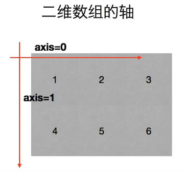
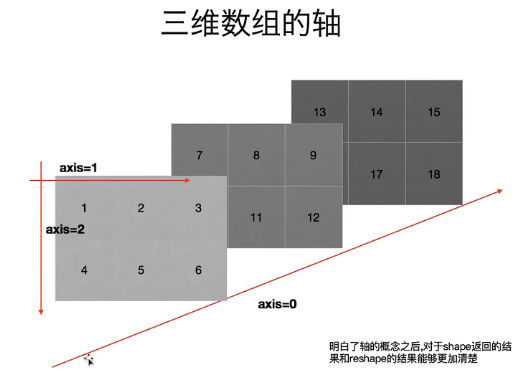
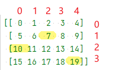

title:: main_numpy

- 官方文档
  collapsed:: true
	- https://numpy.org/devdocs/
- 安装 numpy
  collapsed:: true
	- 官方pip命令
	  collapsed:: true
		- pip3 install --user numpy scipy matplotlib
	- 清华源
	  collapsed:: true
		- pip3 install numpy scipy matplotlib -i https://pypi.tuna.tsinghua.edu.cn/simple
	- 国内源地址 : 在使用pip的时候加参数 -i
	  collapsed:: true
		- 清华大学：https://pypi.tuna.tsinghua.edu.cn/simple
		- 华为云：https://repo.huaweicloud.com/repository/pypi/simple
		- 阿里云：http://mirrors.aliyun.com/pypi
	- 测试是否安装成功
	  collapsed:: true
		- ```python
		  from numpy import *
		  
		  print(eye(4)) # 会输出一个4阶单位阵 
		  ```
-
- ---
- 轴
  collapsed:: true
	- 
	- 
	-
- 数据的类型
	- nan : not a number 表示它不是一个数字
		- 你可以强制指定数组中的某个元素为nan. 但前提是, 该数组中的元素必须是 float 浮点类型保存的, 而不能是用 int整型保存的. 换言之, 如果你的数组是 int 的, 就要先把它转成 float类型, 然后才能将某元素强制指定为 nan类型.
		  collapsed:: true
			- ```python
			  import numpy as np
			  
			  a1 = np.arange(12) # type:ndarray
			  a1 = a1.reshape((3, 4))
			  print(a1)
			  
			  '''
			  [[ 0  1  2  3]
			   [ 4  5  6  7]
			   [ 8  9 10 11]]
			   '''
			  
			  print(a1.dtype) # int32
			  # a1[1,2] =  np.nan # 报错 ValueError: cannot convert float NaN to integer
			  
			  #所以我们先要把数组转成 float类型来存储
			  a1 = a1.astype(float)
			  a1[1,2] =  np.nan # 将 index=行1列2 的元素, 赋值为nan
			  print(a1)
			  
			  '''
			  [[ 0.  1.  2.  3.]
			   [ 4.  5. nan  7.]
			   [ 8.  9. 10. 11.]]
			   '''
			  ```
		-
	- inf : infinity 无穷
		- 当你用一个数字除以0时, 就会返回 inf
- ---
- 增
	- 创建 ndarray 数组 -> np.arange(num1, num2, num3, ...)
	  collapsed:: true
		- ```python
		  import numpy as np
		  
		  # 方法1:
		  a1 = np.array([1,2,3]) # 创建ndarray数组
		  print(a1) # [1 2 3]
		  print(type(a1)) # <class 'numpy.ndarray'> ndarray 就是 numpy中 的数组类型
		  
		  ---
		  
		  # 方法2:
		  a2 = np.array(range(10))
		  print(a2) # [0 1 2 3 4 5 6 7 8 9]
		  
		  ---
		  
		  # 方法3:
		  a3 = np.arange(10)
		  print(a3) # [0 1 2 3 4 5 6 7 8 9]
		  
		  a4 = np.arange(4,10,2) # 从4开始, 到不包括10, 步长为2. 
		  print(a4) # [4 6 8]
		  ```
		- 注意: np.arange()方法, 只能创建一个有终点和起点的固定步长的排列, 而不能由你自定义任意数值的矩阵. 要想自定义数值, 你只能用 np.array()方法
-
- ---
- 删
-
- ---
- 改
	- 加减乘除等运算
	  background-color:: #264c9b
		- 让两个数组, 对应元素相加
		  collapsed:: true
			- ```python
			  import numpy as np
			  
			  a1 = np.arange(6).reshape(2,3)
			  a2 = np.arange(100,106).reshape(2,3)
			  
			  print(a1)
			  '''
			  [[0 1 2]
			   [3 4 5]]
			  '''
			  
			  print(a2)
			  '''
			  [[100 101 102]
			   [103 104 105]]
			  '''
			  
			  
			  a3 = a1 + a2 # a1 和a2 数组中的 对应元素相加
			  print(a3 )
			  '''
			  [[100 102 104]
			   [106 108 110]]
			  '''
			  ```
		- 给数组中的每个元素, 同时加上 (加减乘除)一个数字
		  collapsed:: true
			- ```python
			  import numpy as np
			  
			  a1 = np.arange(10)
			  print(a1) # [0 1 2 3 4 5 6 7 8 9]
			  
			  a2 = a1 + 5 # 将a1数组中的每个元素, 都加上5
			  print(a2) # [ 5  6  7  8  9 10 11 12 13 14]
			  
			  a2 = a1 * 3 # 将a1数组中的每个元素, 都乘上3
			  print(a2) # [ 0  3  6  9 12 15 18 21 24 27]
			  ```
			-
		- 不同行列数的两个数组, 做加减乘除
			- 两个数组, "列数"相同: $a_{3 \times 4} - b_{1 \times 4}$
			  collapsed:: true
				- ```python
				  import numpy as np
				  
				  a = np.arange(12).reshape((3,4))
				  print(a)
				  
				  '''
				  [[ 0  1  2  3]
				   [ 4  5  6  7]
				   [ 8  9 10 11]]
				   '''
				  
				  b = np.arange(4)
				  print(b) # [0 1 2 3]
				  
				  print(a-b) # a是3行4列的, b是1行4列的, 那么这两个数组相减, 怎么减呢? 既然它们列数相同, 那就用每行上的相应列数元素, 来减. 即: 用a的每一行上的列元素, 去减b的行上的对应列元素.
				  
				  '''
				  [[0 0 0 0]  <- a的第1行中: a_11 - b_11, a_12 - b_12, a_13 - b_13, a_14 - b_14,
				   [4 4 4 4]  <- a的第2行中: a_21 - b_11, a_22 - b_22, a_23 - b_13, a_24 - b_14,
				   [8 8 8 8]] <- a的第3行中: a_31 - b_11, a_32 - b_12, a_33 - b_13, a_34 - b_14,
				   '''
				  ```
			- 两个数组, "行数"相同:  $a_{3 \times 4} - b_{3 \times 1}$
			  collapsed:: true
				- ```python
				  import numpy as np
				  
				  a = np.arange(12).reshape((3,4))
				  print(a)
				  
				  '''
				  [[ 0  1  2  3]
				   [ 4  5  6  7]
				   [ 8  9 10 11]]
				   '''
				  
				  b = np.arange(3).reshape((3,1)) # b是3行1列
				  print(b)
				  
				  '''
				  [[0]
				   [1]
				   [2]]
				   '''
				  
				  print(a-b) # a是3行4列, b是3行1列, 这两个数组相减, 既然它们行数相同, 那就用a的每一列上的"每个行元素", 去减b的列上的"对应行元素".
				  
				  '''
				  [[0 1 2 3]  <- = a_11-b_11, a_12-b_11, a_13-b_11, ...
				   [3 4 5 6]  <- = a_21-b_21, a_22-b_21, a_23-b_21, ...
				   [6 7 8 9]] <- = a_31-b_31, a_32-b_31, a_33-b_31, ...
				   '''
				  ```
	-
	- 修改形状, 行列数
	  background-color:: #264c9b
		- 对数组进行转置 -> obj.transpose()
		  collapsed:: true
			- ```python
			  import numpy as np
			  
			  a = np.arange(12).reshape((3,4))
			  print(a)
			  
			  '''
			  [[ 0  1  2  3]
			   [ 4  5  6  7]
			   [ 8  9 10 11]]
			  '''
			  
			  b = a.transpose() # 做转置, 即行变列, 列变行
			  print(b)
			  
			  '''
			  [[ 0  4  8]
			   [ 1  5  9]
			   [ 2  6 10]
			   [ 3  7 11]]
			  '''
			  ```
		- 修改数据的行列数 -> obj.reshape( (新行数,新列数) )
			- 该方法, 输入一个tuple作为参数. 将新的行数和列数, 放在tuple中.
			  collapsed:: true
				- ```python
				  a1 = np.arange(24)
				  print(a1.shape) # (24,)
				  
				  a1 = a1.reshape((2,3,4)) # 改成三层嵌套, 相当于是3维空间的.
				  '''
				  改成3层列表嵌套: 
				  第一层是两个list, 
				  第二层的每个list中, 又包含3个list. 
				  第三层的每个list中, 又包含4个数值. 
				  于是就共有 2*3*4 = 24个数值.
				  '''
				  
				  print(a1)
				  
				  '''
				  [[[ 0  1  2  3]
				    [ 4  5  6  7]
				    [ 8  9 10 11]]
				  
				   [[12 13 14 15]
				    [16 17 18 19]
				    [20 21 22 23]]]
				   '''
				  
				  ---
				  
				  print(a1.shape) # (2, 3, 4)
				  
				  a1_2Dimension = a1.reshape((2,12)) # 重新改成2行12列,即二维空间中的值
				  
				  print(a1_2Dimension)
				  
				  '''
				  [[ 0  1  2  3  4  5  6  7  8  9 10 11]
				   [12 13 14 15 16 17 18 19 20 21 22 23]]
				  '''
				  
				  print(a1_2Dimension.shape) # (2, 12)
				  ```
			- 升维
				- 将数组, 改成两层嵌套的 3行4列
				  collapsed:: true
					- ```python
					  a1 = np.arange(12)
					  print(a1.shape) # (12,)
					  
					  a1 = a1.reshape((3,4)) # 进行修改, 改成3行4列
					  print(a1)
					  
					  '''
					  [[ 0  1  2  3]
					   [ 4  5  6  7]
					   [ 8  9 10 11]]
					   '''
					  
					  print(a1.shape) # (3, 4)
					  ```
				- 将数组, 改成3层嵌套
				  collapsed:: true
					- ```python
					  a1 = np.arange(24)
					  print(a1.shape) # (24,)
					  
					  a1 = a1.reshape((2,3,4)) # 改成三层嵌套, 相当于是3维空间的.
					  '''
					  改成3层列表嵌套:
					  第一层是两个list,
					  第二层的每个list中, 又包含3个list.
					  第三层的每个list中, 又包含4个数值.
					  于是就共有 2*3*4 = 24个数值.
					  '''
					  
					  print(a1)
					  
					  '''
					  [[[ 0  1  2  3]
					    [ 4  5  6  7]
					    [ 8  9 10 11]]
					  
					   [[12 13 14 15]
					    [16 17 18 19]
					    [20 21 22 23]]]
					   '''
					  ```
			- 降维
				- 将3维数组, 重新改为2维数组
				  collapsed:: true
					- ```python
					  print(a1.shape) # (2, 3, 4) <- a1目前是三维数组, 有三层嵌套.
					  
					  a1_2Dimension = a1.reshape((2,12)) # 重新改成2行12列,即二维空间中的值
					  
					  print(a1_2Dimension)
					  
					  '''
					  [[ 0  1  2  3  4  5  6  7  8  9 10 11]
					   [12 13 14 15 16 17 18 19 20 21 22 23]]
					  '''
					  
					  print(a1_2Dimension.shape) # (2, 12)
					  ```
				- 将多维数组, 改成1维数组 (即只有一行, 只有一个list)
				  collapsed:: true
					- ```python
					  import numpy as np
					  
					  a1 = np.arange(24)
					  a1 = a1.reshape((4,6)) # 先改成4行6列
					  print(a1.shape) # (4, 6)
					  
					  a1 = a1.reshape((24,)) # 改回一维数组. 即将列表中的全部24个元素, 放在一个list中.
					  print(a1) # [ 0  1  2  3  4  5  6  7  8  9 10 11 12 13 14 15 16 17 18 19 20 21 22 23]
					  ```
				- 将多维数组, 改成一维数组 -> 直接用 obj.flatten()方法
	-
	- 按条件修改
	  background-color:: #264c9b
		- 三元运算符 -> np.where(数组obj < 某个数, 为真的就赋值某个数, 不符合条件的就赋值某个数)
		  collapsed:: true
			- ```python
			  import numpy as np
			  
			  a1 = np.arange(12)
			  a1 = a1.reshape((3, 4))
			  
			  a1 = np.where(a1<6, 0, 10) # 对a1数组里面的元素, 若小于6的,就都赋值为0; 对大于等于6的, 就都赋值为10
			  print(a1)
			  
			  '''
			  [[ 0  0  0  0]
			   [ 0  0 10 10]
			   [10 10 10 10]]
			  '''
			  ```
		- obj.clip(a_min, a_max) -> 对于数组中的元素, 大于a_max的就使得它等于 a_max，小于a_min,的就使得它等于a_min。粗略说, 就是将头部段数值都变成同一个数, 将尾部段数值也都变成同一个数.
		  collapsed:: true
			- ```python
			  import numpy as np
			  
			  a1 = np.arange(20)
			  a1 = a1.reshape((5, 4))
			  
			  a1 = a1.clip(5,10) # 对a1数组里面的元素, 若小于5的,就都赋值为5; 对大于等于10的, 就都赋值为10
			  print(a1)
			  
			  '''
			  [[ 5  5  5  5]
			   [ 5  5  6  7]
			   [ 8  9 10 10]
			   [10 10 10 10]
			   [10 10 10 10]]
			  '''
			  ```
	-
-
- ---
- 查
	- 查看数组的属性
		- 查看数据类型 -> obj.dtype
		  collapsed:: true
			- ```python
			  a4 = np.arange(4,10,2) # 从4开始, 到不包括10, 步长为2
			  print(a4) # [4 6 8]
			  
			  print(a4.dtype) # int32
			  ```
		- 查看数据的行列数 -> obj.shape
		  collapsed:: true
			- obj.shape的返回值, 是个tuple, 第一个元素就是行数, 第二个元素就是列数.
			  collapsed:: true
				- ```python
				  a1 = np.array([[1,2,3],[4,5,6]])
				  print(a1.shape) # (2, 3) 两行三列
				  ```
			- 通过行列数, 就能计算出数组中元素的总数了, 即:  元素总数=行数 * 列数
			  collapsed:: true
				- ```python
				  import numpy as np
				  
				  a1 = np.arange(24)
				  a1 = a1.reshape((4,6)) # 先改成4行6列
				  
				  print(a1.shape) # (4, 6) <- 这是个元祖, 第一个数字是行数, 第二个数字是列数. 那么我们就能用索引, 来应用到它们了.
				  
				  print(a1.shape[0]) # 4 <- 元祖中的第一个item, 是行数
				  print(a1.shape[1]) # 6 <- 元祖中的第2个item, 是列数
				  
				  # 所以, 当我们不知道一个数组中到底有多少元素时, 也不知道它们被划分成了几行几列, 但我们想把它们变成一行, 就可以先查出它们的行数和列数, 就能知道: 元素总数 = 行数 * 列数.
				  a1_元素总数 = a1.shape[0] * a1.shape[1] # 行数 * 列数 = 一个数组中的元素总数
				  a1_oneLine = a1.reshape((a1_元素总数,))
				  print(a1_oneLine) # [ 0  1  2  3  4  5  6  7  8  9 10 11 12 13 14 15 16 17 18 19 20 21 22 23]
				  ```
			-
	-
	- 按条件查询
		- 按条件查询
		  collapsed:: true
			- ```python
			  import numpy as np
			  
			  a1 = np.arange(12)
			  a1 = a1.reshape((3,4))
			  
			  print(a1 < 10) # 可以直接用数学比较符号, 来查看数组中各个元素与某数相比的大小情况
			  
			  '''
			  [[ True  True  True  True]
			   [ True  True  True  True]
			   [ True  True False False]]
			   '''
			  
			  #查看数组中小于10的数值, 具体是哪些
			  print(a1[a1<10]) # [0 1 2 3 4 5 6 7 8 9]
			  ```
		- 将数组中符合某条件的数值, 进行批量修改
		  collapsed:: true
			- ```python
			  import numpy as np
			  
			  a1 = np.arange(12)
			  a1 = a1.reshape((3, 4))
			  
			  a1[a1<8] = 0 # 将数组中小于8的 数值, 都赋值为0
			  print(a1)
			  
			  '''
			  [[ 0  0  0  0]
			   [ 0  0  0  0]
			   [ 8  9 10 11]]
			  '''
			  ```
			-
	-
- ---
- 切片
	- 取出某些行, 或某些列
	  collapsed:: true
		- ```python
		  import numpy as np
		  
		  a = np.arange(20).reshape((4, 5))  # type: np.ndarray
		  print(a)
		  
		  '''
		  [[ 0  1  2  3  4]
		   [ 5  6  7  8  9]
		   [10 11 12 13 14]
		   [15 16 17 18 19]]
		  '''
		  
		  # 取出某一行
		  print(a[2])  # 取出 index=2的, 即第3行.  [10 11 12 13 14]
		  
		  # 取出连续的多行:
		  print(a[1:])  # 取出 "index = 1到最后" 的这几行.
		  
		  '''
		  [[ 5  6  7  8  9]
		   [10 11 12 13 14]
		   [15 16 17 18 19]]
		   '''
		  
		  # 取出不连续的多行:
		  print(a[[0, 2]])  # 注意: 这里不是冒号(不是取"连续的行"). 而是逗号, 即单独取不连续的行或列. 本例, 是取"index =0 和 2 的这两行. 注意: 要把多行的各自索引值, 写在一个list中
		  
		  '''
		  [[ 0  1  2  3  4]
		   [10 11 12 13 14]]
		   '''
		  
		  # 取出某一列:
		  print(a[:, 1])  # [ 1  6 11 16] <- 逗号前面是写行的索引值, 逗号后面是写列的索引值. 这里取出 index =1 的列. 注意: 逗号前的冒号不能少.
		  
		  # 取出连续的多列:
		  print(a[:, 2:])  # 取出"index = 2到最后" 的列
		  
		  '''
		  [[ 2  3  4]
		   [ 7  8  9]
		   [12 13 14]
		   [17 18 19]]
		  '''
		  
		  # 取不连续的多列
		  print(a[:, [0, 2, 4]])  # 取出 index=0,2,4 的这三列.
		  
		  '''
		  [[ 0  2  4]
		   [ 5  7  9]
		   [10 12 14]
		   [15 17 19]]
		  '''
		  
		  # 取某一行某一列上的那个数值
		  print(a[1,2]) # 7 <- 取 index=1的行, 及 inde=2的列 上的值. 同样, 逗号前写"行数"的索引值, 逗号后写"列数"的索引值
		  
		  # 同时取多行多列的数组子集
		  # 比如, 取第2-3行, 第3-4列的 那块数组子集.
		  print(a[1:3,2:4]) # 注意, 切片索引是"包头不包尾"的.
		  
		  '''
		  [[ 7  8]
		   [12 13]
		  '''
		  
		  #取多个"不相邻的行列交叉点"上的数值. 只要把这几个数值的index(行与列的), 输进去即可.
		  # 比如,我们来取三个值: 其索引值分别是: index=行1列2, index=行2列0, index=行3列4
		  print(a[[1,2,3],[2,0,4]]) #  <- 即三个数的行index, 放在逗号前面; 三个数的列index, 放在逗号后面. [ 7 10 19]
		  ```
		- 
	-
- numpy 读取本地文件(csv文件)中的数据 → np.loadtxt()
	- numpy.loadtxt() 中的参数说明
	  collapsed:: true
		- > numpy.loadtxt(fname, <- 文件路径
		  dtype=<class 'float'>, <- 数据读取出来后, 指定的存储类型
		  comments='#', <- 跳过文件中指定参数开头的行（即不读取）. 比如, 注释语句使用 '#' 作为开头标识的, 就可以把这些行跳过.
		  delimiter=None, <- 本地文件中的用来分割数据的字符串
		  converters=None,
		  skiprows=0, <- 本地文件中, 跳过的行数
		  usecols=None, <- 读取的列数 (因为可能我们不需要读取本地文件中的全部列数)
		  unpack=False, <- # 设为true时, 进行转置. 即行变列 , 列变行
		  ndmin=0,
		  encoding='bytes', <- 对读取的文件进行预编码
		  max_rows=None,
		  *,
		  quotechar=None,
		  like=None)
	- 读取一个csv文件
	  collapsed:: true
		- ```python
		  import numpy as np
		  
		  path_csv = r"C:\phpStorm_proj\py\csv.csv"
		  
		  a1 = np.loadtxt(path_csv, delimiter=",", dtype="int")
		  
		  print(a1)
		  '''
		  [[ 1  2  3  4  5]
		   [ 6  7  8  9 10]
		   [11 12 13 14 15]]
		   '''
		  
		  
		  a1 = np.loadtxt(path_csv, delimiter=",", dtype="int", unpack=True) # unpack=True 对矩阵进行转置. 原行变列, 原列变行. 即读取csv文件进来的时候, 就进行转置的预操作.
		  
		  print(a1)
		  
		  '''
		  [[ 1  6 11]
		   [ 2  7 12]
		   [ 3  8 13]
		   [ 4  9 14]
		   [ 5 10 15]]
		   '''
		  ```