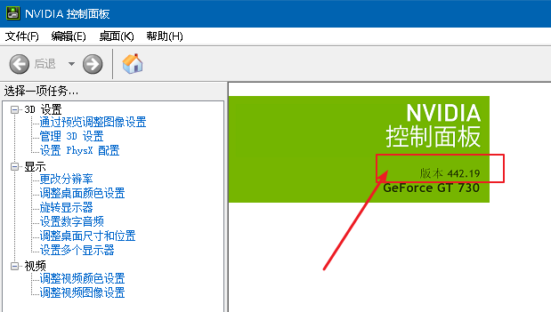
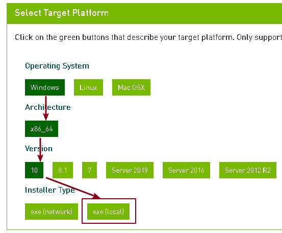
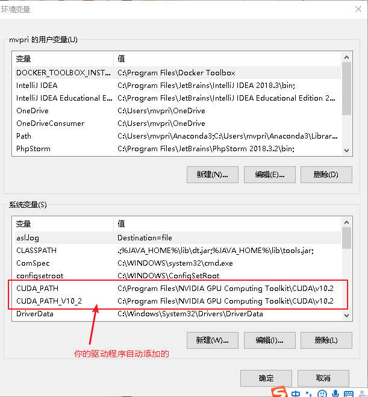
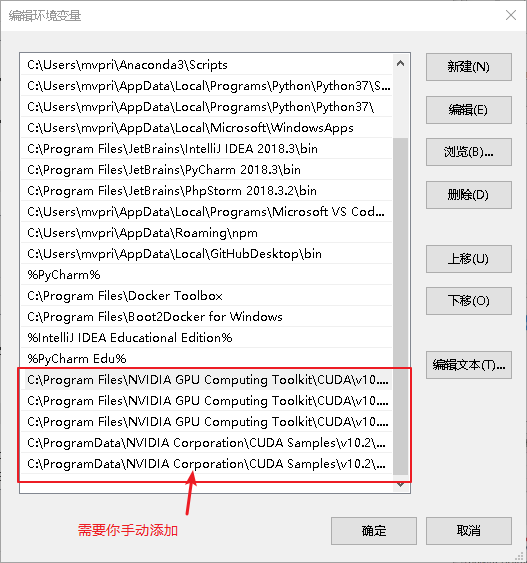
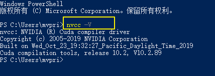
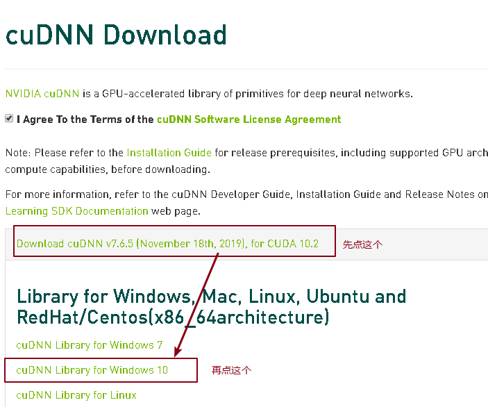
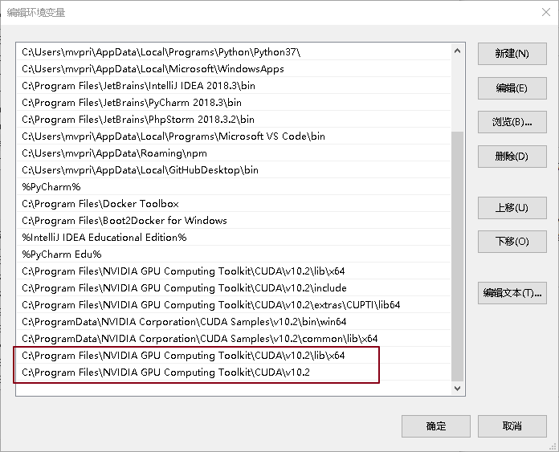
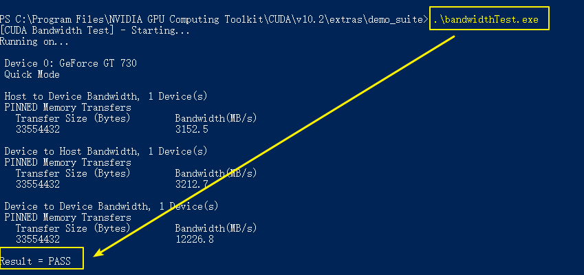
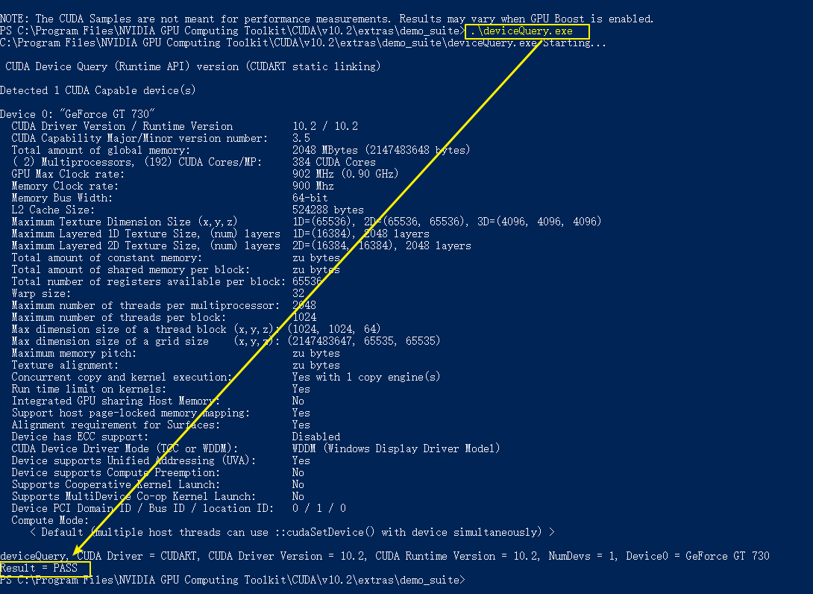

= win10 Nvidia 安装 cuda 和 cudnn 驱动
:toc:

---

2020.02.17日记录

== 1. 先安装 nvidia 最新显卡驱动

驱动下载地址: +
https://www.nvidia.com/Download/index.aspx?lang=en-us

---

==== 查看你现在显卡驱动的版本号

控制面板 -> NVIDIA控制面板 -> 右边的窗口中, 就可以直接看到当前驱动版本号.

---

== 2. 再安装 cuda 框架 （Compute Unified Device Architecture）

GPU 在计算上已经超越了通用的CPU。如此强大的芯片如果只是作为显卡就太浪费了，因此NVIDIA推出CUDA，让显卡可以用于图像计算以外的目的。

虽然GPU是为了图像处理而生的，但是它在结构上并没有专门为图像服务的部件，只是对CPU的结构进行了优化与调整，所以现在GPU, 不仅可以在图像处理领域大显身手，它还被用来科学计算、密码破解、数值分析，海量数据处理（排序，Map-Reduce等），金融分析等, 需要大规模并行计算的领域。

所以GPU也可以认为是一种较通用的芯片。

CUDA的本质是一个工具包（ToolKit）. 只有安装这个框架, 才能够进行复杂的并行计算。主流的深度学习框架, 也都是基于CUDA进行GPU并行加速的，几乎无一例外。还有一个叫做 cudnn，是针对深度卷积神经网络的加速库。

下载地址: +
https://developer.nvidia.com/cuda-downloads

选择下载 离线exe安装程序 即可

比如, 本例, 我们安装的版本是 CUDA 10.2版.

安装时, 选"自定义安装", 除了 Visual Studio Integration 不用装外(不过我装了), 其他全装.

安装完后, 需要配置环境变量 : +
对桌面的"我的电脑" -> 右键, 选"系统属性" -> 高级系统设置 -> 环境变量按钮 -> 双击"Path"变量.

可以看到, 安装cuda后, 它会自动添加两个环境变量. 但你还需要手动添加以下变量 :

- C:\Program Files\NVIDIA GPU Computing Toolkit\CUDA\v10.2\lib\x64 +
- C:\Program Files\NVIDIA GPU Computing Toolkit\CUDA\v10.2\include +
- C:\Program Files\NVIDIA GPU Computing Toolkit\CUDA\v10.2\extras\CUPTI\lib64 +
- C:\ProgramData\NVIDIA Corporation\CUDA Samples\v10.2\bin\win64 +
- C:\ProgramData\NVIDIA Corporation\CUDA Samples\v10.2\common\lib\x64 +

现在, cuda 就安装完了. 下面我们来验证一下:

---

==== 验证 cuda 是否安装成功

在 cmd 命令窗口中, 输入 : +
nvcc -V

输出以上信息, 就表示安装成功.

---

== 3. 最后安装 cuDNN

cuDNN, 是个SDK : Software Development Kit 软件开发工具包). 它是一个专门用于神经网络的加速包.

注意 : cuDNN 跟我们的 CUDA 没有一一对应的关系. 即, 每一个版本的CUDA可能有好几个版本的cuDNN与之对应. 但一般我们只安装最新版本的cuDNN.

最新的cudnn 下载地址 +

https://developer.nvidia.com/rdp/cudnn-download

下载之后不用安装，解压即可。 +
然后各自文件夹中的 cndnn64_7.dll cudnn.h cudnn.lib 文件, 分别复制到: +

- C:\Program Files\NVIDIA GPU Computing Toolkit\CUDA\v10.2\bin
- C:\Program Files\NVIDIA GPU Computing Toolkit\CUDA\v10.2\include
- C:\Program Files\NVIDIA GPU Computing Toolkit\CUDA\v10.2\lib\x64

目录中.

注意：是复制文件到bin、include、lib目录中，不是复制目录!

然后, 也需要添加下面两个到环境变量中：

- C:\Program Files\NVIDIA GPU Computing Toolkit\CUDA\v10.2\lib\x64
- C:\Program Files\NVIDIA GPU Computing Toolkit\CUDA\v10.2

这样, cuDNN 就安装完成.

下面, 我们来验证以下它是否安装成功

---

==== 验证 cuDNN 是否安装成功

验证cuDNN 是否配置成功，主要是使用CUDA内置的deviceQuery.exe 和 bandwithTest.exe 来验证.

进入 C:\Program Files\NVIDIA GPU Computing Toolkit\CUDA\v10.2\extras\demo_suite 目录 +
按住shift + 鼠标右键 -> 在此处打开 powerShell窗口.

然后分别执行下面两个命令
- .\bandwidthTest.exe
- .\deviceQuery.exe

如果以上两步都返回了Result=PASS, 即证明安装成功.

---

