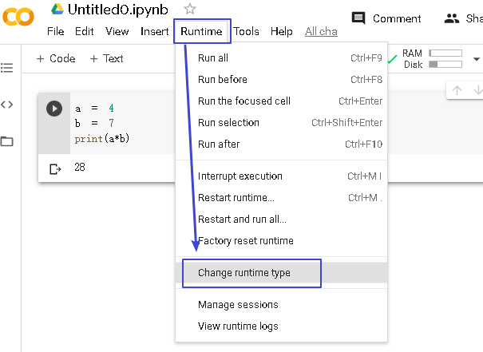
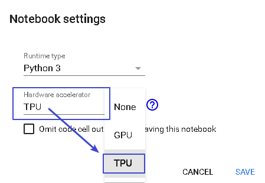
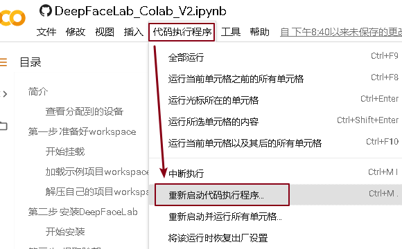

= 使用 Google Colab
:toc:

---

= Google Colab

地址 +
https://colab.research.google.com

Colab规则为每12小时强制重置.

---

== 开启 gpu, tpu 支持

在菜单 Runtime -> Change runtime type 中, 将 Hardware accelerator, 可以改成 TPU 等.

---

== Google Colab 遇到报错问题

==== ERROR: root: Internal Python error  in the inspect module

解决办法：重置启动代码执行程序

---

== 谷歌云盘

你用 Google Colab 创建的文件, 可以直接在谷歌云盘中可见, 会自动放在一个 Colab Notebooks 的目录中.

地址 +
https://drive.google.com/drive/my-drive

---

== github 上的 DeepFaceLab_Colab 项目

https://github.com/dream80/DeepFaceLab_Colab

使用步骤:

在你的 Google Colab 中, 打开下面这个文件 +

https://github.com/dream80/DeepFaceLab_Colab/blob/master/DeepFaceLab_Colab_V2.ipynb

然后在Google Colab 中运行该python文件即可

---

== DeepFaceLab 各模型说明

|===
|type |description

|全脸 (Full Face)
|整张脸（不包括额头）

|半脸 (Half Face)
|猴哥脸上“不长毛”的部分
|===

|===
|名称 |最终效果的头像分辨率(边长) |特点 |缺点 | 显存要求

|H64 (又称original)
|64 px +
半脸模型 (Half Face)
|- 最原始的, 最老的模型 +
- 速度最快 +
- 对系统的要求最低
|- 效果比较差 (因为分辨率小么)
|3G +
如果开启 Use lightweight autoencoder（轻量级）2G显存即可.

|H128
|128 px
|- 内部结构和H64是完全一样的
|
|6G

|DF
|128 px +
全脸模型（Full Face）
|- 内部结构和H64是完全一样的 +
- 最终效果一般来说比H128更像
|- 边缘问题突出
|6G

|LIAEF128
|128 px +
全脸模型（Full Face）
|- 内部结构和 H64 完全不同
- 能使换脸目标发生一定的形变，以解决换脸生硬的问题，以及一些边缘问题，和轻微遮挡的问题.
|- 形变容易导致和src的相像度降低
|

|SAE
|
|- 这并不是一个独立的模型，而是一个建立在上面所有模型之上的模型。通过SAE的参数配置，可以配置出以上各种模型。 +

- SAE最大的优势在于“参数可以配置” 。这个模型是DFL主打的模型. 你可以自定义模型(DF/H/LIAEF，脸型（Half/Full），像素（64/128/256，稍微魔改可以512) ，还有N多参数可探索。
| - 容易崩溃. SAE是最容易坏掉的模型. +
- 默认参数合成效果不理想 +
- 速度非常慢 +
- 对系统要求最高
|

|SAEHD
|
|- 最新的模型 +
- 同样也是参数众多，可以自定义搭配出各种模型. +
- 比SAE模型增加了“True Face”模式 +
- 效果最好. +
- SAEHD现在仍然不够完美，但是不论是稳定性, 还是效果, 都足以秒杀其他所有的模型.
|- 耗时更长
|

|AVATAR
|
|
|
|目前效果比较渣，不推荐使用.

|===

---

== DeepFaceLab 模型的参数说明

|===
|parameter |description |默认时

|Enable autobackup?  +
(y/n ?:help skip:n) :
|自动备份模型，一小时备份一次，开启会自动备份最近15次模型。
|默认不开启 n  +
开启输入 y

|Write preview history?  +
(y/n ?:help skip:n) :
|每10秒自动在model / history文件夹中, 生成一张预览图。
|默认不开启 n  +
开启输入 y

|Target iteration  +
(skip:unlimited/default) :
|训练次数，推荐默认设置。
|默认无限训练，开启此功能可以输入想要的数字。

|Batch_size  +
(?:help skip:0) :
|Batch_size数值，大概可以理解为, 一次有多少图像被发送到神经网络训练。 +
取决于你的硬件性能，建议取大于4的数值，训练伊始可以设置低数值，收敛困难时增加数值。
|

|Feed faces to network sorted by yaw?  +
(y/n ?:help skip:n) :
|偏航排序，data_dst 和 data_src素材种类一致可以开启。
|默认开启，建议不开启。

|Flip faces randomly?  +
(y/n ?:help skip:y) :
|随机翻转脸部，data_src素材丰富时关闭会更自然，反之效果很差。
|默认开启，建议开启。

|Src face scale modifier %  +
( -30…30, ?:help skip:0) :
|data_src面部比例大小，输入数值会改变data_src脸部大小。
|默认为不开启，建议不开启。

|Use lightweight autoencoder?  +
(y/n, ?:help skip:n) :
|是否使用轻量级编码模式，配置较低时使用，牺牲部分质量。
|默认开启，建议不开启。

|Use pixel loss?  +
(y/n, ?:help skip: n/default ) :
|是否使用像素丢失。开启后能增强细节，比如牙齿或其它需要增强的细节，但不宜过量，可以在合成之前开启一段时间。否则将有可能使模型损坏。
|默认不开启，建议后期开启。

|---
|---
|---

|Resolution  +
( 64-256 ?:help skip:128) :
|面部分辨率，分辨率越高越清晰，所需要的硬件配置也越高，训练时间更长。
|默认128pix,建议普通视频默认分辨率即可，追求特写脸部可以尝试192或者256pix.

|Half, mid full, or full face?  +
(h/mf/f, ?:help skip:f) :
|半脸，中脸，全脸。当然是使用全脸，其他没有意义。
|默认全脸，不建议半脸或中脸。

|Learn mask?  +
(y/n, ?:help skip:y ) :
|学习面具。脸部边缘更贴合。
|默认开启。不建议开启，或者建议训练一万步后关闭以增加效率。后期合成时使用FAN-dst遮罩更佳。

|Optimizer mode?  +
( 1,2,3 ?:help skip:1) :
|默认选项1为不打开。 +
2 为训练网络x2，需要更多系统内存。 +
3 为训练网络x3更大，需要更多系统内存和CPU处理器。 +
数值越大训练越慢。
|

|AE architecture  +
(df, liae ?:help skip:df) :
|神经网络结构类型
|默认df, 建议df.

|AutoEncoder dims  +
(32-1024 ?:help skip:256) :
|网络维度数值大小，数值越大细节越准确，也越需要更高的硬件配置。
|新版默认256，建议256或者512这两个数值。

|Encoder/Decoder dims per channel  +
(10-85 ?:help skip:21) :
|解码器维数。越大效果越好，也越需要更高的硬件配置。
|默认21,建议21，但如果分辨率提高也应提高。

|Use CA weights?  +
(y/n, ?:help skip:n ) :
|是否使用CA权重，开启会更精准。（SAEHD默认开启）
|

|Use pixel loss?  +
(y/n, ?:help skip:n ) :
|是否使用像素丢失。开启后能增强细节，比如牙齿或其它需要增强的细节，但不宜过量，可以在合成之前开启一段时间。否则将有可能使模型损坏。
|默认不开启，建议后期开启。（SAEHD无选项）

|Enable random warp of samples? +
 ( y/n, ?:help skip:y) :
|是否使用随机扭曲。random可以随机扭曲面部表情，也就是所谓的无中生有，当src素材不足之后开启会有想不到的效果。但是弊端也很明显，如果长时间开启会损失一部分的“真实度”，因为很多表情都是“扭曲”来的会显得不那么真实. +
而且random堪比learn_mask都是显存杀手，建议训练中期就将其关掉。
|默认开启，建议开启。后期可以关闭，使效果更准确。

|Enable ‘true face’ training?  +
(y/n, ?:help skip:n) :
|
|默认关闭，建议不开启。

|Face style power  +
( 0.0 .. 100.0 ?:help skip:0.00) :
|学习人物风格，体现在面部细节和光照。
|默认不开启，建议合成之前开启，数值不宜过大。

|Background style power  +
( 0.0 .. 100.0 ?:help skip:0.00) :
|学习人物背景风格，体现在边缘。
|默认不开启，建议合成之前开启，数值不宜过大。

|Color transfer mode apply to src faceset.  +
( none/rct/lct/mkl/idt/sot, ?:help skip:none) :
|调色模式，不同模式会有不同效果。
|默认不开启，建议合成之前开启rct使肤色自然。

|Enable gradient clipping?  +
(y/n, ?:help skip:n) :
|是否开启梯度剪切。使用会减少模型损坏几率，但会影响效率。
|默认不开启，建议中后期开启防止模型崩溃。

|Pretrain the model?  +
(y/n, ?:help skip:n) :
|是否使用预训练，开启预训练会使用_internal\pretrain_CelebA文件夹下的24711个脸部图片进行训练，适当训练可以达到一个尚可的角度值。
|默认不开启，不建议过度预训练，如开启可训练1-10万迭代后正式训练。

|===

---

== DeepFaceLab 合成(convert)时 的参数

Choose mode: (1) overlay, (2) hist match, (3) hist match bw, (4) seamless, (5) raw.
|===
|模式 |说明

|overlay
|可以理解为将src的脸部贴在dst上，这个模式需要配合color_transfer_mode模式来用.

|hist-match 直方图匹配模式
|这个模式的优点是在颜色相近的情况下不需要调色就可以取得好的效果，反之效果就不大理想。

|seamless 无缝模式
|它可以尽可能还原一些光影细节

|seamless-hist-match 直方图无缝模式
|可以视为 hist-match 和 seamless 的综合体，使用效果强大，推荐使用。

|raw-rgb 未处理模式
|只作为参照物作用, 未经过任何合成处理. 无用

|raw-rgb-mask RBG遮罩模式
|也是作为参照物使用. 无用.

|raw-mask-only 仅遮罩模式
|只有遮罩. 也是作为参照物使用. 无用.

|raw-predicted-only 未处理模式
|原始未处理的src脸部. 也是作为参照物使用. 无用.

|===

|===
|参数 |说明
|Mask mode: (1) learned, (2) dst . Default – 1 :
|通常（1）学到没有问题。输入1，然后按Enter。

|Choose erode mask modifier [-200…200] (skip:0):
|通常0是可以的，因此请按Enter跳过。

|Choose blur mask modifier [-200…200] (skip:0) :
|移植面部时是边界的模糊，但是即使模糊较弱或模糊太强也很奇怪，因此通常中间的0很好，因此请按Enter跳过。

|Choose output face scale modifier [-50…50] (skip:0) :
|您可以在移植面部时调整尺寸。通常，0是可以的，因此请按Enter跳过。显然，如果data_src和data_dst的表面尺寸不同，则可能需要对其进行调整。

|Apply color transfer to predicted face? Choose mode ( rct/lct skip:None ) :
|当我们移植面部时，他/她纠正肤色的差异。输入rct或lct并按Enter。如果将其设置为“无”，则皮肤颜色将不同且不自然。

|Apply super resolution? (y/n ?:help skip:n) :
|通常n是可以的。如果data_dst的视频质量较低，则y似乎不错。

|Degrade color power of final image [0…100] (skip:0) :
|增加值会增加移植后脸部的鲜艳度。但是，灰度基本上会变差，因此0通常更好。使用Enter跳过。

|Export png with alpha channel? (y/n skip:n) :
|使用alpha通道（透明）将图像导出为png的选项。data_dst视频中有一个透明部分，以后当您使用视频编辑软件合成DeepFaceLab创建的视频时，请将其设置为y。
通常n是可以的，因此请输入skip。
|===

选择选项后，将开始导出将面部移植到data_dst的图像。在“ data_dst”文件夹中自动创建图像，并创建“合并”文件夹。

---

