= 安装 pytorch
:toc:
:sectnums:

---

== PyTorach 介绍

python torch (PyTorach)::
深度学习框架. PyTorch 与 Torch 的不同之处在于, PyTorch 使用了Python 作为开发语言。

---

== 安装

可以在 anaconda 中来使用 pytorch.

Anaconda (  /ˌænə-ˈkɒndə/ 水蚺（南美洲蟒蛇）):: 是一个开源的Python发行版本，其包含了conda、Python等上百个科学包及其依赖项。

[cols="1a,3a"]
|===
|Header 1 |Header 2

|anaconda 官方下载地址
|https://www.anaconda.com/products/individual#Downloads

|安装完后, 打开开始菜单中的 anaconda prompt
|出现（base）, 即表示安装成功 +
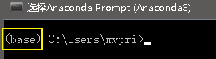

|不同版本的python, 对应着不同版本的pytorch.
|我们可以在 anaconda中, 创建不同版本的pytorch环境, 以方便切换. +
命令如下, 比如, 我们来创建一个使用python3.9的 pytorch环境 :

....
在anaconda prompt 中输入命令:
conda create -n pytorch python=3.9
....

其实, 命令就是:
....
conda create -n your_env_name python=X.X
....
"pytorch"是我们起的这个环境变量的名字 +
"python=3.9"是我们起名的当前环境的版本数.

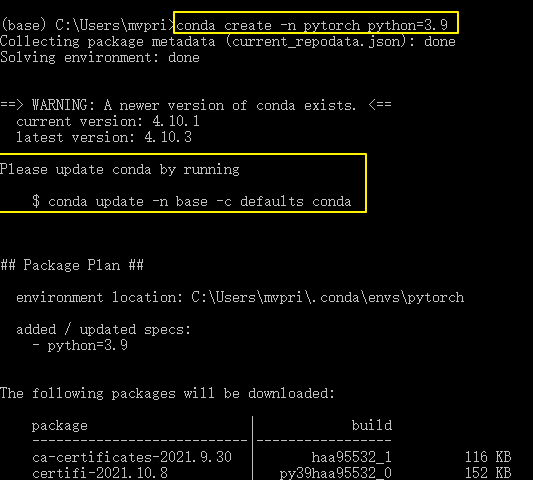

然后, 它会询问 "Proceed ([y]/n)?" 即提示我们要安装一堆支持包, 我们直接回车即可, 因为回车就是默认"安装它们"的意思.

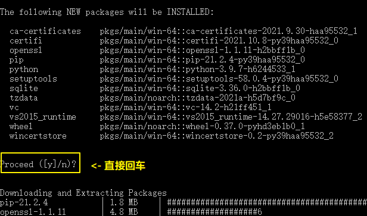

---

激活(或切换不同python版本)的虚拟环境, 命令是: ::
....
conda activate your_env_name
....

然后, 要激活你刚刚创建的  pytorch python=3.9 环境, 就使用命令 +
....
conda activate pytorch
....

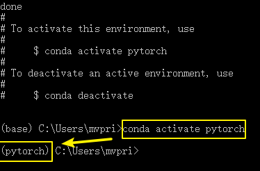

现在, 你看到前面的小括号中, 变成了 pytorch, 就说明, 现在已经切换到是你刚刚建立的 pytorch  python=3.9 环境下了.

---

我们来看看这个环境下, 有哪些工具包存在, 使用: pip list 命令

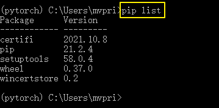

发现, 里面并没有我们要的 pytorch. 我们要单独安装 pytorch

|先看一下你自己的显卡的信息
|在cmd中, 输入命令"nvidia-smi". +

如果出现报错 : "无法将 nvidia-smi项识别为 cmdlet、函数、脚本文件或可运行程序的名称。" 说明你没有将 nvidia-smi.exe 的路径添加到 win10 的环境变量中.

解决方法: 用Everything 软件, 找到 nvidia-smi.exe 的路径

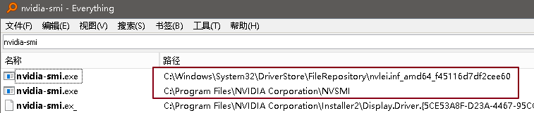

将这两个目录, 添加到 win10 系统变量中的 path 中

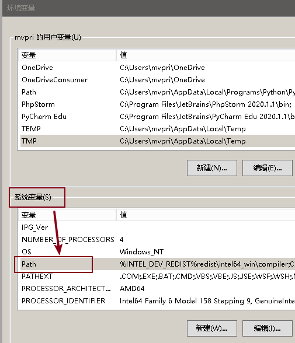

然后, 重新打开 cmd, 输入命令 : nvidia-smi

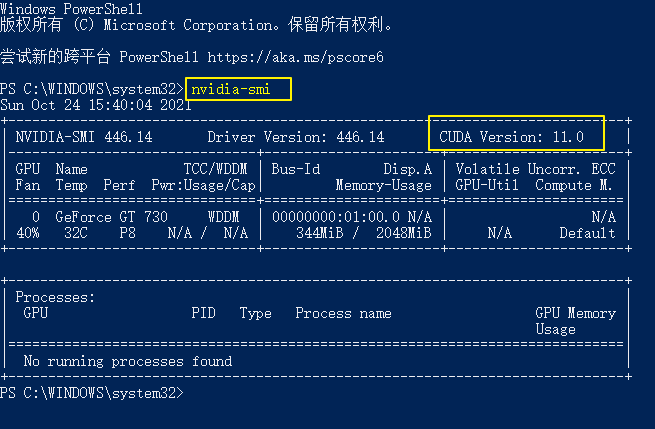

|为了加快"包"的安装速度, 添加国内镜像源
|先查看已经安装过的镜像源::
anaconda prompt 窗口中, 执行命令：
....
conda config --show
....
查看配置项 channels 下的内容.

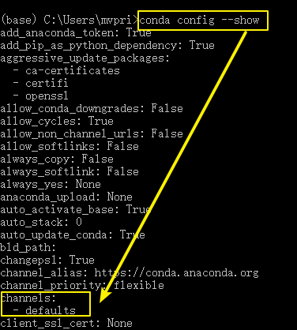

添加清华镜像源::
(中科大镜像源, 不支持Anaconda包镜像服务)

我们需要编辑 .condarc文件, 来把清华镜像源地址输入进去. 注意: 该文件不会默认存在, 只有在执行了下面的命令后, 才会创建出来:
....
conda config --set show_channel_urls yes //设置搜索时,显示channel地址
....

然后, 搜索 .condarc文件, 打开它.
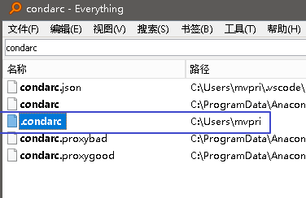

- 该文件, 在 win 10 系统下的目录地址为:   C:\Users\你的用户名
- Mac 或 Linux : /home/你的用户名

接着, 把清华源官网上的说明文档内容, 复制进来: +
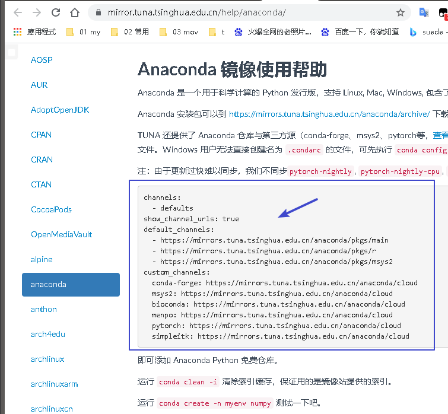

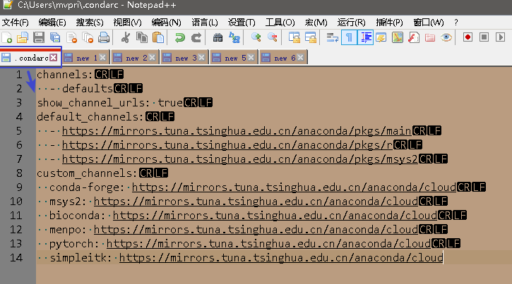

还可以添加 北京外国语大学开源软件镜像站的 Anaconda 地址, 官网如下: +
https://mirrors.bfsu.edu.cn/help/anaconda/

确认是否安装镜像源成功::
执行命令
....
conda config --show
....
找到channels值为如下： +
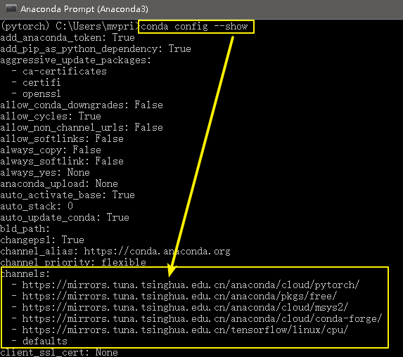

清华镜像源的对于Anaconda的官网说明::
https://mirror.tuna.tsinghua.edu.cn/help/anaconda/

如果要删除镜像源, 可以用下面的命令::
比如, 删除某个清华镜像源
....
conda config --remove channels https://mirrors.tuna.tsinghua.edu.cn/tensorflow/linux/cpu/
....

|单独安装 pytorch
|进入官网下载 https://pytorch.org/

下面会有一行安装命令给出

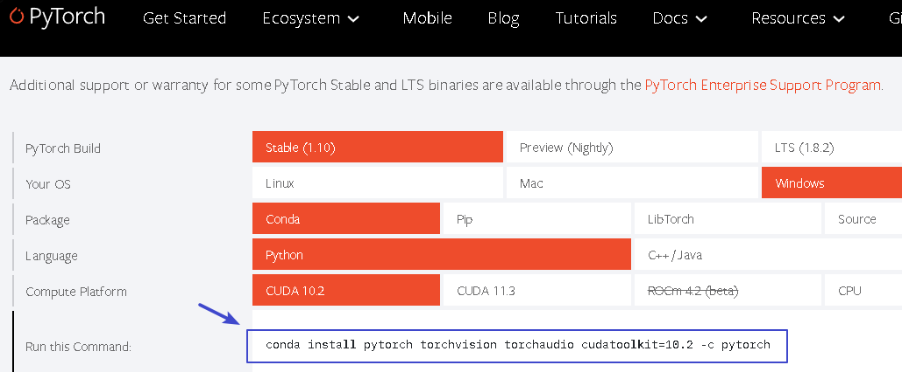

在你刚才的pytorch环境下, 输入该命令, 来安装 pytorch::
....
conda install pytorch torchvision torchaudio cudatoolkit=10.2 -c pytorch
....

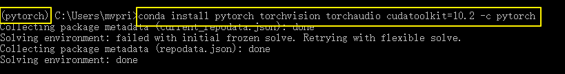

如遇报错 "Warning: 8 possible package resolutions (only showing differing packages)"::
就先执行下面命令, 强制更新所有警告包:
....
conda update --strict-channel-priority --all //强制更新所有警告包

conda install pytorch torchvision torchaudio cudatoolkit=10.2 -c pytorch //继续重新安装 pytorch

....

现在, 再用 "pip list"命令, 就能看到 pytorch库 的存在了 +
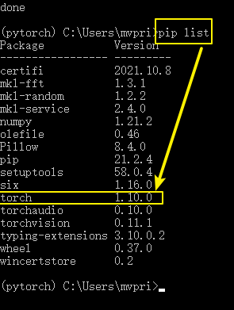

最后, 再来验证一下pytorch是否已成功安装::
- 先输入 python, 进入python命令行下
- 然后输入 import torch，如果输入后没有任何报错，没有任何显示那就是成功了，
- 然后再输入 torch.cuda.is_available()，返回的是True，那便是完成了整个操作。

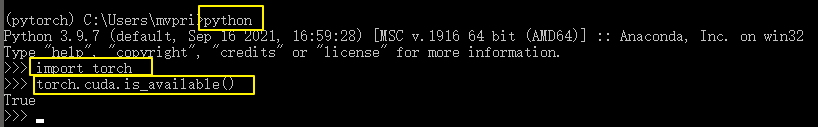

要退出python命令行, 可以使用下面三种方法中的任何一个::
....
quit()
exit()
也可按 Ctrl+Z, 再回车
....

|===

---

