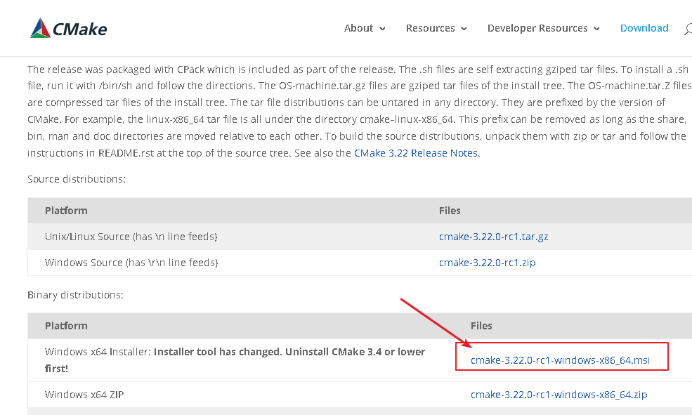

= 老照片修复 开源AI:  Bringing-Old-Photos-Back-to-Life
:toc:
:sectnums:

---

= Bringing-Old-Photos-Back-to-Life

Bringing-Old-Photos-Back-to-Life::
是微软的项目, 可以用来修复老照片, 模糊人脸变高清. +
地址 https://github.com/microsoft/Bringing-Old-Photos-Back-to-Life

注意: github官网上的 Installation 教程, 在win下, 必须使用 git自带的 命令行工具 git bash 才能输入成功, 不能直接在 pycharm的 terminal中输入(无法识别linux命令)!

---

== 2021-10-25 日的官网安装教程

#注意, 先安装 pyTorch后, 再执行下面的操作!#

Installation

Clone the Synchronized-BatchNorm-PyTorch repository for

....
cd Face_Enhancement/models/networks/
git clone https://github.com/vacancy/Synchronized-BatchNorm-PyTorch
cp -rf Synchronized-BatchNorm-PyTorch/sync_batchnorm .
cd ../../../
....

....
cd Global/detection_models
git clone https://github.com/vacancy/Synchronized-BatchNorm-PyTorch
cp -rf Synchronized-BatchNorm-PyTorch/sync_batchnorm .
cd ../../
....

Download the landmark detection pretrained model

....
cd Face_Detection/

wget http://dlib.net/files/shape_predictor_68_face_landmarks.dat.bz2
//注意: 用wget下载文件时, 可能遇到即使文件下载下来也是损坏的, 可以转而直接用迅雷来下载, 然后把这个zip文件拷贝到 E:\phpStorm_proj\Bringing-Old-Photos-Back-to-Life-master\Face_Detection 目录下即可.

bzip2 -d shape_predictor_68_face_landmarks.dat.bz2
//可以不用bzip2来解压(参数 -d或--decompress 　就是执行解压缩。), 直接用 winrar解压即可.

cd ../
....

Download the pretrained model from Azure Blob Storage, put the file `Face_Enhancement/checkpoints.zip` under `./Face_Enhancement`, and put the file `Global/checkpoints.zip` under `./Global`. Then unzip them respectively.

....
cd Face_Enhancement/
wget https://github.com/microsoft/Bringing-Old-Photos-Back-to-Life/releases/download/v1.0/face_checkpoints.zip
unzip face_checkpoints.zip    //用迅雷单独下载这个zip文件, 存放到./Face_Enhancement 目录下, 解压

cd ../
cd Global/
wget https://github.com/microsoft/Bringing-Old-Photos-Back-to-Life/releases/download/v1.0/global_checkpoints.zip
unzip global_checkpoints.zip    //用迅雷单独下载这个zip文件, 存放到 ./Global目录下, 解压

cd ../
//返回上一级目录
....

Install dependencies:

....
pip install -r requirements.txt
//python项目中必须包含一个 requirements.txt 文件，用于记录所有依赖包及其精确的版本号。以便新环境部署。
requirements.txt可以通过pip命令自动生成和安装。
....

---

== 遇到的问题, 解决方式

==== 报错 bash: wget: command not found

Windows中git bash 完全可以替代原生的 cmd，但是对于 git bash 会有一些Linux下广泛使用的命令的缺失，比如wget命令。

解决办法:

[options="autowidth"]
|===
|Header 1 |Header 2

|1.下载wget安装包 wget.exe
|地址：https://eternallybored.org/misc/wget/

|2.
|解压安装包，将 wget.exe 拷贝到C:\Program Files\Git\mingw64\bin\ 下面； +
（或者解压之后, 将解压文件中wget.exe的路径添加到环境变量中）
|===

---

==== 报错 ...since package 'wheel' is not installed

解决办法: 先安装 wheel

....
pip install wheel
....

---

==== 报错 ERROR: Failed building wheel for dlib

网上有两种说法:

1.首先下载CMake. +
官网下载地址：https://cmake.org/download/

image:img_ai/31.png[]

安装完后, 需要重启电脑. +
然后打开cmd，输入cmake, 能够显示cmake的一些信息即为安装成功

---

2.做人脸识别等, 电脑需要事先安装 visual studio. 如果没有安装，就会出现“failed build wheel for Dlib”的问题.

解决办法：安装visual studio（推荐版本2019），一定要勾选C++开发包！

https://visualstudio.microsoft.com/zh-hans/downloads/

---

== pip 使用国内镜像

使用方法
....
pip install tensorflow -i https://mirrors.aliyun.com/pypi/simple

pip install  tensorflow==2.3 -i https://mirrors.aliyun.com/pypi/simple
....

国内常用镜像源有:

[options="autowidth"]
|===
|Header 1 |Header 2

|清华镜像
|https://pypi.tuna.tsinghua.edu.cn/simple

|中科大镜像
|https://pypi.mirrors.ustc.edu.cn/simple

|阿里镜像
|http://mirrors.aliyun.com/pypi/
|===
