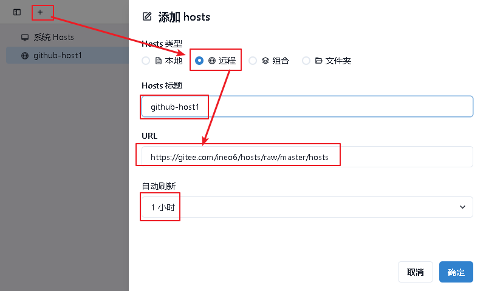
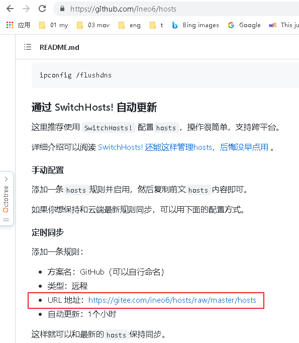
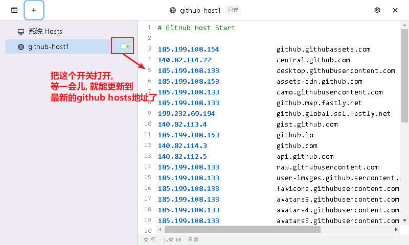
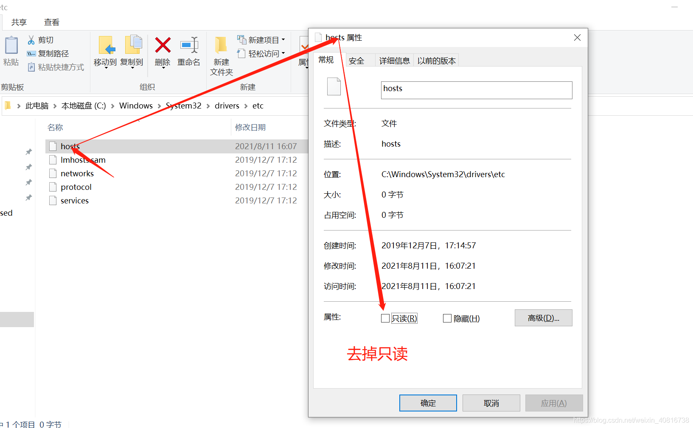
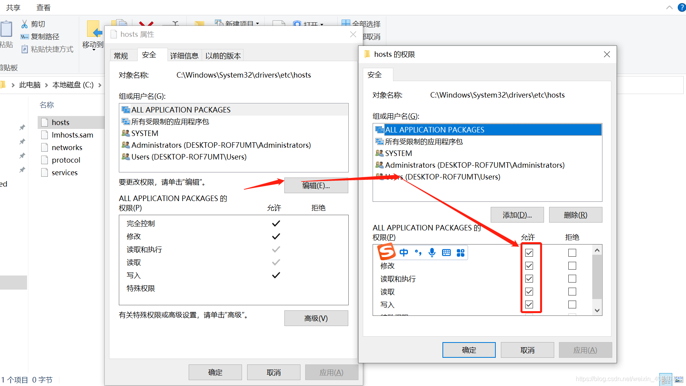

= SwitchHost
:toc:
:sectnums:

---

== SwitchHost 使用方法

URL地址, 到下面的官网查找 +
https://github.com/ineo6/hosts

....
URL 地址：https://gitee.com/ineo6/hosts/raw/master/hosts
....

---

== 如果提示 “没有写入 Hosts 文件的权限”

---

