= github
:toc: left
:toclevels: 3
:sectnums:
:stylesheet: myAdocCss.css

'''

---

== github 从国内访问的问题

==== 解决 github 速度太慢的问题

1.修改本地hosts文件

[options="autowidth"]
|===
|Header 1 |位置

|win10
|C:\Windows\System32\drivers\etc\hosts

|mac/linux
|/etc/hosts
|===

2.获取Github相关网站的ip, 到下面的网站来查询ip: +
https://www.ipaddress.com

找到这两个网站的ip: +
http://github.global.ssl.fastly.net +
http://github.com

分别输入 github.global.ssl.fastly.net 和 github.com，查询ip地址, 把他们加入 hosts中.

....
140.82.113.3	github.com
199.232.69.194	github.global.ssl.fastly.net
....

---

==== 图片在github上 显示不出来的问题

用 f12 查看 页面上显示不出来的图片的位置, 在 console 中看到报错 "Failed to load resource: net::ERR_CERT_COMMON_NAME_INVALID",

该错误的原因是：

[options="autowidth"]
|===
|原因 |背景知识

|1. dns污染
|Domain Name System, 用于域名与 IP 地址的相互转换

|2. hosts设置错误
|Hosts 是一个没有扩展名的系统文件.  +
所在目录为: C:\windows\system32\drivers\etc\ +
其作用就是将一些常用的网址域名, 与其对应的IP地址, 建立一个关联“数据库”.

当用户在浏览器中输入一个需要登录的网址时，系统会首先自动从Hosts文件中寻找对应的IP地址，一旦找到，系统会立即打开对应网页， +
如果没有找到，则系统会再将网址, 提交DNS域名解析服务器, 进行IP地址的解析。

|3. 官方更新了dns，但是dns缓存没有被更新，导致错误解析。
|Column 2, row 3
|===

一般的DNS问题, 都可以通过修改hosts文件来解决，即, 使用本地hosts文件, 对网站域名进行直接解析, 来绕过依靠DNS的解析.

步骤:

1. 在无法显示的图片上, 定位到该图片的标签，那么你得到了它的URL，比如我的为 "https://raw.githubusercontent.com/.../xxx.jpg"

2. 打开 https://www.ipaddress.com/

3. 搜索 raw.githubusercontent.com 的ip, 得到 IP Address :
199.232.68.133

4. 将该ip地址加入hosts文件中.  +
win10 的路径在 C:\Windows\System32\drivers\etc\ 中

将下面的内容拷贝入 hosts文件中
....
199.232.68.133 raw.githubusercontent.com
199.232.68.133 avatars3.githubusercontent.com
....

5. 在dos窗口中, 刷新本地DNS的缓存, 命令为:
....
ipconfig /flushdns
....

现在, github页面上就能显示出图片了.

---

== 0. ++快速实现手册

[options="autowidth"]
|===
|你想要实现 |方法

|1-1.把你的本地目录, 变成Git可以管理的仓库
|git init

|1-2.将本地库, 关联到github上的远程库上
|git remote add origin git@github.com:m-v-priest/testGit2.git

|1-3.查看每个本地仓库, 各自关联到的远程仓库有哪些?
|先进入本地库的目录中, 用:  +
git remote -v

|---|---

|2-1.把你的文件, 添加(add)到"版本库"
|git add 你的文件名.扩展名

|2-2.输入本次提交(commit)的说明信息
|git commit -m "本次提交更新的说明信息"

|2-3.把本地库中的文件, 推送到远程库上
|第一次推送用:  +
git push -u origin master (该命令把当前分支master, 推送到远程) +

此后的推送用:  +
git push origin master

|---|---

|3.将远程库, 克隆到本地
|进入某个本机空目录中, 然后:  +
git clone git@github.com:m-v-priest/testGit2.git

npm install //如果你拉取的是框架或模块库, 还需要安装相关依赖
|---|---

|===

---

== git说明

所有的版本控制系统，只能跟踪纯文本文件的改动，比如TXT文件，网页，所有的程序代码等. 编码强烈建议使用标准的UTF-8编码.

---

== 安装git

在Windows上安装Git +
https://git-scm.com/downloads

安装完后, 在win中搜索 Git Bash, 打开, 即可看到命令行工具

还需要设置一下:
输入:

[source,python]
....
git config --global user.name "Your Name"
git config --global user.email "email@example.com"
....

这个git config命令的 参数 --global, 表明你这台电脑上所有的Git仓库, 都会使用这个配置.

---

==== 升级 git 到最新版本 -> git update-git-for-windows

[options="autowidth"]
|===
| |命令

|查看自己的git版本
|git --version

|升级 git 到最新版本
|git update-git-for-windows

或 下载地址, 直接安装exe, 推荐! +
https://git-scm.com/download/win
|===

---

== 在 mac 上配置 github

Mac 电脑

1.配置github账户
....
git config --global user.name “m-v-priest”          //用户名，建议拼音或英文
git config --global user.email "346669129@qq.com"   //邮箱地址
....

2.生成秘钥
....
ssh-keygen -t rsa -C "346669129@qq.com"   //上面的邮箱地址
....

连续按3次enter，直到出现下面的内容
....
+---[RSA 2048]----+
| .o+Xo           |
|  oB+o.          |
|  .*.o   .       |
|  oo .=.. + .    |
|  o o..+S+ +     |
| . . . .= o      |
|  . ..  .* .     |
| . .. ..=.E      |
|  oo. +O*=       |
+----[SHA256]-----+
....

现在, 就完成了账户创建、秘钥生成，.ssh文件夹下就多了id_rsa（私有秘钥）和id_rsa.pub（公有密钥）

....
ls -al ~/.ssh       //检查SSH key是否存在
cd .ssh/            //进入.ssh隐藏目录, 再ls, 就会看到id_rsa 和id_rsa.pub
open ./             //就会打开这个文件夹了。
....

4.也可以不用打开该目录, 直接在终端输入
....
cat id_rsa.pub  //查看公有密钥，全部复制，要添加到github中
....

5.登录你的 github, 点击你的小头像 -> Settings -> SSH and GPG keys -> New SSH key -> 在Key中,将你的公钥内容复制进去，里面会自动生成邮箱; 在 title 中写上你当前电脑的名字, 再点击add key完成添加

6.现在, 就可以在你的电脑上,
....
创建目录,
git init  //将目录变成 git 管理的仓库
git remote add origin git@github.com:m-v-priest/02_my_EngishRead.git //链接远程库
git pull origin master //将远程仓库的内容, 拉取到本机当前目录下
....

---

== 1. #把你的目录, 变成Git可以管理的仓库(repository) ->  git init 命令#

比如, 你想把 E:\testGit2 目录(无论它是空目录, 还是非空目录), 变成git仓库, 就先进入这个目录, 再输入: git init

[source,python]
....
git init
....

该目录下, 会多出一个隐藏目录".git".

---

== 2. 把你的文件, 添加到"版本库" -> git add 你的文件名.扩展名

你先在testGit2目录中, 新建一个 t1.txt 文件, 内容如下:
....
---t1 origin 的内容---
....

输入两步命令:

[source,python]
....
# 把文件添加到仓库 -> git add
git add t1.txt

# 对本次提交, 附上文字性说明 -> git commit -m 文字说明信息
git commit -m "这是t1.txt的最原始稿"
....

事实上, 你可以多次add上不同的文件, 然后用commit一次性提交这些文件. 即, 可输入成:

[source,python]
....
git add file1.txt
git add file2.txt file3.txt
git commit -m "add 3 files."
....

---

==== 查看仓库当前的状态 ->  git status

[source,python]
....
Administrator@priest MINGW64 /e/testGit2 (master)
$ git status # 你输入

On branch master
nothing to commit, working tree clean
....

现在, 你来修改 t1.txt, 比如把内容改成
....
---t1 v1版本---
....

然后再输入 git status 命令, 来查看: +
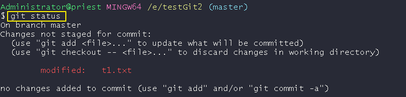

---

==== 查看文件在修改后, 具体改动了什么内容? -> git diff 文件名.扩展名

输入
[source,python]
....
git diff t1.txt # diff 就是 difference
....

[source,python]
....
Administrator@priest MINGW64 /e/testGit2 (master)
$ git diff t1.txt #你输入

diff --git a/t1.txt b/t1.txt
index ca3c3cc..5a58fbf 100644
--- a/t1.txt
+++ b/t1.txt
@@ -1 +1 @@
----t1 origin 的内容---
+---t1 v1版本---
....

---

== 3. 输入本次提交的说明信息 -> git commit -m "本次提交更新的说明信息"

[source,python]
....
Administrator@priest MINGW64 /e/testGit2 (master)
$ git commit -m "info_t1:update to v1" #你的输入

[master 80ec8aa] info_t1:update to v1
 1 file changed, 1 insertion(+), 1 deletion(-)
....

---

==== 查看所有的提交(即commit命令)日志 -> git log

现在, 你来多次修改 t1.txt文件, 然后每次修改后, 就commit 一次. 这样, 你就有了多次commit. 可以用 git log 来查看你所有commit的历史记录(日志).

如果嫌输出信息太多，看得眼花缭乱的，可以加上 --pretty=oneline 参数.

[source,python]
....
# 对t1.txt进行第2次修改, 然后输入下面命令
Administrator@priest MINGW64 /e/testGit2 (master)
$ git add t1.txt  # 你输入

Administrator@priest MINGW64 /e/testGit2 (master)
$ git commit -m "myinfo:t1文件_第2次更新"  # 你输入
[master f7a456c] myinfo:t1文件_第2次更新
 1 file changed, 1 insertion(+), 1 deletion(-)

# 对t1.txt进行第3次修改, 然后输入下面命令
Administrator@priest MINGW64 /e/testGit2 (master)
$ git add t1.txt  # 你输入

Administrator@priest MINGW64 /e/testGit2 (master)
$ git commit -m "myinfo:t1文件_第3次更新"  # 你输入
[master 430a7a2] myinfo:t1文件_第3次更新
 1 file changed, 1 insertion(+), 1 deletion(-)

# 然后用 git log, 来查看你所有commit提交的记录, 它会从"最近到最远"的来显示提交日志. 的确显示了你更新了3次文件.
Administrator@priest MINGW64 /e/testGit2 (master)
$ git log  # 你输入

commit 430a7a236ba941019a62489f7dd1596a340786b0 (HEAD -> master)
Author: zrx <346669129@qq.com>
Date:   Mon Apr 20 10:19:43 2020 +0800

    myinfo:t1文件_第3次更新

commit f7a456c64fa7b83a95d912b3fb3c6c62877c7df6
Author: zrx <346669129@qq.com>
Date:   Mon Apr 20 10:19:14 2020 +0800

    myinfo:t1文件_第2次更新

commit 80ec8aaf8031a8d6d7c16ddcfabe965d4a715c31
Author: zrx <346669129@qq.com>
Date:   Mon Apr 20 10:07:52 2020 +0800

    info_t1:update to v1

commit 63e712ad70f09410fad7e511f70e71d8b40613a5
Author: zrx <346669129@qq.com>
Date:   Fri Apr 17 16:19:53 2020 +0800

    这是t1.txt的最原始稿

....

*对 git log命令, 加上 --pretty=oneline 参数, 可以精简显示*:

[source,python]
....
Administrator@priest MINGW64 /e/testGit2 (master)
$ git log --pretty=oneline # 你输入

430a7a236ba941019a62489f7dd1596a340786b0 (HEAD -> master) myinfo:t1文件_第3次更
新 # 注意! 这里有 HEAD, 表示这个是"当前版本"!
f7a456c64fa7b83a95d912b3fb3c6c62877c7df6 myinfo:t1文件_第2次更新
80ec8aaf8031a8d6d7c16ddcfabe965d4a715c31 info_t1:update to v1
63e712ad70f09410fad7e511f70e71d8b40613a5 这是t1.txt的最原始稿

....

输出的信息里面, 有 *430a... 一长串英文和数字, 是 commit id（版本号）*. 它是SHA1计算出来的一个非常大的数字，用十六进制表示.

---

==== 回退到上一个commit的版本 -> git reset --hard HEAD^

如果你想回退到上一个版本, 即 第2次修改后的t1.txt. 由于当前版本(即最新commit时的版本), 是用 HEAD 来表示的. 所以:

[options="autowidth"]
|===
|回到指定版本 |命令

|当前(最新)版本
| HEAD

|上一个版本
| HEAD^

|上上一个版本
|HEAD^^

|往上100个版本
|HEAD~100
|===

[source,python]
....
Administrator@priest MINGW64 /e/testGit2 (master)
$ git reset --hard HEAD^ # 你输入

HEAD is now at f7a456c myinfo:t1文件_第2次更新 # 可以发现, HEAD已经变成了"第2次更新"时的文件.
# 你打开 t1.txt, 也能看到文字内容的确是第2次更新时的.

# 你再次用 git log 来查看 commit日志, 发现, 你第3次更新的记录不见了?
Administrator@priest MINGW64 /e/testGit2 (master)
$ git log # 你输入

commit f7a456c64fa7b83a95d912b3fb3c6c62877c7df6 (HEAD -> master)
Author: zrx <346669129@qq.com>
Date:   Mon Apr 20 10:19:14 2020 +0800

    myinfo:t1文件_第2次更新

commit 80ec8aaf8031a8d6d7c16ddcfabe965d4a715c31
Author: zrx <346669129@qq.com>
Date:   Mon Apr 20 10:07:52 2020 +0800

    info_t1:update to v1

commit 63e712ad70f09410fad7e511f70e71d8b40613a5
Author: zrx <346669129@qq.com>
Date:   Fri Apr 17 16:19:53 2020 +0800

    这是t1.txt的最原始稿

....

如果你还想回到你第3次更新时的版本, 就一定要事先记录下它的 commit id 号. 你第3次commit时的id号, 是 430a7a236ba941019a62489f7dd1596a340786b0, 则, 你就输入:

[source,python]
....
Administrator@priest MINGW64 /e/testGit2 (master)
$ git reset --hard 430a7 # 你在 --hard后, 输入第3次commit时的id号. 不用写全, 只要写前几位就可以了，Git会自动去找。当然也不能只写前一两位，因为Git可能会找到多个版本号，就无法确定是哪一个了。

HEAD is now at 430a7a2 myinfo:t1文件_第3次更新

# 现在再看看你的 t1.txt, 里面的确是 第3次更新时的内容.
....

Git的"版本回退", 速度非常快，因为 *Git在内部有个HEAD指针, 专门指向"当前版本"*. 当你回退版本的时候，Git仅仅是把HEAD指针, 指向你所指定的那个版本号上去.

---

==== 查看你使用过的每一个git命令 -> reflog

如果你忘了, 或找不到你想恢复版本的commit 的id号, 该怎么办? 可以用 git reflog 来查看你之前所有使用过的git命令（包括已经被删除的 commit 记录和 reset 的操作）, 从而找到你想要的 id 号.

[source,python]
....
Administrator@priest MINGW64 /e/testGit2 (master)
$ git reflog # 你输入

430a7a2 (HEAD -> master) HEAD@{0}: reset: moving to 430a7
f7a456c HEAD@{1}: reset: moving to HEAD^
430a7a2 (HEAD -> master) HEAD@{2}: commit: myinfo:t1文件_第3次更新
f7a456c HEAD@{3}: commit: myinfo:t1文件_第2次更新
80ec8aa HEAD@{4}: commit: info_t1:update to v1
63e712a HEAD@{5}: commit (initial): 这是t1.txt的最原始稿

....

reflog, 即 Reference logs（参考日志）

---

== 工作区(目录) -> git add -> 暂存区(stage) -> git commit -> 版本库(含有master分支)

[source,python]
...
E:\testGit2  # 这个是我们的"工作区"（Working Directory）
E:\testGit2\.git # 这个隐藏目录, 是Git的"版本库".
....

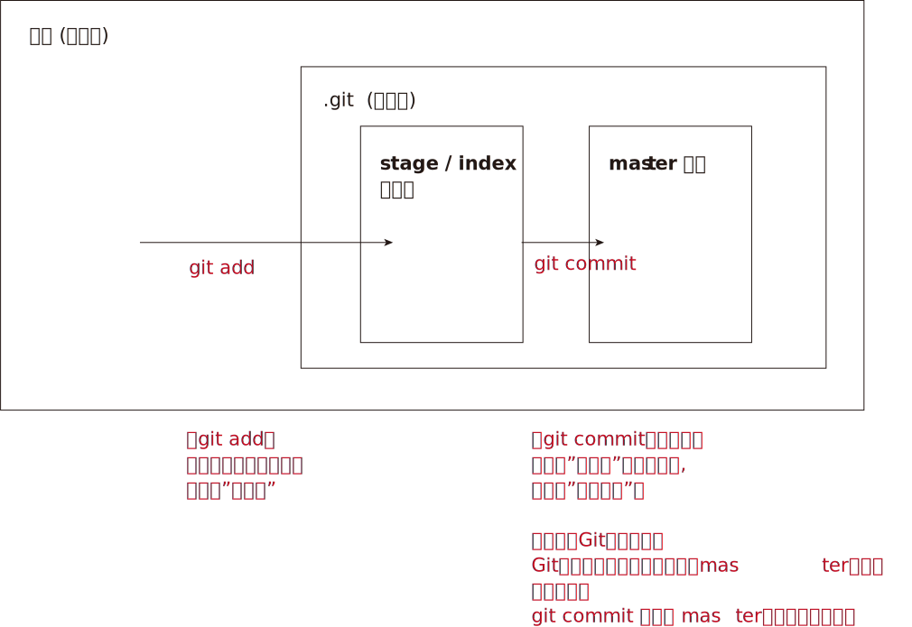

你可以简单理解为，需要提交的文件修改, 通通放到暂存区，然后，一次性提交暂存区的所有修改。

继续, 我们对t1.txt做第4次更新. 然后新增一个t2.txt文件. 在用 git status 查看一下状态:

[source,python]
....
Administrator@priest MINGW64 /e/testGit2 (master)
$ git status # 你输入

On branch master
Changes not staged for commit:
  (use "git add <file>..." to update what will be committed)
  (use "git checkout -- <file>..." to discard changes in working directory)

        modified:   t1.txt # modified表明, t1文件被修改过了

Untracked files: # Untracked 表明, t2文件尚未被 add过
  (use "git add <file>..." to include in what will be committed)

        t2.txt

no changes added to commit (use "git add" and/or "git commit -a")

....

现在, 将t1和t2文件, 都add, 在用git status再查看一下：

[source,python]
....
Administrator@priest MINGW64 /e/testGit2 (master)
$ git add t1.txt t2.txt # 你输入.  一次 add 多个文件时, 这多个文件用空格隔开即可.

Administrator@priest MINGW64 /e/testGit2 (master)
$ git status # 你输入
On branch master
Changes to be committed:
  (use "git reset HEAD <file>..." to unstage)

        modified:   t1.txt
        new file:   t2.txt

....

现在，暂存区的状态就变成了：

[options="autowidth"]
|===
|工作区(你的目录)||暂存区(atage)

|t1.txt +
t2.txt
| git add ->
|t1.txt +
t2.txt
|===

*所以，git add命令实际上就是把要提交的所有修改, 先放到暂存区（Stage）， +
然后，执行git commit, 就可以一次性把暂存区中的所有修改, 提交到分支(branch)。*

[source,python]
....
Administrator@priest MINGW64 /e/testGit2 (master)
$ git commit -m "现在有2个文件,t1和t2" # 你输入

[master e52e491] 现在有2个文件,t1和t2
 2 files changed, 2 insertions(+), 1 deletion(-)
 create mode 100644 t2.txt

# 一旦提交后，如果你又没有对工作区做任何修改，那么工作区就是“干净”的
Administrator@priest MINGW64 /e/testGit2 (master)
$ git status # 你输入
On branch master
nothing to commit, working tree clean # clean表明, 工作区是"干净"的.

....

现在版本库变成了这样，暂存区就没有任何内容了：

[options="autowidth"]
|===
|工作区(你的目录)||暂存区(stage) || master分支(由HEAD指针指向)

|t1.txt +
t2.txt
|
|很干净
|git commit -m "更新说明" ->
|t1.txt +
t2.txt
|===

---

==== 查看工作区, 和版本库里面最新版本的区别 -> git diff HEAD -- 文件名.扩展名

[source,python]
....
Administrator@priest MINGW64 /e/testGit2 (master)
$ git diff HEAD -- t1.txt # 你输入.  没有输出任何内容, 说明一切ok, 工作区和版本库里的内容一致.

....

现在, 我们来这样操作: 将t1文件进行第5次更新, 使用add命令; 然后, 进行第6次更新, 这时跳过add命令, 直接使用commit命令. 来看看会发生什么?

[source,python]
....
# 先对t1.txt进行第5次修改, 用add命令
Administrator@priest MINGW64 /e/testGit2 (master)
$ git add t1.txt # 你输入

# 再对t1.txt进行第6次修改, 直接用commit命令
Administrator@priest MINGW64 /e/testGit2 (master)
$ git commit -m "myinfo:t1文件_第6次更新" # 你输入

[master 0e88bcf] myinfo:t1文件_第6次更新
 1 file changed, 1 insertion(+), 1 deletion(-)

# 查看状态. 你发现, 第6次更新的没有被提交? 为什么?
# 因为当你用git add命令后，在工作区的第一次修改被放入暂存区，准备提交，但是，在工作区的第二次修改并没有放入暂存区(没有使用add命令)，所以，git commit只负责把暂存区的修改提交了，也就是第一次的修改被提交了，第二次的修改不会被提交。
Administrator@priest MINGW64 /e/testGit2 (master)
$ git status # 你输入

On branch master
Changes not staged for commit:
  (use "git add <file>..." to update what will be committed)
  (use "git checkout -- <file>..." to discard changes in working directory)

        modified:   t1.txt

no changes added to commit (use "git add" and/or "git commit -a")

# 用git diff HEAD -- t1.txt命令, 来查看工作区, 和版本库里面最新版本的区别
Administrator@priest MINGW64 /e/testGit2 (master)
$ git diff HEAD -- t1.txt # 你输入

diff --git a/t1.txt b/t1.txt
index 092e828..8fa0ee9 100644
--- a/t1.txt
+++ b/t1.txt
@@ -1 +1 @@
----t1 v5版本---
+---t1 v6版本---

....

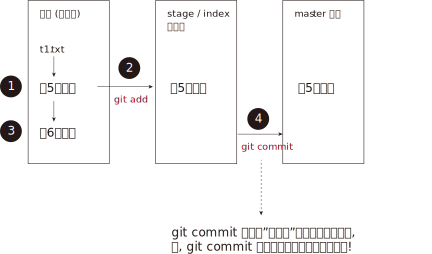

*即, git commit 只管提交"暂存区"中的内容, 而不会去管"工作区"中的文件.* +
所以, 无论你修改几次文件, 都必须先 git add 再 git commit. 两步操作都要做! 换言之, *git add 是每次修改后, 都要做的; 而git commit 可以一次性提交n次修改*. 如下: +
....
第一次修改 -> git add -> 第二次修改 -> git add -> git commit
....
就相当于把两次修改(git add)合并后, 一块提交(commit)了.

---

==== 对"工作区"中的文件, 撤销修改 -> git checkout -- 文件名.扩展名

现在, 你把t1.txt进行第7次修改, 在git add之前, 你突然发现第7次修改不好, 想恢复到第6次修改的状态. 由于你既没有add过, 也没有commit过, 所以你此时的id号依然是第6次修改时的. 但工作区中的t1.txt文件的内容, 此时却是第7次修改时的了, 该怎么撤销修改呢? +
可以用 git checkout 命令

*此命令用来放弃掉所有还没有加入到缓存区(即暂存区)（就是 git add 命令）的修改.*

[source, python]
....
# 先对t1.txt进行第7次修改
Administrator@priest MINGW64 /e/testGit2 (master)
$ git status # 你输入, 可以看到, 提示t1.txt被修改了

On branch master
Changes not staged for commit:
(use "git add <file>..." to update what will be committed)
(use "git checkout -- <file>..." to discard changes in working directory)

        modified:   t1.txt

no changes added to commit (use "git add" and/or "git commit -a")

# 如果你想把t1.txt文件在工作区的修改全部撤销，就用 git checkout -- t1.txt 命令
Administrator@priest MINGW64 /e/testGit2 (master)
$ git checkout -- t1.txt # 你输入

....

撤销修改后, 可以发现, 工作区中的t1.txt文件内容, 已经复原到之前的状态了. 注意, 这个复原, 分两种情况:

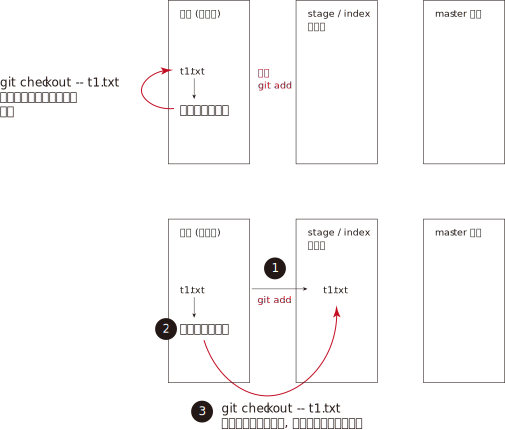

*注意! git checkout \-- file命令中的 \-- 很重要，没有--，就变成了“切换到另一个分支”的命令.*

---

==== 将暂存区中的内容撤销掉 -> git reset HEAD 文件名.扩展名

*如果你在 git add 到暂存区后, 才发现该文件有错, 你可以用  "git reset HEAD 文件名.扩展名"命令, 来把暂存区的修改撤销掉（unstage），重新放回工作区.*

[source, python]
....
# 对t1.txt进行修改, 然后add
Administrator@priest MINGW64 /e/testGit2 (master)
$ git add t1.txt # 你输入

# 用git status查看一下，修改只是添加到了暂存区，还没有提交.
Administrator@priest MINGW64 /e/testGit2 (master)
$ git status # 你输入

On branch master
Changes to be committed:  # <-表示"暂存区"中的内容等待被commit
(use "git reset HEAD <file>..." to unstage)

        modified:   t1.txt

# 此时你发现这个t1.txt有错, 想撤销add
# 用命令git reset HEAD <file>可以把"暂存区"的修改撤销掉（unstage），重新放回工作区
Administrator@priest MINGW64 /e/testGit2 (master)
$ git reset HEAD t1.txt # 你输入

Unstaged changes after reset:
M       t1.txt

# 再用git status查看一下，现在"暂存区"是干净的，"工作区"有修改
Administrator@priest MINGW64 /e/testGit2 (master)
$ git status # 你输入

On branch master
Changes not staged for commit: # <- 表示"暂存区stage"中没有内容, 是干净的.
(use "git add <file>..." to update what will be committed)
(use "git checkout -- <file>..." to discard changes in working directory)

        modified:   t1.txt

no changes added to commit (use "git add" and/or "git commit -a")

# 虽然"暂存区"中干净了, 但"工作区"中的t1.txt还是错误的修改, 所以我们要把"工作区"中的t1.txt, 也撤销修改.
Administrator@priest MINGW64 /e/testGit2 (master)
$ git checkout -- t1.txt # 你输入

....

*即, 有时候，我们用Git的时候有可能commit提交代码后，发现这一次commit的内容是有错误的，那么有两种处理方法： +
1、修改错误内容，再次commit一次 +
2、使用git reset 命令撤销这一次错误的commit*

第一种方法比较直接，但会多次一次commit记录。
而 *我个人更倾向第二种方法，错误的commit没必要保留下来。*

git-reset 的意思就是: Reset current HEAD to the specified state, 即, 让HEAD这个指针指向其他的地方。

例如我们有一次commit不是不是很满意，需要回到上一次的Commit里面。那么这个时候就需要通过reset，把HEAD指针指向上一次的commit的点。
它有三种模式，soft,mixed,hard :

image:./img_github/git_06 git-reset.webp[]

小结

*场景1：当你改乱了"工作区"某个文件的内容，想直接丢弃"工作区"的修改时，用命令git checkout -- file。*

*场景2：当你不但改乱了工作区某个文件的内容，还添加 add 到了"暂存区"时，想丢弃修改，分两步: 第一步用命令 git reset HEAD <file> ，就回到了场景1，第二步按场景1操作。*

*场景3：已经提交了(commit)不合适的修改到"版本库"时，想要撤销本次提交(commit)，参考"版本回退"一节，不过前提是没有推送到"远程库"。*

---

==== 删除"版本库"里的文件

在你add, 并commit后, 如果你想删除"工作区"中的txt文件, 可以直接在文件管理器中把它删了，或者用rm命令删了:
....
$ rm test.txt
....

这个时候，Git知道你删除了文件，因此，工作区和版本库就不一致了，git status命令会立刻告诉你哪些文件被删除了.

虽然"工作区"中的文件没了, 但是你之前用commit提交到"版本库repository(HEAD)"中的文件, 还是有的, 所以, *如果你想把"版本库"里的该文件也删除, 就用  git rm test.txt 命令*, 然后再 git commit.

[source, python]
....
# 你先创建一个 t2.txt, 然后 add, commit 它
Administrator@priest MINGW64 /e/testGit2 (master)
$ git add t2.txt # 你输入

Administrator@priest MINGW64 /e/testGit2 (master)
$ git commit -m "t2文件第2次更新" 你输入
[master ebfacb6] t2文件第2次更新
1 file changed, 0 insertions(+), 0 deletions(-)
create mode 100644 t2.txt

# 你想在"工作区"中, 删除它, 就用 rm 命令, 或直接在资源管理器中删除它.
Administrator@priest MINGW64 /e/testGit2 (master)
$ rm t2.txt

# 但是, 由于刚刚你已经commit过它了, 所以在"版本库"里, 它依然存在, 如何删除版本库里的它呢? 用 git rm 命令
Administrator@priest MINGW64 /e/testGit2 (master)
$ git rm t2.txt # 你输入
rm 't2.txt'

Administrator@priest MINGW64 /e/testGit2 (master)
$ git status
On branch master
Changes to be committed:
(use "git reset HEAD <file>..." to unstage)

        deleted:    t2.txt

# 然后再 commit
Administrator@priest MINGW64 /e/testGit2 (master)
$ git commit -m "删除t2文件" # 你输入
[master 8996edf] 删除t2文件
1 file changed, 0 insertions(+), 0 deletions(-)
delete mode 100644 t2.txt

....

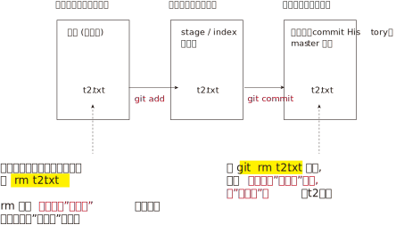

如果你不删"版本库"里的文件, 只删除了"工作区"中文件, 就能恢复它. 用命令 git checkout -- t2.txt

[source, python]
....
Administrator@priest MINGW64 /e/testGit2 (master)
$ git add t2.txt # 先add

Administrator@priest MINGW64 /e/testGit2 (master)
$ git commit -m "new t2" # 再 commit
On branch master
nothing to commit, working tree clean

Administrator@priest MINGW64 /e/testGit2 (master)
$ rm t2.txt # 物理删除"工作区"中的文件

Administrator@priest MINGW64 /e/testGit2 (master)
$ git checkout -- t2.txt # 将之前提交到"版本库"里的文件, 拷贝回"工作区"中.

....

*git checkout其实是用"版本库"里的版本, 替换"工作区"的版本，无论"工作区"是修改还是删除，都可以“一键还原”。*

*注意：对哪些从来没有被添加到"版本库"里, 就被删除的文件，是无法恢复的！* 即, "版本库"相当于一个备份箱. +
*如果一个文件已经被提交到"版本库"，那么你永远不用担心在"工作区"中误删它*(因为能从"版本库"中来恢复它到"工作区"中)，但是要小心，你只能恢复文件到最新版本(即"版本库"中是什么版本, 恢复的就是什么版本)，你会丢失最近一次commit提交后你修改的内容。

---

== 4. 远程仓库 github

本地Git仓库, 和GitHub仓库之间的传输, 是通过SSH加密的.

==== (1) 在本机, 创建 SSH Key

首先查看 C:\Users\Administrator\.ssh 这个目录存不存在? 如果存在, 则直接跳到下一步。如果没有，打开Shell（Windows下打开Git Bash），创建SSH Key：

[options="autowidth"]
|===
|步骤 |

|1. ssh-keygen命令, 用来生成私钥和公钥.
|ssh-keygen -t rsa -C "youremail@example.com"

参数 -t rsa 表示使用rsa算法进行加密. +
引号中的内容, 是你在github上的注册邮箱.

|2. 设定你的ssh密码
|当然, 由于这个Key也不是用于军事目的，你也可以不设置密码。那么就一路回车，使用默认值即可.
|===

执行后，会在 C:\Users\Administrator\.ssh (注意: 这里的Administrator 是你的计算机名, 如果你改过名字, 就要换成你新的名字 )目录下, 找到id_rsa(私钥)和id_rsa.pub(公钥)

- id_rsa 是私钥，不能泄露出去.
- id_rsa.pub 是公钥，可以放心地告诉任何人.

---

==== (2) 将 SSH Key 添加到 你的github账号上

登陆GitHub -> 打开“Account settings” -> “SSH Keys”页面 -> 点“Add SSH Key” -> 填上任意Title，在Key文本框里粘贴id_rsa.pub文件的内容 -> 点“Add Key”，你就看到已经添加的Key.

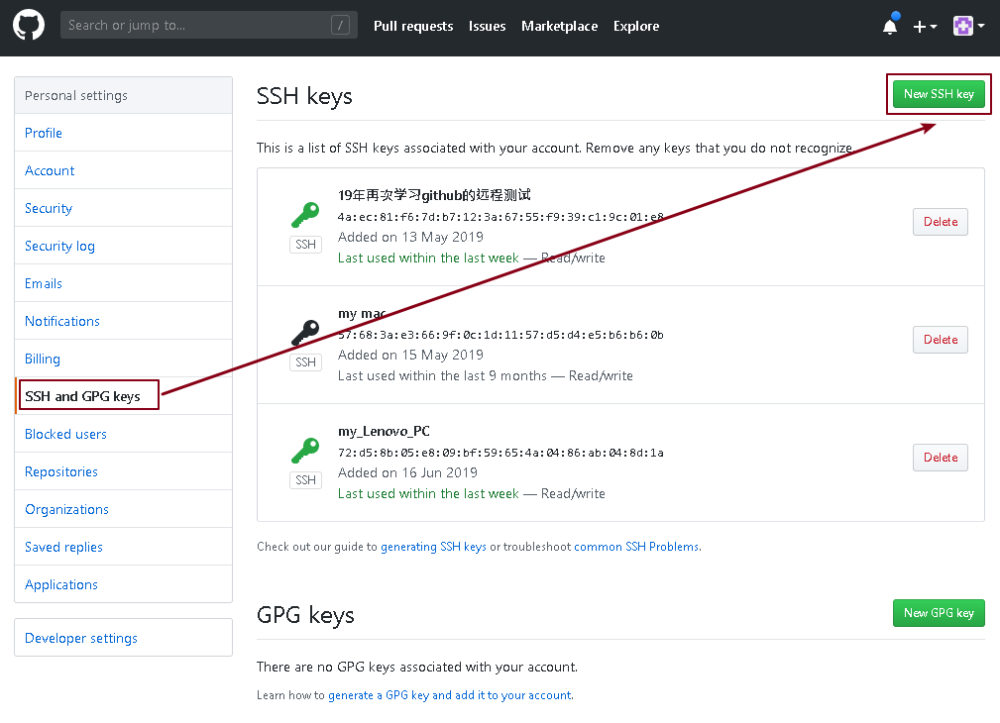

为什么GitHub需要SSH Key呢？因为GitHub需要识别出, 你push推送的commit提交, 确实是你push推送的，而不是别人冒充的. 而Git支持SSH协议，所以，GitHub只要知道了你的公钥，就可以确认只有你自己才能推送。

当然，GitHub允许你添加多个Key。假如你有若干电脑，你一会儿在公司提交，一会儿在家里提交，只要把每台电脑的Key都添加到GitHub，就可以在每台电脑上往GitHub推送了。

注意: 在GitHub上免费托管的Git仓库，任何人都可以看到喔（但只有你自己才能改）。所以，不要把敏感信息放进去。

如果你不想让别人看到Git库，有两个办法 : +
一个是交点保护费，让GitHub把公开的仓库变成私有的，这样别人就看不见了（不可读更不可写）。 +
另一个办法是自己动手，搭一个Git服务器，因为是你自己的Git服务器，所以别人也是看不见的。公司内部开发必备。

---

==== (3) #在github上, 添加远程库#

你已经在本地创建了一个Git仓库后，又想在GitHub创建一个Git仓库，并且让这两个仓库进行远程同步.

步骤:

1.登陆GitHub，在右上角点击“new repository”按钮，创建一个新的仓库

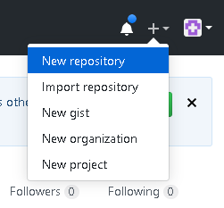

2.在Repository name 填入你的远程仓库名, 比如叫 "test"，其他保持默认设置，点击“Create repository”按钮，就成功地创建了一个新的Git仓库

*注意!!! 下图中的最后一个选项, 创建 README文件 ,不要选!!!*

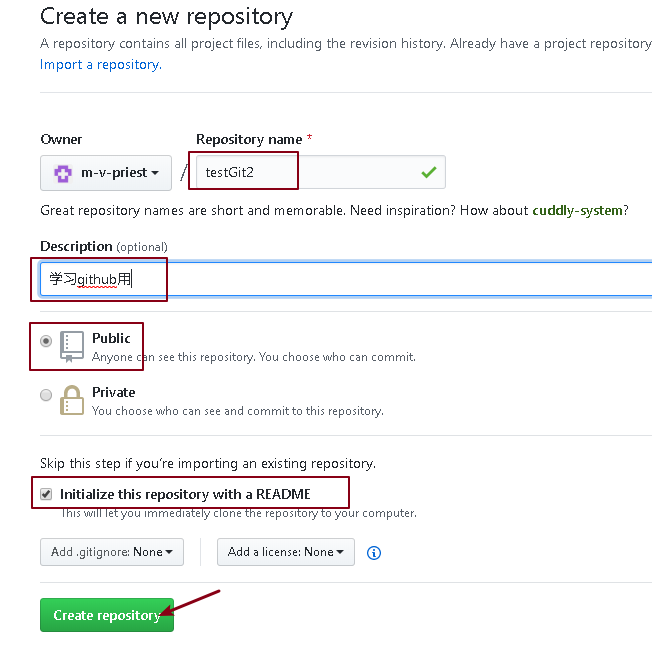

*注意!!! 上图中的最后一个选项, 创建 README文件 ,不要选!!! 否则你在之后用push 将"本地库"推送到相关联的"远程库"时, 一定会报错!!* (error: failed to push some refs to 'git@github.com:m-v-priest/testGit2.git'
)

原因是, 你创建了一个含有 README.md 和 .gitignore文件 的远程库, 但是你的本地库中, 很可能是没有这两个文件的, 所以导致两端的文件不相符! 于是你会看到git提示你先拉取(pull)再推送(push)，但总是推送(push)失败。

想要避免这种问题，就要保持创建的仓库是一个空仓库，什么都没有。

其实在创建仓库时，其实Github是有提示的，相信很多人都没有注意过红框里面的小字:
....
Skip this step if you’re importing an existing repository.
如果要导入现有存储库，请跳过此步骤。

This will let you immediately clone the repository to your computer.
这将允许您立即将存储库克隆到您的计算机。
....

当你创建了这个干净的远程库后, 它会提示你接下来该怎么操作, 才能将本地库上传到这个远程库:

…or create a new repository on the command line
....
echo "# testGit2" >> README.md
git init
git add README.md
git commit -m "first commit"
git remote add origin git@github.com:m-v-priest/testGit2.git
git push -u origin master
....

…or push an existing repository from the command line
....
git remote add origin git@github.com:m-v-priest/testGit2.git
git push -u origin master
....

…or import code from another repository
....
You can initialize this repository with code from a Subversion, Mercurial, or TFS project.
....

---

==== (3-1) #将本地库, 关联到远程库上# -> git remote add origin git@github.com:m-v-priest/testGit2.git

现在, 我们就可以把一个本地仓库, 与这个github远程仓库关联，然后，把本地仓库的内容, 推送到它上面去。

[source,python]
....
# 亲测可行
git remote add origin git@github.com:m-v-priest/testGit2.git

# 下面这句可以不用输入(输了也会报错), 直接用 git add .  等来上传你的文件到github上就行.
git push -u origin master
# 把本地库的内容推送到远程库，用 git push 命令，实际上是把当前分支master, 推送到远程。
....

由于远程库是空的，我们第一次推送master分支时，加上了-u参数，Git不但会把本地的master分支内容推送到远程新的master分支，还会把本地的master分支和远程的master分支关联起来，在以后的推送, 或者拉取时, 就可以简化命令。

推送成功后，可以立刻在GitHub页面中, 看到远程库testGit2的内容, 已经和本地testGit2目录中一模一样.

从现在起，只要本地作了提交(commit后)，就可以通过命令:
[source,python]
....
git add . # add所有文件
get commit -m "..."

git push origin master
# 把本地 master分支的最新修改, 推送至GitHub
....

---

==== SSH 警告

当你第一次使用Git的 clone 或者 push命令 连接GitHub时，会得到一个警告：

....
The authenticity of host 'github.com (xx.xx.xx.xx)' can't be established.
RSA key fingerprint is xx.xx.xx.xx.xx.
Are you sure you want to continue connecting (yes/no)?
....

这是因为Git使用SSH连接，而SSH连接在第一次验证GitHub服务器的Key时，需要你确认GitHub的Key的指纹信息, 是否真的来自GitHub的服务器，输入 yes 回车即可。

Git会输出一个警告，告诉你已经把GitHub的Key添加到本机的一个信任列表里了：

....
Warning: Permanently added 'github.com' (RSA) to the list of known hosts.
....

这个警告只会出现一次，后面的操作就不会有任何警告了。

---

==== (3-2) 一个本地仓库, 可以同时关联多个远程仓库 ->  git remote add 关联的远程仓库名

到每个仓库的路径下，创建远程关联仓库. 一个本地仓库, 可以同时关联多个远程仓库. 输入命令:

[source,python]
....
git remote add origin 地址
git remote add 远程仓库名2(一定要和origin不同) 地址
....
关联的远程仓库名, 可以随便取, 但一般设成 origin.

如果想要要删除关联的某个远程仓库, 就用:
[source,python]
....
git remote remove 远程仓库名2
....

---

==== (3-3) 查看每个本地仓库, 各自关联到的远程仓库 ->  git remote -v

你可以用 git remote -v  查看该本地仓库下, 关联的远程仓库

-v 就是 verbose.

[source,python]
....
# gitBash中
Administrator@priest MINGW64 /e/phpStorm_proj/01_myLearn (master)
$ git remote -v # 你输入

origin  https://github.com/m-v-priest/01_myLearn (fetch)
origin  https://github.com/m-v-priest/01_myLearn (push)
....

[source,python]
....
# phpStorm中
E:\phpStorm_proj\testGit2>git remote -v # 你输入
origin  git@github.com:m-v-priest/testGit2.git (fetch)
origin  git@github.com:m-v-priest/testGit2.git (push)
....

---

==== (4) 将远程库克隆到本地 -> git clone 远程仓库地址

假设你想把你github上的 testGit2仓库, 克隆到本机上, 就先找到它的地址:

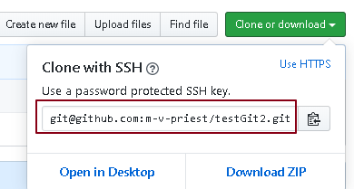

然后用 git clone 命令:
....
git clone git@github.com:m-v-priest/testGit2.git
....

[source,python]
....
# 在 E:\phpStorm_proj 目录下, 使用 git clone命令, 就会把远程仓库下载到 E:\phpStorm_proj 目录下面
E:\phpStorm_proj>git clone git@github.com:m-v-priest/testGit2.git # 你输入

Cloning into 'testGit2'...
remote: Enumerating objects: 31, done.
Receiving objects: 100% (31/31), done.
Resolving deltas: 100% (1/1), done.1)
remote: Counting objects: 100% (31/31), done.
remote: Compressing objects: 100% (16/16), done.
remote: Total 31 (delta 1), reused 31 (delta 1), pack-reused 0

....

你也许还注意到，GitHub给出的地址不止一个，还可以用https://github.com/michaelliao/gitskills.git这样的地址。 +
实际上，Git支持多种协议，默认的 git:// 使用ssh，但也可以使用https等其他协议。

使用https除了速度慢以外，还有个最大的麻烦是每次推送都必须输入口令，但是在某些只开放http端口的公司内部就无法使用ssh协议而只能用https。

---

==== (10) 删除 github上的远程仓库

比如你想删除 test 仓库,  +
1.就先进入该仓库页面,  点 'Settings' 按钮

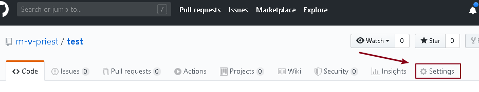

2.滑动到最底部，点击 'Delete this repository'

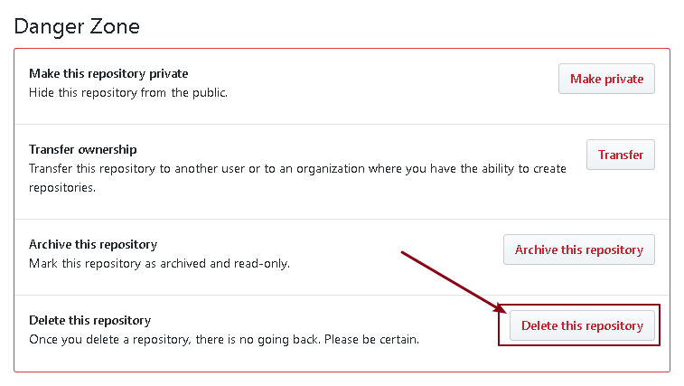

3.输入要删除的仓库名称，输入账号密码即可.

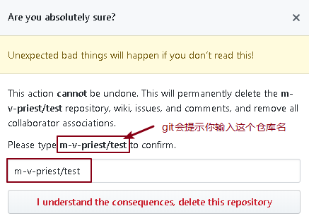

---

== 分支管理

分支在实际中有什么用呢？假设你准备开发一个新功能，但是需要两周才能完成. 如果你边开发边提交, 由于代码还没写完，不完整的代码库会导致别人无法引用你的库, 不能干活。而如果你等代码全部写完再一次提交，又面临着丢失每天进度保存的巨大风险。

现在有了分支，就不用怕了。你创建了一个属于你自己的分支B，别人看不到，还继续在原来的分支A上正常工作，而你在自己的分支B上干活，想提交就提交，直到开发完毕后，再一次性合并到原来的分支A上，这样，既安全，又不影响别人工作。

换言之, 分支就像是科幻电影里面的平行宇宙，两个平行宇宙互不干扰，不过，在某个时间点，两个平行宇宙就能合并.

---

==== (1) 创建分支, 与合并分支的原理

每次commit提交，Git都把它们串成一条时间线，这条时间线就是一个分支。截止到目前，只有一条时间线, 这个分支叫主分支(master).

Git用master指向最新的提交(commit)，再用HEAD指向master (*HEAD指向的就是"当前分支"*)，就能确定当前分支，以及当前分支的提交点.

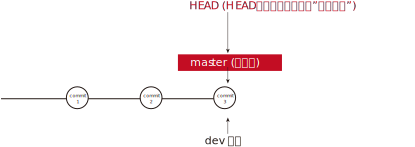

每次提交，master分支都会向前移动一步，这样，随着你不断提交，master分支的线也越来越长。

当我们创建新的分支，例如dev时，Git新建了一个指针叫dev，指向master相同的提交，再把HEAD指向dev，就表示"当前分支"在dev上(*因为"当前分支"由HEAD决定. HEAD指向那个分支, 哪个分支就是"当前分支"*).

你看，Git创建一个分支很快，因为除了增加一个dev指针，改改HEAD的指向，工作区的文件都没有任何变化！

不过，*从现在开始，对工作区的修改和提交commit, 就是针对dev分支了，比如新提交commit一次后，dev指针往前移动一步，而master指针不变*：

假如我们在dev上的工作完成了，就可以把dev合并到master上。*Git怎么合并呢？最简单的方法，就是直接把master指向dev的当前提交，就完成了合并*：

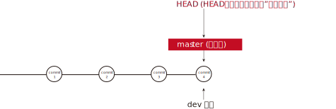

所以Git合并分支也很快！就改改指针，工作区内容也不变！

*合并完分支后，甚至可以删除dev分支。删除dev分支就是把dev指针给删掉，删掉后，我们就剩下了一条master分支*：

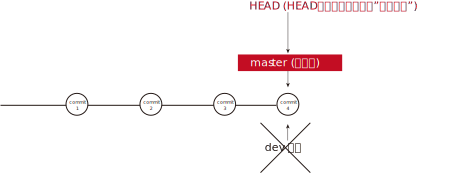

---

==== (2) ++分支操作的命令总结

[options="autowidth"]
|===
|你想要的分支操作 |命令

|1.创建新分支
|git branch <name>

|查看当前在使用的是哪个分支?
| git branch +
结果列表中前面标*号的, 表示"当前使用分支".

比如, 默认情况下, 你输入: +
$ git branch +
* master #会显示这个

|2.切换到某个分支上
|git checkout <name> +
或者 git switch <name>  # 推荐用这个! 注意: 要想使用这个命令, 必须升级git到最新版本才行! +

我们注意到"切换分支"使用 git checkout <branch>，而前面讲过的"撤销修改"则是 git checkout -- <file>，同一个命令，有两种作用，确实有点令人迷惑。

*实际上，"切换分支"这个动作，用switch更科学。* 因此，最新版本的Git提供了新的git switch命令来切换分支：

"创建"并"切换"到新的dev分支，可以使用： +
$ git switch -c dev

直接切换到已有的master分支，可以使用： +
$ git switch master

因此, 使用新的git switch命令，比git checkout要更容易理解。

|创建+切换分支
|git checkout -b <name> +
或者 git switch -c <name>  # 推荐用这个!

|3.合并"某个分支"到"当前分支"
|git merge <某分支的name>

|4.删除某分支
|git branch -d <某分支的name>

|---|---

|查看分支的合并情况
|git log --graph --decorate --oneline --all +

或 git log --graph --pretty=oneline --abbrev-commit +

或更详细的 git log --graph

|===

---

==== (3) 完整流程案例操作

1.首先，我们创建dev分支，然后切换到dev分支：

[source,python]
....
# 创建新的dev分支
$ git checkout -b dev # 你输入
Switched to a new branch 'dev'

# 然后，用git branch命令查看当前分支
$ git branch # 你输入. git branch命令会列出所有分支，当前分支前面会标一个*号。
* dev
  master
....

git checkout命令, 加上 -b 参数, 表示"创建"并"切换"，相当于以下两条命令：

[source,python]
....
$ git branch dev
$ git checkout dev
Switched to branch 'dev'
....

2.现在我们在工作区中新增一个t3.txt文件 , 然后add, 并提交commit:
[source,python]
....
$ git add . # 你输入
$ git commit -m "用dev分支提交_v1" # 你输入
On branch dev
nothing to commit, working tree clean
....

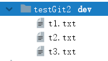

3.现在，dev分支的工作完成，我们就可以切换回master分支：

[source,python]
....
$ git checkout master # 你输入
Switched to branch 'master'
Your branch is up to date with 'origin/master'.
....

*切换回master分支后，你发现你的工作目录下, t3.txt不见了！因为那个提交是在dev分支上，而master分支此刻的提交点并没有变.*

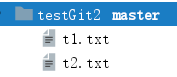

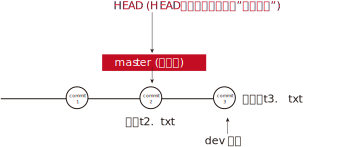

4.现在，我们把dev分支的工作成果, 合并到master分支上：

[source,python]
....
$ git merge dev # 你输入

Updating 58813dc..3345332
Fast-forward
 t3.txt | 1 +
 1 file changed, 1 insertion(+)
 create mode 100644 t3.txt
....

*git merge命令, 用于合并"指定分支"到"当前分支"。* 合并后，你就能看到, 此时为master分支的本机目录中, 有t3.txt文件了，和dev分支的最新提交是完全一样的。

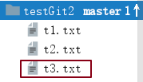

注意到上面的Fast-forward信息，Git告诉我们，*这次合并是“快进模式(Fast-forward)”，也就是直接把master指向dev的当前提交*，所以合并速度非常快。

当然，也不是每次合并, 都能Fast-forward，我们后面会讲其他方式的合并。

5.合并完成后，就可以放心地删除dev分支了：

[source,python]
....
$ git branch -d dev # 你输入
Deleted branch dev (was 3345332).

# 删除后，查看branch，就只剩下master分支了.
$ git branch # 你输入
* master
....

因为创建、合并和删除分支非常快，所以 *Git鼓励你使用分支完成某个任务，合并后再删掉分支，这和直接在master分支上工作效果是一样的，但过程更安全。*

事实上, *在实际开发中, master分支应该是非常稳定的，也就是仅用来发布新版本，平时不能在上面干活；干活都在dev分支上. 换言之, 不稳定的开发版本都放在dev分支上.* +
 到某个时候，比如1.0正式版发布时，再把dev分支合并到master上，在master分支发布1.0版本.

你和团队每个人都在dev分支上干活，每个人都有自己的分支，时不时地往dev分支上合并就可以了。所以，团队合作的分支看起来就像这样：

image:./img_github/git_40分支-7.png[650,650]

---

==== (4) 解决"合并分支"时的冲突

案例如下:
[source, python]
....
git branch dev # 创建 dev 分支

git checkout dev # 切换到 dev分支上
Switched to branch 'dev'

# 将 t3.txt文件内容修改为"t3文件的内容_dev"

# 然后在dev分支上提交
git add .
git commit -m "t3文件内容为:dev"

# 切换到master分支
git checkout master # 你输入

Switched to branch 'master'
Your branch is ahead of 'origin/master' by 1 commit.
  (use "git push" to publish your local commits) # Git还会自动提示我们当前master分支, 比远程的master分支要超前1个提交。

# 在master分支上, 也把t3.txt文件的内容改为:"t3文件的内容_master"

# 在master分支上提交它
git add .
git commit -m "t3文件内容为:master"
....

现在，master分支和dev分支, 各自都分别有新的提交，变成了这样:

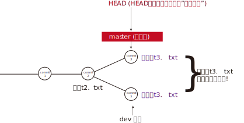

显然, 两次提交的t3.txt文件内容不同, 这种情况下，Git无法执行“快速合并”，只能试图把各自的修改合并起来，但这种合并就可能会有冲突，我们试试看：

[source,python]
....
$ git merge dev # 将dev分支合并到master分支上来

Auto-merging t3.txt
CONFLICT (content): Merge conflict in t3.txt
Automatic merge failed; fix conflicts and then commit the result.
....

果然冲突了！Git告诉我们，t3.txt文件存在冲突，必须手动解决冲突后再提交。 +

git status也可以告诉我们冲突的文件：

[source,python]
....
$ git status # 你输入

On branch master
Your branch is ahead of 'origin/master' by 2 commits.
  (use "git push" to publish your local commits)

You have unmerged paths.
  (fix conflicts and run "git commit")
  (use "git merge --abort" to abort the merge)

Unmerged paths:
  (use "git add <file>..." to mark resolution)

        both modified:   t3.txt

no changes added to commit (use "git add" and/or "git commit -a")

....

现在, 你可以直接打开t3.txt文件, 会看到里面的内容变成了:
[source,python]
....
<<<<<<< HEAD
t3文件的内容_master
=======
t3文件的内容_dev
>>>>>>> dev
....

*Git用<<<<<<<，=======，>>>>>>>标记出不同分支的内容.*

现在, 你必须选择保留哪个一版本的内容? 我们保留HEAD分支上的内容, 即, 将txt3的内容改为:
....
t3文件的内容_master
....

保存后, 然后再提交, 即可.
[source, python]
....
$ git add .
$ git commit -"t3文件内容已改为master"

# 这时git会跳出一个文件, 让你确认, 你直接关掉它即可.
hint: Waiting for your editor to close the file...
[main 2020-04-23T07:51:29.747Z] update#setState idle
[main 2020-04-23T07:51:59.749Z] update#setState checking for updates
[main 2020-04-23T07:51:59.956Z] update#setState idle
[master faf9a01] Merge branch 'dev'

....

现在，master分支和 dev分支变成了下图所示：

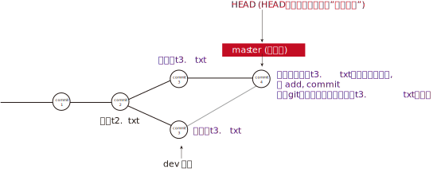

用带参数的git log也可以看到分支的合并情况：
[source, python]
....
$ git log --graph --pretty=oneline --abbrev-commit # 你输入

*   faf9a01 (HEAD -> master) Merge branch 'dev'
|\
| * 4c534e2 (dev) t3文件内容为:dev
* | 95cef0e t3文件内容为:master
|/
* 3345332 用dev分支提交_v2
* 58813dc (origin/master, origin/HEAD) update
...
* 430a7a2 myinfo:t1文件_第3次更新
* f7a456c myinfo:t1文件_第2次更新
* 80ec8aa info_t1:update to v1
* 63e712a 这是t1.txt的最原始稿

....

最后，解决合并冲突后, 就可以删除dev分支了：
[source, python]
....
$ git branch -d dev # 你输入

Deleted branch dev (was 4c534e2).
....

小结

当Git无法自动合并分支时，就必须首先解决冲突。解决冲突后，再提交，合并完成。

解决冲突就是把Git合并失败的文件手动编辑为我们希望的内容，再提交。

用 git log --graph 命令可以看到分支合并图。图中的
*表示一个commit

[source, python]
....
git log --graph --decorate --oneline --all
....

---

==== (5) 分支管理策略

---

== 5. 将git远程库, 拉取到本地, 并安装相关依赖 -> git clone 远程库的git地址

....
git clone git@github.com:m-v-priest/my_hexo_project.git

npm install //安装依赖
....

---

image:./img_github/git_00.svg[]

https://www.liaoxuefeng.com/wiki/896043488029600/900005860592480
