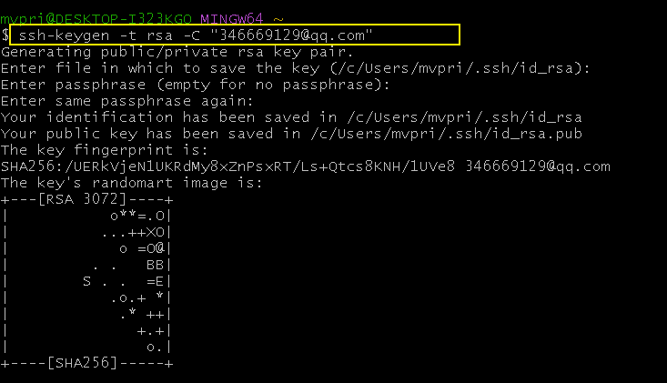

= github
:toc: left
:toclevels: 3
:sectnums:
//:stylesheet: myAdocCss.css

'''

== ★ git clone 下载你网上的仓库时,  报错 : git@github.com:Permission denied (publickey).fatal:Could not read from remote repository.

你在执行
....
git clone git@github.com:m-v-priest/03_myLife_commonSense.git
....

时, 报错 :

原因是: 你本电脑的密钥和公钥文件丢失了. 你的这两个钥匙文件, 会存放在这个目录中: +
....
C:\Users\mvpri\.ssh
....

[.small]
[options="autowidth" cols="1a,1a"]
|===
|Header 1 |Header 2

|第1步: 先检查你本地电脑的"密钥"和"公钥"文件还在不在?
|在 git bash 中, 输入命令:  +
....
ls -al ~/.ssh
....

|第2步: 重新在本地电脑上, 生成密钥和公钥文件
|输入命令: +
....
ssh-keygen -t rsa -C "346669129@qq.com"
....

然后一路回车.

然后, 你手动打开你电脑目录
....
C:\Users\mvpri\.ssh
....

就能看到这几个文件: +

|第3步: 登录你的github网站上, 将本地电脑的公钥输进去
|

|===

'''

== 报错: ssh: connect to host git.zhlh6.cn port 22: Network is unreachable

这个报错中, 有cn字样, 说明你没有用git官方服务器.

[.small]
[options="autowidth" cols="1a,1a"]
|===
|Header 1 |Header 2

|1.查看当前配置的远程仓库地址
|输入 git remote -v

image:/img_github/0067.png[,]

从这里可以看到，当前远程地址是基于 git.zhlh6.cn 的。

|2.获取 GitHub 仓库的官方地址
|登录你的 GitHub 账号，找到目标仓库，点击 Code 按钮，可以看到 HTTPS 或 SSH 格式的仓库地址，例如：

HTTPS 格式：https://github.com/username/repository.git +
SSH 格式：git@github.com:username/repository.git

|3.修改远程仓库地址
|根据你选择的协议（HTTPS 或 SSH），运行以下命令修改远程地址：

如果选择 HTTPS：
....
git remote set-url origin https://github.com/username/repository.git
....

如果选择 SSH：
....
git remote set-url origin git@github.com:username/repository.git
....

|4.验证远程地址修改
|再次查看远程地址，确保修改成功：git remote -v

输出应类似：
....
origin  https://github.com/username/repository.git (fetch)
origin  https://github.com/username/repository.git (push)
....

或
....
origin  git@github.com:username/repository.git (fetch)
origin  git@github.com:username/repository.git (push)
....

image:/img_github/0069.png[,]

image:/img_github/0068.png[,]

现在, 再次 git pull origin master 等, 就正常了.

|===

'''

== (这个不用看了)报错: ssh: connect to host git.zhlh6.cn port 22: Network is unreachable

报错
....
ssh: connect to host git.zhlh6.cn port 22: Network is unreachable
fatal: Could not read from remote repository.

Please make sure you have the correct access rights
and the repository exists.
....

这个错误提示表明, 你的电脑无法通过 SSH 协议, 连接到 git.zhlh6.cn，可能的原因包括: 网络问题、SSH 配置错误, 或远程仓库地址有误。

[.small]
[options="autowidth" cols="1a,1a"]
|===
|Header 1 |Header 2

|1.检查远程地址 :   +
|报错中出现的 git.zhlh6.cn 可能不是 GitHub 的官方地址

要查看当前配置的远程地址, 就用下面的命令:
....
git remote -v
....

image:/img_github/0063.png[,]

如果地址不正确，修改为 GitHub 的正确仓库地址。例如：
....
git remote set-url origin git@github.com:username/repository.git
....

|2.测试网络连接
|使用 ping 测试是否能连接到 GitHub
....
ping github.com
....

比如, 我们来 ping 你上面的中国服务器

image:/img_github/0064.png[,]

从 ping 的结果来看，网络是畅通的，但这只说明可以通过 ICMP 协议（ping 使用的协议）与服务器通信。即使 ping 正常，SSH 可能仍受限（如防火墙阻止 22 端口）。

|3.测试 SSH 配置
|尝试以下命令, 检查 SSH 端口是否通畅

....
telnet git.zhlh6.cn 22
....

注意: win10 默认没有安装 telnet, 可以这样安装:
用win+R键打开运行程序，在输入框里输入：OptionalFeatures, 回车

image:/img_github/0065.png[,]

或, 使用其他端口测试连接
....
ssh -T -p 443 git@104.21.51.157
....

image:/img_github/0066.png[,]

根据上图返回的结果, 综合判断是: 你的网络和目标服务器之间存在访问限制，主要表现在： +
22 端口被阻止，无法进行 SSH 通信。 +
443 端口的连接未成功，可能是目标服务器未支持。

|4.切换端口或协议
|

|5.进一步调试
|
|===

'''

== ★ 强制将本地文件, 上传覆盖掉github上的仓库

....
git push -f origin master
....

== ★ 下载时, 如何把远程库强制覆盖掉本地库中的内容?

用 git pull origin master 拉去远程库的文件到本地时, 有时会报错:
....
Please commit your changes or stash them before you merge.
....

解决办法是: 直接将本地的状态恢复到上一个commit id, 然后用远程的代码直接覆盖本地就好了。
....
git reset --hard
git pull origin master
....

---

== 上传到github时, 如何排除 node_modules目录? -> 创建 .gitignore文件

在项目根目录, 新建一个 .gitignore 文件, 内容如下:
....
node_modules
....

注意: .gitignore只能忽略那些原来没有被track的文件，如果某些文件已经被纳入了版本管理中，则修改.gitignore是无效的。

解决方法就是先把本地缓存删除（改变成未track状态），然后再提交:

[source, Shell]
....
git rm -r --cached .
git add .
git commit -m '本次提交的说明信息'
git push origin master
....

---

== ★ 将本地项目, 上传到github上

比如, 你要把本地的oldProjs项目, 上传到github上的newProj文件夹中.

1.进入Github首页，点击右上角的+号, 按 New repository新建一个项目(假设叫newProj).

2.进入newProj项目, 点击右上方的绿色按钮 Clone or dowload, 会出现一个地址(即newProj在github上的url地址)，copy这个地址下来, 我们下面有用. +
该地址形如:

[source, Shell]
....
git@github.com:m-v-priest/newProj.git
....

3.在你的电脑中, 进入某一个目录, 你会把网上的newProj项目, 下载到这里.

4.右键鼠标, 选择 Git Bash Here

5.把github上面的仓库, 克隆到本地, 方法是 -> git clone newProj的项目地址
代码如下:

[source, Shell]
....
git clone git@github.com:m-v-priest/newProj.git
....

现在, 你电脑上就会多出一个newProj目录, 该目录名即为你github上面的项目名.

6.现在就能上传了, 先把oldProj项目里面的所有内容(文件与子目录), 都拷贝到newProj目录中. 然后进入newProj目录.

7.进行上传, 输入下面三条命令:

[source, Shell]
....
git add .
git commit  -m  "提交信息"
git push origin master
....

---

== 上传时, 报提示 warning: LF will be replaced by CRLF in ... 的问题

主要源于不同操作系统, 所使用的"换行符"不一样:

[options="autowidth"]
|===
|系统 |采用的换行符

|Uinx/Linux
|LF (LineFeed) (换行)

|Dos/Windows
|CRLF (CarriageReturn LineFeed)(回车+换行)

|Mac OS
|CR (CarriageReturn) (回车)
|===

在Git中，可以通过以下命令(git config core.autocrlf), 来显示当前你的Git中, 采取的是哪种对待换行符的方式: +
比如, 在我的win10上

[source, Shell]
....
$ git config core.autocrlf //<--输入此命令
true  //<--输出的结果
....

此命令会有三个输出值: “true”，“false” 或者“input”

[options="autowidth"]
|===
|输出值 |说明

|为true时
|add时, 会进行这个转换: CRLF(win) -> LF(linux), +
checkout时, 再进行这个转换: LF(linux) -> CRLF(win)

|为false时
|line endings(行尾换行符)不做任何改变，文本文件保持其原来的样子。

|为input时
|add时, 会进行这个转换: CRLF(win) -> LF(linux), +
 checkout时, 不做转换, 保持这个换行符换: LF(linux) ，所以Windows操作系统不建议设置此值。
|===

---

== ★ 修改远程仓库的名字, 同时对本地仓库也同步更新

步骤

[options="autowidth"]
|===
|Header 1 |Header 2

|1. 先修改远程仓库名字
|进入你要改名字的仓库, 选 settings -> 改名 +

|2.在你本地仓库下, 输入命令: +
git remote -v
|可以看到你本地这个仓库, 所连接到的远程仓库的对应地址  +

|3. 继续输入命令 +
git remote rm origin
|意思即: 断开链接, 删除远程仓库的连接地址. 即 删除origin这个远端的仓库和你本地的映射

删除后, 在用 git remote -v 来查看, 就看不到任何东西了..

|4. 重新链接到远程仓库（修改过名字后的远程仓库） +
git remote add origin git@git.zhlh6.cn:m-v-priest/02_myself_ID_EGO.git
|

|5. 进行同步
|git pull origin master
|===

---

== ★ (亲测成功) github上传时, 发现有文件遗漏, 没有全部 push 上去 -> 原因: 你在本地的该目录上, 看到后面有个 "master"字样

[options="autowidth" cols="1a,1a"]
|===
|Header 1 |Header 2

|1.
|为什么某个目录(比如目录名字是"101 logseq_english"), 没有上传上去? 因为你看到, 在pycharm中, 该本地目录前, 有个"master"字样. 类似如下图:

|2.
|你进入该"101 logseq_english"目录, #里面有个 .git文件, 删除它.# 这样, 该目录后面就不会带有 "master" 字样了.

|3.
|但是, 你现在依然无法上传"101 logseq_english"目录. 你打开github网站, 发现该目录的图标上, 多出一个箭头来了, 并且你无法点击进入该目录. 相当于被冻结了一样.

|4.
|你在本机上这样解决:  在pycharm 的 terminal终端中,  退回上一层目录("02_myself_ID_EGO"), 依次执行以下命令:

....
git rm --cached "101 logseq_english"  //文件名中若带有空格的, 就要在文件名两端加上双引号即可.
git add .
git commit -m "commit messge"  //双引号中的是你本次上传的说明性信息
git push origin master  //即 git push origin [branch_name]
....

|===

---

== 其他

[options="autowidth"]
|===
|Header 1 |Header 2

|git status
|首先, 用 git status 命令, 用于查看在你上次提交之后, 是否有对文件进行再次修改。可以发现被遗漏的文件(即未被git 跟踪的文件)

|git add -A
|添加所有变化

|git add -u
|添加被修改(modified)和被删除(deleted)文件，不包括新文件(new)

|git add .
|添加新文件(new)和被修改(modified)文件，不包括被删除(deleted)文件

|git restore --staged
|我们通过 git add 命令, 将文件提交到暂存区之后，发现文件提交错了，就可以通过git restore --staged 撤销在暂存区提交的文件。

|git ls-files
|git ls-files 命令, 可以查看暂存区的文件
|===

---

== 遇到过的报错

==== github error: cannot lock ref ...

解决办法:

1.执行命令： git gc --prune=now +
该命令可以清理优化本地的 git 项目.  (比如因为提交的改动过多，导致本地的缓冲区占用太大。)

2.再执行：git remote prune origin

---

== ★ git中的objects文件夹特别大

就是这个目录下的 +
C:\phpStorm_proj\02_myself_ID_EGO\.git\objects\pack

Git中的objects文件夹特别大, 通常是因为存储了大量的数据对象，这些对象是Git用来保存项目文件内容变化历史的元数据。如果objects文件夹大小超过了预期，可能是由于以下原因：

1. 有大文件被提交到了版本控制中。
2. 存在大量的历史提交或分支。
3. 存在未优化的git对象（比如旧的提交、合并、tags等）。

解决方法：

[.my1]
.案例
====

1.清理未跟踪的大文件：

git clean -fdx

这将删除所有未跟踪的文件和文件夹，包括生成的二进制文件等。
====

[.my1]
.案例
====
2.压缩历史： +
使用git gc命令来清理无用的objects并优化本地库：

git gc --prune=now --aggressive

`--prune=now` 选项将删除所有不再被引用的objects，``--aggressive``选项会尝试更加频繁地压缩和删除objects。
====

3.如果是因为分支过多，可以尝试合并不必要的分支，使用``git merge --squash``将分支的历史压缩，减少objects的数量。

4.如果是因为某些旧的对象没有被及时清理，可以手动找到这些对象的hash值，然后用``git hash-object -w --stdin <hash>``来重写它们。

5.如果是因为某些大的二进制文件被误提交到了版本控制系统中，从版本控制历史中移除它们需要使用``git filter-branch``或者``git rm``命令来从历史中移除这些文件，然后再进行一次全面的垃圾收集。

确保在执行这些操作之前，对当前的仓库做好备份，以防止操作失误导致数据丢失。

