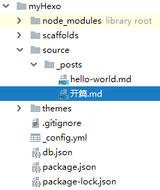
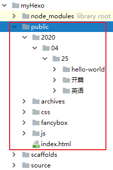
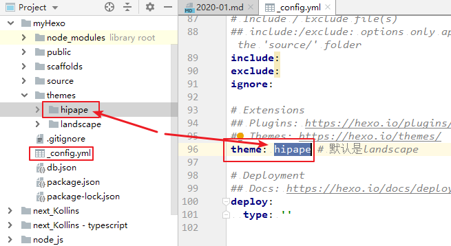
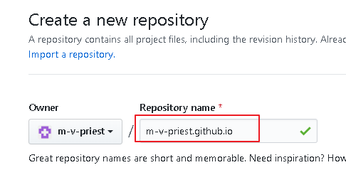
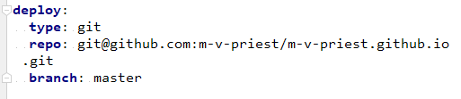
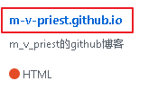
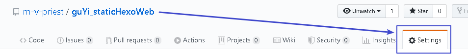
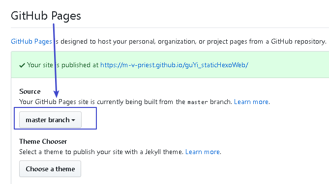

= hexo 博客框架
:toc:

---

== 快速手册: 当你从github上 pull了 你hexo项目下来, 要启动它

如果你的电脑是新win10, 那么按下列步骤操作:
....
安装 node.js
npm install -g hexo-cli  //安装hexo库
npm install //在你的hexo项目目录下,安装hexo依赖
hexo g //生成静态网站文件
hexo server //运行本机服务器, Press Ctrl+C to stop.
....

---

== 文档

官方文档 +
https://hexo.io/

中文文档 +
https://hexo.io/zh-cn/docs/

---

== 安装

首先需要安装  Node.js 和 Git.
然后, 用命令 npm install -g hexo-cli
:

[source,typescript]
....
E:\phpStorm_proj\myHexo_Design> npm install -g hexo-cli # 你输入

C:\Users\Administrator\AppData\Roaming\npm\hexo -> C:\Users\Administrator\AppData\Roaming\npm\node_mod
ules\hexo-cli\bin\hexo
....

== 1. 新建一个网站 -> hexo init [folder]

....
hexo init [folder]
....
新建一个网站。如果没有设置 folder ，Hexo 默认就在目前的文件夹下, 建立网站。

[source,typescript]
....
hexo init <folder> # 或进入你的指定目录(比如myHexo_Design), 直接运行命令 hexo init
cd <folder>
npm install # 当你执行npm install, npm会根据你在package.json中对各种依赖的定义, 去安装这些依赖。
....

---

== 项目目录中的各文件说明

==== _config.yml 文件是配置文件

网站的配置信息, 在 _config.yml 文件中，您可以在此配置大部分的参数。

该文件的内容如下:

[source,typescript]
....
# Hexo Configuration
## Docs: https://hexo.io/docs/configuration.html
## Source: https://github.com/hexojs/hexo/

# Site
title: Hexo         // 网站标题
subtitle: ''        //网站副标题
description: ''     //网站描述
keywords:           //你网站的关键词, 用逗号隔开
author: John Doe    //你的名字
language: en
timezone: ''

# URL
## If your site is put in a subdirectory, set url as 'http://yoursite.com/child' and root as '/child/'
url: http://yoursite.com        //你网站的URL
root: /                         //网站根目录. 如果您的网站存放在子目录中，例如 http://yoursite.com/blog，则请将您的 url 设为 http://yoursite.com/blog 并把 root 设为 /blog/。
permalink: :year/:month/:day/:title/   //文章的 永久链接 格式
permalink_defaults:             //永久链接中各部分的默认值
pretty_urls:                    //Rewrite the permalink variables to pretty URLs
  trailing_index: true # Set to false to remove trailing 'index.html' from permalinks
  trailing_html: true # Set to false to remove trailing '.html' from permalinks

# Directory
source_dir: source              //资源文件夹，这个文件夹用来存放内容。 Source folder. Where your content is stored
public_dir: public              //公共文件夹，这个文件夹用于存放生成的站点文件。 Public folder. Where the static site will be generated
tag_dir: tags //标签文件夹
archive_dir: archives           //归档文件夹
category_dir: categories        //分类文件夹
code_dir: downloads/code        //Include code directory (subdirectory of source_dir)
i18n_dir: :lang                 //国际化（i18n）文件夹
skip_render:                    //跳过指定文件的渲染，您可使用 glob 表达式来匹配路径。 Paths that will be copied to public raw, without being rendered. You can use glob expressions for path matching.

# Writing
new_post_name: :title.md # File name of new posts   // The filename format for new posts
default_layout: post                                //预设布局
titlecase: false # Transform title into titlecase
external_link:              //在新标签中打开链接
  enable: true # Open external links in new tab
  field: site # Apply to the whole site
  exclude: ''
filename_case: 0            //把文件名称转换为 (1) 小写或 (2) 大写 Transform filenames to 1 lower case; 2 upper case
render_drafts: false        //显示草稿
post_asset_folder: false
relative_link: false        //把链接改为与根目录的相对位址
future: true
highlight:
  enable: true
  line_number: true
  auto_detect: false
  tab_replace: ''
  wrap: true
  hljs: false

# Home page setting
# path: Root path for your blogs index page. (default = '')
# per_page: Posts displayed per page. (0 = disable pagination)
# order_by: Posts order. (Order by date descending by default)
index_generator:
  path: ''
  per_page: 10
  order_by: -date

# Category & Tag
default_category: uncategorized
category_map:
tag_map:

# Metadata elements
## https://developer.mozilla.org/en-US/docs/Web/HTML/Element/meta
meta_generator: true

# Date / Time format
## Hexo uses Moment.js to parse and display date
## You can customize the date format as defined in
## http://momentjs.com/docs/#/displaying/format/
date_format: YYYY-MM-DD
time_format: HH:mm:ss
## Use post's date for updated date unless set in front-matter
use_date_for_updated: false

# Pagination
## Set per_page to 0 to disable pagination
per_page: 10            //每页显示的文章量 (0 = 关闭分页功能)
pagination_dir: page    //分页目录

# Include / Exclude file(s)
## include:/exclude: options only apply to the 'source/' folder
include:
exclude:
ignore:

# Extensions
## Plugins: https://hexo.io/plugins/
## Themes: https://hexo.io/themes/
theme: landscape

# Deployment
## Docs: https://hexo.io/docs/deployment.html
deploy:
  type: ''
....

---

==== scaffolds目录, 是模版

当您新建文章时，Hexo 会根据 scaffold模板 来建立文件。

---

==== source目录, 是用户存放资源的地方

Source folder. This is where you put your site’s content.

Hexo ignores hidden files and files or folders whose names are prefixed with _ (underscore) - except the _posts folder.

Renderable files (e.g. Markdown, HTML) will be processed and put into the public folder, while other files will simply be copied.

hexo会忽略掉隐藏文件, 和带有'_'开头名字的目录(除了 _posts目录之外).
可渲染的文件, 如markdown, html文件, 会被处理, 并放入public目录中. 而其他文件不会被处理, 只会直接被丢进去.

---

==== themes目录, 是主题

Theme folder. Hexo generates a static website by combining the site contents with the theme.

Hexo 会根据主题来生成静态页面。

---

== 2. 新建一个md页面 -> hexo new 页面名字

[source,typescript]
....
hexo new 开篇 //会在source\_posts目录下, 新建一个md文件, 文件名就是"开篇"

//会输出提示
INFO  Created: ~\PhpstormProjects\myHexo\source\_posts\开篇.md
....

新建一篇之后, 以后你就可以直接在phpStorm的资源管理器中, 来新增子目录和页面了, 更方便.

注意: Hexo 新建的文件, 有三种默认布局：分别是 post、page 和 draft布局。在创建这三种不同类型的文件时，它们会被保存到不同的路径中:

[options="autowidth"]
|===
|新建的页面布局 |会保存到路径
|post 布局 |source/_posts
|page 布局|source
|draft 布局|source/_drafts
|===

您自定义的其他布局和 post 相同，都将储存到 source/_posts 文件夹。

具体说明
https://zhuanlan.zhihu.com/p/132823826?from_voters_page=true

---

==== 新建一个子目录中的页面 -> hexo new  --path 子目录名/孙目录名/文件名 "页面 title"

或者你一定要用命令输入的话, 比如你想在某个子目录中,新建某个文件, 可以加上 --path 参数:
....
hexo new  --path 子目录名/孙目录名/文件名 "页面 title"
....

注意！title 是必须指定的! 不能省略

[source,typescript]
....
hexo new  --path 英语/经济学人/2020-01 "eco 2020-01"

//输出
INFO  Created: ~\PhpstormProjects\myHexo\source\_posts\英语\经济学人\2020-01.md

....

---

==== 2-2. 让hexo支持 asciiDoc文件

....
npm install hexo-renderer-asciidoc --save
....

注意, 安装完后, 要重启phpStorm才能生效

https://github.com/hcoona/hexo-renderer-asciidoc

hexo支持的所有插件 +
https://hexo.io/plugins/

---

==== 2-3. 添加分类 categories

在hexo项目根目录下, 输入
....
hexo new page categories
....

它会新建一个categories目录, 里面有个index.md文件. 然后修改它，改成:
....
---
title: categories
date: 2020-04-26 15:45:11
type: "categories"
comments: false
---
....

comments: false 的意思是"关闭评论".

将 本项目的 scaffolds/post.md 文件内容, 改为如下:
....
---
title: {{ title }}
date: {{ date }}
tags: {{tags}}
categories: {{categories}}
---
....

然后用 hexo new 文件名 来创建新的md文件, 就能看到页面里面有上面的四行代码, 可以在里面修改标签了! 格式如下:
....
title: 页面名称

tags:
- tag1
- tag2
- tag3

categories:
- c1
....

注意, 要想使标签和目录生效, 必须用 hexo new 命令来创建,  你自己直接新建的md文件, 即使你手动加上上面的代码, 也无效. 原因未知. *不过, 你可以直接复制已存在的有标签的页面, 来创建新的文件呀, 这个亲测可行! 然后你就可以直接在上面该标签了, 能够生效.*

---

==== 2-4. 添加标签 tags

在hexo项目根目录下, 输入
....
hexo new page tags
....

它会新建一个tags目录, 里面有个index.md文件. 然后修改它，改成:
....
---
title: tags
date: 2020-04-26 15:53:06
type: "tags"
comments: false
---
....

---

==== 2-5 插入图片 -> hexo-asset-image 插件

要显示图片, 必须安装这个插件 hexo-asset-image
....
npm install https://github.com/CodeFalling/hexo-asset-image --save
....

按网上的说法, 这个插件的内容需要修改, 不然可能会出Bug. +
打开/node_modules/hexo-asset-image/index.js，将内容更换为下面的代码:

[source,typescript]
....
'use strict';
var cheerio = require('cheerio');

// http://stackoverflow.com/questions/14480345/how-to-get-the-nth-occurrence-in-a-string
function getPosition(str, m, i) {
  return str.split(m, i).join(m).length;
}

var version = String(hexo.version).split('.');
hexo.extend.filter.register('after_post_render', function(data){
  var config = hexo.config;
  if(config.post_asset_folder){
    	var link = data.permalink;
	if(version.length > 0 && Number(version[0]) == 3)
	   var beginPos = getPosition(link, '/', 1) + 1;
	else
	   var beginPos = getPosition(link, '/', 3) + 1;
	// In hexo 3.1.1, the permalink of "about" page is like ".../about/index.html".
	var endPos = link.lastIndexOf('/') + 1;
    link = link.substring(beginPos, endPos);

    var toprocess = ['excerpt', 'more', 'content'];
    for(var i = 0; i < toprocess.length; i++){
      var key = toprocess[i];

      var $ = cheerio.load(data[key], {
        ignoreWhitespace: false,
        xmlMode: false,
        lowerCaseTags: false,
        decodeEntities: false
      });

      $('img').each(function(){
		if ($(this).attr('src')){
			// For windows style path, we replace '\' to '/'.
			var src = $(this).attr('src').replace('\\', '/');
			if(!/http[s]*.*|\/\/.*/.test(src) &&
			   !/^\s*\//.test(src)) {
			  // For "about" page, the first part of "src" can't be removed.
			  // In addition, to support multi-level local directory.
			  var linkArray = link.split('/').filter(function(elem){
				return elem != '';
			  });
			  var srcArray = src.split('/').filter(function(elem){
				return elem != '' && elem != '.';
			  });
			  if(srcArray.length > 1)
				srcArray.shift();
			  src = srcArray.join('/');
			  $(this).attr('src', config.root + link + src);
			  console.info&&console.info("update link as:-->"+config.root + link + src);
			}
		}else{
			console.info&&console.info("no src attr, skipped...");
			console.info&&console.info($(this));
		}
      });
      data[key] = $.html();
    }
  }
});
....

在打开你hexo项目目录下的 _config.yml文件，修改下述内容
....
post_asset_folder: true
....

然后, 用命令新建一个md页面: +
....
hexo new --path myHisDes/myDes_01  "myDes"
//注意: 双引号中的不是文件的名字! 而只是文件的说明;. 文件名字是"/"后的myDes_01
....

然后, 你会发现除了新建了一个myDes_01.md文件, 还同时新建了一个同名的目录. 你就可以把图片, 放入这个同名目录中了.

用下面的md语法, 来引用图片
....

....
*注意!! windows系统下,  "/图片"前面必须加个点号, 否则, 图片不能显示.*

---

==== 2-6. 添加站内搜索 -> hexo-generator-searchdb 插件

插件官网地址如下
....
https://github.com/theme-next/hexo-generator-searchdb
....

1.在Hexo的根目录下，执行安装命令
....
npm install hexo-generator-searchdb
....

2.hexo项目下的全局配置文件_config.yml，新增如下内容：
....
search:
path: search.xml
field: post
format: html
limit: 10000
....

3.next主题目录下的 _config.yml文件，修改local_search的enable为true：
....
local_search:
    enable: true
....

---

==== 2-7. 主页中,让每篇文章只显示一小部分, 要看全文就按"显示更多"按钮

在你想截断的段落后, 加上
....
<!--more-->
....
即可. 这种方式是hexo推荐的, 因为可以手动灵活的设置截断位置.

但注意, 这个代码, 对md文件有效, 对adoc文件似乎无效

---

== 3. 生成静态网站文件 -> hexo generate

上面你新建的, 都只是 md文件. 为了把它们渲染成网站的html文件, 你要用 hexo generate 命令.

[source,typescript]
....
hexo generate

或简写成
hexo g
....

这样后, 你会在你的项目目录中, 看到一个 public目录, 里面就是 hexo帮你从md文件渲染成 html的静态页面, 即静态网站. 你能看到里面有首页 index.html, 还有css, js 等.

Hexo 生成的所有html文件, 都放在 public 文件夹中，以后你想备份或转移整个网站内容时(这些html时), 就可以将它们复制到您喜欢的地方。

---

==== hexo clean  -> 清除缓存文件db.json 和已生成的静态文件public

如果生成静态网站后, 再运行 hexo server 时, 发现页面不是最新的, 比如图片看不到, 那么就先执行 "清空缓存命令", 然后再重新 hexo g

....
hexo clean # 清除缓存文件db.json 和已生成的静态文件public

hexo g
....

==== 生成静态html的同时, 监视文件变动 -> hexo generate --watch

Hexo 能够监视文件变动, 并立即重新生成(generate)静态文件，它在生成时会比对文件的 SHA1 checksum，只有变动的文件才会写入。

....
hexo generate --watch
....

---

== 4. 启动本机服务器, 预览生成的静态网站 -> hexo server

hexo server 命令可以启动本机服务器。默认情况下，访问网址为： http://localhost:4000/。  +

[source,typescript]
....
hexo server

// 输出:
INFO  Start processing
INFO  Hexo is running at http://localhost:4000 . Press Ctrl+C to stop.
....

选项有

[options="autowidth"]
|===
|选项|描述
|-p, --port |重设端口
|-s, --static |只使用静态文件
|-l, --log |启动日记记录，使用覆盖记录格式
|===

按  Ctrl+C 可以停止服务器(停止预览), 继续新增或编辑你的md文件. 然后再 generate, 再 hexo server 启动服务器来预览.

---

== 5. 更新你网站的基本信息, 比如网站名, 作者等 ->  _config.yml 文件

您可以在 _config.yml 中修改网站的大部分配置信息。如 :

[options="autowidth"]
|===
|参数 |描述
|title |网站标题
|subtitle |网站副标题
|description |网站描述. description主要用于SEO，告诉搜索引擎一个关于您站点的简单描述，通常建议在其中包含您网站的关键词。
|keywords |网站的关键词。使用半角逗号 , 分隔多个关键词。
|author |您的名字. 用于主题显示文章的作者。
|language |网站使用的语言。对于简体中文用户来说，使用不同的主题可能需要设置成不同的值，请参考你的主题的文档自行设置，常见的有 zh-Hans和 zh-CN。
|===

具体见官方文档 +
 https://hexo.io/docs/configuration

---

== 6. 换主题(网站皮肤) theme

官方提供的主题网站为 +
https://hexo.io/themes/

推荐用nex主题,亲测极好 +
https://github.com/theme-next/hexo-theme-next

下面, 我们以replica主题为例, 来应用它

步骤:

==== (步骤1). 从Github上拉取主题的源码到本机

进入 https://github.com/theme-next/hexo-theme-next 页面, 里面有安装说明.

在你本机的博客项目myHexo目录下, 输入:

[source,typescript]
....
C:\Users\mvpri\PhpstormProjects\myHexo>git clone https://github.com/theme-next/hexo-theme-next themes/next
....

==== (步骤2) 修改_config.yml 文件中的配置

把Hexo主目录下 _config.yml 文件中的theme字段改为 next，如下：

[source,typescript]
....
# Extensions
## Plugins: http://hexo.io/plugins/
## Themes: http://hexo.io/themes/
theme: next
....

==== (步骤3) 更新此主题到最新版本

....
cd themes/next
git pull
....

然后, 启动 hexo 服务器, 就能看到效果了.
....
hexo server
....

==== 设置next主题中的参数

你会发现, 主题目录中, 也有一个  _config.yml 文件. 这个文件区别于 hexo项目目录下的 _config.yml 文件. 它们只是同名而已.

hexo项目/_config.yml文件, 是用来配置hexo本身的参数的.

主题/_config.yml文件, 是由主题作者提供，用于配置主题相关的选项的.

我们就打开next主题目录下的 /_config.yml文件,
....
//找到Scheme Settings
# Schemes
# scheme: Muse
# scheme: Mist
# scheme: Pisces
scheme: Gemini  //启用这个主题样式, 效果最好
....

---

== 7. 将本机这个静态网站, 部署到 GitHub Pages 上 ->

下面, 就能将这个本机的静态网站, 部署到 GitHub Pages 上

==== (步骤1) 在git上新建一个仓库, 名字为:  m-v-priest.github.io

在github上, 新建一个 repository, 专门用来放置这个hexo博客网站。如果你希望你的站点能通过 <你的 GitHub 用户名>.github.io 域名访问，你的 repository 应该直接命名为 <你的 GitHub 用户名>.github.io。

....
你新建一个仓库, 名字为:  m-v-priest.github.io
....

==== (步骤2) 安装 hexo-deployer-git

....
npm install hexo-deployer-git --save
....

==== (步骤3) 在 _config.yml 文件中进行配置
在 _config.yml 中修改参数，一个正确的部署配置中, 至少要有 type 参数，例如：

[source,typescript]
....
deploy:
    type: git
    repo: git@github.com:m-v-priest/m-v-priest.github.io.git  //你要将博客(静态网站文件)放入的远程库（Repository）的地址
    branch: [branch]  //分支名称。
    message: [message] //自定义提交信息 (默认为 Site updated: {{ now('YYYY-MM-DD HH:mm:ss') }})
....

==== (步骤4) 运行部署命令 -> hexo clean && hexo deploy

输入
....
hexo clean && hexo deploy
....

hexo clean 命令用于清除缓存文件 (db.json) 和已生成的静态文件 (public)。
在某些情况（尤其是更换主题后），如果发现您对站点的更改, 无论如何也不生效，您就需要运行该命令。

==== (步骤5) 访问 https://m-v-priest.github.io/ 即可看到博客!

然后, 将你的博客仓库名, 前面加上https://, 就可以访问了. 即, 点击连接 https://m-v-priest.github.io/
 , 就可访问你的博客了!

---

== 8. 一次性同时执行 生成(generate) 和部署(deploy) 两个命令

您可执行下列的其中一个命令，让 Hexo 在生成完毕后自动部署网站，两个命令的作用是相同的。

....
hexo generate --deploy
或
hexo deploy --generate

//上面两个命令可以简写为
hexo g -d
hexo d -g
....

---

== 9. 把你本地的 hexo 博客项目代码 (而非只是它生成的静态网站), 上传到github上

下面, 把你的整个本机hexo项目(而非只是它生成的静态网站) , 上传到 git仓库中.

[options="autowidth"]
|===
|步骤 |命令

|1.先把你的hexo项目变成git可以追踪的本地仓库
|git init

|2.在github上新建一个名叫 my_hexo_project 仓库, 之后用来存放你上传的hexo项目
|生成后, 该远程库的地址就是 git@github.com:m-v-priest/my_hexo_project.git

|3. 将本地的hexo项目, 关联到刚刚你创建的远程git仓库(即你git上的my_hexo_project仓库)
|git remote add origin git@github.com:m-v-priest/my_hexo_project.git

|4.然后就在phpStorm中, 正常执行 add, commit, push 命令
|git add . +
git commit -m "提交信息说明" +
git push -u origin master

|===

注意, 主题不会上传! 所以当你在新的机器上, 重新将远程库拉取到本地时, 你要重新安装hexo主题!

---

== 10. 快速总结

[source,typescript]
....
npm install -g hexo-cli //安装 hexo

hexo init <folder>  //创建一个网站文件夹

cd <folder>

npm install //安装依赖

hexo new 文件名  //新建一个md文件, 会放在source\_posts目录下

hexo generate //生成静态html文件. 可简写成 hexo g

hexo generate --watch //监视文件变动并立即重新生成静态文件

hexo server //启动本机服务器, 预览网站效果

hexo clean && hexo deploy //将静态网站, 上传到git page上去

hexo generate --deploy //一次性同时执行 生成(generate) 和部署(deploy) 两个命令. 可简写成 hexo g -d

打开 https://m-v-priest.github.io/ 就能看到你的博客

....

---

== 11. 在你的github上, 挂载第二个hexo博客

上面, 你已经有了一个主hexo博客, 访问链接是  https://m-v-priest.github.io/ +
你还可以在你的github上挂载第二个hexo博客, 比如访问链接是 https://m-v-priest.github.io/guYi_staticHexoWeb/

可以这样操作:

1.先在github上, 创建一个仓库, 名叫  guYi_hexo_project , 用来上传你第二个hexo博客(guyi)项目(非静态网站)的内容.

2.再创建一个仓库, 名叫  guYi_staticHexoWeb, 之后会用来放置你guyi博客生成的静态网站的内容

3.按正常步骤在你的phpStorm中做完整个hexo博客后, 在本机服务器试运行正常后

4.修改 guYi_hexo_project 中的 _config.yml 配置文件, 把下面三个参数的值, 改为如下内容:
....
url: https://m-v-priest.github.io/guYi_staticHexoWeb  //这个地址,就是你最终用来访问第二个hexo博客的url地址
root: /

deploy:
  type: git
  repo: git@github.com:m-v-priest/guYi_staticHexoWeb.git  //即,你guyi hexo生成的静态网站后的存放仓库地址
  branch : master
....

5.在github上, 进入guYi_staticHexoWeb仓库, 选择setting, 找到GitHub Pages勾选master branch

6.然后就能访问url地址  https://m-v-priest.github.io/guYi_staticHexoWeb/ 就能看到第二个hexo博客的内容了.

但是似乎后来又没有成功? guYi的首页可以看到, 但每个页面的 more点进去, 就找不到页面了?  +
后来把guYi文件夹放到我自己的hexo项目目录的 source/_posts 目录中, 才能显示出guYi的每个页面. 这就没意义了, 还不如直接把guYi的目录放在我的博客目录中呢, 没必要独立出来了.

---

