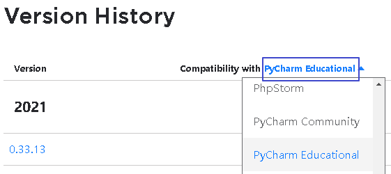
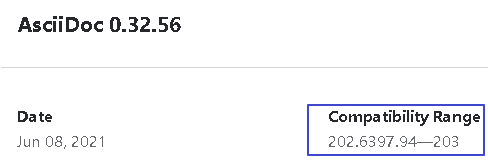
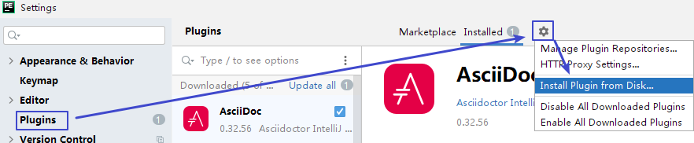

= 手动安装 jetbrain 插件

[cols="1a,3a"]
|===
|Header 1 |Header 2

|1.先查看本软件的版本号
|

|2.打开官网
|https://plugins.jetbrains.com/

|3.搜索你要装的插件, 比如 asciidoc
|

找到和你软件版本匹配的 asciidoc的版本

|4.下载下来后, 不要解压
|选择settings -> plug -> install from disks

|===

