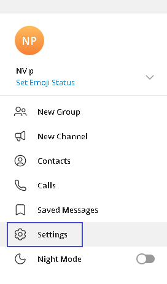
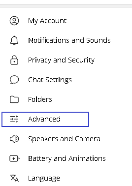
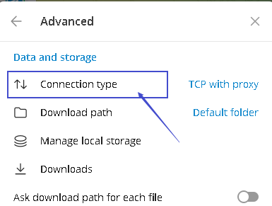
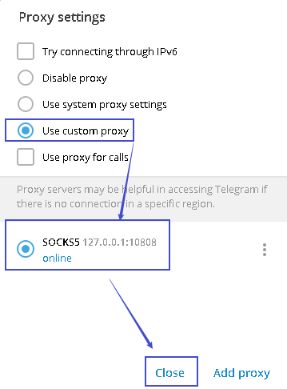

= telegram
:toc: left
:toclevels: 3
:sectnums:
:stylesheet: myAdocCss.css

'''
== win10 无法链接 telegram 的解决办法

必须手动设置代理

Windows系统其他代理软件查看本地端口的方法:

- Clash for Windows: 主界面 → General → Port(默认是: 7890)
- Clash.NET: 主界面 → 右侧 → 混合端口(Mixe-Port)
- SS/SSD → 右键状态栏SS/SSD图标 → 服务器 → 编辑服务器 → 本地端口(默认是: 1080)
- SSR → 右键状态栏SSR图标 → 选项设置→本地端口(默认是: 1080)
- V2RayN: 主界面 → 左下角 → SOCKS5(或者参数设置 → 本地监听端口)(默认是: 10808)
- Trojan-Qt5: 打开Trojan-Qt5主界面 → 双击一个节点 → 本地端口(默认是1080)
- Netch: 打开Netch主界面 → 设置 → 本地端口SOCKS5(默认是2801)

具体见 https://kerrynotes.com/how-to-set-telegram-proxy/