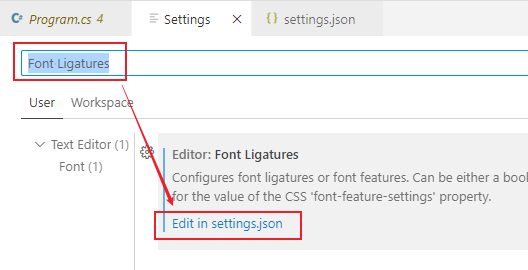

= vscode 配置 python
:toc: left
:toclevels: 3
:sectnums: 

---

== vs 快捷键

[options="autowidth"]
|===
|Header 1 |Header 2 |

|-> 格式化代码
|快速格式化代码
|Ctrl(按住不放)+K+D

|→ 注释
|注释
|ctrl+k , 然后按住ctrl不放, 再按c

|
|取消注释
|ctrl+k , 然后按住ctrl不放, 再按u

|
|
|

|航操作 →
|复制本行到下一行上
|Ctrl + D

|
|移动行
|alt + 上下键

|
|删除当前行
|Shift+Delete

|
|
|

|→ 括号配对
|快速找到括号的另一半匹配位置
|ctrl+}

|
|在匹配的括号内, 选中里面的全部文本(包括包围它们的括号)
|Ctrl + Shift +}

|
|
|

| → 大小写转换
|转换为大写
|Ctrl + Shift + U

|
|转换为小写
|Ctrl + U

|
|
|

| → 代码片段输入
|快速输入 Console.WriteLine()
|cw + 两次Tab

|===

'''

== vs 设置

==== 让代码在窗口内自动换行

在菜单 file -> preference -> settings 中, 搜索 "Editor: Word Wrap", 将其设置改成"on".

'''

==== 缩放代码

打开 文件>首选项>设置 +
搜索栏搜索 ：Font Ligatures +
点击在 settings.json 中编辑 +
加入 "editor.mouseWheelZoom": true +

保存修改后, 就能用鼠标滚轮, 来缩放代码了

'''

==== 隐藏代码的注释

安装插件 Hide Comments

'''

==== 删除所有注释

安装插件 Remove Comments

'''

==== 折叠代码

'''

