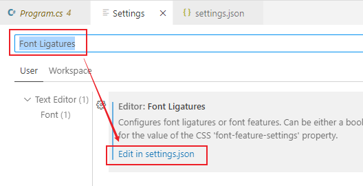
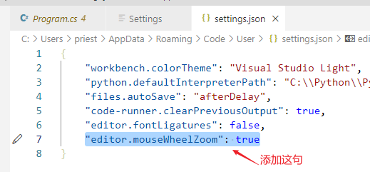

= vscode 配置 python
:toc:
:toclevels: 3
:sectnums:

---

==== 让代码在窗口内自动换行

在菜单 file -> preference -> settings 中, 搜索 "Editor: Word Wrap", 将其设置改成"on".

image:img/004.png[,]

---

==== 隐藏代码的注释

安装插件 Hide Comments

---

==== 删除所有注释

安装插件 Remove Comments

'''

==== 缩放代码

打开 文件>首选项>设置

搜索栏搜索 ：Font Ligatures

点击在 settings.json 中编辑

加入 "editor.mouseWheelZoom": true

保存修改后, 就能用鼠标滚轮, 来缩放代码了

'''
