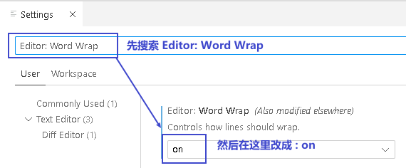

= vscode 配置 python
:toc:
:toclevels: 3
:sectnums:

---

==== 让代码在窗口内自动换行

在菜单 file -> preference -> settings 中, 搜索 "Editor: Word Wrap", 将其设置改成"on".

---

==== 隐藏代码的注释

安装插件 Hide Comments

---

==== 删除所有注释

安装插件 Remove Comments

---
