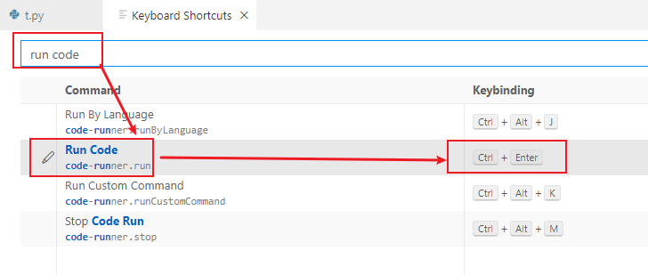
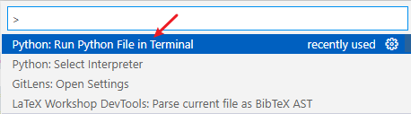
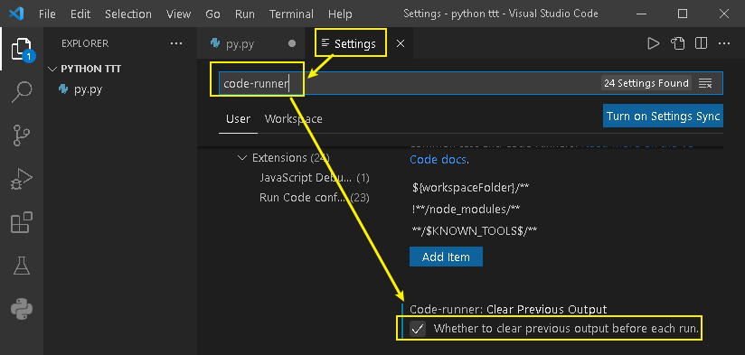

= vscode 配置 python
:toc:
:toclevels: 3
:sectnums:

---

== 给右键添加运行 python程序 -> 安装 Code Runner 插件

安装 Code Runner 插件即可.

---

== 将运行python程序的快捷键, 改为 ctrl + enter

修改快捷键, 位置在: 菜单file -> preferences -> keyboard shortcuts (ctrl+k ctrl+s), 搜索 "run code"

---

== python 程序运行, 没输出任何内容?

在 vscode 的控制台 (菜单view -> command palette) 中, 输入命令: run python in terminal 即可.

---

== 为什么 vscode 运行 python, 总是重复打印老的输出结果?

因为你忘了让 vscode 自动保存你修改过的 python文件了!

开启 "file -> auto save" 即可.

---

== 让vscode在运行代码时, 清除上一次的打印信息

在设置中 (file -> preferences -> settings), 搜索 "code-runner". 进行设置

---

