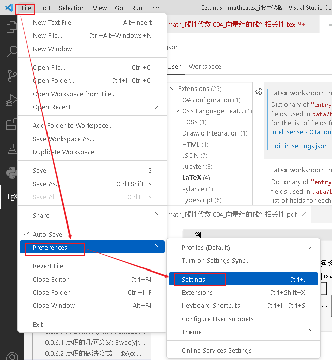
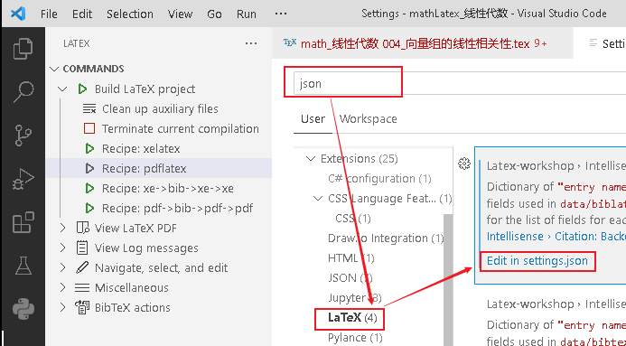
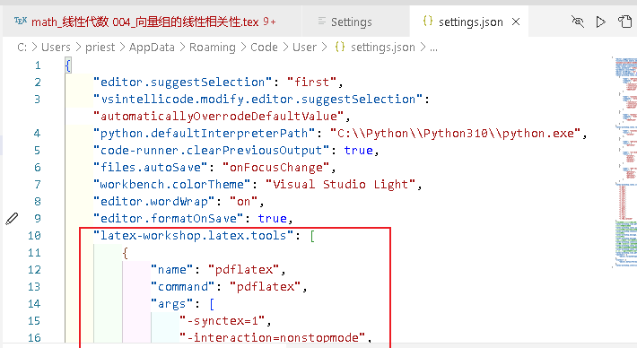
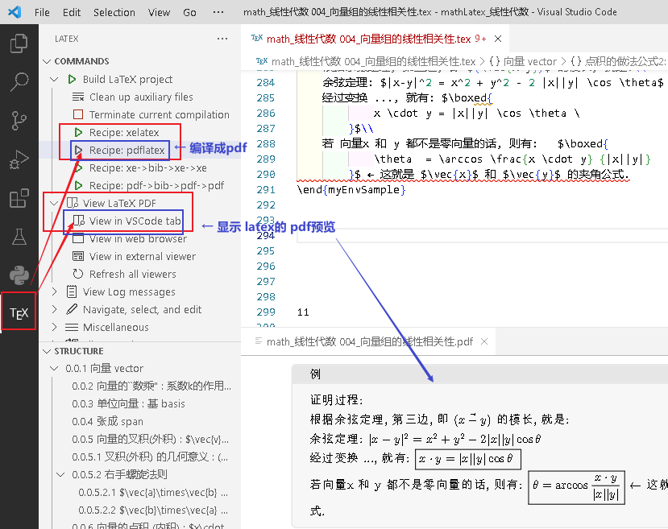
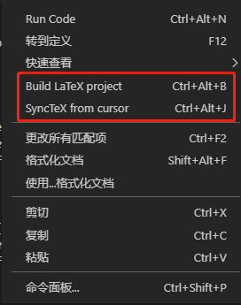
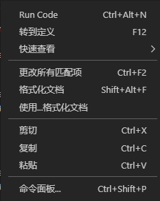

= vscode 配置 latex
:toc: left
:toclevels: 3
:sectnums:

---

== 配置 latex

先安装扩展 LaTex Workshop

然后, 再在 settings.json 文件中 (路径在 C:\Users\priest\AppData\Roaming\Code\User), 输入下面的代码. 注意，一定要在花括号里面输入啊！

....
    "latex-workshop.latex.tools": [
        {
            "name": "pdflatex",
            "command": "pdflatex",
            "args": [
                "-synctex=1",
                "-interaction=nonstopmode",
                "-file-line-error",
                "%DOCFILE%"
            ]
        },
        {
            "name": "xelatex",
            "command": "xelatex",
            "args": [
                "-synctex=1",
                "-interaction=nonstopmode",
                "-file-line-error",
                "%DOCFILE%"
            ]
        },
        {
            "name": "bibtex",
            "command": "bibtex",
            "args": [
                "%DOCFILE%"
            ]
        }
    ],
    "latex-workshop.latex.recipes": [
        {
            "name": "xelatex",
            "tools": [
                "xelatex"
            ],
        },
        {
            "name": "pdflatex",
            "tools": [
                "pdflatex"
            ]
        },
        {
            "name": "xe->bib->xe->xe",
            "tools": [
                "xelatex",
                "bibtex",
                "xelatex",
                "xelatex"
            ]
        },
        {
            "name": "pdf->bib->pdf->pdf",
            "tools": [
                "pdflatex",
                "bibtex",
                "pdflatex",
                "pdflatex"
            ]
        }
    ],
    "latex-workshop.latex.clean.fileTypes": [
        "*.aux",
        "*.bbl",
        "*.blg",
        "*.idx",
        "*.ind",
        "*.lof",
        "*.lot",
        "*.out",
        "*.toc",
        "*.acn",
        "*.acr",
        "*.alg",
        "*.glg",
        "*.glo",
        "*.gls",
        "*.ist",
        "*.fls",
        "*.log",
        "*.fdb_latexmk"
    ],
    //tex文件浏览器，可选项为"none" "browser" "tab" "external"
    "latex-workshop.view.pdf.viewer": "tab",
    //自动编译tex文件
    "latex-workshop.latex.autoBuild.run": "onFileChange",
    //显示内容菜单：（1）编译文件；（2）定位游标
    "latex-workshop.showContextMenu": true,
    //显示错误
    "latex-workshop.message.error.show": false,
    //显示警告
    "latex-workshop.message.warning.show": false,
    //从使用的包中自动补全命令和环境
    "latex-workshop.intellisense.package.enabled": true,
    //设置为never，为不清除辅助文件
    "latex-workshop.latex.autoClean.run": "never",
    //设置vscode编译tex文档时的默认编译链
    "latex-workshop.latex.recipe.default": "lastUsed",
    // 用于反向同步的内部查看器的键绑定。ctrl/cmd +点击(默认)或双击
    "latex-workshop.view.pdf.internal.synctex.keybinding": "double-click",
    "[python]": {
        "editor.formatOnType": true
    },
    "[latex]": {
        "editor.defaultFormatter": "James-Yu.latex-workshop"
    },
    "latex-workshop.intellisense.biblatexJSON.replace": {},
....

然后, vscode就可以打开 tex文件了.

点击左边工具栏的TEX按钮:

'''

== Latex配置代码说明

这里主要是写一些在第1.2节里面配置代码的说明，防止自己忘记。

==== 编译命令

....
"latex-workshop.latex.tools": [
    {
        "name": "pdflatex",
        "command": "pdflatex",
        "args": [
            "-synctex=1",
            "-interaction=nonstopmode",
            "-file-line-error",
            "%DOCFILE%"
        ]
    },
    {
        "name": "xelatex",
        "command": "xelatex",
        "args": [
            "-synctex=1",
            "-interaction=nonstopmode",
            "-file-line-error",
            "%DOCFILE%"
        ]
    },
    {
        "name": "bibtex",
        "command": "bibtex",
        "args": [
            "%DOCFILE%"
        ]
    }
],
....

此处代码是为下面recipe的编译链提供编译命令，name是标签，可被recipe引用，command是编译命令。%DOCFILE%表示文件路径可以为中文。

====  编译链
....
"latex-workshop.latex.recipes": [
    {
        "name": "xelatex",
        "tools": [
            "xelatex"
        ],
    },
    {
        "name": "pdflatex",
        "tools": [
            "pdflatex"
        ]
    },
    {
        "name": "xe->bib->xe->xe",
        "tools": [
            "xelatex",
            "bibtex",
            "xelatex",
            "xelatex"
        ]
    },
    {
        "name": "pdf->bib->pdf->pdf",
        "tools": [
            "pdflatex",
            "bibtex",
            "pdflatex",
            "pdflatex"
        ]
    }
],
....

此处代码定义了编译链，即应按照什么顺序选择编译器编译tex文件，name是标签，即出现在工具栏里面的名称，tool定义了按照何种顺序使用编译器。

==== 清除辅助文件
....
"latex-workshop.latex.clean.fileTypes": [
    "*.aux",
    "*.bbl",
    "*.blg",
    "*.idx",
    "*.ind",
    "*.lof",
    "*.lot",
    "*.out",
    "*.toc",
    "*.acn",
    "*.acr",
    "*.alg",
    "*.glg",
    "*.glo",
    "*.gls",
    "*.ist",
    "*.fls",
    "*.log",
    "*.fdb_latexmk"
],
....

上面的代码定义了要清除的辅助文件的格式。

....
//设置为never不清除辅助文件
"latex-workshop.latex.autoClean.run": "never",
....

这里有三个选项，分别是：

① onBuilt：每次编译后都清除辅助文件；

② onFailed： 编译失败时清除辅助文件；

③ never：从不清除辅助文件。

我这里选了never，一开始用的是onFailed，但我发现一旦编译错误之后，vscode会把所有辅助文件全部清除，导致修改代码去掉bug之后，也无法正常编译了，所以选择了nerver。

==== pdf浏览器选择

....
//tex文件浏览器，可选项为"none" "browser" "tab" "external"
"latex-workshop.view.pdf.viewer": "tab",
....

上面代码定义了编译后查看pdf的浏览器，有4个选项，分别是：

① none: 不用浏览器；

② brower：使用网页浏览器；

③ tab：使用vscode内置浏览器；

④ external：使用外置pdf浏览器。

我用的是vscode内置浏览器，其实网页浏览器也挺好用的，显字大。

==== 自动编译选项

....
//自动编译tex文件
"latex-workshop.latex.autoBuild.run": "onFileChange",
....

上面代码定义了自动编译代码的功能，使用默认编译链自动构建tex的project，有3个选项，分别是：

① onFileChange：检测到文件更改的时候自动编译tex；

② onSave：保存的时候自动编译tex；

③ never：不自动编译tex。

我选择的是onFileChange，时时编译，保证自己的文档不丢失。

==== 显示菜单内容

....
//显示内容菜单：（1）编译文件；（2）定位游标
"latex-workshop.showContextMenu": true,
....

上面代码定义了在tex文件中，单击鼠标右键出现的菜单选项。

这是属性为true时右键菜单的样子。

这是属性为false时右键菜单的样子。

Build LaTex projrct为编译latex项目，SyncTex from cursor为定位tex代码在pdf文件中的位置，即正向定位。

这里为了方便编译和定位正文内容，我选了true选项。

==== 错误和警告信息提示
...
//显示错误
"latex-workshop.message.error.show": false,
//显示警告
"latex-workshop.message.warning.show": false,
....

上面代码定义了出现错误或者警告的时候是否会出现弹窗，我觉得弹窗很烦人，而且在终端中也可看到，所以选择了false属性。

==== 自动补全功能

....
//从使用的包中自动补全命令和环境
"latex-workshop.intellisense.package.enabled": true,
....

上面代码定义了是否自动补全命令和环境的功能，我觉得挺实用的，少打很多字，特别方便，还有提示，所以选择了true属性。

==== 默认编译链选择

....
//设置vscode编译tex文档时的默认编译链
"latex-workshop.latex.recipe.default": "lastUsed",
....

上面代码设置了vscode编译tex文档中的默认编译链，有2个选项，分别是

① first：选择latex-workshop.latex.recipes的第1条作为默认编译链；

② lastUsed：选择上一次使用的编译链作为默认编译链。

我在这里选择了lastUsed，因为我发现我用的最多的编译链是pdflatex。

==== 反向定位

....
// 用于反向同步的内部查看器的键绑定。ctrl/cmd +点击(默认)或双击
"latex-workshop.view.pdf.internal.synctex.keybinding": "double-click",
....

上面代码定义了从pdf浏览器中定位vscode的tex代码位置的功能，我觉得这条功能十分十分好用，强烈推荐！

这里也有2个选项，分别是：

① ctrl-click：ctrl+鼠标左键单击；

② double-click：鼠标左键双击。

我比较喜欢鼠标左键双击，所以选择的第二个选项。

'''

