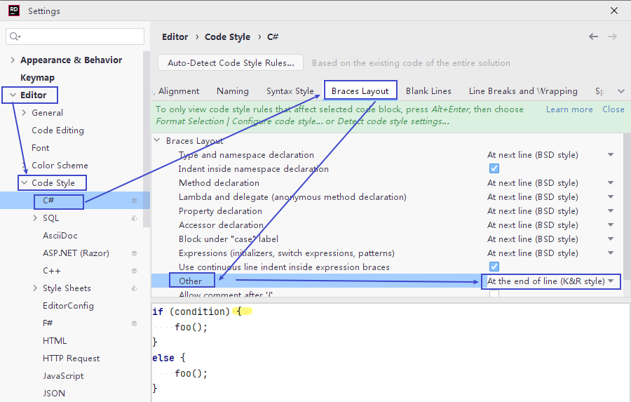
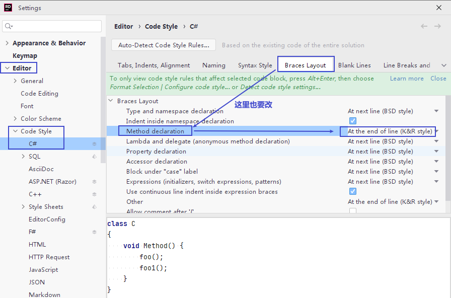

= jetbrain rider 设置
:sectnums:
:toclevels: 3
:toc: left

---

== 快捷键

[options="autowidth"]
|===
|Header 1 |Header 2

|自动格式化代码
|ctrl + Alt + L
|===

'''

== 设置

==== 让左大括号, 不到下一行去

改下面两个地方的设置

'''

