= visual studio 设置
:sectnums:
:toclevels: 3
:toc: left

---

==== 修改代码的显示字体

在工具 -> 选项里面

image:img/001.png[,]

---

==== 代码过长的话, 让它在窗口内自动换行

image:img/002.png[,]

---

==== 让{}的左大括号, 不换行

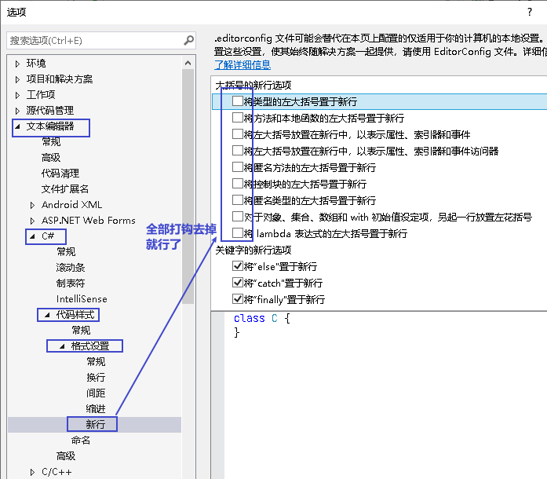

---

==== 自定义代码片段

1.菜单: 工具 -> 代码片段管理器

image:img/003.png[,]

....
C:\Program Files\Microsoft Visual Studio\2022\Community\VC#\Snippets\2052\Visual C#
....

2.然后, 随便复制一个snippet文件, 比如起名叫 myOrigin.snippet, 用notepad++ 打开它. +
我们修改下面三个地方:

image:img/004.png[,]

比如, 你的代码片段, 为 c# 文件刚刚新建时的 最简代码框架, 如下:

[source, c# ]
----
using System.IO.Compression;

namespace ConsoleApp1
{
    internal class Program
    {

        static void Main(string[] args)
        {

        }

    }

}
----

把你这个代码片段, 拷贝到 `<Code Language="csharp"><![CDATA[...]]>`  这句的...处. +
保存该文件.

然后, 你就可以直接在 vs软件里, 输入你设定的快捷键"ori", 然后连按两次tab键, 就能输出该代码片段了.

---

== 让选中的变量, 背景高亮

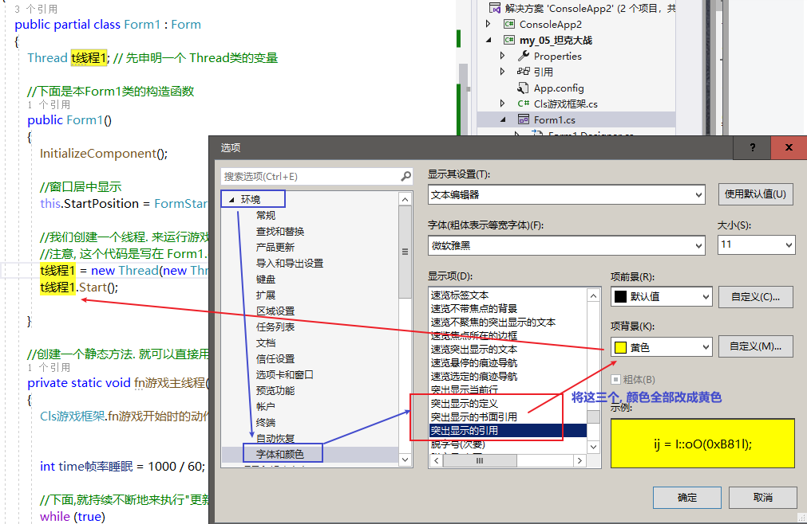

---

== 打开某个"解决方案"

当你有多个"解决方案"时, 如何打开其中某一个"解决方案" ? 按快捷键 ctrl+shift+o, 然后找到 .sln 文件就行了.

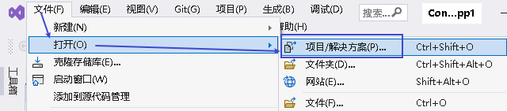

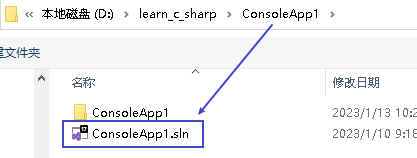

---

== 如何在现有"解决方案"下, 添加"新项目"?

选中现有的"解决方案", 右键 ->  添加 -> 新建项目 -> C#控制台引用

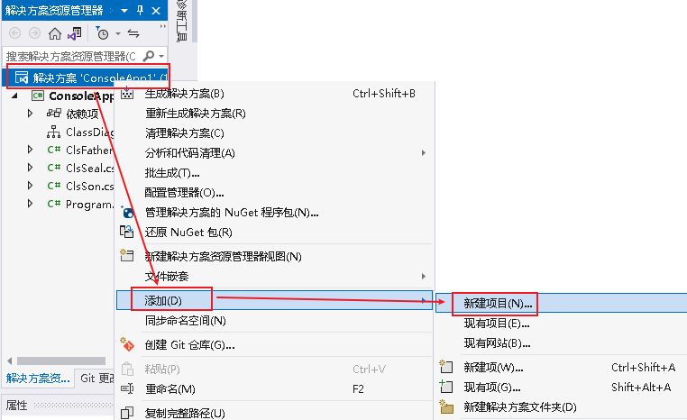

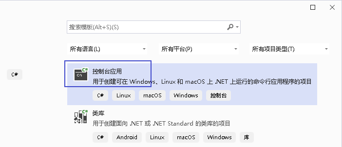

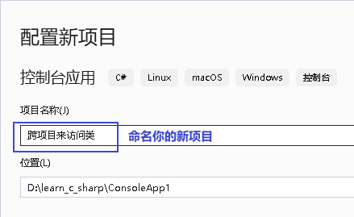

现在, 在你同一个"解决方案"下,  就有两个"项目"了.

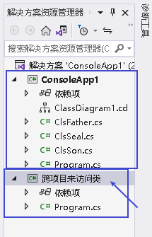

---

== 对已有的项目重命名

在某个项目上, 右键, 来重命名

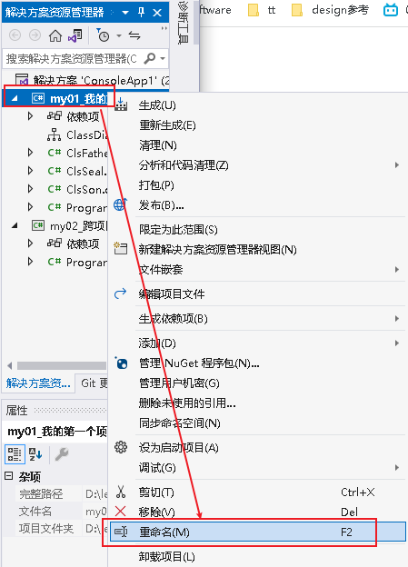

---

== 重命名已有的"解决方案"

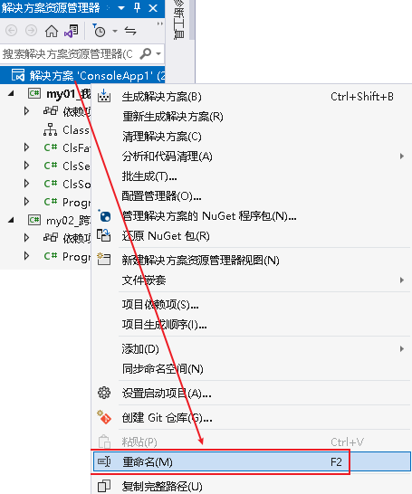

---

== 如何在一个项目里面, 使用到另一个项目中的类?

比如, 我们在同一个"解决方案"中, 有两个"项目", 我们想在项目2中, 来引用项目1中的 ClsSon类. +
就在"项目2"上 ,右键 -> 添加 -> 项目引用

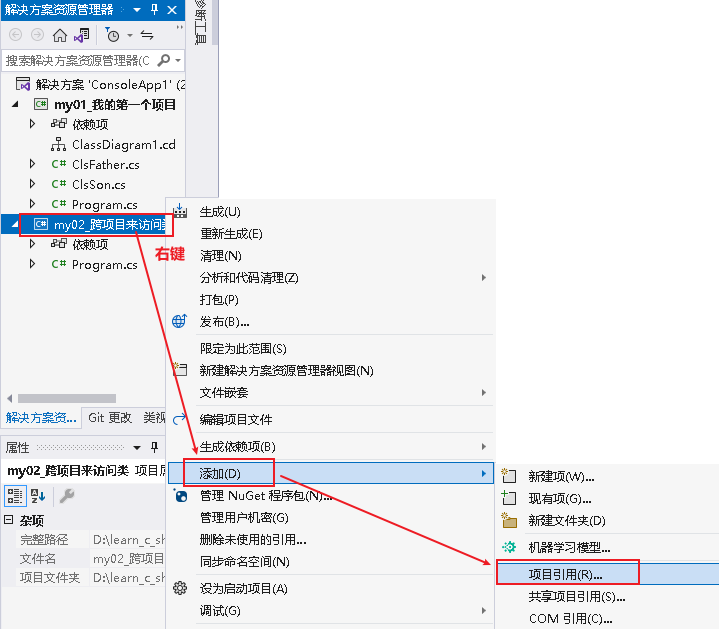

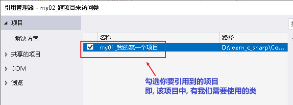

我们先在项目1中, 把子类的权限, 设为 public.  但由于子类是从父类继承来的, 父类的权限更高, 所以我们还要继续把父类的权限, 也设为 public才行.

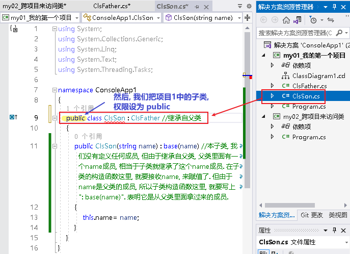

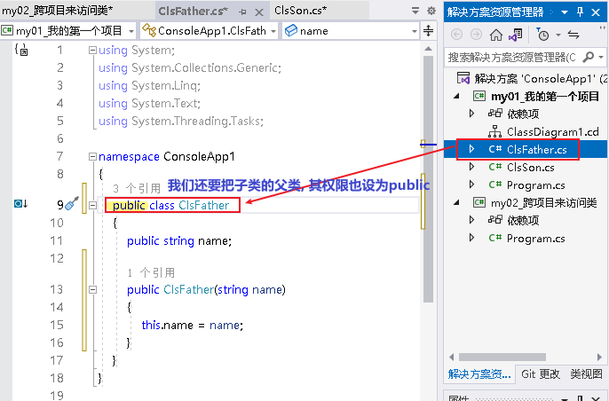

即, 完整代码是:

.标题
====
例如：

项目1的父类:  +
[source, java]
----
using System;
using System.Collections.Generic;
using System.Linq;
using System.Text;
using System.Threading.Tasks;

namespace my01_我的第一个学习项目
{
    public class ClsFather //因为本父类的子类, 要暴露给其他项目来使用, 所以本处的父类, 也要设为 public权限.
    {
        public string name;

        public ClsFather(string name)
        {
            this.name = name;
        }
    }
}
----

项目1的子类: +
[source, java]
----
namespace my01_我的第一个学习项目
{
    internal class Program
    {
        static void Main(string[] args)
        {
            Console.WriteLine("我是项目1的输出");

        }
    }
}
----

项目1 的主文件: +
[source, java]
----
namespace my01_我的第一个学习项目
{
    internal class Program
    {
        static void Main(string[] args)
        {
            Console.WriteLine("我是项目1的输出");

        }
    }
}
----

项目2的主文件 +
[source, java]
----
using my01_我的第一个学习项目;  //在这里, 导入你的第一个项目. 里面有你在本项目中要使用的类. using 就相当于 python 中的 import 导入包或库

namespace my02_跨项目来引用类
{
    internal class Program
    {
        static void Main(string[] args)
        {
            ClsSon p1 = new ClsSon("zrx");
            Console.WriteLine("我是项目2, 我引用了项目1中的 ClsSon类, 来创建实例.  实例的name成员={0}",p1.name); //输出: 我是项目2, 我引用了项目1中的 ClsSon类, 来创建实例.  实例的name成员=zrx

        }
    }
}
----

注意: 你在执行项目2的主文件前, 必须先把项目2, 右键, 设为"启动项目". 否则, 如果项目1是默认的启动项目, 就不会执行项目2的主文件!

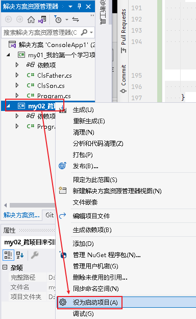

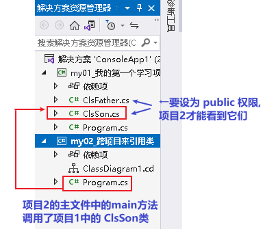
====
