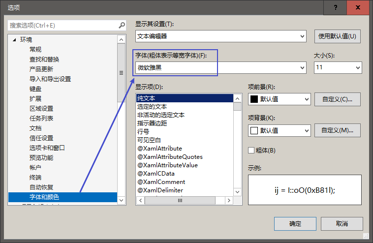
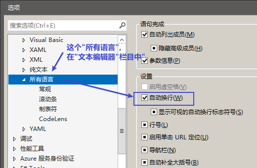
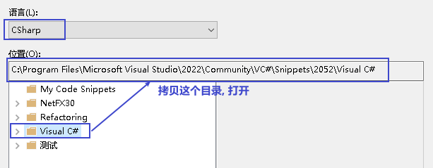
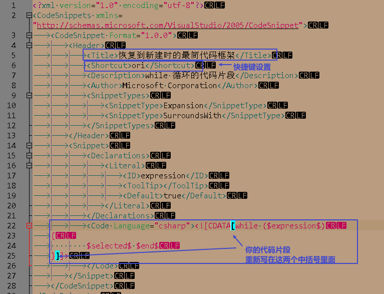

= visual studio 设置
:sectnums:
:toclevels: 3
:toc: left

---

==== 修改代码的显示字体

在工具 -> 选项里面

---

==== 代码过长的话, 让它在窗口内自动换行

---

==== 自定义代码片段

1.菜单: 工具 -> 代码片段管理器

....
C:\Program Files\Microsoft Visual Studio\2022\Community\VC#\Snippets\2052\Visual C#
....

2.然后, 随便复制一个snippet文件, 比如起名叫 myOrigin.snippet, 用notepad++ 打开它. +
我们修改下面三个地方:

比如, 你的代码片段, 为 c# 文件刚刚新建时的 最简代码框架, 如下:

[source, c# ]
----
using System.IO.Compression;

namespace ConsoleApp1
{
    internal class Program
    {

        static void Main(string[] args)
        {

        }

    }

}
----

把你这个代码片段, 拷贝到 `<Code Language="csharp"><![CDATA[...]]>`  这句的...处. +
保存该文件.

然后, 你就可以直接在 vs软件里, 输入你设定的快捷键"ori", 然后连按两次tab键, 就能输出该代码片段了.

---

