= 获取组件身上的属性值
:sectnums:
:toclevels: 3
:toc: left
''''

== 官方文档

https://docs.unity3d.com/cn/2021.1/Manual/ScriptingTransform.html

https://docs.unity3d.com/cn/2021.1/ScriptReference/Transform.html

'''

== 增

==== 类中的字段, 就是组件身上的参数

比如, 你脚本中写以下字段, 权限要 public, 才能暴露给组件中. 如果是 private, 则不会暴露出来.
[,subs=+quotes]
----
public class crip时间脚本 : MonoBehaviour {

 public enum enumSex {
        male,female
    };

//下面这些类中的字段, 都会显示在该脚本的组件上
    public string name;
    public int age;
    public enumSex sex;
    public bool is是否已婚;
    public string[] arr亲密好友;

    // Start is called before the first frame update
    void Start() {

    }

    // Update is called once per frame
    void Update() {
    }
}
----

image:img/0061.png[,]

'''

==== 添加组件(给当前物体, 添加组件)

[,subs=+quotes]
----
// Start is called before the first frame update
void Start() {
    //拿到当前脚本所挂载的游戏物体实例
    GameObject ins当前物体 = this.gameObject;

    //给我们的当前物体, 添加一个button组件.
    *ins当前物体.AddComponent<Button>();*
}
----

'''

==== 在字段中, 还可以有Class类型

[,subs=+quotes]
----
using System;
using System.Collections;
using System.Collections.Generic;
using TMPro;
using UnityEngine;
using UnityEngine.SceneManagement;

*[System.Serializable]*  //必须用这个标签, 来放在你的"Class类"前面, 这样后, 这个类, 才能作为字段(的类型), 放在另一个类中.
public class ClsPerson {
    public string name;
    public int age;
    public List<string> arr亲朋友好;
}

public class crip时间脚本 : MonoBehaviour {

    *public ClsPerson insPerson;*  //使用"Class类型"的字段

    // Start is called before the first frame update
    void Start() {

    }

    // Update is called once per frame
    void Update() {

    }

}

----

image:img/0062.png[,]

'''

==== 让 public字段, 不显示在脚本组件中; 或, 让 private字段, 显示在脚本组件中.

[,subs=+quotes]
----
public class crip时间脚本 : MonoBehaviour {

 public enum enumSex {
        male,female
    };

    public string name;

    *[HideInInspector]* //添加这个标签代码后, 就会将下面的public字段, 在脚本组件中隐藏. 不暴露出来.
    public int num存折余额;

    *[SerializeField]* //添加这个代码后, 会将即使是 private 的字段, 也在脚本组件中暴露出来. 即,只让"脚本组件"能访问到, 但别的模块访问不到.
    private string str心情日记;

    // Start is called before the first frame update
    void Start() {

    }

    // Update is called once per frame
    void Update() {

    }

}
----

'''

== 删

'''

== 改

==== ★ 一部到位找到某个特定物体上的组件, 并赋值某个字段

[,subs=+quotes]
----
/*
//先找到 Panel物体, 再获取该物体下的重孙物体, 载获取该重孙物体上的TMP_Text组件, 在给该组件上的 text字段重新赋值. 这整套动作做下来,太麻烦了
GameObject ob_Panel计算器 = GameObject.Find("Panel计算器");

UnityEngine.Transform tf输入框1 = ob_Panel计算器.transform.Find("my输入框1/Text Area/Placeholder");
TMP_Text tmp = tf输入框1.GetComponent<TMP_Text>();
tmp.text = "hello zrx";
*/

*//不如一部到位: 直接全局查找到该重孙物体,并同时找到TMP_Text组件, 直接赋值其text字段.*
*GameObject.Find("Panel计算器/my输入框1/Text Area/Placeholder").GetComponent<TMP_Text>().text* = "hello slf";
----

image:img/0076.png[,]

'''

==== 将当前物体设置为"非激活"状态. -> ins当前物体.SetActive(false)

[,subs=+quotes]
----
    // Start is called before the first frame update
    void Start() {
        //拿到当前脚本所挂载的游戏物体实例
        GameObject ins当前物体 = this.gameObject;

        *ins当前物体.SetActive(false);* //将当前物体设置为"非激活"状态.
        //也可直接合并成一句代码写:  *this.gameObject.SetActive(false);* //将本脚本挂载的物体, 取消激活状态
    }
----

image:/img/0018.png[,]

Unity gameObject 和GameOjbect区别是什么

这两个相比，**gameObject好理解一点bai，就是你脚本挂着的那个物体。这zhi个实例化过程是Unity帮你实现的，不用dao在写代码实例化。** this.gameObject默认函数，脚本一创建直接就get到了。
*例如，有一个A物体。你给它挂载一个脚本里写this.gameObject。那就等于是直接获取（实例化）A这个物体了，你直接可以引用它下面挂载的属性。*

GameObject不是对象，通常需要获取一个对象，就像你定义一个public GameObject A；
那么属性里就会出现一个可托选的框，那就是Unity告诉你，你定义的这个物体是哪个物体要你选择，无论你拖拽也好，脚本里获取也好，都是要给A赋予对象的。
这是一个强大的引擎，里面很多函数，都可以简化，this.gameObject就是简化实例化的一个函数，希望能给你带来帮助~

Gameobject是一个类型，所有的游戏物件都是这个类型的对象。

gameobject是一个对象， 就跟java里面的this一样， 指的是这个脚本所附着的游戏物件

'''

==== 将物体上的脚本组件, 关闭(即不激活)

[,subs=+quotes]
----
//下面, 我们关闭"go空物体"上的"crip时间脚本".

GameObject go空物体 =  GameObject.Find("go空物体"); //先全局查找到 "go空物体"
Debug.Log(go空物体.name);

//获取到 "go空物体"身上挂载的 "crip时间脚本". *注意: 你获取的脚本, 其类型, 就是你自定义的脚本名称"crip时间脚本".*
*crip时间脚本 myScript1 =  go空物体.GetComponent<crip时间脚本>();*
*myScript1.enabled= false;* //将该脚本禁用, 即该脚本组件上, 取消掉打钩状态
----

image:img/0068.png[,]

'''

== 查

==== ★★★ 获取其他物体身上的组件(即"Class类")中的字段值.

*组件(component), 其实就是你写的c#脚本的"class类".* 比如, 你有两个物体, a物体, 挂载着脚本1; b物体, 挂载着脚本2. 那么, 你可以在脚本1中, 来获取脚本2的"类"中的字段值.

.标题
====
脚本1(是个类文件. class类名就是"脚本1"), 挂载在"go我的空物体"上
[,subs=+quotes]
----
public class my脚本1 : MonoBehaviour {

    // Start is called before the first frame update
    void Start() {

       *GameObject insObGirl =  GameObject.Find("obGirl");* //先在脚本1中, 查找到挂载着"脚本2"的物体"obGirl".

        Debug.Log(*insObGirl.GetComponent<my脚本2>().name女孩名字*); //slf ← *然后, 就能获取"obGirl"物体身上的组件"my脚本2"(即 "my脚本2"类) 中的字段"name女孩名字"的值了.*

    }

    // Update is called once per frame
    void Update() {

    }
}
----

脚本2(是个类文件. class类名就是"脚本2"), 挂载在"obGirl"物体上.
[,subs=+quotes]
----
public class my脚本2 : MonoBehaviour
{
    *public string name女孩名字 = "slf"; //"my脚本2"类, 里面有个静态字段 "name女孩名字"*

    // Start is called before the first frame update
    void Start()
    {

    }

    // Update is called once per frame
    void Update()
    {

    }
}
----

image:img/0084.png[,]

image:img/0085.png[,]

====

'''

==== ★★ 获取子物体的脚本(class类)中的字段值

挂载在n个子物体上的脚本 ClsPerson, 为;
[,subs=+quotes]
----
public class ClsPerson : MonoBehaviour
{
    *public string name姓名; //里面有两个字段*
    public int age;

    // Start is called before the first frame update
    void Start()
    {

    }

    // Update is called once per frame
    void Update()
    {

    }
}
----

父物体上的脚本为:
[,subs=+quotes]
----
public class my脚本1 : MonoBehaviour {

    // Start is called before the first frame update
    void Start() {
        *ClsPerson[] arr = this.GetComponentsInChildren<ClsPerson>(); //获取到本物体this的所有子物体身上挂载的组件(即ClsPerson类的脚本.)*

        foreach (ClsPerson p in arr) {
            Debug.Log(p.name); //注意, 这里会输出所有"子物体"的名字, 而不是子物体身上挂载的脚本类中的字段值. 事实上,子物体脚本的ClsPerson类中, 并无"name"字段.
            Debug.Log(*p.name姓名*); //成功输出子物体身上挂载的ClsPerson类中的"name姓名"字段值
            Debug.Log(p.age); //输出ClsPerson类中的"age"字段值
        }

    }

    // Update is called once per frame
    void Update() {

    }
}
----

image:img/0086.png[,]

'''

==== ★ 获取当前物体, & 查看组件的名称, 和是否处于激活(显示)状态. -> this.gameObject.activeInHierarchy

[,subs=+quotes]
----
    void Start()
    {
        //拿到当前脚本所挂载的游戏物体实例
        *GameObject ins = this.gameObject;* //获取当前物体

        Debug.Log(*ins.name*); //获取当前组件的"名称"
        Debug.Log(ins.tag); //获取当前组件的"tag名"
        Debug.Log(ins.layer); //获取当前组件的"layer图层索引", 注意是索引值.

        Debug.Log(*ins.activeInHierarchy*); //true  ← 判断当前实例, 是否是激活状态 (注意, 如果其父组件是不激活状态, 即使本组件激活, 该方法也会返回 false.)

        Debug.Log(*ins.activeSelf*); //← 判断当前实例, 是否是激活状态(而无关其父组件是否处在激活状态. 即, 即使其父组件不激活, 本组件是激活的, 这个方法也能返回ture. 但我没实验成功. 如果父物体被关闭, 则子物体上的输出语句直接就都没了.)
        // 即 Debug.Log(*gameObject.activeSelf*); //这个也能检测本脚本挂载的物体, 是否处于激活状态.

    }
----

'''

==== 查看图片的 transform属性上 的信息

现在, 我们的脚步挂在 中间一层物体 sthMy 上. 它有父物体(sthFather), 也有子物体(sthSon).

image:img/0038.png[,]

[,subs=+quotes]
----
// Start is called before the first frame update
void Start() {
    //拿到当前脚本所挂载的游戏物体实例
    *GameObject ins当前物体 = this.gameObject;*

    Debug.Log(*ins当前物体.transform.position*);
    Debug.Log(*ins当前物体.transform.localPosition*);

    Debug.Log(*ins当前物体.transform.rotation*);
    Debug.Log(ins当前物体.transform.localRotation);

    Debug.Log(*ins当前物体.transform.localScale*);

}
----

image:img/0039.png[,]

又例如

[,subs=+quotes]
----
// Start is called before the first frame update
void Start()
{
    //拿到当前脚本所挂载的游戏物体实例
    GameObject ins = this.gameObject;

    Debug.Log(ins.name); //获取当前组件的"名称"

    *Transform insTrans = ins.transform;* //拿到本组件的 "transform 属性"的实例对象. 其实: *虽然Transform组件也可以用GetCompment（）获得，但由于该组件太常见，因此可以通过transform字段 直接访问到Transform组件。* 并且，Unity为了方便，在同一物体上，从任何一个组件出发都可以直接获得其他组件，可以不需要先获得先获得游戏体。
    Debug.Log(*insTrans.position*);  //获取 transform属性中的: 世界空间中的变换位置。
    Debug.Log(*insTrans.localPosition*);  //相对于父变换的变换位置

    Debug.Log(*insTrans.rotation*); //一个 Quaternion，用于存储变换在世界空间中的旋转。
    Debug.Log(*insTrans.localRotation*); //相对于父级变换旋转的变换旋转。

    Debug.Log(*insTrans.localScale*);//相对于 GameObjects 父对象的变换缩放。

}
----

image:img/0015.png[,]

'''

==== 获取图片身上的颜色, 及翻转等信息

[,subs=+quotes]
----
// Start is called before the first frame update
void Start() {
    //拿到当前脚本所挂载的游戏物体实例
    GameObject ins = this.gameObject;

    //获取 本图片实例身上的 SpriteRenderer 组件
    *SpriteRenderer insSp = ins.GetComponent<SpriteRenderer>();*
    Debug.Log(*insSp.color*); //拿到 SpriteRenderer 组件实例身上的 颜色属性
    Debug.Log(*insSp.flipY*); //拿到 翻转属性, y轴上是否翻转? 即图片是否上下倒置?

}

// Update is called once per frame
void Update() {

}
----

image:img/0016.png[,]

'''

==== ★ 获取父物体 -> transform.parent -> 返回一个 Transform类型的对象

[,subs=+quotes]
----
//获取当前物体的父物体 transform.parent
*Transform tf = transform.parent;*
Debug.Log(tf.name);

//获取当前物体的根物体(即直系祖先,而非直系祖先的兄弟) transform.root
*Transform tf2 = transform.root;*
Debug.Log(tf2.name);
----

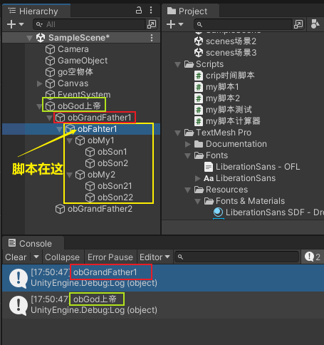

'''

==== ★ 获取父物体 -> ins当前物体.transform.parent.gameObject -> 返回一个 GameObject类型的对象

[,subs=+quotes]
----
    void Start() {
        //拿到"当前脚本所挂载的游戏物体"的父物体
        ins当前物体 = this.gameObject; //先获取当前物体
        *GameObject ins父物体 = ins当前物体.transform.parent.gameObject; //获取当前物体的父物体. 这是曲线救国啊, 先获取到当前物体的 transform组件, 然后从该组件上溯到父物体上去.*
        Debug.Log(ins父物体.name); // 打印出父物体的名字
        Debug.Log(ins父物体.transform.position); //拿到父物体的位置
    }
----

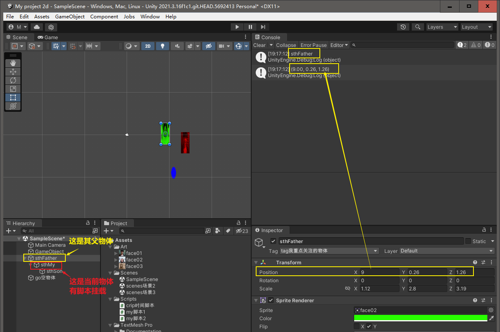

'''

==== ★ 获取子物体

[,subs=+quotes]
----
// Start is called before the first frame update
void Start() {
    //拿到"当前脚本所挂载的游戏物体"的父物体
    ins当前物体 = this.gameObject; //先获取当前物体

    // int num子物体的个数 = ins当前物体.transform.childCount; //获取当前物体的子物体的个数, 有几个子物体
    Debug.Log(num子物体的个数);

    //*解出当前物体与"所有子物体"的父子关系.* 所有子物体会到最顶层的层级上去, 而不是只向上升一级.
    *ins当前物体.transform.DetachChildren();*

    //*获取某一个特定的子物体*
    *Transform ins子物体 = ins当前物体.transform.Find("sthSon2");* //transform.Find()方法的返回值, 是一个Transform类型. 虽然返回的是Transform类型, 但其实这个物体, 就是子物体.
                                                          //Transform.Find()方法只查找自己本身以及自己的子对象，效率比较高. 而另一个GameObject.Find()方法会遍历整个当前场景，挨个查找，效率偏低. 另外, Transform.Find()可以获取处于 激活/ 非激活状态 的游戏对象，返回值类型是Transform 类型。GameObject.Find()只能获取处于 激活状态 的游戏对象，返回值类型是一个GameObject类型。

    Debug.Log(ins子物体.name);
    Debug.Log(ins子物体.transform.position);

    *//判断一个物体是否是另一个物体的子物体*
    *bool res = ins子物体.IsChildOf(ins当前物体.transform); //必须这样写, 因为从上面可知, ins子物体 的类型是 Transform. 所以这个IsChildOf()方法只能判断两个 Transform类型之间的父子关系.*
    Debug.Log(res);

    //Debug.Log(ins子物体.IsChildOf(ins当前物体)); //这样写会报错, 会提示无法从GameObject 转成Transform.
}
----

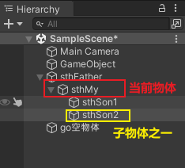

在Unity中有以下两个Find方法，都是通过游戏对象名称来查找游戏对象的。

public static GameObject Find(string name);

public Transform Find(string name);

仔细观察以下，这两个还是有区别的。第一个返回值是一个GameObject类型的，第二个返回值类型是Transform 类型的。

区别：

public static GameObject Find(string name);
适用于整个游戏场景中名字为name的**所有处于活跃状态的游戏对象。**如果在场景中有多个同名的活跃的游戏对象，在多次运行的时候，结果是固定的。

public Transform Find(string name);
适用于查找游戏对象子对象名字为name的游戏对象，**不管该游戏对象是否是激活状态，都可以找到。**只能是游戏对象直接的子游戏对象。

'''

==== 获取所有子物体 (包括本物体) -> GetComponentsInChildren<Transform>()

[,subs=+quotes]
----
//获取所有子物体（包括"本脚本"挂载的物体本身）
*Transform[] arrTF = GetComponentsInChildren<Transform>();*

foreach (var item in arrTF) {
    Debug.Log(item.name);
----

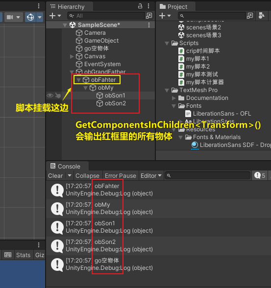

'''

== 搜索

====  ★ 查找一级子物体中的一个 -> transform.Find(子物体名字)

[,subs=+quotes]
----
//只能寻找一级子物体，不能寻找再下层的孙物体
*Transform tf = transform.Find("obMy1");*
Debug.Log(tf.name);
----

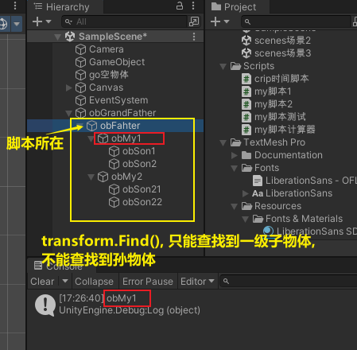

*transform.Find()能找到失活的儿子; 而GameObject相关的查找 是找不到失活对象的.*

'''

==== ★ 查找孙物体中的一个, 要写上路径  -> transform.Find(子物体名/孙物体名字)

[,subs=+quotes]
----
//如果想要寻找二级或者更下级子物体，需要将路径全标注。
*Transform tf = transform.Find("obMy2/obSon22");*
Debug.Log(tf.name);
----

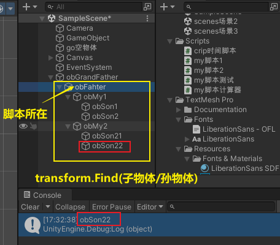

Find()得出结论：

- 只能找其子物体，不能找其同级或更高层级物体
- 找子物体时不考虑是否被禁用（隐藏）
- 找多层子物体时需写全路径（否则即使存在也找不到）

'''

==== 用索引, 来查找某个子物体或孙物体 -> transform.GetChild(子物体的索引值).GetChild(孙物体的索引值)

[,subs=+quotes]
----
//transform.GetChild(), 可以根据子物体的序号来获取子物体，只能获取一级的子物体，但是可以通过连续两次获取，获取到二级的子物体。

Transform tf0 = *transform.GetChild(0);*
Debug.Log(tf0.name);

Transform tf1 = *transform.GetChild(1);*
Debug.Log(tf1.name);

Transform tf1_0 = *transform.GetChild(1).GetChild(0);*
Debug.Log(tf1_0.name);
----

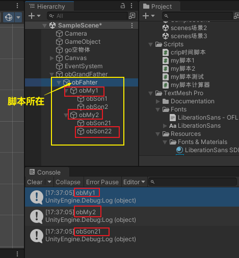

transform.GetChild()使用总结：

- 以自身为基础，查找子物体（注意索引从0开始，写多报错）
- *可以使用transform.parent.parent 的形式无限向上，然后再GetChild()，就达到了查找父层级或更高层级物体的目的*
- 弊端是依赖游戏物体的层级关系，使用时需确保层级关系相对稳定。若不稳定会导致每次修改游戏体时还要修改代码，这就加大了工作量了。

'''

==== 将另一个物体, 设置为自己的父物体

[,subs=+quotes]
----
//获取某一个特定的子物体
Transform trans子物体 = ins当前物体.transform.Find("sthSon2"); //transform.Find()方法的返回值, 是一个Transform类型. 虽然返回的是Transform类型, 但其实这个物体, 就是子物体.

GameObject go物体 =  GameObject.Find("go空物体"); //全局查找"go空物体"

//设置为父物体
*trans子物体.SetParent(go物体.transform); //将 "go物体.transform" 设置为 "trans子物体" 的父物体*
----

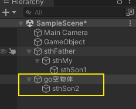

'''

==== 全局搜索某物体 (低效) -> GameObject.Find()

[,subs=+quotes]
----
// Start is called before the first frame update
void Start() {
    //拿到当前脚本所挂载的游戏物体实例
    GameObject ins当前物体 = this.gameObject;

    *GameObject ins父物体 = GameObject.Find("sthFather"); //全局查找名字是"sthFather"的物体*
    Debug.Log(ins父物体.name);

    //获取父物体身上的 Transform组件. 必须先创建一个 Transform 实例, 然后再来访问该实例里面的字段.
    Transform insTF = ins父物体.GetComponent<Transform>();
    Debug.Log(insTF.position);
}
----

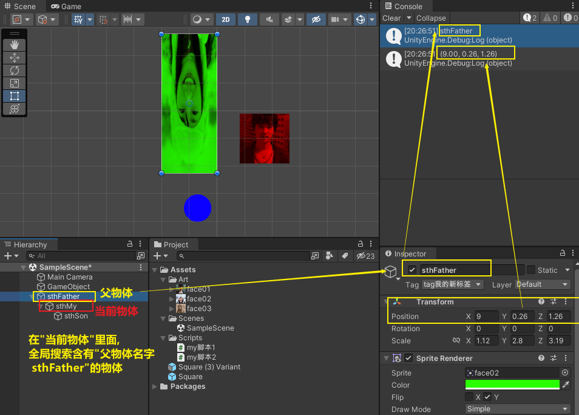

但这个GameObject.Find() 方法有两个弊端:

1. 无法找到未激活的物体.
2. 需要遍历场景的所有物体，性能上看是十分低效的.

GameObject.Find()
这个方法没有其他重载的方法。通过的名字来查找一个不是特定的物体，*简而言之，当一个场景有多个名字相同的物体的时候，无法找到你想要的那一个*，该函数的返回值是一个GameObject类的对象.

总结：

- 1）函数的返回值是一个被查找到的对象（GameObject类），*如果存在多个同名的物体，也只是返回其中一个。（可能不是你想要的那一个）*
- 2）*物体需要处于active()处于true状态, 才能被找到。*
- 3）*Find()非常消耗性能，不建议在Update()方法里面使用。*
- 4）该函数也可以查找子游戏物体对象。*如果多个游戏场景同时运行，那么Find()查找的范围是所有场景。*

'''

==== 通过 "tag名" 来查找物体 -> GameObject.FindGameObjectWithTag(你的标签名) 和  GameObject.FindGameObjectsWithTag(你的标签名)

[,subs=+quotes]
----
// Start is called before the first frame update
void Start() {
    //拿到当前脚本所挂载的游戏物体实例
    GameObject ins当前物体 = this.gameObject;

    *//通过tag名来查找. 只返回第一个找到的物体*
    *GameObject resOb = GameObject.FindGameObjectWithTag("tag我重点关注的物体"); //这里用 GameObject.FindWithTag() 方法也行.*
    Debug.Log(resOb.name);

    *//通过tag名来查找. 返回所有找到的物体, 返回一个数组*
    *GameObject[] arrResObj = GameObject.FindGameObjectsWithTag("tag我重点关注的物体");*

    foreach (GameObject obj in arrResObj) {
        Debug.Log(obj.name);
    }

}
----

GameObject.FindWithTag() +
该方法与Find()用法比较相似，区别就是该方法是通过"标签"来查找一个不是特定的游戏物体，如果找到，则返回一个游戏物体对象，没有找到会传一个空字符或者null.抛出一个异常.

GameObject.FindGameObjectsWithTag() +
这个函数也是根据标签来查找游戏物体对象，它返回的是一个游戏物体对象数组，场景中存在相同标签的物体都将被返回。物体需要处于active()处于true状态, 才能被找到。

'''

==== 按类型查找

[,subs=+quotes]
----
public class my脚本测试 : MonoBehaviour {
    // Start is called before the first frame update

    void Start() {
        *my脚本1 ins = GameObject.FindObjectOfType<my脚本1>(); //注意:  GameObject.FindObjectOfType<类型名>()方法, 这个泛型里面的"类型名", 其实是你自定义创建的脚本的"类名", 而不是物体名字. 另外, 这个查找方法, 只能查找到脚本挂载的物体. 所以, 这里会输出"my脚本1"挂载的物体的名字.*

        Debug.Log(ins.name);

     }

    // Update is called once per frame
    void Update() {

    }
}
----

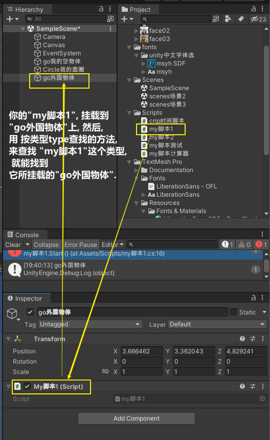

注意, 按类型查找, 只能找到已激活状态的物体.

unity中查找对象的五种方法
 3dC 2016-07-20   |  10318阅读  |  24转藏

转藏全屏朗读分享
unity中提供了**对象的五种方法：

通过对象名称（Find方法）
通过标签**单个游戏对象（FindWithTag方法）
通过标签获取多个游戏对象（FindGameObjectsWithTags方法）
通过类型获取单个游戏对象（FindObjectOfType方法）
通过类型获取多个游戏对象（FindObjectsOfType方法）

Find方法：
static GameObject Find (string name)
传入的name可以是单个的对象的名字，也可以是hierarchy中的一个路径名，如果找到会返回该对象(活动的)，如果找不到就返回null。
[csharp] view plain copy print?在CODE上查看代码片派生到我的代码片
var cubeF = GameObject.Find("/CubeFather");
if (null != cubeF)
{
    Debug.Log("find cube father~");
}
cubeF = GameObject.Find("CubeFather");
if (null != cubeF)
{
    Debug.Log("find cube father, no /~");
}

var cubeS = GameObject.Find("/CubeFather/CubeSon");
if (null != cubeS)
{
    Debug.Log("find cube son~");
}
cubeS = GameObject.Find("CubeFather/CubeSon");
if (null != cubeS)
{
    Debug.Log("find cube son, no /~");
}
cubeS = GameObject.Find("CubeSon");
if (null != cubeS)
{
    Debug.Log("find cube son, no one /~");
}

结果如上，可见不论参数是对象名字还是对象的路径，只要对象存在都会查找到，但是建议最好是写详细的路径名例如CubeFather/CubeSon，这样的话，在unity查找的过程中会省很多事，效率高；另外不要在每一帧都执行的函数中调用该函数，可以看上图结果中会执行好多次，用到某个对象时可以在Start这种只执行一次的函数中定义变量获取Find的返回值，再在每帧都执行的函数中使用该变量即可~

FindWithTag方法：
static GameObject FindWithTag (string tag)
返回一个用tag做标识的活动的对象，如果没有找到则为null。
[csharp] view plain copy print?在CODE上查看代码片派生到我的代码片
var sphere = GameObject.FindWithTag("Sphere");
if (null != sphere)
{
    Debug.Log("Sphere~");
}
将hierarchy中某个对象的Inspector面板上面的Tag自定义一个，然后为其选择自定义（上述例子中用的Sphere）
，当然没有的话，利用下拉列表中的AddTag构建

FindGameObjectsWithTag方法：
static GameObject[] FindGameObjectsWithTag (string tag)
返回一个用tag做标识的活动的游戏物体的列表，如果没有找到则为null。具体代码略过~

FindObjectOfType方法：
static Object FindObjectOfType(Type type)
返回类型为type的活动的第一个游戏对象

FindObjectsOfType方法：
static Object FindObjectsOfType(Type type)
返回类型为type的所有的活动的游戏对象列表

注意：一定保证对象是active的才会找到
         为了效率高，一定要保证别在每帧都调用的函数中使用上述函数

Unity 之 查找游戏物体的几种方式解析
2021-11-13 522举报

简介： 一篇小白也能看懂的查找游戏物体的方式解析 -- Unity 之 查找物体的几种方式。
一篇小白也能看懂的查找游戏物体的方式解析 -- Unity 之 查找物体的几种方式。本文通过实际测试得出使用结论，大家进行简单记录，在使用时想不起来可以再来看看，多用几次基本就没有问题了。
一，Object.Find()
Object.Find():根据名称找到游戏对象并返回它。

void ObjectFind()
{
    // 找父级
    GameObject parent = GameObject.Find("GameObject");
    Debug.Log("找父级物体，是否找到：" + (parent != null));

    // 找子级
    GameObject child = GameObject.Find("Child");
    Debug.Log("找子级物体，是否找到：" + (child != null));

    // 找父级隐藏物体
    GameObject parentHide = GameObject.Find("GameObjectHide");
    Debug.Log("找父级隐藏物体，是否找到：" + (parentHide != null));

    // 找子级隐藏物体
    GameObject childHide = GameObject.Find("ChildHide");
    Debug.Log("找子级隐藏物体，是否找到：" + (childHide != null));
}
测试结果如下图：
ObjectFind

当有使用GameObject.Find("GameObject"), 场景中有多个名为“GameObject”的物体存在时，将每个“GameObject”设置为不同的标签，多运行几次查看结果。

测试场景如下：
搭建场景

测试代码如下：

// 找同名物体
GameObject nameObj = GameObject.Find("GameObject");
Debug.Log("找同名，是否找到：" + nameObj.tag);
测试结果: 查找顺序是：“自身”(挂载脚本的物体) --> 和自身同层级上面物体 --> 和自身同层级下面物体 --> 自身子物体 --> 自身父物体。

找同名物体

Object.Find()得出结论：

全局查找参数名称游戏物体；
不对禁用(隐藏)物体进行查找；
若有同名物体时根据层级关系进行查找。
使用建议: 有同名物体存在时，尽量不要使用Object.Find()进行查找，或者说使用Object.Find()进行查找时，应控制查找物体命名唯一。

二，FindGameObjectWithTag()
GameObject.FindGameObjectWithTag() 根据标签查找游戏物体并返回。
GameObject.FindGameObjectsWithTag() 根据标签查找当前场景中所有这个标签的游戏物体并返回所有物体的数组。

将如下场景：除主摄像机~(Main Camera)~外的所有游戏物体的标签~(Tag)~都修改为Player，进行测试。

测试场景

测试代码如下：

void GameObjectFindWithTag()
{
    GameObject tagObj = GameObject.FindGameObjectWithTag("MainCamera");
    Debug.Log("根据标签查找游戏物体，是否查到：" + (tagObj != null));

    GameObject[] tagObjs = GameObject.FindGameObjectsWithTag("Player");
    for (int i = 0; i < tagObjs.Length; i++)
    {
        Debug.Log("根据标签查找游戏物体名称：" + tagObjs[i].name);
    }
}
测试结果：

测试结果

查找不存在的标签测试:

GameObject tagObj = GameObject.FindGameObjectWithTag("MainCamera1");
Debug.Log("根据标签查找游戏物体，是否查到：" + (tagObj != null));
不存标签

报错:UnityException: Tag: MainCamera1 is not defined. 翻译: MainCamera1是一个未定义的标签

FindGameObjectWithTag()得出结论：

查找不到禁用物体，使用时需确认要查找的物体是启用(显示)状态；
有多个有游戏物体使用同一标签时，尽量不使用FindGameObjectWithTag此方式查找单一游戏体，因为查找顺序会受到层级影响；
查找未定义标签会报错，使用时需确认查找的字符串是已定义的标签；
查找的标签是已定义但是未使用过，会找不到游戏物体，返回空值。
三，GameObject.FindObjectOfType()
和上面根据标签查找的逻辑差不多。

GameObject.FindObjectOfType<类型>(); :根据类型(组件/自定义脚本)查找并返回这个类。
GameObject.FindObjectsOfType<类型>() :根据类型(组件/自定义脚本)查找当前场景中所有这个类并返回一个这个类的数组。

void FindObjectOfType()
{
     Camera typeCamera = GameObject.FindObjectOfType<Camera>();
     Debug.Log("根据类型查找物体，是否查到：" + (typeCamera != null));

     Transform[] typeTransArr = GameObject.FindObjectsOfType<Transform>();
     for (int i = 0; i < typeTransArr.Length; i++)
     {
         Debug.Log("根据类型查找到的物体名称：" + typeTransArr[i].name);
     }
}
测试结果

FindObjectOfType()得出结论：

查找不到禁用物体，使用时需确认要查找的物体是启用(显示)状态；
查找场景中不存在类型时会返回null，不会报错；
通常使用情况为：初始化时在一个脚本中获取另一个脚本的引用，通过这种形式查找。【后多被单例取代】

四，Transform.Find()
查找挂载物体父级，同级，子级物体：

void TransformFind()
{
    // 找父级
    Transform parent = transform.Find("Root");
    Debug.Log("找父级物体，是否找到：" + (parent != null));

    // 找同级
    Transform selfObj = transform.Find("Parent_1");
    Debug.Log("找同级物体，是否找到：" + (selfObj != null));

    // 找子级
    Transform child = transform.Find("Child");
    Debug.Log("找子级物体，是否找到：" + (child != null));

    // 找子级隐藏物体
    Transform childHide = transform.Find("ChildHide");
    Debug.Log("找子级隐藏物体，是否找到：" + (childHide != null));
}
TransformFind

找多层级子物体：

// 找二级子物体
Transform child_1 = transform.Find("Child_1_1");
Debug.Log("找二级子物体 参数只写名称，是否找到：" + (child_1 != null));
// 找二级子物体
Transform child_1_1 = transform.Find("Child/Child_1_1");
Debug.Log("找二级子物体 参数写全路径，是否找到：" + (child_1_1 != null));
找二级子物体

Find()得出结论：

只能找其子物体，不能找其同级或更高层级物体
找子物体时不考虑是否被禁用（隐藏）
找多层子物体时需写全路径（否则即使存在也找不到）
五，Transform.FindObjectOfType()
经过测试和GameObject.FindObjectOfType()没什么区别，测试结果一致，测试代码和截图就不发处理占地方了。

测试时我发现 GameObject.FindObjectsOfType<类型>()和Transform.FindObjectsOfType<Transform>() 被合并了，应该说完全是一个方法了，根据下图可以看到，我虽然前打的是Transform的标签，但是它是灰色的，鼠标放上去看到方法引用的却是GameObject.FindObjectsOfType。

测试结果

得出结论：
Transform.FindObjectOfType() 和 GameObject.FindObjectOfType()使用方式一样，结果也没有区别...

六，transform.GetChild()
Transform.GetChild()是找子物体的方法，也是我个人比较喜欢用的方式，弊端是不能随意修改游戏物体的层级关系。

使用起来也很简单
比如:找一级子物体的第一个物体

Transform child1 = transform.GetChild(0);
找一级子物体的第一个物体的第三个子物体

Transform child1 = transform.GetChild(0).GetChild(2);
使用方式：几个层级就几个GetChild(),参数就是当前层级的第几个物体（从0开始）

使用拓展：

遍历子物体:
for (int i = 0; i < transform.childCount; i++)
{
     Debug.Log(transform.transform);
}
获取当前物体的父物体transform.parent
获取当前物体的根物体transform.root
transform.GetChild()使用总结：

以自身为基础，查找子物体（注意索引从0开始，写多报错）
可以使用transform.parent.parent 的形式无限向上，然后再GetChild()，就达到了查找父层级或更高层级物体的目的
弊端是依赖游戏物体的层级关系，使用时需确保层级关系相对稳定。若不稳定会导致每次修改游戏体时还要修改代码，这就加大了工作量了。

'''

== 例子

==== 制作一个计算器

首先, 要对输入框 InputField, 限定只能输入数字 int类型.

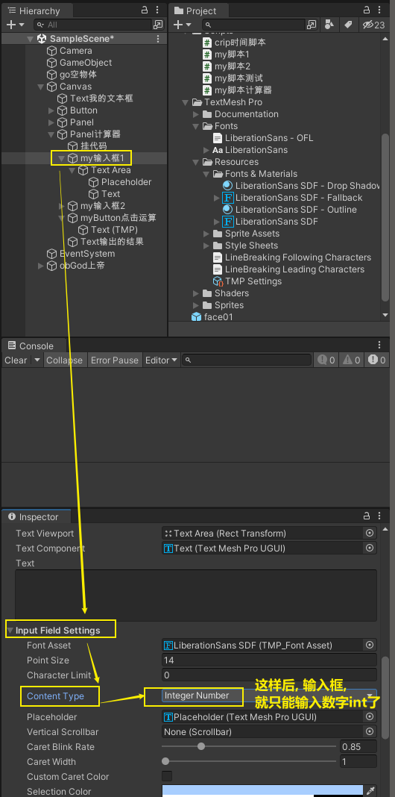

若只限制输入整数，将此属性修改为Intefer Number即可 +
若要输入小数，将此属性设置为Decimal Number即可

[,subs=+quotes]
----
# #
----

