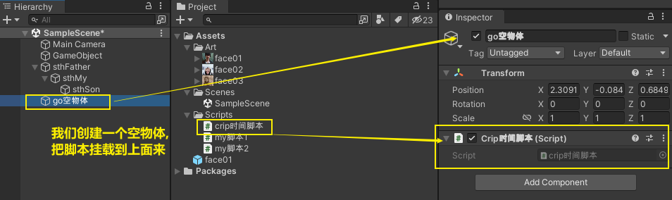
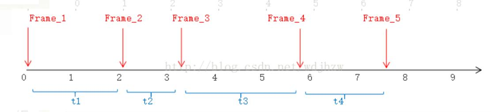
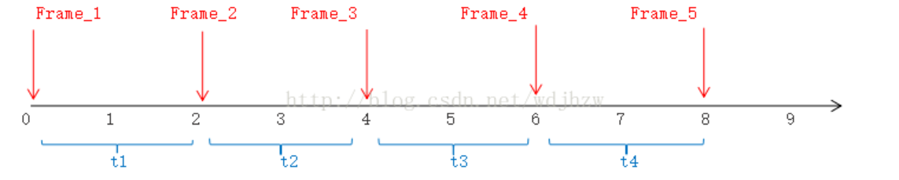
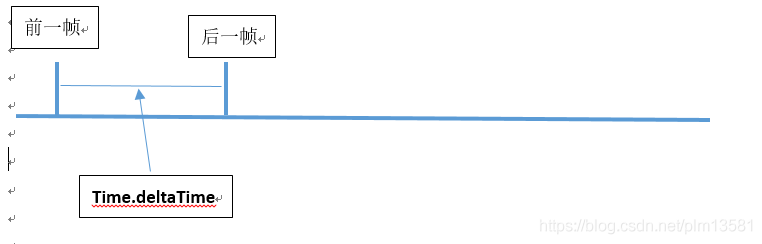
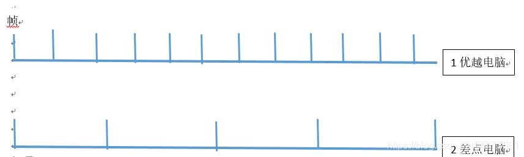

= 游戏时间
:sectnums:
:toclevels: 3
:toc: left
''''

== 渲染世界 & 逻辑世界

首先我们必须理解渲染世界和逻辑世界的不同，渲染世界和我们人类生活的世界世界是并行的，他的单位时间也是秒（或者毫秒等等），与现实时间是完全一致的；逻辑世界他的时间单位是帧，1帧是逻辑世界最小的时间单位，**而逻辑世界与我们人类生活的现实世界的时间之间有个换算单位，**就像$和￥之间也有个汇率一样道理，*这个换算就是1帧多少秒，在Unity中，即Time.fixedDeltaTime，默认为0.02秒。*

**Update()是渲染世界的推进器，也就是当渲染世界的“工人”完成一次工作之后就会Update一下，**去做下一次工作了。**因此跟渲染相关的东西，我们应该写在Update里面，**比如要让一个球旋转，这个球只是看起来在转，对游戏来说就是一个动画，没什么实际意义，那么就应该写在Update下，并且依赖于Time.deltaTime来做运算。

**FixedUpdate()则是逻辑帧，Unity会尽可能保证现实生活中平均时间（默认0.02秒）执行一次，**当然，这根设备也有很大关系的，破机器肯定跑不了这么快。**每一次执行FixedUpdate，就是逻辑世界的时间推进一个单位。所以如果一些公式和现实有关的时候，**比如你的移动速度概念里是米/秒（我的demo里故意这么做）而不是米/帧的话，那你应该坚信，不管现实中1帧花了多少秒，**Time.fixedDeltaTime就是现实中经过的时间**（这是你预设的，不会变化）。

这就是逻辑与渲染2个世界的不同，为什么需要分2个Update，其实道理很简单，如果渲染的update也走逻辑的，因为逻辑的并不能保证每一次运行间隔，所以比如动画、比如位移（纯动画的位移）之类的都会出现速度不正确的情况，使观众不适应。因此，我们要严格遵守一个规则——逻辑层的用FixedUpdate()和Time.fixedDeltaTime，而渲染层的用Update()和Time.deltaTime。

*Update()：每帧被调用一次*。

**FixedUpdate()：每隔Time.fixedDeltaTime被调用一次。**Time.fixedDeltaTime默认是0.02s，可以通过Edit->ProjectSettings->Time来设置。

在游戏中，因为受场景渲染的复杂程度，还有输入的一系列事件等等各种原因影响，游戏画面的帧率是在不断变化的。

所以，在控制游戏逻辑的过程中，一般是需要按照每帧去处理的（使用Update()）。而**物理相关的处理，则需要根据时间的变化去处理（使用FixedUpdate()）。**

而当我们在Update()中，希望通过每隔一段时间去执行一些逻辑，比如修改GameObject的Transform，需要使用Time.deltaTime。

*主要原因，就是帧率在不断变化，Update()被调用的时间并不是线性的。*
在Update()中，时间轴上，渲染出的5帧画面Frame_1~Frame_5，以及每帧的时间间隔t1~t4：

Transform的Translate方法接受的参数，实际上是一个位移，而不是速度。
在FixedUpdate()中，发生的情况是这样的：

因为FixedUpdate()的调用间隔就是0.02s=t1=t2=t3=t4，所以实际上，位移=速度*时间。

**由于Update()并不是按照单位时间被调用的，**所以要乘以每次的“帧间时间”，而这个时间就是Time.deltaTime。这样的操作相当于一个“补偿”，将每次帧率的变化，通过时间的变化同步体现到执行逻辑上。

'''

== Time.deltaTime

Time.deltatime是一个值，表示一帧的间隔时间。这个值在不同电脑里不一样。

Time.deltaTime是帧与帧相减出来的，既是后一帧时间减去前一帧时间得出来的.

假设有两台电脑，一台性能优越，另一台垃圾点，各运行一秒

性能优越的电脑：
每秒的帧数多，帧与帧间隔就短Time.deltaTime数值就小，假设这个数值是0.1 (即每帧花费0.1秒)，乘与速度1，那么每帧速度是0.1. 假设一秒运行30帧，那么速度就是3。

性能差些的电脑：
电脑每秒的帧数少，帧与帧间隔就长, Time.deltaTime数值就大，假设这个数值是0.3(即每帧花费0.3秒)，乘与速度1，那么每帧速度是0.3， 假设一秒运行10帧，速度也是3。

结果相同，这就是导致结果趋向一致的过程。

这就好像甲跟乙比一分钟能走多远，甲步子迈的小但迈的多，乙呢步子迈的大但慢，甲迈三步乙迈一步就可以了，这就导致在同样的时间，他们同样到达.

---

== 代码

[,subs=+quotes]
----
    // Start is called before the first frame update
    void Start()
    {
        //游戏开始到现在所度过的时间
        Debug.Log(Time.time);

        //时间缩放值. 默认是1.0,即正常时间流逝. 游戏没有被加速.
        Debug.Log(Time.timeScale);

        //固定时间间隔.
        Debug.Log(Time.fixedDeltaTime);

        //上一帧到这一帧所用的游戏时间. 比如, 60帧的游戏, 则这个 Time.deltaTime 值就是 1/60秒
        Debug.Log(Time.deltaTime);

    }
----

