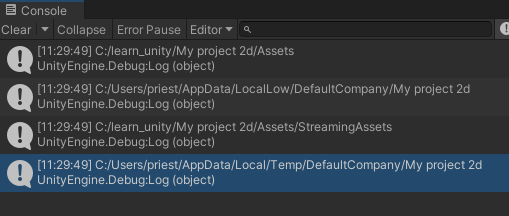
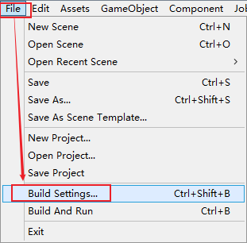
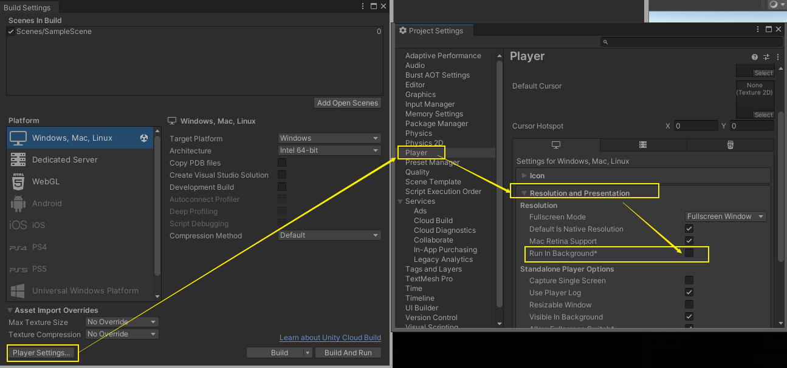
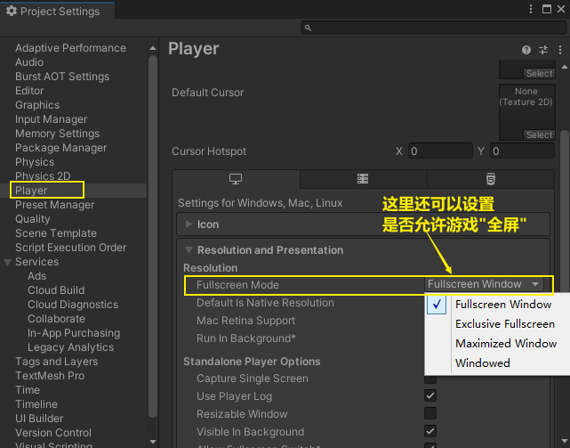

= Unity资源加载路径
:sectnums:
:toclevels: 3
:toc: left
''''

== 资源路径

Unity中资源的处理种类, 大致分为：Resources、StreamingAssets、AssetBundle、PersistentDataPath 四类。

[options="autowidth"]
|===
|Header 1 |Header 2 |特点

|Resources
|是作为一个Unity的保留文件夹出现的，也就是如果你新建的文件夹的名字叫Resources，那么里面的内容在打包时都会被无条件的打到发布包中。
|*只读，即不能动态修改。所以想要动态更新的资源不要放在这里。* +
会将文件夹内的资源, 打包集成到.asset文件里面。因此建议可以放一些Prefab，因为Prefab在打包时会自动过滤掉不需要的资源，有利于减小资源包的大小。 +
资源读取使用Resources.Load()。

|StreamingAssets
|StreamingAssets和Resources很像。同样作为一个只读的Unity3D的保留文件夹出现。不过两者也有很大的区别，那就是**Resources文件夹中的内容在打包时会被压缩和加密。而StreamingAsset文件夹中的内容则会原封不动的打入包中**，因此StreamingAssets主要用来存放一些二进制文件。
|*只读不可写。*
主要用来存放二进制文件。
只能用过WWW类来读取。

|AssetBundle
|AssetBundle就是把prefab或者二进制文件, 封装成AssetBundle文件。
|是Unity3D定义的一种二进制类型。
使用WWW类来下载。

|PersistentDataPath
|这个路径下是**可读写。**而且在IOS上就是应用程序的沙盒，但是在Android可以是程序的沙盒，也可以是sdcard。并且在Android打包的时候，ProjectSetting页面有一个选项Write Access，可以设置它的路径是沙盒还是sdcard。

*内容可读写，不过只能运行时才能写入或者读取。 提前将数据存入这个路径是不可行的。*
**无内容限制。**你可以从 StreamingAsset 中读取二进制文件或者从 AssetBundle 读取文件来写入 PersistentDataPath 中。
*写下的文件，可以在电脑上查看。同样也可以清掉。*
需要使用WWW类来读取。
|
|===

[,subs=+quotes]
----
// Start is called before the first frame update
void Start()
{
    //游戏数据的存放目录(是只读的, 游戏发布后,这个路径会被加密压缩)
    Debug.Log(*Application.dataPath*); // 此属性用于返回"程序的数据文件"所在文件夹的路径。例如在Editor中就是Assets了。

    //持久化文件夹的路径
    Debug.Log(*Application.persistentDataPath*); //此属性用于返回一个持久化数据存储目录的路径，可以在此路径下存储一些持久化的数据文件。

    //streamingAssets文件夹的路径. (只读,配置文件)
    Debug.Log(*Application.streamingAssetsPath*); //此属性用于返回"流数据的缓存目录"，返回路径为相对路径，适合设置一些"外部数据文件"的路径。放在Unity工程StreamingAssets文件夹中的资源发布后,都可以通过这个路径读取出来。

    Debug.Log(*Application.temporaryCachePath*); //此属性用于返回一个临时数据的缓存目录。
}
----

'''

== 查看"游戏是否被允许在后台运行?"

[,subs=+quotes]
----
    // Start is called before the first frame update
    void Start()
    {
        //查看"游戏是否被允许在后台运行?"
        Debug.Log(*Application.runInBackground*); //false
    }
----

可以在这里设置:

'''

== 是否允许游戏全屏

'''

== 退出游戏

[,subs=+quotes]
----
void Start()
{
    //退出游戏
    *Application.Quit();*
}
----

'''

