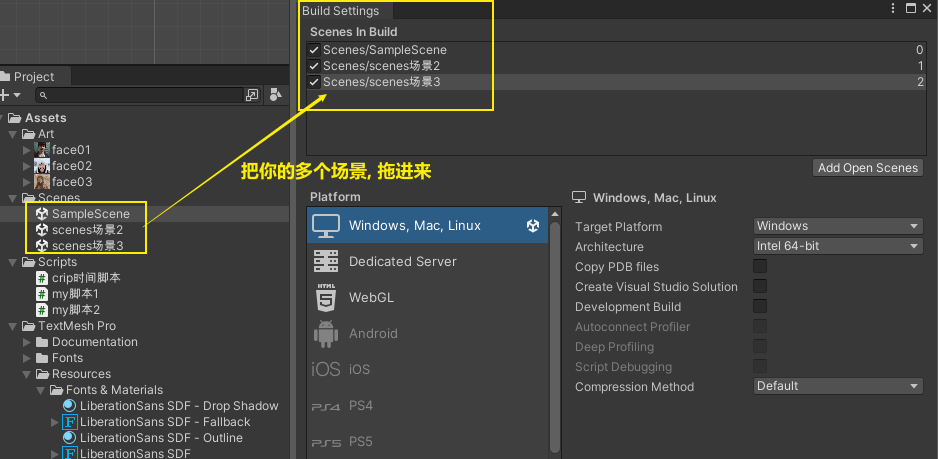
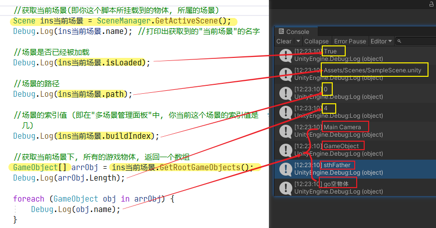
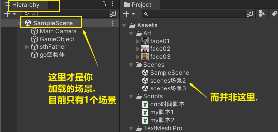
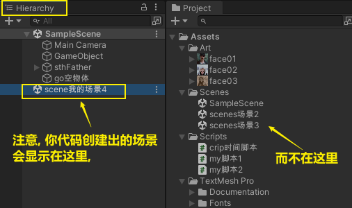
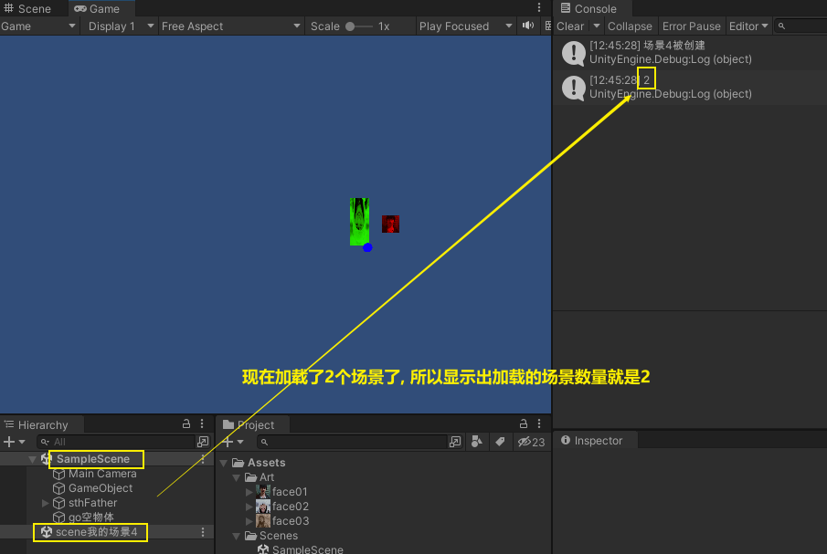
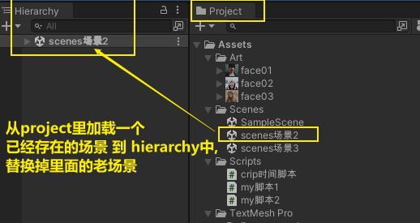
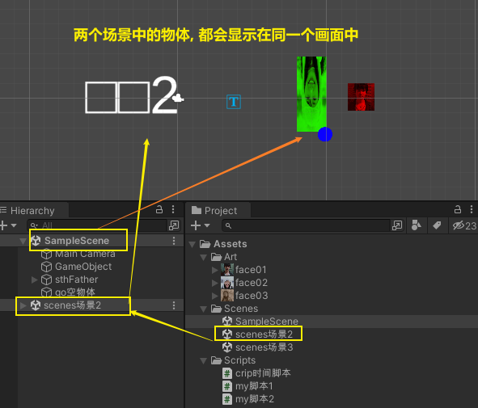
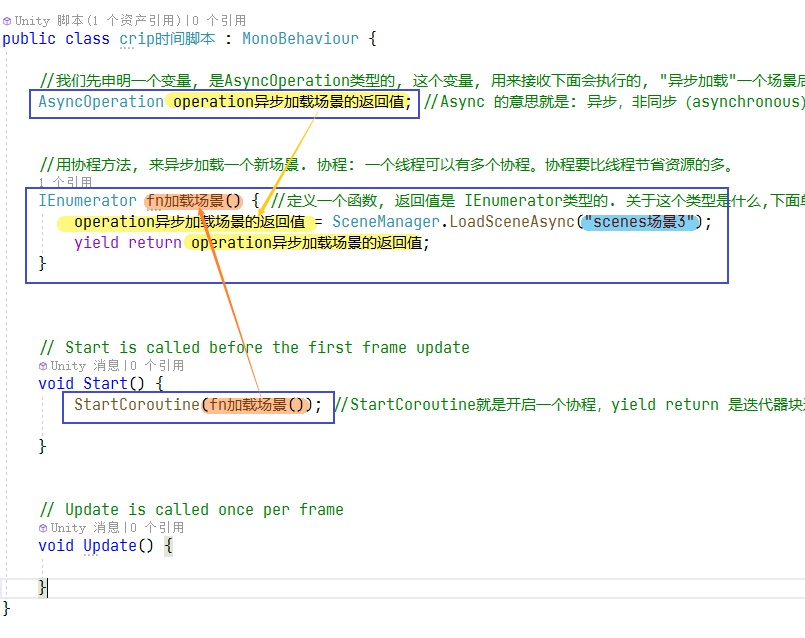
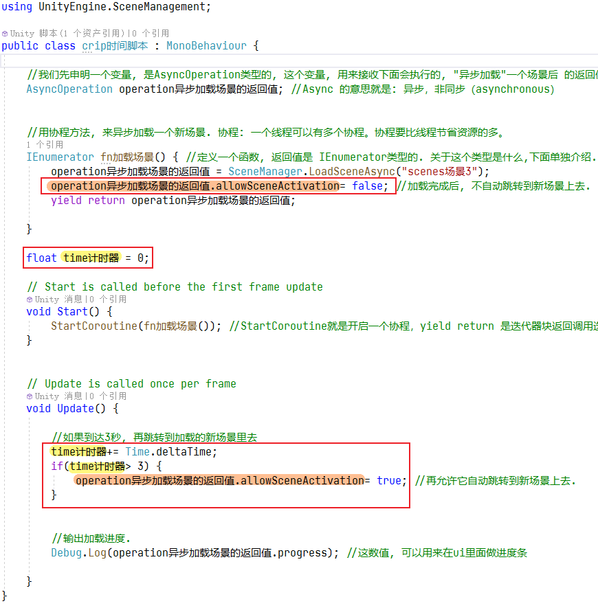

= 多场景切换
:sectnums:
:toclevels: 3
:toc: left
''''

== 切换多个场景

菜单 file -> build setting (ctrl + shift + b)

[,subs=+quotes]
----
void Start()
{
    //加载某个场景, 输入场景名字.
    SceneManager.LoadScene("scenes场景2"); //这段代码会直接跳转到"scenes场景2"上去.
}
----

== 获取当前场景下, 所有的游戏物体, 返回一个数组

[,subs=+quotes]
----
void Start()
{
    //获取当前场景(即你这个脚本所挂载到的物体, 所属的场景)
    *Scene ins当前场景 = SceneManager.GetActiveScene();*
    Debug.Log(ins当前场景.name); //打印出获取到的"当前场景"的名字

    //场景是否已经被加载
    Debug.Log(*ins当前场景.isLoaded*);

    //场景的路径
    Debug.Log(*ins当前场景.path*);

    //场景的索引值 (即在"多场景管理面板"中, 你当前这个场景的索引值是几)
    Debug.Log(*ins当前场景.buildIndex*);

    //获取当前场景下, 所有的游戏物体, 返回一个数组
    *GameObject[] arrObj = ins当前场景.GetRootGameObjects();*
    Debug.Log(arrObj.Length);

    foreach (GameObject obj in arrObj) {
        Debug.Log(obj.name);
    }

}
----

== 当前加载的场景的数量

[,subs=+quotes]
----
//当前加载的场景的数量
Debug.Log(SceneManager.sceneCount); //输出1. 即使你创建了n个场景, 如果不加载的话, 也只会输出当前加载的这1个场景的数量, 即1.
----

== 创建新场景

[,subs=+quotes]
----
//创建新场景
SceneManager.CreateScene("scene我的场景4");
Debug.Log("场景4被创建");
----

如果代码这样写:

[,subs=+quotes]
----
void Start() {

    //创建新场景
    *SceneManager.CreateScene("scene我的场景4");*
    Debug.Log("场景4被创建");

    //当前已加载场景的数量
    Debug.Log(*SceneManager.sceneCount*); //输出2.
}
----

Hierarchy窗口, 就是一个Scene场景中游戏对象的管理器。Scene视图和Hierarchy窗口的操作, 是相互关联的。

Hierarchy和Project的区别：

*Hierarchy窗口显示的是当前游戏世界（舞台）里的元素，Project里显示的是所有资源，比如新引进项目里，但是还没有添加到游戏世界里的资源。*

**Hierarchy里的资源组织方式与硬盘里的目录结构无关，**可以通过建立Empty Object作为父对象，然后把任意对象放在里面，形成级联结构，这样来管理对象；也可以通过选中父对象，完成对一组对象的总体操作。

Hierarchy里蓝色的对象表示是预制件；可以将预制件右键Unpack来打散重新编辑，然后将编辑好的组拖进project窗口对应的目录里，实现创建新的预制件。

Hierarchy 视图窗口，也被称之为：场景视图。而场景视图作用则是显示当前场景下包含的游戏物体。

Project 视图窗口，也被称之为：工程视图。这里面主要用于存放游戏里所需要的资源文件以及脚本文件，简单来讲，包含如下部分：
声音资源；
模型资源；
场景文件；
脚本文件；

'''

== 卸载场景

[,subs=+quotes]
----
//创建新场景
*Scene ins场景5 = SceneManager.CreateScene("scene我的场景5");*
Debug.Log("场景5被创建");

//卸载场景
*SceneManager.UnloadSceneAsync(ins场景5);* //将场景5卸载
Debug.Log("场景5被卸载");
----

== 加载一个已在assets中存在的场景, 且替换掉原场景. 即现在只有一个你新加载的新场景存在.

[,subs=+quotes]
----
//加载已在assets中存在的场景, 且替换掉原场景. 即现在只有一个你新加载的新场景存在.
*SceneManager.LoadScene("scenes场景2", LoadSceneMode.Single);* //加载它, 并卸载掉老场景
----

[,subs=+quotes]
----
hier·archy n.   /ˈhaɪərɑːki/
( pl. -ies)

1.
[ CU] a system, especially in a society or an organization, *in which people are organized into different levels of importance from highest to lowest* 等级制度（尤指社会或组织）
•
the social/political hierarchy 社会╱政治等级制度

•
She's quite high up in the management hierarchy. 她位居管理层要职。

2.
[ C+sing./pl.v.] the group of people in control of a large organization or institution 统治集团
3.
[ C] ( formal ) a system that ideas or beliefs can be arranged into 层次体系
•
a hierarchy of needs 不同层次的需要
----

'''

== 从 project中 加载一个新场景 到 hierarchy中, 且保留原场景

[,subs=+quotes]
----
//加载已在assets中存在的场景, 且保留原场景.
*SceneManager.LoadScene("scenes场景2", LoadSceneMode.Additive);* //加载它
----

'''

== 异步地来加载一个场景, 并自动跳转到新场景上去

[,subs=+quotes]
----
using System.Collections;
using System.Collections.Generic;
using UnityEngine;
using UnityEngine.SceneManagement;

public class crip时间脚本 : MonoBehaviour {

    //我们先申明一个变量, 是AsyncOperation类型的, 这个变量, 用来接收下面会执行的, "异步加载"一个场景后 的返回值.
    *AsyncOperation operation异步加载场景的返回值;* //Async 的意思就是: 异步，非同步（asynchronous）

    //用协程方法, 来异步加载一个新场景. 协程: 一个线程可以有多个协程。协程要比线程节省资源的多。
    *IEnumerator fn加载场景()* { //定义一个函数, 返回值是 IEnumerator类型的. 关于这个类型是什么,下面单独介绍. 注意!! 你这个函数的返回值, 一定要是 IEnumerator 类型的,而不要错写成 IEnumerable 类型, 否则下面的StartCoroutine()函数会报错!
        *operation异步加载场景的返回值 = SceneManager.LoadSceneAsync("scenes场景3");*
        *yield return operation异步加载场景的返回值;*
    }

    // Start is called before the first frame update
    void Start() {
        *StartCoroutine(fn加载场景());* //StartCoroutine就是开启一个协程，yield return 是迭代器块返回调用迭代的地方。在Unity中，我们可以使用StartCoroutine方法来启动一个协程。该方法需要传入一个IEnumerator对象。然后，我们就可以在该方法中执行我们想要执行的代码了。

    }

    void Update() {
        *//输出加载进度. 数值范围在0-0.9, 即它最大就是0.9. 到0.9后, 就说明这个场景就被加载完成了.*
        Debug.Log(*operation异步加载场景的返回值.progress*); //这数值, 可以用来在ui里面做进度条

    }
}
----

IEnumerable 和 IEnumerator详解

从名字常来看，IEnumerator是枚举器的意思，IEnumerable是可枚举的意思。这两个都是个接口

接下来我们看一下IEnumerator和IEnumerable的源码

[,subs=+quotes]
----
 public interface IEnumerable
    {
        IEnumerator GetEnumerator();
    }
----

IEnumerable非常简单，就一个GetEnumerator()方法，但是这个方法的返回值却是一个IEnumerator对象，从注释我们可以得知IEnumerable代表继承此接口的类可以获取一个IEnumerator来实现枚举这个类中包含的集合中的元素的功能（比如List<T>,ArrayList,Dictionary等继承了IEnumeratble接口的类,接下来我们看下IEnumerator这个接口中有什么。

[,subs=+quotes]
----
public interface IEnumerator
{
    object Current { get; }
    bool MoveNext();
    void Reset();
}
----

Enumerator有一个object类型的属性，还有一个返回值为bool值的MoveNext方法, 和一个无返回值的Reset方法

如果你不想自动跳转到新加载的场景上, 就再加上一句代码:

[,subs=+quotes]
----
using System.Collections;
using System.Collections.Generic;
using UnityEngine;
using UnityEngine.SceneManagement;

public class crip时间脚本 : MonoBehaviour {

    //我们先申明一个变量, 是AsyncOperation类型的, 这个变量, 用来接收下面会执行的, "异步加载"一个场景后 的返回值.
    AsyncOperation operation异步加载场景的返回值; //Async 的意思就是: 异步，非同步（asynchronous）

    //用协程方法, 来异步加载一个新场景. 协程: 一个线程可以有多个协程。协程要比线程节省资源的多。
    IEnumerator fn加载场景() { //定义一个函数, 返回值是 IEnumerator类型的. 关于这个类型是什么,下面单独介绍. 注意!! 你这个函数的返回值, 一定要是 IEnumerator 类型的,而不要错写成 IEnumerable 类型, 否则下面的StartCoroutine()函数会报错!
        operation异步加载场景的返回值 = SceneManager.LoadSceneAsync("scenes场景3");
        *operation异步加载场景的返回值.allowSceneActivation= false; //加载完成后, 不自动跳转到新场景上去.*
        yield return operation异步加载场景的返回值;

    }

    *float time计时器 = 0;*

    // Start is called before the first frame update
    void Start() {
        StartCoroutine(fn加载场景()); //StartCoroutine就是开启一个协程，yield return 是迭代器块返回调用迭代的地方。在Unity中，我们可以使用StartCoroutine方法来启动一个协程。该方法需要传入一个IEnumerator对象。然后，我们就可以在该方法中执行我们想要执行的代码了。

    }

    // Update is called once per frame
    void Update() {

        *//如果到达3秒, 再跳转到加载的新场景里去*
        time计时器+= Time.deltaTime;
        if(time计时器> 3) {
            operation异步加载场景的返回值.allowSceneActivation= true; //再允许它自动跳转到新场景上去.
        }

        //输出加载进度.
        Debug.Log(operation异步加载场景的返回值.progress); //这数值, 可以用来在ui里面做进度条

    }
}
----

'''
