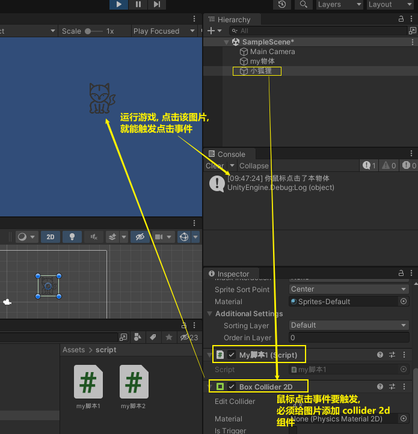
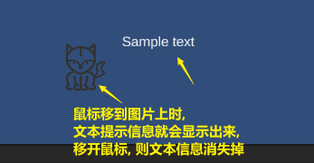
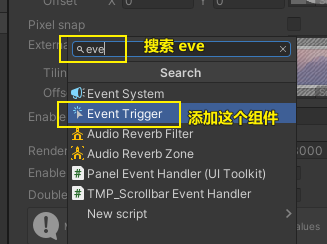
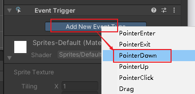
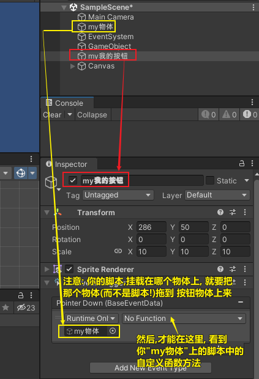
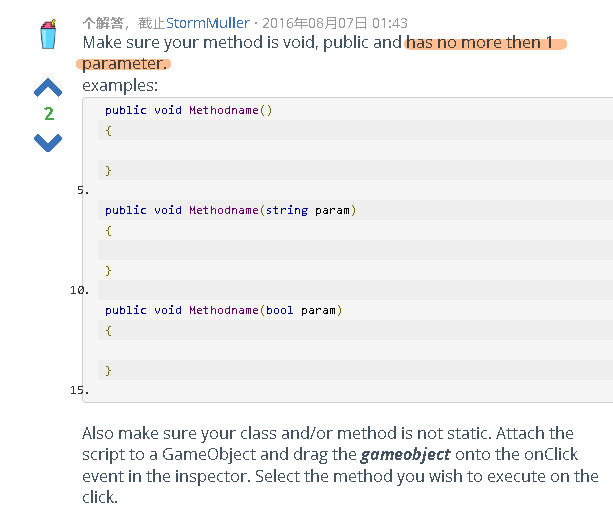

= 获取鼠标键盘操作
:sectnums:
:toclevels: 3
:toc: left
''''

== 获取鼠标点击

[,subs=+quotes]
----
// Update is called once per frame
void Update() {

    *//检测鼠标的点击(只会触发一次). 0代表左键, 1是右键, 2是滚轮.*
    if (*Input.GetMouseButtonDown(0)*) {
        Debug.Log("左键被点击");
    }

    if(Input.GetMouseButtonDown(1)) {
        Debug.Log("右键被点击");
    }

    //持续按下鼠标(会持续检测)
    if (*Input.GetMouseButton(0)*) {
        Debug.Log("左键已被按下");
    }

    //抬起鼠标(只会触发一次)
    if (*Input.GetMouseButtonUp(0)*) {
        Debug.Log("左键已被抬起");
    }

}
----

'''

==== onMouseDown()

若要实现“点击某一游戏对象触发事件”这一功能，则可以使用onMouseDown方法（属于MonoBehaviour类的静态方法）。注意：该游戏对象必须添加Collider组件，否则无法触发onMouseDown方法。

2D碰撞体对应的是2D的游戏对象，不能将3D和2D混用；

这个组件可以定义物理碰撞的2D游戏对象的形状；
形状不需要与游戏对象完全相同，粗略近似的方法在游戏运行中更有效。

2D碰撞体都有以下8种类型

Box Collider 2D 盒型碰撞体
它就是一个矩形的碰撞盒。

[,subs=+quotes]
----
public class my脚本1 : MonoBehaviour {

    // Start is called before the first frame update
    void Start() {

    }

    // Update is called once per frame
    // Update is called once per frame
    void Update() {

    }

    *private void OnMouseDown() {*
        Debug.Log("你鼠标点击了本物体");
    }
}

----

'''

==== OnMouseDrag()

当用户鼠标在GUIElement或Collider上拖拽时OnMouseDrag被调用 。

OnMouseDrag is called every frame while the mouse is down.

*OnMouseDrag在鼠标按下的每一帧被调用。*

OnMouseDrag 可以被作为协同程序，在函数体内使用yield语句，这个事件将发送到所有附在Collider或GUIElement的脚本上。

[,subs=+quotes]
----
*private void OnMouseDrag() {*
    Debug.Log("你鼠标拖拽了本物体");
}
----

'''

==== 鼠标移入a物体上方时, 就让b物体(比如文本提示信息)显示出来(激活它); 鼠标移出a物体时, 就让b物体文本信息, 隐藏掉(取消激活)

下面的脚本, 挂载到你的图片物体上.

[,subs=+quotes]
----
public class my脚本1 : MonoBehaviour {

    *GameObject insGo提示信息; //我们先设一个字段, 之后会用来存储"文本提示信息"物体.*

    // Start is called before the first frame update
    void Start() {
        *insGo提示信息 = GameObject.Find("inof提示信息"); //先找到这个"文本提示信息"物体.*
        *insGo提示信息.SetActive(false); //先把这个"文本提示信息"的组件, 取消激活状态.*
    }

    // Update is called once per frame
    // Update is called once per frame
    void Update() {

    }

    *private void OnMouseEnter() {*  //只检测一次
        Debug.Log("你鼠标进入了本物体");

        *insGo提示信息.SetActive(true); //鼠标移入图片上方时, 就激活该"文本提示信息"的组件.*
    }

    *private void OnMouseExit() {* //只检测一次
        Debug.Log("你鼠标移出了本物体");

        *insGo提示信息.SetActive(false); //鼠标移出物体时, 就让文本提示信息取消激活. 隐藏掉.*

    }

}
----

'''

== 获取键盘点击

[,subs=+quotes]
----
// Update is called once per frame
void Update() {

    //监测键盘的按下
    if(*Input.GetKeyDown(KeyCode.A)*) {
        Debug.Log("A键被按下");
    }

    if (*Input.GetKeyDown(KeyCode.Escape)*) {
        Debug.Log("esc键被按下");
    }

    //监测持续按下某个键
    if (*Input.GetKey(KeyCode.A)*) {
        Debug.Log("A键被持续按下");
    }

    //监测某个键被抬起
    if (*Input.GetKeyUp(KeyCode.A)*) {
        Debug.Log("A键被抬起");
    }

}
----

'''

== 手机触摸屏

[,subs=+quotes]
----
using System.Collections;
using System.Collections.Generic;
using UnityEngine;
using UnityEngine.SceneManagement;

public class crip时间脚本 : MonoBehaviour {

    // Start is called before the first frame update
    void Start() {

        //开启"多点触摸"
        *Input.multiTouchEnabled = true;*

    }

    // Update is called once per frame
    void Update() {

        //判断当前是否是"单点触摸"
        *if (Input.touchCount == 1)* { //Input.touchCount获取当前的触摸点数目，若为1则是"单点触控"，大于1则是"多点触控"
            *Touch touch = Input.touches[0];* //Input.touches结构，这是一个触摸数组，每个记录代表着手指在屏幕上的触碰状态。每个手指触控都是通过Input.touches来描述的.
            Debug.Log(touch.position); //你触摸屏幕的位置

            //"触摸动作"的阶段
            switch (*touch.phase*) { //phase（状态,相位，也即屏幕操作状态）有以下这几种
                case *TouchPhase.Began*: //手指刚刚触摸屏幕
                    break;
                case *TouchPhase.Moved*: //手指在屏幕上移动
                    break;
                case *TouchPhase.Stationary*: //手指触摸屏幕，但自最后一阵没有移动
                    break;
                case *TouchPhase.Ended*: //手指离开屏幕
                    break;
                case *TouchPhase.Canceled*: //系统取消触控跟踪，原因如把设备放在脸上或同时超过5个触摸点(屏幕沾水了)
                    break;
            }

        }

        //判断当前是否是"多点触摸"
        if(*Input.touchCount == 2* ) { //是否触摸了两个点
            Touch touch1 = *Input.touches[0]*; //既然触摸了两个点, 那就有两个点各自的信息了.
            Touch touch2 = *Input.touches[1]*;
        }

    }
}

----

== 对物体的鼠标点击事件

对图片, 添加鼠标点击事件, 先要给图片这个物体, 添加组件

然后, 添加 pointerDown 事件, 也是"鼠标点击"的意思.

*但注意: 你自定义的函数, 有超过1个参数的话, 在 onclick里就看不到了. 无参数的函数可以看到, 1个参数的也可以看到, 但2个参数就看不到了. 另外, 如果参数是数组类型, 也看不到.*

注意, 也不能将函数定义为 static静态方法的!

