= ui界面
:sectnums:
:toclevels: 3
:toc: left
''''

== 画布的尺寸设置, 设置成你手机屏幕的大小

先创建画布. ui界面必须画在canvas上. 你创建了画布后, 系统会自动帮你创建出"事件系统 eventSystem"

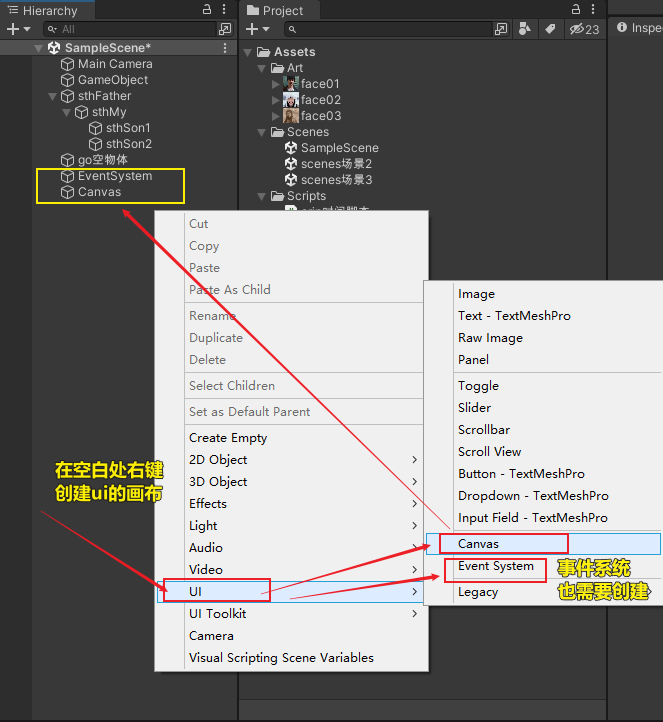

在ui画布上, 添加一个图片位

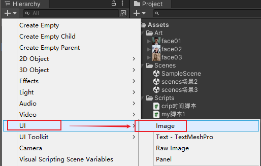

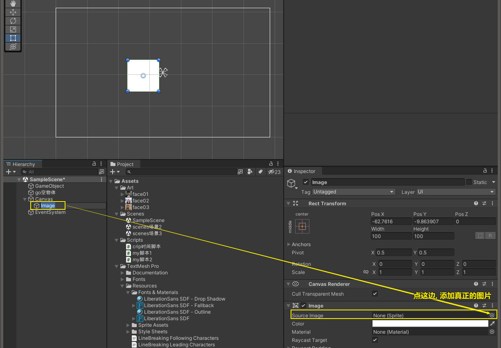

首先我们要注意画布的缩放设置:

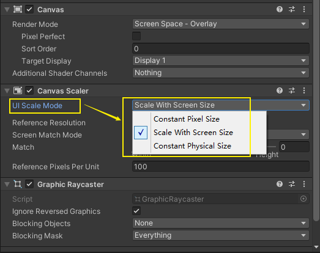

ui缩放模式, 有三个选项:

Canvas Scaler 有如下属性：
UI Scale mode：

其中Constant Pixel Size ：
连续的像素大小，这也就意味着，你布局的UI元素 都是实际的大小，比如你在当前分辨率界面上建了一个50px * 50 px 那么当你的分辨率变大时，你就要重新设置，不然50 * 50 在新的分辨率下 就会非常 难看。
*而且这个是像素大小，即使没有改变分辨率，在不同设备上（像素大小可能不同）的表现也有可能很诡异。*

*Scale with screen size*（主要说明就这个进行）：
*和屏幕大小一起缩放， 这个非常常用，这样就确保在不同分辨率下，当前UI 不会出现大的偏差。*

Constant physical size：
连续的 物理大小，与第一条相对，*在不同像素的设备上都会有良好的表现，比如 2cm * 2cm, 在不同设备上都会这么大。*

Reference Solution： 参考 分辨率，这个一般自己手动设置，你想要多大，就设置多大
这里使用 1600 * 900

以下详解一下 Scale Match mode，通常和上边Reference Solution 搭配使用：
*在Game视口下： Display 1 右边有一个比值，如16：10，这个就是实际的视口宽高比*，而
这个如果和我们的Reference Solution 不一样，我们要怎么做。

Match wide or height（匹配宽或高）：
出现滚动条， 左宽右高， 滚动条的数值代表 宽，高的权重，0 代表宽优先，1代表高优先
0.5代表双方权重一样，一起缩放。

Expand（扩张）：如果视口比 小于 参考分辨率， 以5：4为例，那么视图就会将1600 * 900
扩张到1600 * 1280， 也就是宽扩张，多余的部分用蓝色填充，蓝色这个是天空盒，可以设置。
有时一侧会出现黑色，这个不是场景，一般不用理会。

Shrink（收缩）：同理。

Reference pixels per Unit（每个单位的参考像素点，多针对Sprite）：这是个默认值，只有当Sprite本身没有Reference pixels per Unit这个属性时才会使用，否则Sprite本身的属性会覆盖掉默认值。 默认100
用处：我们设计了一个 2单位 * 2（单位）（单位通常是图片设计者指定的）的Sprite,然后没有设置这个属性，Unity就会把它变为200px * 200px 的Sprite。

我们要做的就是:

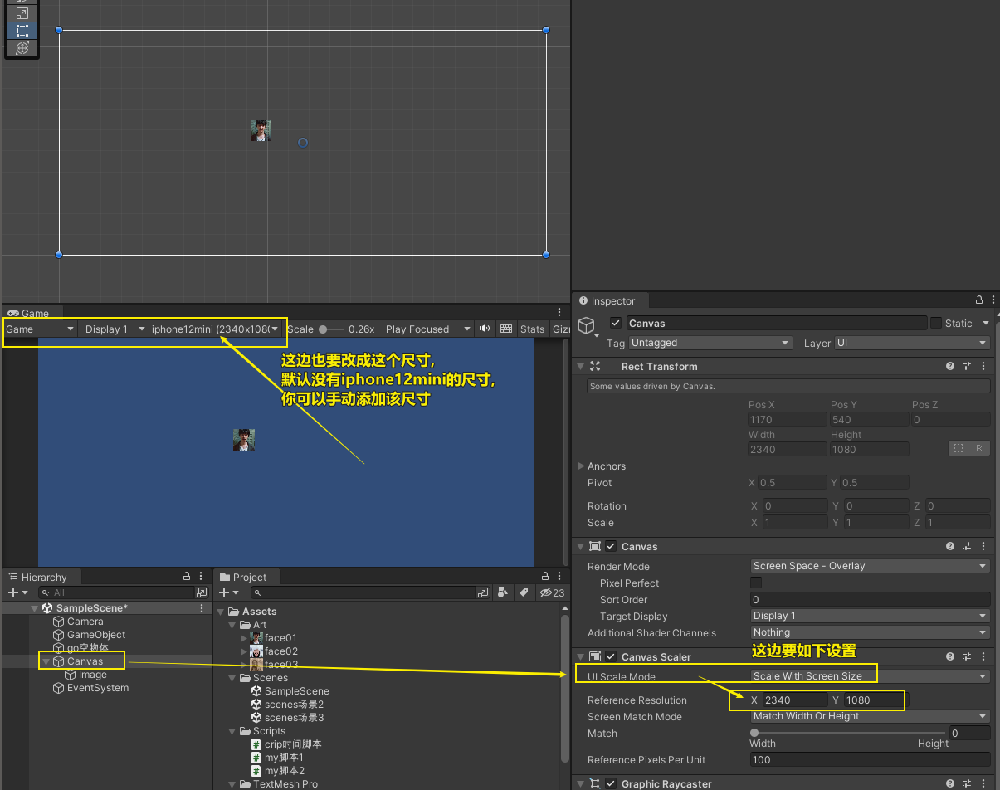

'''

== 锚点(等于坐标原点(0,0))

图像的锚点, 其实是它父物体上的东西

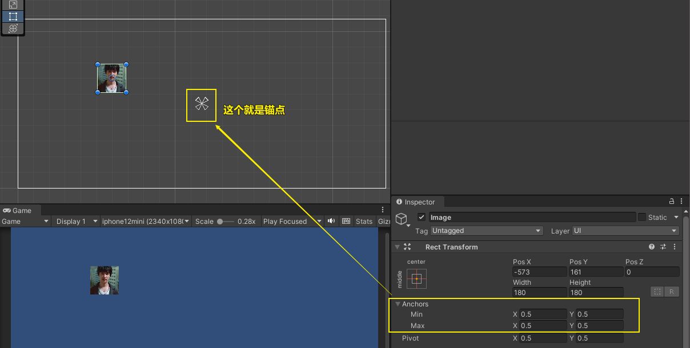

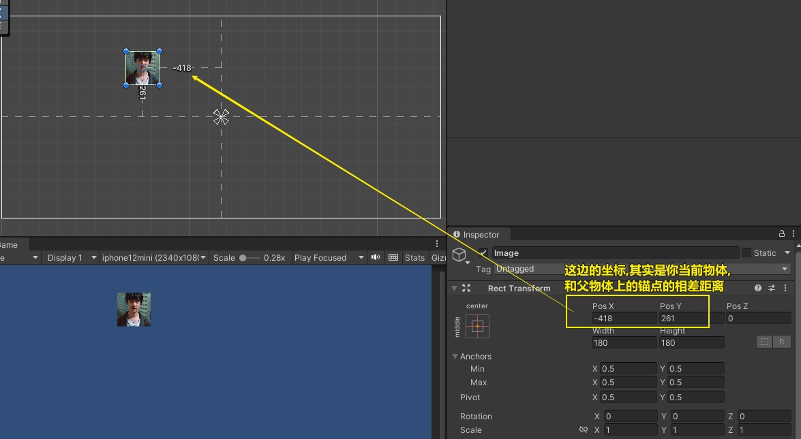

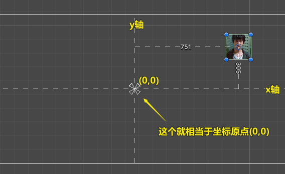

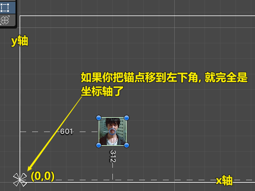

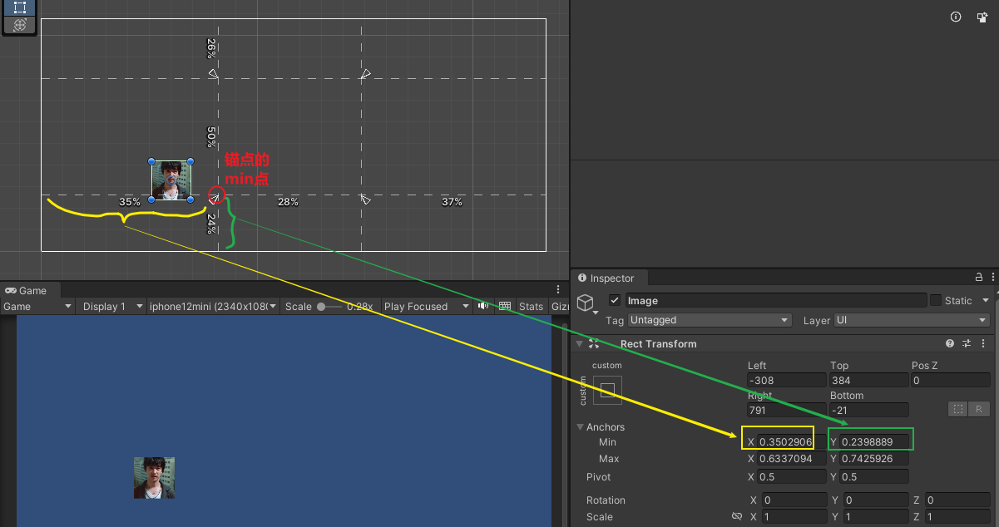

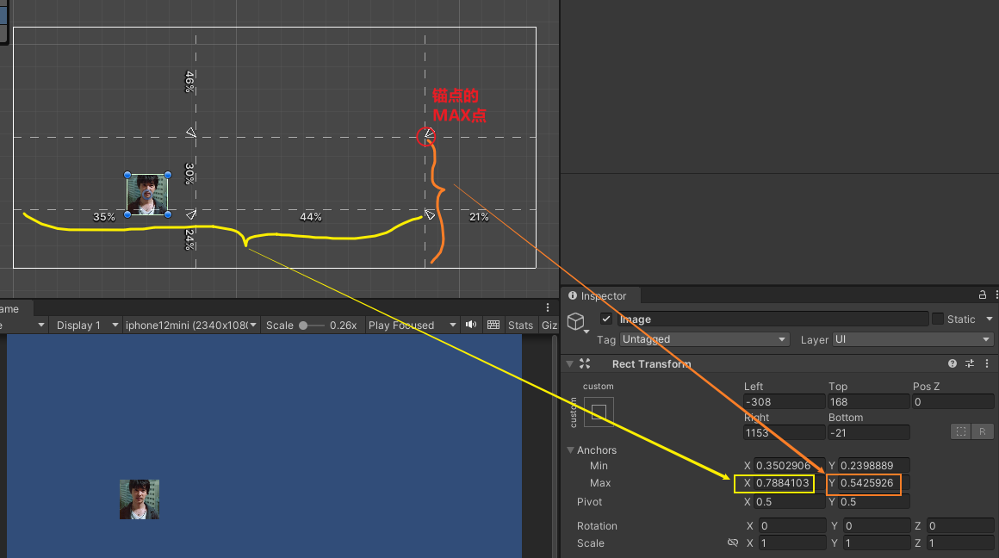

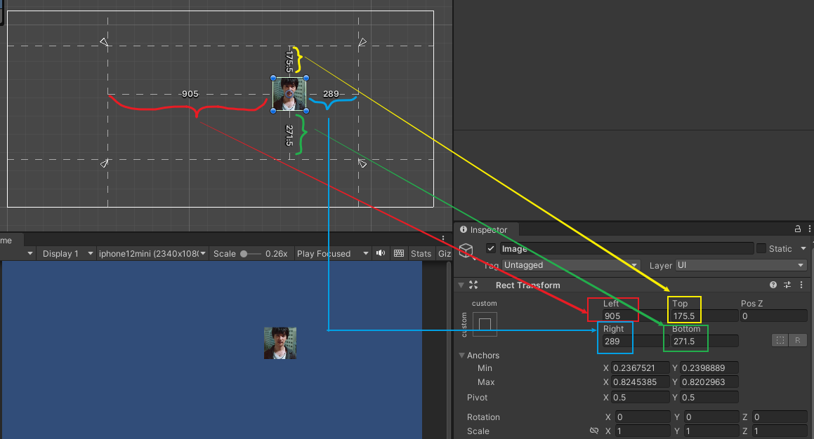

'''

== 轴心点

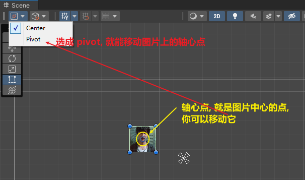

图片的缩放, 旋转, 都是以"轴心点"为中心点的.

'''

== ★ 让文本能显示出中文

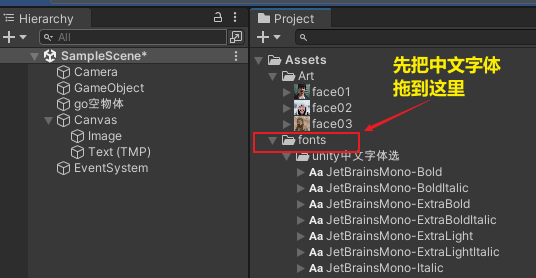

选中一个中文字体. 右键

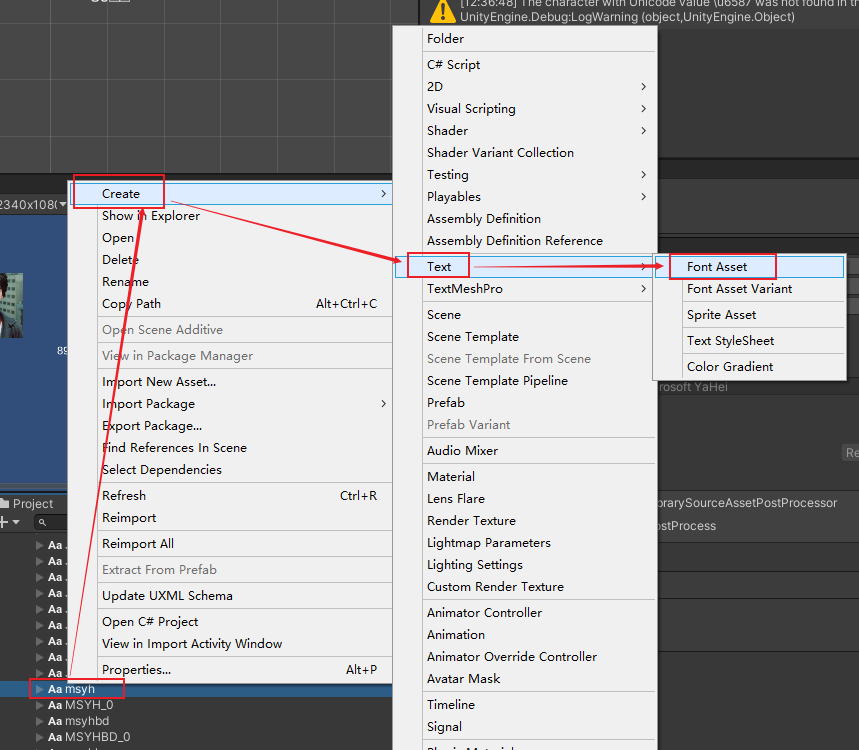

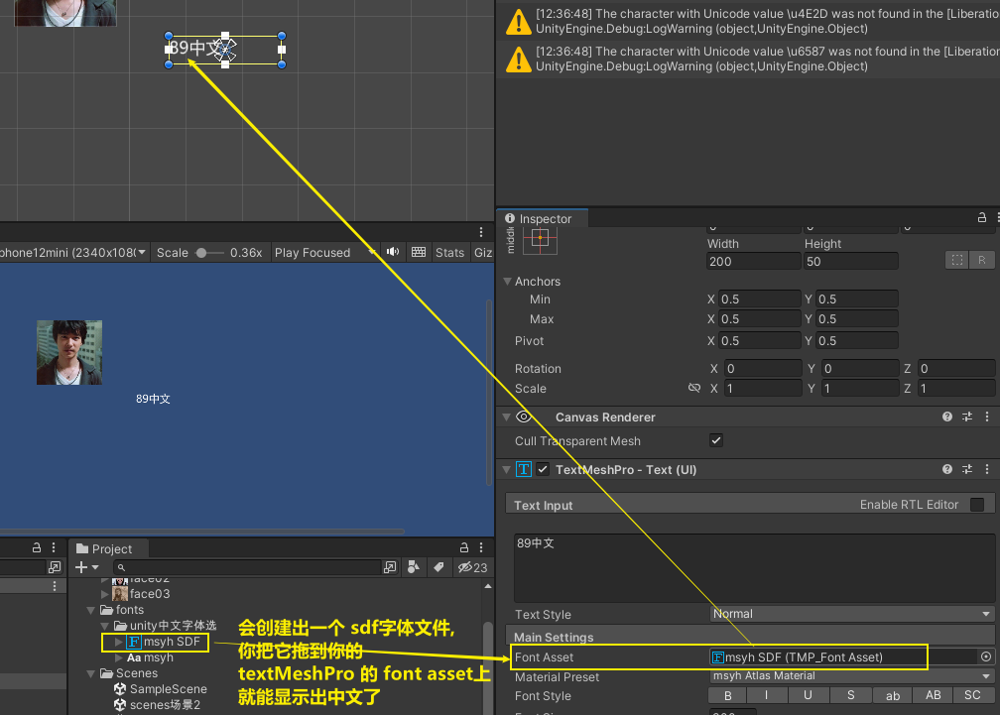

'''

== 按钮

用按钮, 控制"文本框"中的文本内容的改变

注意: 下图说错了, c#脚步, 要挂载在"文本框上". 换言之, 点击按钮的逻辑操作, 要写在 文本框的脚本里面. 然后, 把"文本框"物体, 拖到"按钮"的 on click组件上 (即让"按钮"来管理"文本框"物体). 然后按钮就能找到"文本框"身上脚本中的 你写的"fn点击"方法. 相当于按钮会调用 "文本框"脚本中的方法.

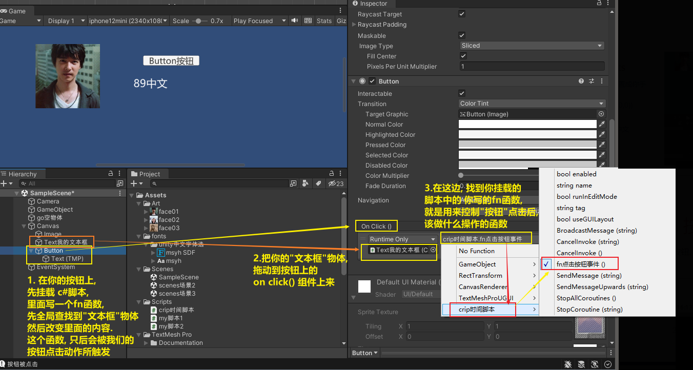

挂载在按钮上的脚步, 内容如下:

[,subs=+quotes]
----
using System.Collections;
using System.Collections.Generic;
using TMPro;
using UnityEngine;
using UnityEngine.SceneManagement;

public class crip时间脚本 : MonoBehaviour {

    // Start is called before the first frame update
    void Start() {

    }

    // Update is called once per frame
    void Update() {

    }

    *public void fn点击按钮事件()* {
        *GameObject go文本框 =  GameObject.Find("Text我的文本框");* //先全局找到你要用本函数, 控制的物体, 即"文本框"物体
        *TMP_Text tmp输入框 = go文本框.GetComponent<TMP_Text>();* //获取"文本框"物体身上的"TextmeshPro_Text"组件
        *tmp输入框.text = "按钮被点击333";* //修改该组件里的文本内容, 即文本框里的内容.

    }
}
----

'''
== UGUI 调整物体上下图层顺序

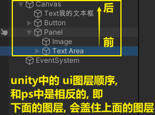

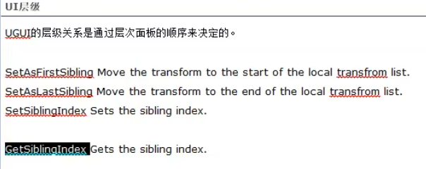

- SetAsFirstSibling()  //设置到最底层
- SetAsLastSibling()  //设置到最顶层
- SetSiblingIndex() //设置到指定层

