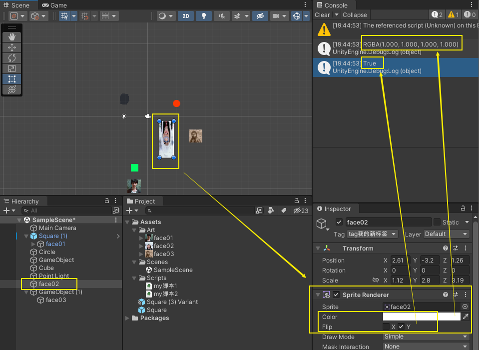
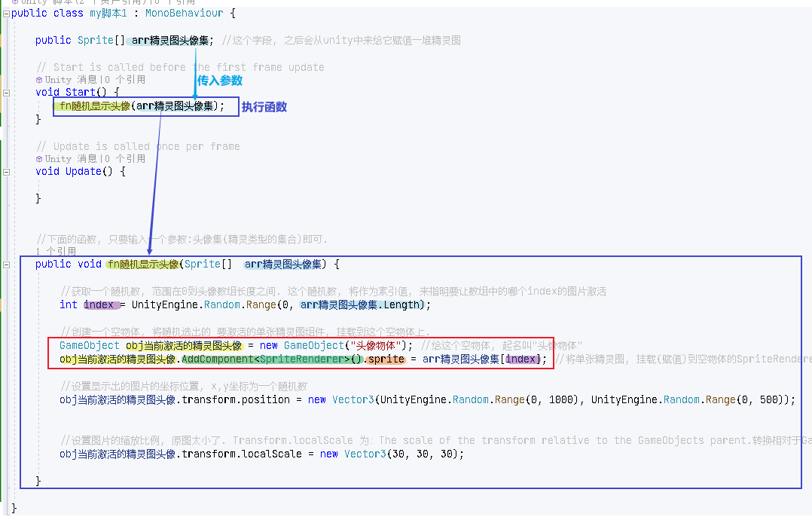
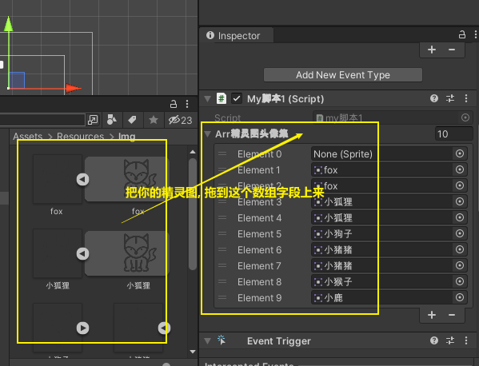
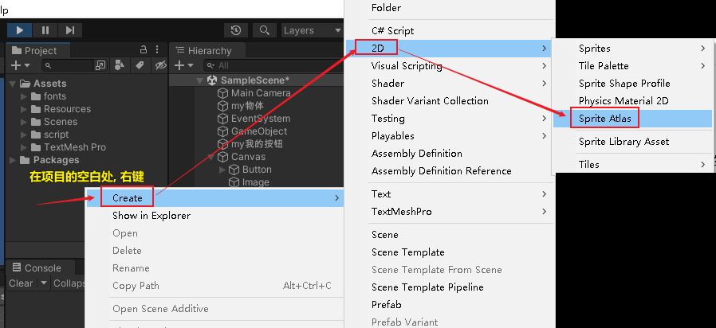
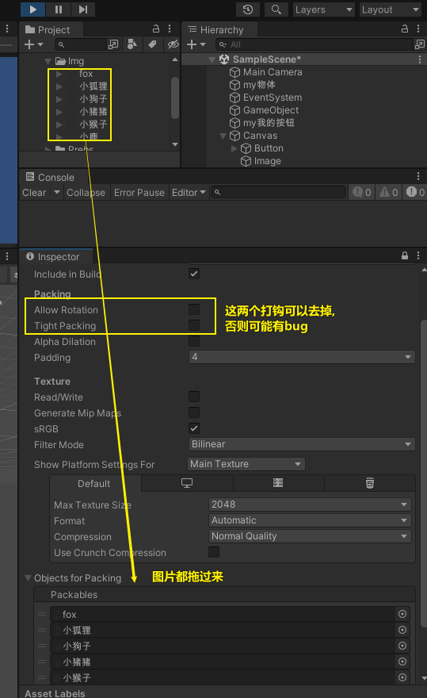

= 精灵图片
:sectnums:
:toclevels: 3
:toc: left
''''

== 代码控制

==== 获取图片身上的颜色, 及翻转等信息

[,subs=+quotes]
----
// Start is called before the first frame update
void Start() {
    //拿到当前脚本所挂载的游戏物体实例
    GameObject ins = this.gameObject;

    //获取 本图片实例身上的 SpriteRenderer 组件
    *SpriteRenderer insSp = ins.GetComponent<SpriteRenderer>();*
    Debug.Log(*insSp.color*); //拿到 SpriteRenderer 组件实例身上的 颜色属性
    Debug.Log(*insSp.flipY*); //拿到 翻转属性, y轴上是否翻转? 即图片是否上下倒置?

}

// Update is called once per frame
void Update() {

}
----

'''

==== 随机显示图片

[,subs=+quotes]
----
public class my脚本1 : MonoBehaviour {

    *public Sprite[] arr精灵图头像集; //这个字段, 之后会从unity中来给它赋值一堆精灵图*

    // Start is called before the first frame update
    void Start() {

        fn随机显示头像(arr精灵图头像集); //执行函数

    }

    // Update is called once per frame
    void Update() {

    }

    //下面的函数, 只要输入一个参数:头像集(精灵类型的集合)即可.
    public void fn随机显示头像(Sprite[]  arr精灵图头像集) {

        //获取一个随机数, 范围在0到头像数组长度之间. 这个随机数, 将作为索引值, 来指明要让数组中的哪个index的图片激活
        int index = UnityEngine.Random.Range(0, arr精灵图头像集.Length);

        **//创建一个空物体, 将随机选出的 要激活的单张精灵图组件, 挂载到这个空物体上. **
        *GameObject obj当前激活的精灵图头像 = new GameObject("头像物体"); //给这个空物体, 起名叫"头像物体"*

        *obj当前激活的精灵图头像.AddComponent<SpriteRenderer>().sprite = arr精灵图头像集[index]; //将单张精灵图, 挂载(赋值)到空物体的SpriteRenderer组件上的sprite字段中. 空物体就能显示出头像图片了.*

        //注意, 上面两句代码不过你连起来写成一句, 否则会报错, 说UnityEngine.Sprite类型 无法转换为GameObject类型. 但像现在这样分成两句写, 却没问题. 原因未知.

        //设置显示出的图片的坐标位置, x,y坐标为一个随机数
        obj当前激活的精灵图头像.transform.position = new Vector3(UnityEngine.Random.Range(0, 1000), UnityEngine.Random.Range(0, 500));

        //设置图片的缩放比例, 原图太小了. Transform.localScale 为：The scale of the transform relative to the GameObjects parent.转换相对于GameObjects父对象的比例
        obj当前激活的精灵图头像.transform.localScale = new Vector3(30, 30, 30);

    }

}
----

'''

Sprite 精灵 是一种 2D 图形对象，图形是从位图图像 Texture2D 获取的。Sprite 类主要标识应该用于特定精灵的图像部分。然后，*GameObject 上的 SpriteRenderer 组件可以使用该信息来实际显示图形。*

官方文档: +
https://docs.unity3d.com/cn/2021.1/ScriptReference/Sprite.html

运算符

- bool	该对象是否存在？
- operator !=	比较两个对象是否引用不同的对象。
- operator ==	比较两个对象引用，判断它们是否引用同一个对象。

'''

== 精灵图集

图集可以放在Resources文件夹中加载，也可以打包到AssetBundle中进行加载。

教程
https://zhuanlan.zhihu.com/p/456101373

https://www.bilibili.com/video/BV1LD4y1m7kF/?spm_id_from=333.337.search-card.all.click&vd_source=52c6cb2c1143f8e222795afbab2ab1b5

