= ui toolkit 教程2
:sectnums:
:toclevels: 3
:toc: left
''''

== 制作 ui

在工程里面, 右键, 创建一个 ui document

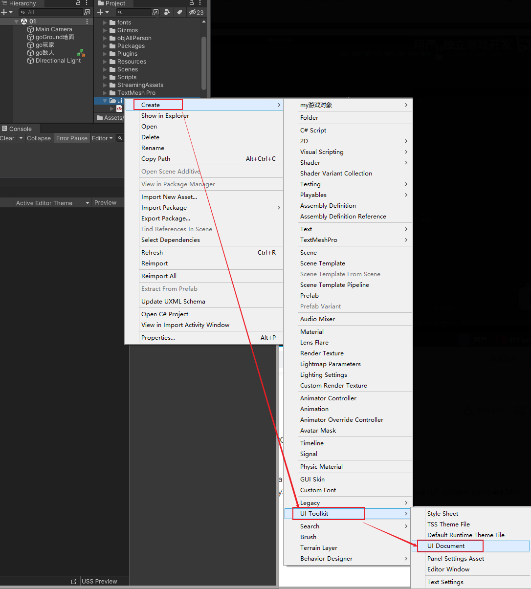

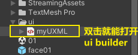

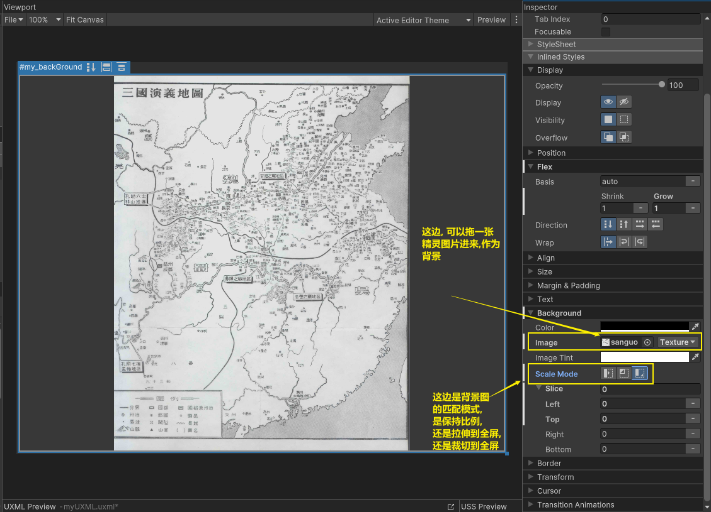

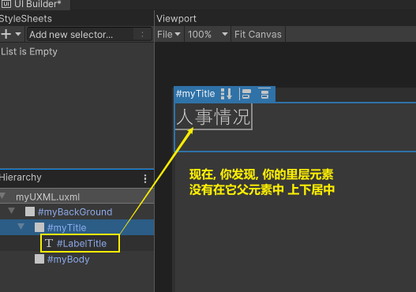

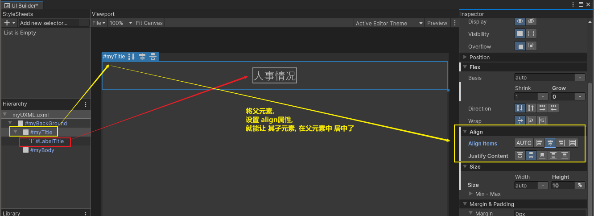

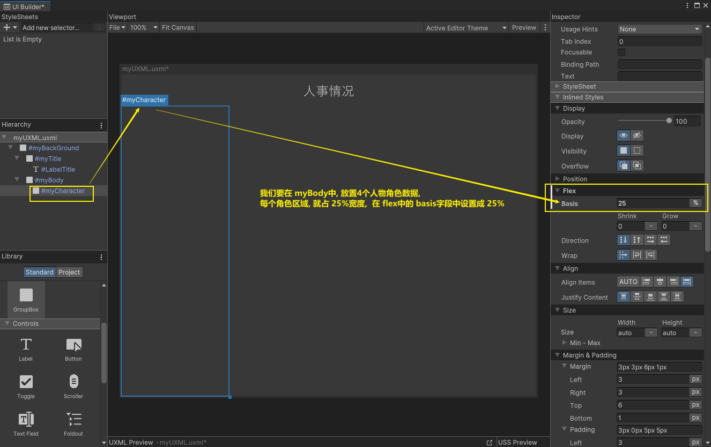

Flex Box属性中的 Flex Basis 是关于项目宽度属性设置的，这和CSS盒子模型Width属性的区别在哪？

- 如果没有设置flex-basis属性，那么flex-basis的大小, 就是项目的width属性的大小
- 如果没有设置width属性，那么flex-basis的大小, 就是项目内容(content)的大小.就是说, 当指定一个flex-basis值的时候，盒子的宽度属性被忽略了，所以我们就不需要指定盒子的宽度width属性了

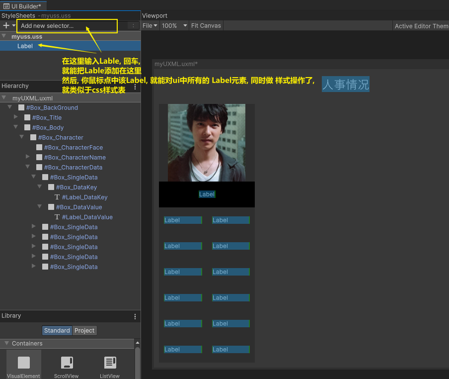

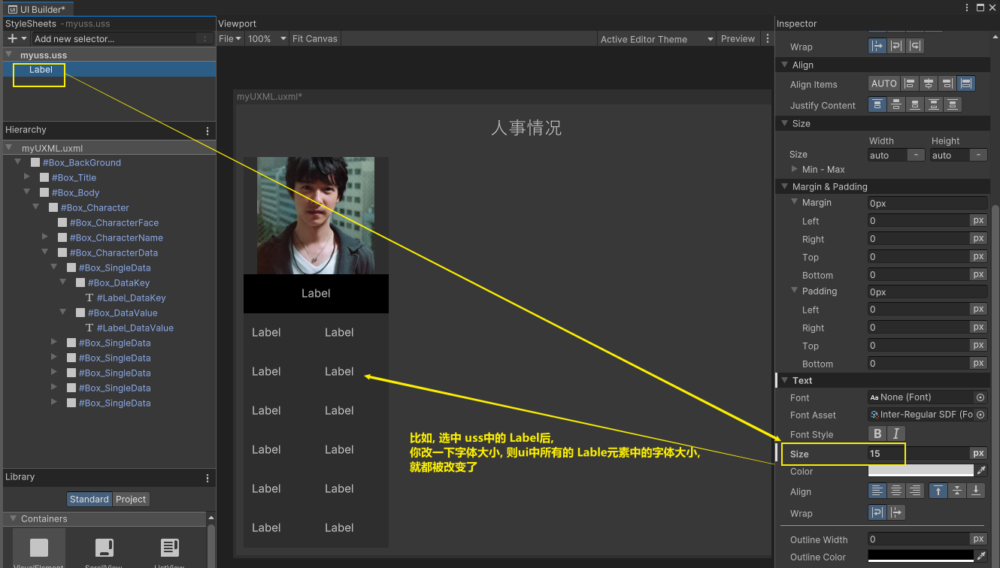

== 将 ui, 显示在游戏画面里

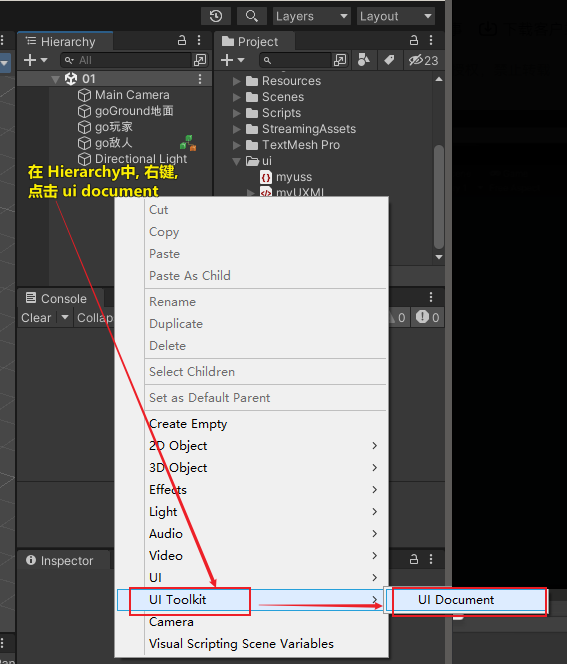

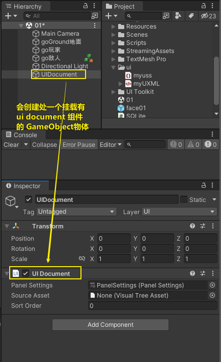

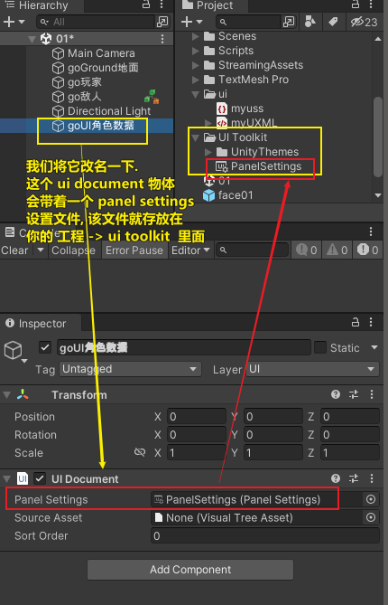

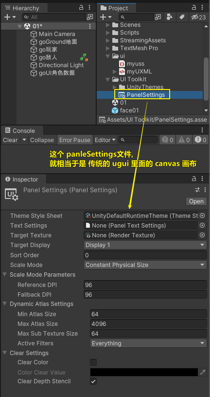

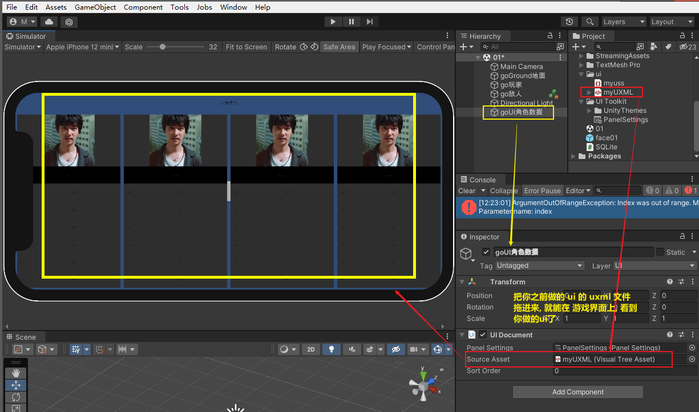

== 用鼠标点击, 来让虚拟元素隐藏或显示

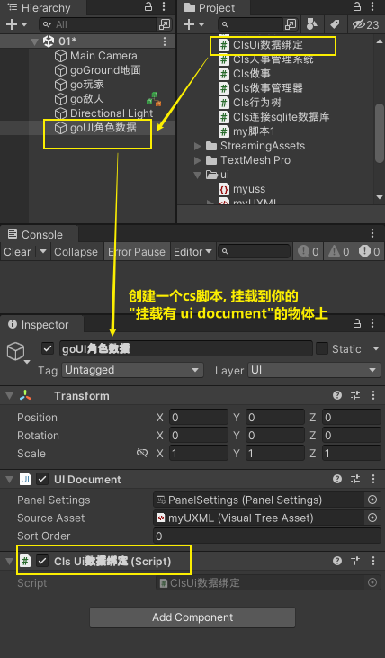

[,subs=+quotes]
----
using System.Collections;
using System.Collections.Generic;
using UnityEngine;
using UnityEngine.UIElements;

public class ClsUi数据绑定 : MonoBehaviour
{

    *VisualElement ve根节点;*

    private void Awake()
    {
        *ve根节点 = GetComponent<UIDocument>().rootVisualElement; //获取到ui中的根节点*

    }

    // Start is called before the first frame update
    void Start()
    {

    }

    // Update is called once per frame
    void Update()
    {
        *if (Input.GetMouseButtonDown(0))  //这里我只能运行成功鼠标操作, 对键盘操作却无效, 原因未知*
        {
            *if (ve根节点.style.display == DisplayStyle.Flex)* //判断, 根节点是否处于"可见"状态. 如果为可见状态, 就把根节点隐藏掉(不显示).
            {
                *ve根节点.style.display = DisplayStyle.None;*
            }
            else  //否则, 如果根节点处于隐藏状态, 就让他显示出来
            {
                *ve根节点.style.display = DisplayStyle.Flex; //DisplayStyle.Flex 就是设置uss来让节点"可见"*
            }
        }
    }
}

----

== 查找到所有的"Box_Character"节点(即虚拟元素), 并将每一个"Box_Character"虚拟元素的背景色, 改为黑色

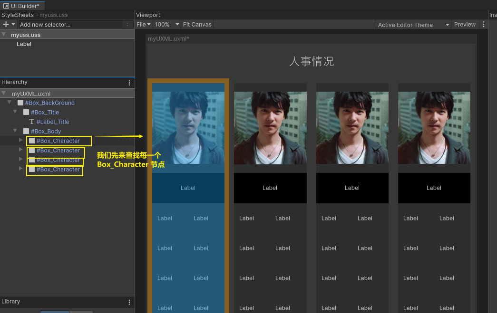

[,subs=+quotes]
----
using System;
using System.Collections;
using System.Collections.Generic;
using UnityEngine;
using UnityEngine.UIElements;

public class ClsUi数据绑定 : MonoBehaviour
{

    VisualElement ve根节点;

    private void Awake()
    {
        ve根节点 = GetComponent<UIDocument>().rootVisualElement; //获取到ui中的根节点

        //查找到所有的"Box_Character"节点, 返回一个集合
        UQueryBuilder<VisualElement> uQueryBuilder = ve根节点.Query("Box_Character"); //UQueryBuilder<T0>类型的对象是什么? : Utility Object that contructs a set of selection rules to be ran on a root visual element.

        //对查找到的所有"Box_Character"虚拟元素, 执行一个"委托变量指针指向的函数". 本例中, 该函数(即"fn委托函数指针()"), 会将每一个"Box_Character"虚拟元素的背景色,改成黑色.
        uQueryBuilder.ForEach(fn委托函数指针);

    }

    private void fn委托函数指针(VisualElement ve虚拟元素)
    {
        ve虚拟元素.style.backgroundColor= Color.black;
    }

    // Start is called before the first frame update
    void Start()
    {

    }

    // Update is called once per frame
    void Update()
    {

    }
}

----

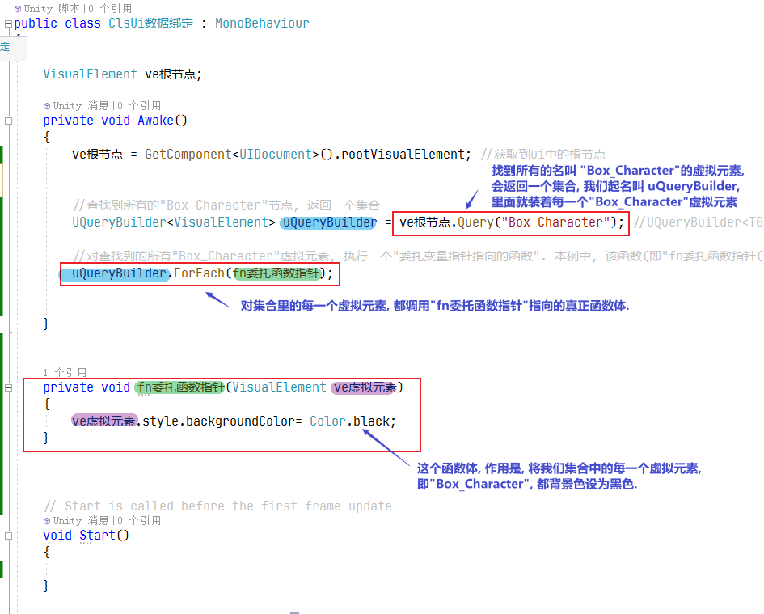

现在, 运行游戏后, 效果就是:

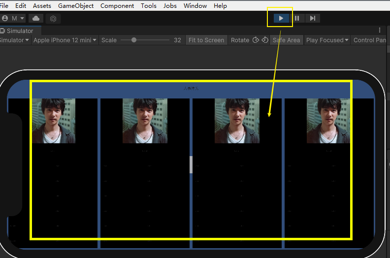

== 查找到所有名叫"Label_DataKey"的Lable节点, 将其中的文本内容, 改成 "zrx" ->  节点.Query<类型>("名字") 方法

[,subs=+quotes]
----
using System;
using System.Collections;
using System.Collections.Generic;
using UnityEngine;
using UnityEngine.UIElements;

public class ClsUi数据绑定 : MonoBehaviour
{

    VisualElement ve根节点;

    private void Awake()
    {
        ve根节点 = GetComponent<UIDocument>().rootVisualElement; //获取到ui中的根节点

        *//查找到所有名叫"Label_DataKey"的Lable节点*, 返回一个集合
        *UQueryBuilder<Label> uQueryBuilder = ve根节点.Query<Label>("Label_DataKey");*
        uQueryBuilder.ForEach(fn委托函数指针);

    }

    *private void fn委托函数指针(Label objLabel)*
    {
        *objLabel.text = "zrx";*
        objLabel.style.color= Color.white;
        objLabel.style.fontSize= 48;
    }

    // Start is called before the first frame update
    void Start()
    {

    }

    // Update is called once per frame
    void Update()
    {

    }
}

----

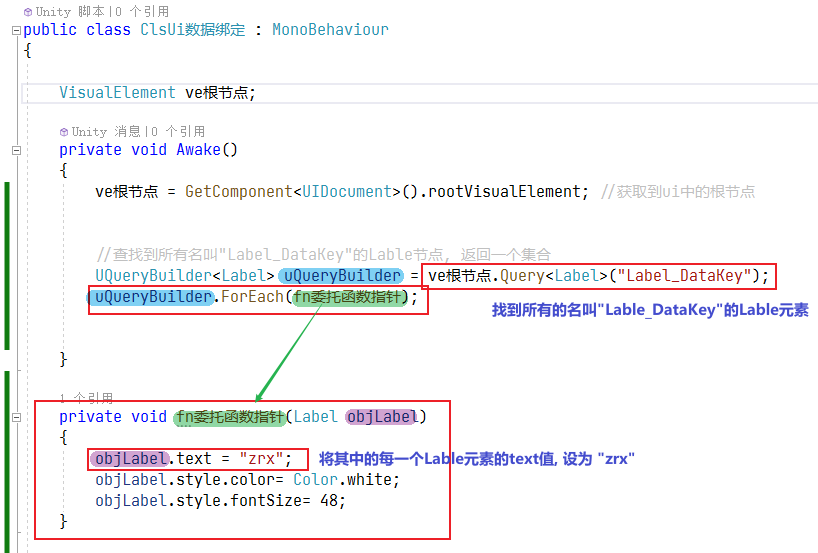

== 只查找第一个找到的虚拟元素 -> 节点.Q<类型>("名字") 方法

[,subs=+quotes]
----
using System;
using System.Collections;
using System.Collections.Generic;
using UnityEngine;
using UnityEngine.UIElements;

public class ClsUi数据绑定 : MonoBehaviour
{

    VisualElement ve根节点;

    private void Awake()
    {
        ve根节点 = GetComponent<UIDocument>().rootVisualElement; //获取到ui中的根节点

        //查找到所有名叫"Label_DataKey"的Lable节点, 返回一个集合
        UQueryBuilder<Label> uQueryBuilder = ve根节点.Query<Label>("Label_DataKey");
        uQueryBuilder.ForEach(fn委托函数指针);

        *//只查找第一个找到的名叫"xxx"的元素*
         *VisualElement veFirst =  ve根节点.Q<Label>("Label_DataKey");* //Q(): 返回找到的第一个VisualElement,  The first element matching all the criteria, or null if none was found.

         *veFirst.style.backgroundColor = Color.yellow;*

    }

    private void fn委托函数指针(Label objLabel)
    {
        objLabel.text = "zrx";
        objLabel.style.color= Color.white;
        objLabel.style.fontSize= 48;
    }

    // Start is called before the first frame update
    void Start()
    {

    }

    // Update is called once per frame
    void Update()
    {

    }
}

----

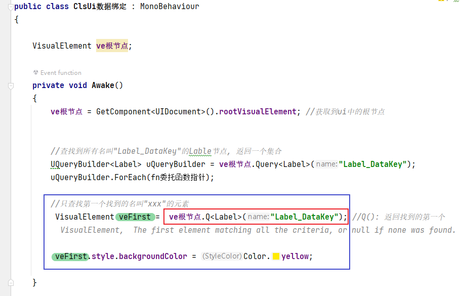

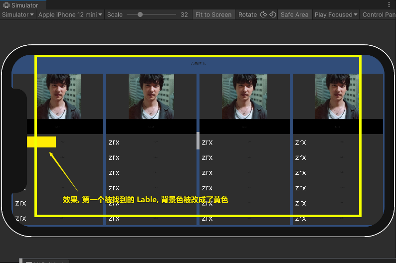

https://www.bilibili.com/video/BV1tG4y147ha/?spm_id_from=333.788&vd_source=52c6cb2c1143f8e222795afbab2ab1b5

11.20

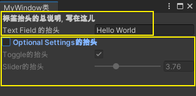

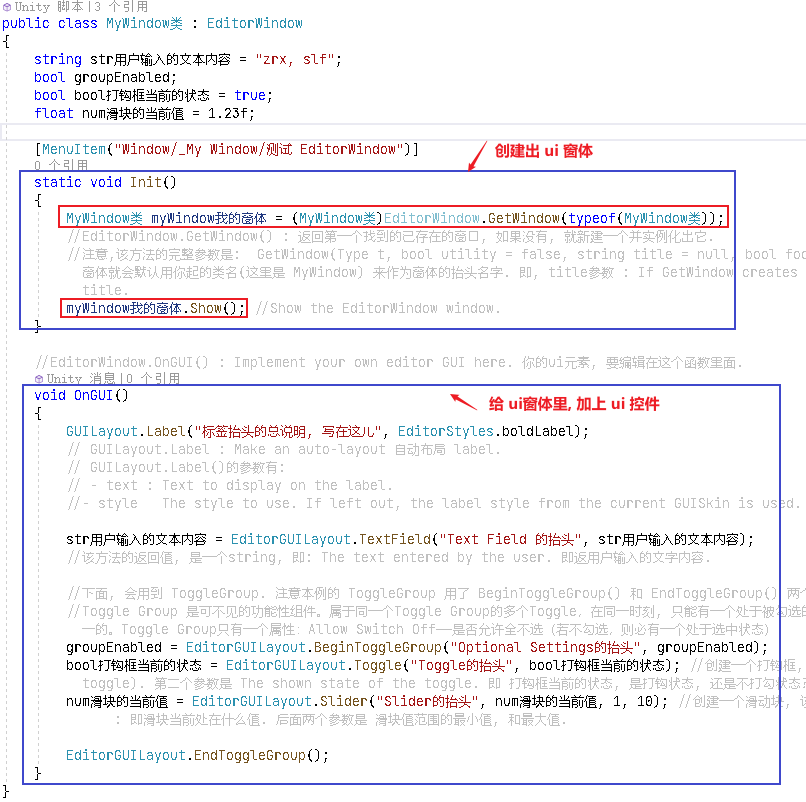

image:img/0362.png[,]

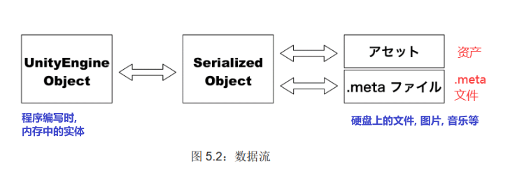

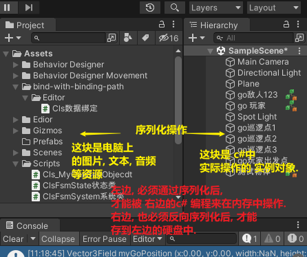

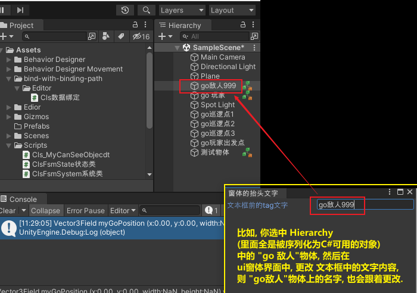

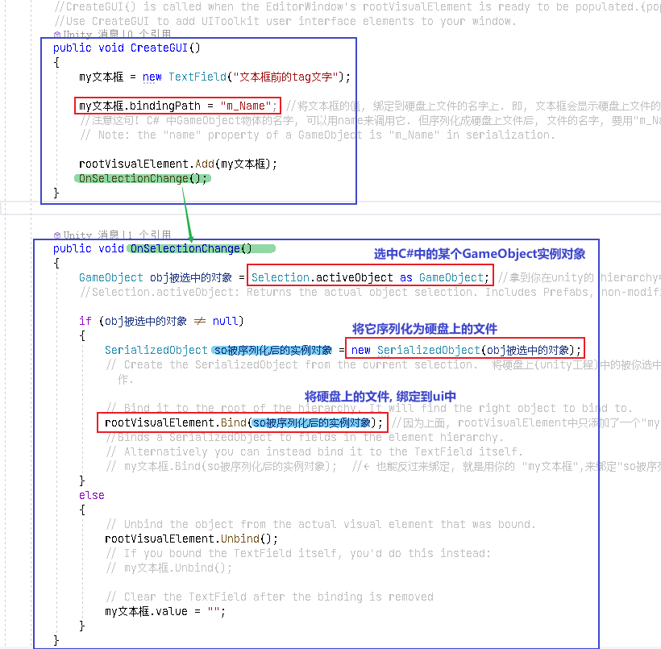

image:img/0367.png[,]

image:img/0368.png[,]

image:img/0369.png[,]

image:img/0370.png[,]

image:img/0371.png[,]

image:img/0372.png[,]

image:img/0373.png[,]

image:img/0374.png[,]

image:img/0375.png[,]

image:img/0376.png[,]

image:img/0377.png[,]

image:img/0378.png[,]

image:img/0379.png[,]

image:img/0380.png[,]

image:img/0381.png[,]

image:img/0382.png[,]

image:img/0383.png[,]

image:img/0384.png[,]

image:img/0385.png[,]

image:img/0386.png[,]

image:img/0387.png[,]

image:img/0388.png[,]

image:img/0389.png[,]

image:img/0390.png[,]

image:img/0391.png[,]

image:img/0392.png[,]

image:img/0393.png[,]

image:img/0394.png[,]

image:img/0395.png[,]

image:img/0396.png[,]

image:img/0397.png[,]

image:img/0398.png[,]

image:img/0399.png[,]

image:img/0400.png[,]

image:img/0401.png[,]

image:img/0402.png[,]

image:img/0403.png[,]

image:img/0404.png[,]

image:img/0405.png[,]

image:img/0406.png[,]

image:img/0407.png[,]

image:img/0408.png[,]

image:img/0409.png[,]

image:img/0410.png[,]

image:img/0411.png[,]

image:img/0412.png[,]

image:img/0413.png[,]

image:img/0414.png[,]

image:img/0415.png[,]

image:img/0416.png[,]

image:img/0417.png[,]

image:img/0418.png[,]

image:img/0419.png[,]

image:img/0420.png[,]

image:img/0421.png[,]

image:img/0422.png[,]

image:img/0423.png[,]

image:img/0424.png[,]

image:img/0425.png[,]

image:img/0426.png[,]

image:img/0427.png[,]

image:img/0428.png[,]

image:img/0429.png[,]

image:img/0430.png[,]

image:img/0431.png[,]

image:img/0432.png[,]

image:img/0433.png[,]

image:img/0434.png[,]

image:img/0435.png[,]

image:img/0436.png[,]

image:img/0437.png[,]

image:img/0438.png[,]

image:img/0439.png[,]

image:img/0440.png[,]

image:img/0441.png[,]

image:img/0442.png[,]

image:img/0443.png[,]

image:img/0444.png[,]

image:img/0445.png[,]

image:img/0446.png[,]

image:img/0447.png[,]

image:img/0448.png[,]

image:img/0449.png[,]

image:img/0450.png[,]

image:img/0451.png[,]

image:img/0452.png[,]

image:img/0453.png[,]

image:img/0454.png[,]

image:img/0455.png[,]

image:img/0456.png[,]

image:img/0457.png[,]

image:img/0458.png[,]

image:img/0459.png[,]

image:img/0460.png[,]

image:img/0461.png[,]

image:img/0462.png[,]

image:img/0463.png[,]

image:img/0464.png[,]

image:img/0465.png[,]

image:img/0466.png[,]

image:img/0467.png[,]

image:img/0468.png[,]

image:img/0469.png[,]

image:img/0470.png[,]

image:img/0471.png[,]

image:img/0472.png[,]

image:img/0473.png[,]

image:img/0474.png[,]

image:img/0475.png[,]

image:img/0476.png[,]

image:img/0477.png[,]

image:img/0478.png[,]

image:img/0479.png[,]

image:img/0480.png[,]

image:img/0481.png[,]

image:img/0482.png[,]

image:img/0483.png[,]

image:img/0484.png[,]

image:img/0485.png[,]

image:img/0486.png[,]

image:img/0487.png[,]

image:img/0488.png[,]

image:img/0489.png[,]

image:img/0490.png[,]

image:img/0491.png[,]

image:img/0492.png[,]

image:img/0493.png[,]

image:img/0494.png[,]

image:img/0495.png[,]

image:img/0496.png[,]

image:img/0497.png[,]

image:img/0498.png[,]

image:img/0499.png[,]

image:img/0500.png[,]

image:img/0501.png[,]

image:img/0502.png[,]

image:img/0503.png[,]

image:img/0504.png[,]

image:img/0505.png[,]

image:img/0506.png[,]

image:img/0507.png[,]

image:img/0508.png[,]

image:img/0509.png[,]

image:img/0510.png[,]

image:img/0511.png[,]

image:img/0512.png[,]

image:img/0513.png[,]

image:img/0514.png[,]

image:img/0515.png[,]

