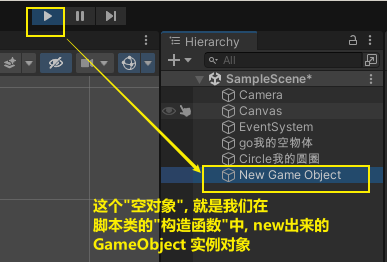
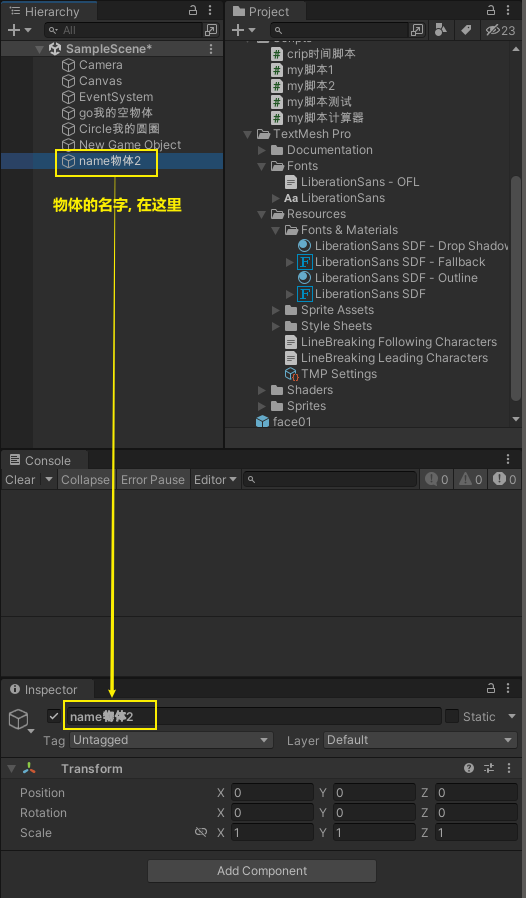
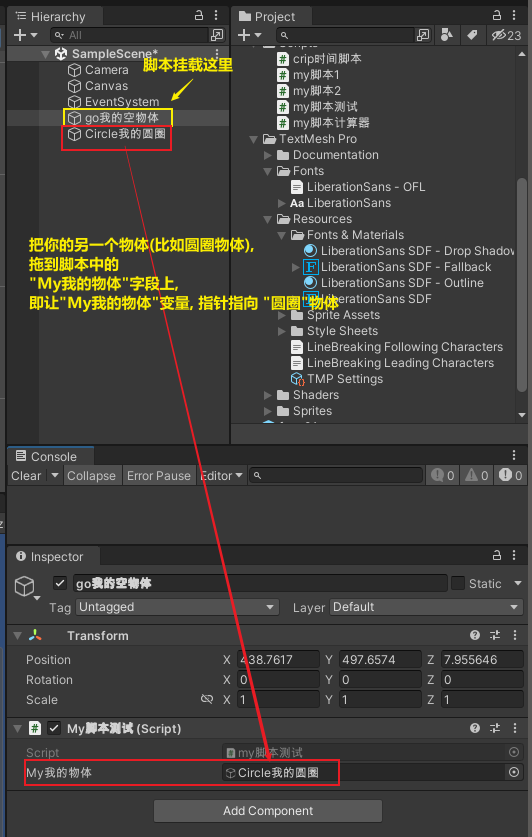
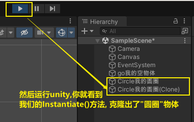
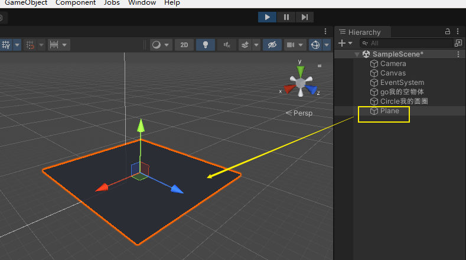

= 创建游戏物体
:sectnums:
:toclevels: 3
:toc: left

'''

== 创建物体, 方法1: 在类的构造构造函数中, new 出 GameObject类的实例

.标题
====
你在空物体上, 挂载一个脚本,然后在里面写上:
[,subs=+quotes]
----
public class my脚本测试 : MonoBehaviour {
    // Start is called before the first frame update

    void Start() {

        *GameObject my我的物体变量 = new GameObject();* //这个代码, 就是**使用本类的构造函数, 来创建出一个空的GameObject类实例.**
    }

    // Update is called once per frame
    void Update() {

    }
}
----

然后运行unity, 就能看到, 它会为我们生成一个"空对象".

====

.标题
====
[,subs=+quotes]
----
public class my脚本测试 : MonoBehaviour {
    // Start is called before the first frame update

    //public GameObject my我的物体; //在这里, 创建一个字段, 类型是GameObject类型. 然后, 你就能在unity中, 将某个物体拖动给这个字段, 让这个字段变量的指针, 指向那个物体实例了.

    void Start() {

        GameObject my我的物体变量 = new GameObject(); //这个代码, 就是使用本类的构造函数, 来创建出一个空的GameObject类实例.

        *GameObject my我的物体变量2 = new GameObject("name物体2"); //可以给个参数, 作为你new出来的这个物体的名字.*

    }

    // Update is called once per frame
    void Update() {

    }
}
----

====

'''

== 方法2: 从已有的"预制体", 或游戏中已有的物体, 克隆出新的分身物体.

你的脚本如下:
[,subs=+quotes]
----
public class my脚本测试 : MonoBehaviour {
    // Start is called before the first frame update

    *public GameObject my我的物体; //在这里, 创建一个字段, 类型是GameObject类型. 然后, 你就能在unity中, 将某个物体拖动给这个字段, 让这个字段变量的指针, 指向那个物体实例了.*

    void Start() {

        *GameObject.Instantiate(my我的物体); //Instantiate函数是unity3d中进行实例化的函数，也就是对一个对象进行复制操作的函数.*
    }

    // Update is called once per frame
    void Update() {

    }
}
----

Instantiate函数实例化, 是将original源对象的所有子物体和子组件, 完全复制，成为一个新的对象。这个新的对象, 拥有与源对象完全一样的东西，包括坐标值等。

Instantiate（）是Unity提供克隆游戏对象的方法，在游戏中应用比较广泛，而且提高了工作效率，一般常用于发射炮弹、AI敌人等一些完全相同并且数量庞大的游戏对象。

格式：

①Instantiate（GameObject）;

②Instantiate（GameObject,position,rotation）;

说明：

（1）GameObject 指生成克隆的游戏对象，也可以是Prefab预制体。

（2）position 指生成克隆的游戏对象的初始位置，类型是Vector3。

（3）rotation 指生成克隆的游戏对象的初始角度，类型是Quaternion。

'''

== 方法3:

[,subs=+quotes]
----
public class my脚本测试 : MonoBehaviour {
    // Start is called before the first frame update

    void Start() {

        *//创建游戏内置的几何物体. Primitive adj. 原始的*
        GameObject obj平面 = *GameObject.CreatePrimitive(PrimitiveType.Plane); //创建出一个平面*
        obj平面.transform.localPosition = new Vector3(3,4,5);
     }

    // Update is called once per frame
    void Update() {

    }
}

----

'''

