= 脚本组件
:sectnums:
:toclevels: 3
:toc: left
''''

== other

==== Transform 和 transform 的区别

- Transform是一个类，用来描述物体的位置，大小，旋转等等信息。
- transform是Transform类的对象，依附于每一个物体。也是当前游戏对象的一个组件(每个对象都会有这个组件)

'''

==== transform 与 gameObject 的区别

[options="autowidth"]
|===
|gameObject |transform

|当前游戏对象的实例. +
在unity中每个游戏对象都是一个gameobject. monodevelop中的 gameobject, 就代表着本脚本所依附的对象.
|当前游戏对象的transform组件

gameobject.transform,是获取当前游戏对象的transform组件. +
所以,  gameobject.transform 和 this.transform, 指向的都是同一个对象。 +
即：gameobject.transform == this.transform == transform

transform.gameobject:可以这么理解为：获取当前transform组件所在的 gameobect对象. +
所以, transform.gameobject == this.gameobject == gameobect

他们可以无限的引用下去: gameobject.transform == this.transform == gameobject.transform.gameobject.tranform == tranform.gameobect.transform
|===

'''

==== 可以通过物体身上的transform组件, 来直接获得该物体的名字.

[,subs=+quotes]
----
public class my脚本1 : MonoBehaviour
{

    //本类中, 我们定义一个字段, 用来指向游戏物体的圆圈(Circle)类型.
    public GameObject ins圆圈实例;

    // Start is called before the first frame update
    void Start()
    {
        Debug.Log(*ins圆圈实例.transform.position*.ToString()); //打印出了本类的"ins圆圈实例"字段所指向的游戏物体"my我的圆圈"的transform组件上的position位置坐标值.

        Debug.Log(ins圆圈实例.name); //打印出"my我的圆圈"
        Debug.Log(*ins圆圈实例.transform.name*); //"my我的圆圈" *← 通过物体的transform组件, 一样能拿到"挂载了该组件的物体"的名字.*

        Debug.Log(*string.Format("本类字段\"ins圆圈实例\"指向的游戏物体的名字是: {0}", ins圆圈实例.transform.name)*);  //可以这样输出

        *//但下面这样写, 却会出错!* 会提示: 无法从"string"转换为"UnityEngine.Object"
        //Debug.Log("本类字段\"ins圆圈实例\"指向的游戏物体的名字是: {0}", ins圆圈实例.transform.name);

        Debug.Log(*ins圆圈实例.gameObject*); //my我的圆圈  ← *即会输出本类的"ins圆圈实例"字段, 所指针指向的游戏物体是哪个.*

    }

    // Update is called once per frame
    void Update()
    {

    }
}
----

'''

== class类 即 组件

==== 类中的字段, 就是组件身上的参数

比如, 你脚本中写以下字段, 权限要 public, 才能暴露给组件中. 如果是 private, 则不会暴露出来.
[,subs=+quotes]
----
public class crip时间脚本 : MonoBehaviour {

 public enum enumSex {
        male,female
    };

//下面这些类中的字段, 都会显示在该脚本的组件上
    public string name;
    public int age;
    public enumSex sex;
    public bool is是否已婚;
    public string[] arr亲密好友;

    // Start is called before the first frame update
    void Start() {

    }

    // Update is called once per frame
    void Update() {
    }
}
----

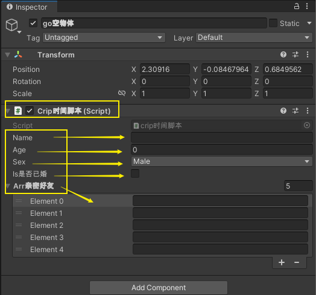

'''

==== 在字段中, 还可以有Class类型

[,subs=+quotes]
----
using System;
using System.Collections;
using System.Collections.Generic;
using TMPro;
using UnityEngine;
using UnityEngine.SceneManagement;

*[System.Serializable]*  //必须用这个标签, 来放在你的"Class类"前面, 这样后, 这个类, 才能作为字段(的类型), 放在另一个类中.
public class ClsPerson {
    public string name;
    public int age;
    public List<string> arr亲朋友好;
}

public class crip时间脚本 : MonoBehaviour {

    *public ClsPerson insPerson;*  //使用"Class类型"的字段

    // Start is called before the first frame update
    void Start() {

    }

    // Update is called once per frame
    void Update() {

    }

}

----

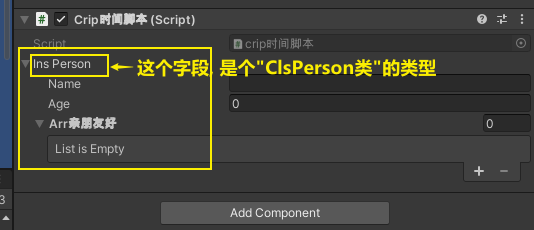

'''

==== 让 public字段, 不显示在脚本组件中; 或, 让 private字段, 显示在脚本组件中.

[,subs=+quotes]
----
public class crip时间脚本 : MonoBehaviour {

 public enum enumSex {
        male,female
    };

    public string name;

    *[HideInInspector]* //添加这个标签代码后, 就会将下面的public字段, 在脚本组件中隐藏. 不暴露出来.
    public int num存折余额;

    *[SerializeField]* //添加这个代码后, 会将即使是 private 的字段, 也在脚本组件中暴露出来. 即,只让"脚本组件"能访问到, 但别的模块访问不到.
    private string str心情日记;

    // Start is called before the first frame update
    void Start() {

    }

    // Update is called once per frame
    void Update() {

    }
}
----

'''

==== 你的类(脚本)中, 有一个字段, 指向某个游戏物体, 则, 你可以在类(脚本)中, 直接调用该字段, 来获取到它所指向的游戏物体上的属性值.

比如,

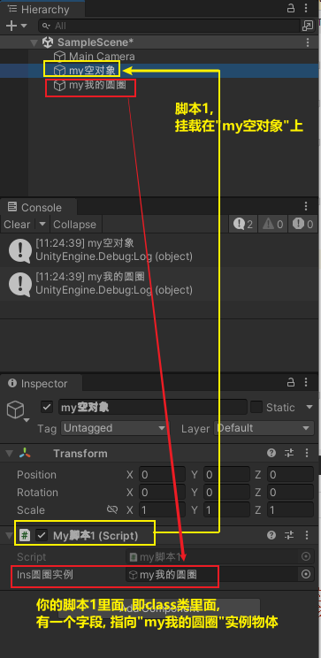

my脚本1:
[,subs=+quotes]
----
public class my脚本1 : MonoBehaviour
{

    *//本类中, 我们定义一个字段, 用来指向游戏物体的圆圈(Circle)类型.*
    *public GameObject ins圆圈实例;  //只要在unity中, 把圆圈物体, 拖到这个字段上, 就相等于是给这个字段赋值了. 这个字段就有值了.*

    // Start is called before the first frame update
    void Start()
    {
        Debug.Log(*this.name*);  *//打印出本脚本挂载的物体的名字*
        Debug.Log(*ins圆圈实例.name*); *//可以直接调用字段名, 来获取到"该字段变量"指向的"实例对象"中的属性. ← 会打印出本类字段"ins圆圈实例"所指针指向的实例对象("my我的圆圈")身上的name名字.*

    }

    // Update is called once per frame
    void Update()
    {

    }
}

----

'''

== 增

==== 添加组件(给当前物体, 添加组件)

[,subs=+quotes]
----
// Start is called before the first frame update
void Start() {
    //拿到当前脚本所挂载的游戏物体实例
    GameObject ins当前物体 = this.gameObject;

    //给我们的当前物体, 添加一个button组件.
    *ins当前物体.AddComponent<Button>();*
}
----

'''

== 删

'''

== 改

==== 更改组件上字段的值

[,subs=+quotes]
----

//先找到 Panel物体, 再获取该物体下的重孙物体, 载获取该重孙物体上的TMP_Text组件, 在给该组件上的 text字段重新赋值. 这整套动作做下来,太麻烦了
GameObject ob_Panel计算器 = GameObject.Find("Panel计算器");

UnityEngine.Transform tf输入框1 = ob_Panel计算器.transform.Find("my输入框1/Text Area/Placeholder");
TMP_Text tmp = tf输入框1.GetComponent<TMP_Text>();
tmp.text = "hello zrx";

//直接全局查找到该重孙物体,并同时找到TMP_Text组件, 直接赋值其text字段.
*GameObject.Find("Panel计算器/my输入框1/Text Area/Placeholder").GetComponent<TMP_Text>().text* = "hello slf";
----

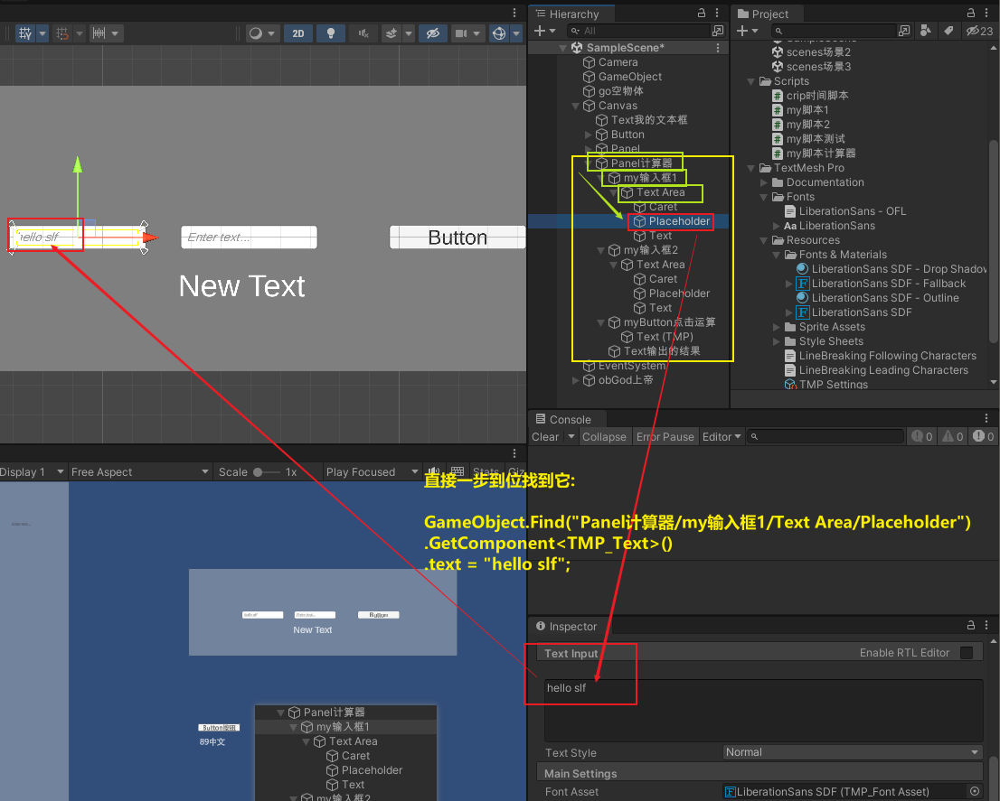

'''

==== 将物体上的脚本组件, 关闭(即不激活)

[,subs=+quotes]
----
//下面, 我们关闭"go空物体"上的"crip时间脚本".

GameObject go空物体 =  GameObject.Find("go空物体"); //先全局查找到 "go空物体"
Debug.Log(go空物体.name);

//获取到 "go空物体"身上挂载的 "crip时间脚本". *注意: 你获取的脚本, 其类型, 就是你自定义的脚本名称"crip时间脚本".*
*crip时间脚本 myScript1 =  go空物体.GetComponent<crip时间脚本>();*
*myScript1.enabled= false;* //将该脚本禁用, 即该脚本组件上, 取消掉打钩状态
----

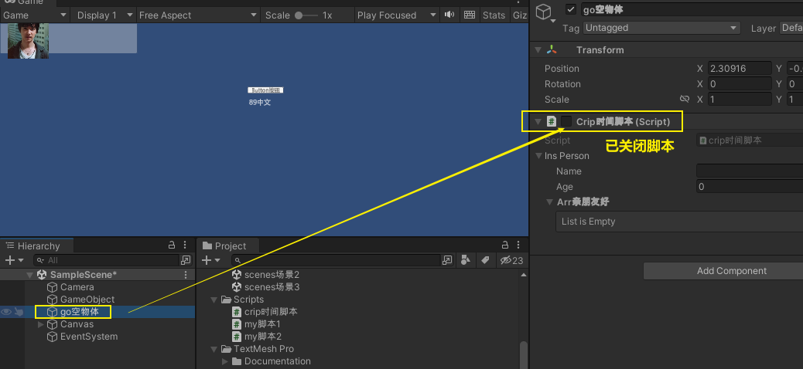

'''

==== ★ 物体在场景中的active状态

获取当前物体, & 查看组件的名称, 和是否处于激活(显示)状态. -> this.gameObject.activeInHierarchy

[,subs=+quotes]
----
    void Start()
    {
        //拿到当前脚本所挂载的游戏物体实例
        *GameObject ins = this.gameObject;* //获取当前物体

        Debug.Log(*ins.name*); //获取当前组件的"名称"
        Debug.Log(ins.tag); //获取当前组件的"tag名"
        Debug.Log(ins.layer); //获取当前组件的"layer图层索引", 注意是索引值.

        Debug.Log(*ins.activeInHierarchy*); //true  ← 判断当前实例, 是否是激活状态 (注意, 如果其父组件是不激活状态, 即使本组件激活, 该方法也会返回 false.)

        Debug.Log(*ins.activeSelf*); //← 判断当前实例, 是否是激活状态(而无关其父组件是否处在激活状态. 即, 即使其父组件不激活, 本组件是激活的, 这个方法也能返回ture. 但我没实验成功. 如果父物体被关闭, 则子物体上的输出语句直接就都没了.)
        // 即 Debug.Log(*gameObject.activeSelf*); //这个也能检测本脚本挂载的物体, 是否处于激活状态.

    }
----

'''

== 查 /遍历

==== ★★★ 获取其他物体身上的组件(即"Class类")中的字段值.

*组件(component), 其实就是你写的c#脚本的"class类".* 比如, 你有两个物体, a物体, 挂载着脚本1; b物体, 挂载着脚本2. 那么, 你可以在脚本1中, 来获取脚本2的"类"中的字段值.

.标题
====
脚本1(是个类文件. class类名就是"脚本1"), 挂载在"go我的空物体"上
[,subs=+quotes]
----
public class my脚本1 : MonoBehaviour {

    // Start is called before the first frame update
    void Start() {

       *GameObject insObGirl =  GameObject.Find("obGirl");* //先在脚本1中, 查找到挂载着"脚本2"的物体"obGirl".

        Debug.Log(*insObGirl.GetComponent<my脚本2>().name女孩名字*); //slf ← *然后, 就能获取"obGirl"物体身上的组件"my脚本2"(即 "my脚本2"类) 中的字段"name女孩名字"的值了.*

    }

    // Update is called once per frame
    void Update() {

    }
}
----

脚本2(是个类文件. class类名就是"脚本2"), 挂载在"obGirl"物体上.
[,subs=+quotes]
----
public class my脚本2 : MonoBehaviour
{
    *public string name女孩名字 = "slf"; //"my脚本2"类, 里面有个静态字段 "name女孩名字"*

    // Start is called before the first frame update
    void Start()
    {

    }

    // Update is called once per frame
    void Update()
    {

    }
}
----

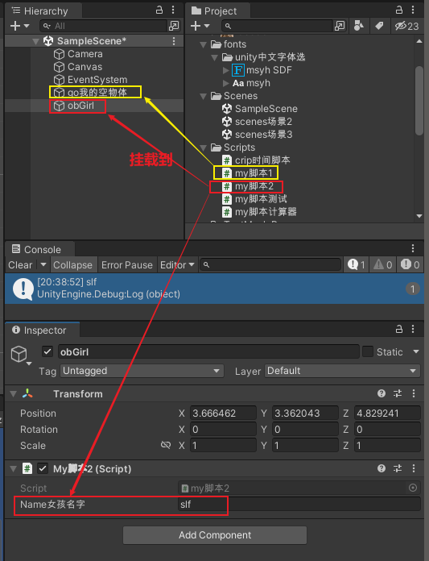

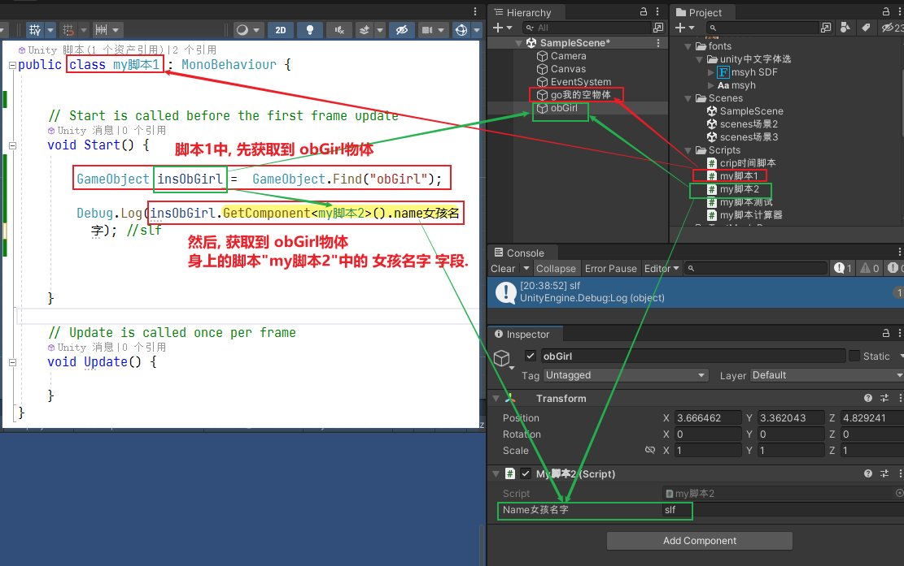

====

'''

==== ★★ 获取子物体的脚本(class类)中的字段值

挂载在n个子物体上的脚本 ClsPerson, 为;
[,subs=+quotes]
----
public class ClsPerson : MonoBehaviour
{
    *public string name姓名; //里面有两个字段*
    public int age;

    // Start is called before the first frame update
    void Start()
    {

    }

    // Update is called once per frame
    void Update()
    {

    }
}
----

父物体上的脚本为:
[,subs=+quotes]
----
public class my脚本1 : MonoBehaviour {

    // Start is called before the first frame update
    void Start() {
        *ClsPerson[] arr = this.GetComponentsInChildren<ClsPerson>(); //获取到本物体this的所有子物体身上挂载的组件(即ClsPerson类的脚本.)*

        foreach (ClsPerson p in arr) {
            Debug.Log(p.name); //注意, 这里会输出所有"子物体"的名字, 而不是子物体身上挂载的脚本类中的字段值. 事实上,子物体脚本的ClsPerson类中, 并无"name"字段.
            Debug.Log(*p.name姓名*); //成功输出子物体身上挂载的ClsPerson类中的"name姓名"字段值
            Debug.Log(p.age); //输出ClsPerson类中的"age"字段值
        }

    }

    // Update is called once per frame
    void Update() {

    }
}
----

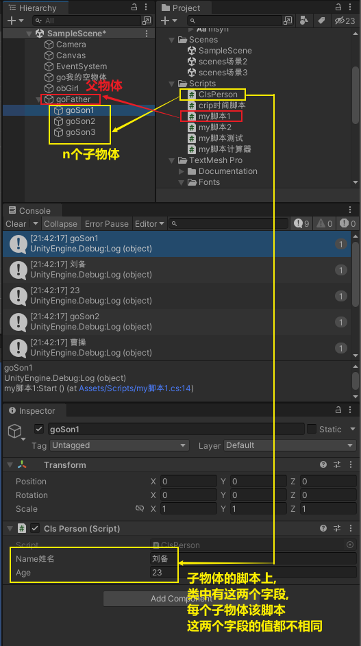

'''

==== 查看图片的 transform属性上 的信息

现在, 我们的脚步挂在 中间一层物体 sthMy 上. 它有父物体(sthFather), 也有子物体(sthSon).

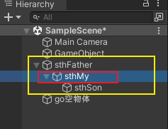

[,subs=+quotes]
----
// Start is called before the first frame update
void Start() {
    //拿到当前脚本所挂载的游戏物体实例
    *GameObject ins当前物体 = this.gameObject;*

    Debug.Log(*ins当前物体.transform.position*);
    Debug.Log(*ins当前物体.transform.localPosition*);

    Debug.Log(*ins当前物体.transform.rotation*);
    Debug.Log(ins当前物体.transform.localRotation);

    Debug.Log(*ins当前物体.transform.localScale*);

}
----

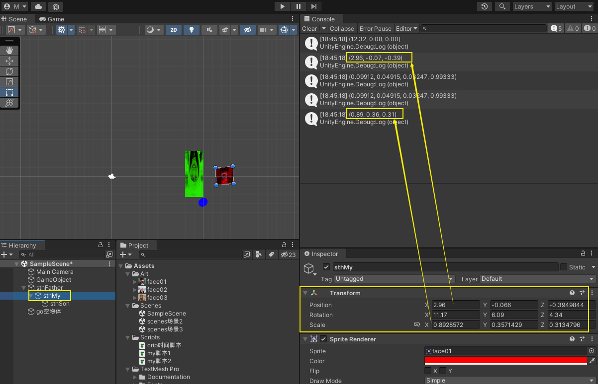

又例如

[,subs=+quotes]
----
// Start is called before the first frame update
void Start()
{
    //拿到当前脚本所挂载的游戏物体实例
    GameObject ins = this.gameObject;

    Debug.Log(ins.name); //获取当前组件的"名称"

    *Transform insTrans = ins.transform;* //拿到本组件的 "transform 属性"的实例对象. 其实: *虽然Transform组件也可以用GetCompment（）获得，但由于该组件太常见，因此可以通过transform字段 直接访问到Transform组件。* 并且，Unity为了方便，在同一物体上，从任何一个组件出发都可以直接获得其他组件，可以不需要先获得先获得游戏体。
    Debug.Log(*insTrans.position*);  //获取 transform属性中的: 世界空间中的变换位置。
    Debug.Log(*insTrans.localPosition*);  //相对于父变换的变换位置

    Debug.Log(*insTrans.rotation*); //一个 Quaternion，用于存储变换在世界空间中的旋转。
    Debug.Log(*insTrans.localRotation*); //相对于父级变换旋转的变换旋转。

    Debug.Log(*insTrans.localScale*);//相对于 GameObjects 父对象的变换缩放。

}
----

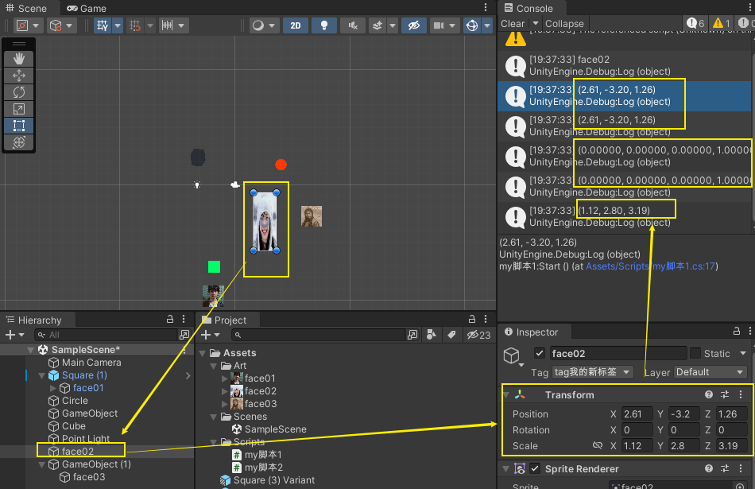

'''

==== 获取脚本类中, "某个字段"所指向的"游戏物体"下面的子物体的数量

[,subs=+quotes]
----
public class my脚本1 : MonoBehaviour
{

    //本类中, 我们定义一个字段, 用来指向游戏物体的圆圈(Circle)类型.
    public GameObject ins圆圈实例;

    // Start is called before the first frame update
    void Start()
    {
        *Debug.Log(ins圆圈实例.transform.childCount); // 有3个子物体.  ← 获取本类的"ins圆圈实例"字段所指向的游戏物体"my我的圆圈"下面的子物体的数量.*
    }

    // Update is called once per frame
    void Update()
    {

    }
}
----

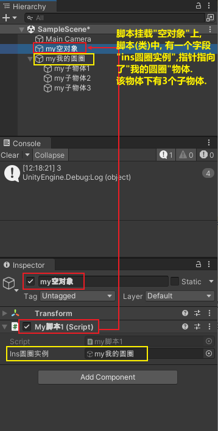

'''

==== 获取到子物体身上的transform组件中的属性

脚本, 我们就直接挂到父物体身上.
[,subs=+quotes]
----
public class my脚本2 : MonoBehaviour
{
    // Start is called before the first frame update
    void Start()
    {
        Debug.Log(*this.transform.Find("my子物体2").position*); //获取到this物体(即当前脚本所挂载的物体)下的叫做"my子物体2"的子物体 身上的transform组件中的position值. 注意: transform.Find() 只能找到所在物体的子辈, 而不包括孙辈.

        *Debug.Log(this.transform.GetChild(0).position); //获取到this物体下索引值是0的子物体 身上的transform组件中的position值.*
    }

    // Update is called once per frame
    void Update()
    {

    }
}
----

'''

