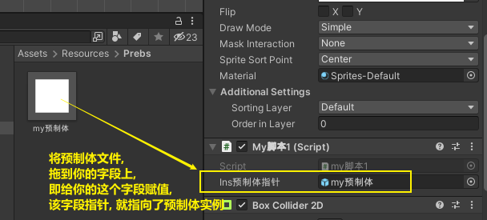

= 预制体
:sectnums:
:toclevels: 3
:toc: left
''''

== 增

==== 对预制体, 进行克隆

[,subs=+quotes]
----
public class my脚本1 : MonoBehaviour {

    *public GameObject ins预制体指针; //这个变量的值, 会在unity界面里, 将预制体拖到该字段上, 来得到赋值*

    // Start is called before the first frame update
    void Start() {

        *GameObject ins我的预制体 = GameObject.Instantiate(ins预制体指针);*

    }

    // Update is called once per frame
    void Update() {

    }

}
----

Instantiate函数实例化, 是将original源对象的所有子物体和子组件, 完全复制，成为一个新的对象。这个新的对象, 拥有与源对象完全一样的东西，包括坐标值等。

Instantiate（）是Unity提供克隆游戏对象的方法，在游戏中应用比较广泛，而且提高了工作效率，一般常用于发射炮弹、AI敌人等一些完全相同并且数量庞大的游戏对象。

格式：

①Instantiate（GameObject）;

②Instantiate（GameObject,position,rotation）;

说明：

（1）GameObject 指生成克隆的游戏对象，也可以是Prefab预制体。

（2）position 指生成克隆的游戏对象的初始位置，类型是Vector3。

（3）rotation 指生成克隆的游戏对象的初始角度，类型是Quaternion。

'''

== 删

'''

== 改

'''

== 查 /遍历

'''

