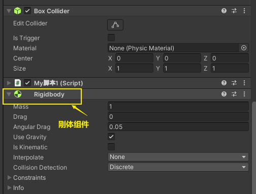
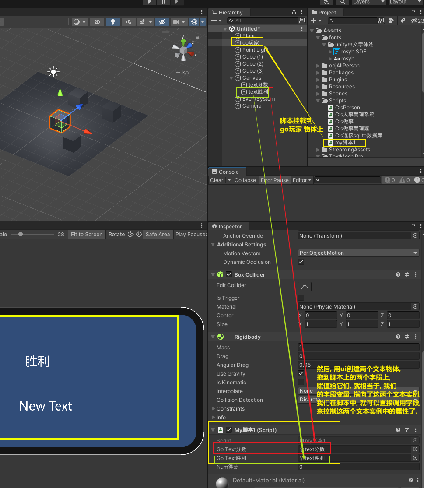

= 移动, 旋转
:sectnums:
:toclevels: 3
:toc: left
''''

== 移动

==== 给物体, 朝某坐标方向, 施加一个力, 让它朝那个方向移动

首先, 你要给物体添加一个刚体组件.

然后把下面的脚本, 挂载在该物体上, 再运行, 即可看到效果

[,subs=+quotes]
----
public Rigidbody ins刚体;

// Start is called before the first frame update
void Start()
{
    *ins刚体 = GetComponent<Rigidbody>(); //获取刚体组件*
}

// Update is called once per frame
void Update()
{
    *ins刚体.AddForce(new Vector3(10, 20, 30));* //修改该"刚体类"的实例身上的字段值
}
----

'''

== 旋转

把脚本挂载到某个物体上, 然后运行即可看到效果:

[,subs=+quotes]
----

void Update() {
    transform.Rotate(Vector3.up); //物体自转, 沿着y轴

}
----

'''

== 碰撞检测

直接写上下面的方法就行了, 不需要写在 update()里. 注意, 该方法是unity自带的, 所以不能修改它的方法名!

[,subs=+quotes]
----
//要检测碰撞, 条件：至少有一个物体有Rigidbody刚体组件，两个物体都要有Collider碰撞器组件.
private *void OnCollisionEnter(Collision collision)*
{
    Debug.Log("发生了碰撞");
}
----

'''

==== 将碰撞到的其他物体, 销毁

[,subs=+quotes]
----
//你是A物体, 所有的其他"敌人"物体, 标有tag标签为"敌人". 下面的代码, 作用是, 将你A物体所碰撞到的"敌人"物体, 销毁掉.
private void OnCollisionEnter(Collision collision)
{
    *if(collision.gameObject.tag == "敌人")* //Collision.gameObject 是 The GameObject whose collider you are colliding with. (Read Only). This is the GameObject that is colliding with your GameObject.
    {
        Destroy(collision.gameObject);
    }
}
----

官方文档 : https://docs.unity3d.com/ScriptReference/Collision-gameObject.html

'''

== 控制 ui文本中的内容

[,subs=+quotes]
----
using System.Collections;
using System.Collections.Generic;
using TMPro;
using Unity.Burst.Intrinsics;
using UnityEngine;
using UnityEngine.U2D;
using UnityEngine.UI;

public class my脚本1 : MonoBehaviour {

    *public GameObject goText分数;*
    *public GameObject goText胜利;*
    public  int num得分=0;

    // Start is called before the first frame update
    void Start() {

        *goText胜利.SetActive(false); //先把"goText胜利"这个文本物体, 取消激活(即隐藏掉). 等我们胜利了, 再来激活(显示出)它.*
    }

    // Update is called once per frame
    void Update() {

    }

    *private void OnCollisionEnter(Collision collision) //碰撞检测*
    {
        if (collision.gameObject.tag == "敌人")
        {
            Destroy(collision.gameObject);
            num得分++;
            *goText分数.GetComponent<TMP_Text>().text = $"得分:{num得分}";*
        }

        if (num得分 >= 3)
        {
            *goText胜利.GetComponent<TMP_Text>().text = $"你胜利了!!";*
            *goText胜利.SetActive(true);*
        }

    }

}

----

