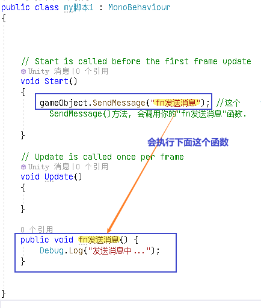
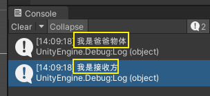

= 消息
:sectnums:
:toclevels: 3
:toc: left

'''

== 消息的发送

为了方便多个物体间的消息传达与接收，Unity中包含了几种消息推送机制 ：

[options="autowidth"]
|===
|Header 1 |当前对象（自身）所挂载的所有脚本 |父物体上的脚本 |子物体上的脚本 |其他物体上的脚本

|public void SendMessage(1.被调用目标方法的方法名, 2.传递给目标方法的参数, 3.当目标方法不存在时，是否告知开发者（是否打印错误）);
|√
|×
|×
|×

|BroadcastMessage(“函数名”, 参数，SendMessageOptions)
|√
|×
|√
|×

|SendMessageUpwards(“函数名”, 参数，SendMessageOptions)
|√
|√
|×
|×
|===

Unity与SendMessge的用法有如下三种：

SendMessage(“函数名”, 参数，SendMessageOptions) //GameObject自身的Script

BroadcastMessage(“函数名”, 参数，SendMessageOptions) //自身和子Object的Script

SendMessageUpwards(“函数名”, 参数，SendMessageOptions) //自身和父Object的Script

其中第三个参数的意义：

SendMessageOptions.RequireReceiver //如果没有找到相应函数，会报错(默认是这个状态)

SendMessageOptions.DontRequireReceiver //即使没有找到相应函数，也不会报错，自动忽略

 Unity3D中的SendMessage使用（消息推送）

https://blog.csdn.net/liulong1567/article/details/46463353

概述
Unity提供的消息推送机制可以非常方便我们的脚本开发，*它实现的是一种伪监听者模式，利用的是反射机制。*

常用函数
*关于消息推送，常用的函数有三个：”SendMessage“、”SendMessageUpwards“、”BroadcastMessage“。这些函数都是GameObject或者Component的成员函数，只要得到一个对象，然后调用它的这三个函数就可以进行一个消息的推送。*

1.SendMessage
原型：public void SendMessage(string methodName, object value = null, SendMessageOptions options = SendMessageOptions.RequireReceiver);
作用：调用一个对象的methodName函数，这个函数可以是公有的也可以是私有的，后面跟一个可选参数（此参数作为传入参数），最后面跟一个可选的设置参数（它有两个选项，后面再讲）。

2.SendMessageUpwards
原型：public void SendMessageUpwards(string methodName, object value = null, SendMessageOptions options = SendMessageOptions.RequireReceiver);
作用：它的作用和SendMessage类似，只不过它不仅会向当前对象推送一个消息，也会向这个对象的父对象推送这个消息（记住，是会遍历所有父对象）。

3.BroadcastMessage
原型：public void BroadcastMessage(string methodName, object parameter = null, SendMessageOptions options = SendMessageOptions.RequireReceiver);
作用：这个函数的作用和SendMessageUpwards的作用正好相反，它不是推送消息给父对象，而是推送消息给所有的子对象，当然，也是会遍历所有的子对象。

Unity中的SendMessage方法

本质就是调用那个GameObject里面的Script里面的函数，可以跨语言的，例如Javascript可以调用C#的函数。
如果GameObject本身有两个脚本，例如“Move1.c#”和“Move2.js”，两个脚本内有同名函数例如“DoMove()”，会两个函数都执行一次。

方法名:需要接收消息gameobject挂载脚本上的方法名，无视访问权限, 能够调用private的方法 。

参数：object类型，单值，多值传数组，同理接收方参数列表页应为数组。
//参数注意事项：就算没有对应参数列表的方法，还是会调用同名的方法，所以SendMessage不是寻找函数签名，只是寻找函数名提示信息为枚举类型：

SendMessage还有两个同类型方法
BroadcastMessage，SendMessageUpwards。
用法相同只是作用范围不同

BroadcastMessage自身脚本以及子物体挂载的脚本。
SendMessageUpwards自身脚本以及父物体挂载的脚本。

一、功能：用于向某个GameObject发送一条信息，让它完成特定功能。

1、执行GameObject自身的Script中“函数名”的函数
SendMessage ("函数名",参数，SendMessageOptions)

2、执行自身和子节点GamgeObject的Script中“函数名”的函数
BroadcastMessage ("函数名",参数，SendMessageOptions)

3、自身和父节点GamgeObject的Script中“函数名”的函数
SendMessageUpwards ("函数名",参数，SendMessageOptions)

二、SendMessageOptions参数：

提示信息可以省略不写,默认为RequireReceiver。

1、如果没有脚本接收,没有找到相应函数，会报错(默认是这个状态), 抛出异常
SendMessageOptions.RequireReceiver

2、即使没有找到相应函数，也不会报错，自动忽略
SendMessageOptions.DontRequireReceiver

**SendMessage系列用起来都比较简单，但是效率低下（见https://www.cnblogs.com/chenliyang/p/6558680.html）所以基本很少看到有人用。**对于各种架构类型SendMessage基本都比不上委托等用法，对于一些中小型不需要考虑性能的程序可以考虑使用（作为一个小型的MVC事件收发），在此不做深入研究，总体上食之无味弃之不可惜，建议小伙伴们不要使用。

缺点如下（参考https://www.cnblogs.com/FudgeBear/p/10367495.html）：
　　过于依赖反射机制(reflection)来查找消息对应的被调用函数
　　1. *频繁使用反射会影响性能*
　　2. *更会大大增加代码的维护成本 -- 字符串标识对应方法*
　　3. *无视访问权限, 能够调用private的方法* -- 若有一个是有方法在声明的类中没有被使用，那正常情况下都会把它认为是废代码从而删除，这时隐患就出现了

'''

== 给物体自己发送消息

[,subs=+quotes]
----
public class my脚本1 : MonoBehaviour
{

    // Start is called before the first frame update
    void Start()
    {
        *gameObject.SendMessage("fn发送消息"); //这个SendMessage()方法, 会调用你的"fn发送消息"函数.*
    }

    // Update is called once per frame
    void Update()
    {

    }

    *public void fn发送消息() {*
        Debug.Log("发送消息中...");
    }

}
----

'''

== 给自身的所有脚本(组件), 发送消息.

把下面两个脚本, 都挂载到同一物体上.里面写上相同的函数名. 那么执行一个, 就能都触发. +
需要注意脚本A和脚本B被挂载到了同一个游戏对象下，不是同一个游戏对象，无效。

my发送信息者
[,subs=+quotes]
----
public class my发送信息者 : MonoBehaviour
{
    // Start is called before the first frame update
    void Start()
    {
        **gameObject.SendMessage("fn爸爸物体发出信息",SendMessageOptions.RequireReceiver); **//SendMessage(), 它有三个参数，分别为“被调用目标方法的方法名”、“传递给目标方法的参数”、“当目标方法不存在时，是否告知开发者（是否打印错误）”.
                                               //即, 第一个参数就是要调用的方法名，就是响应SendMessage方法的目标方法，
                                               //第二个参数是第一个参数(即所调用的函数)可以传递进去的参数，
                                               //第三个参数是设置本次SendMessage是否需要有接收方，默认参数是需要有接收方的，如果在消息接收对象身上没有这个方法，就会报错，如果传递参数 SendMessageOptions.DontRequireReceiver 则即使接收消息的对象身上没有这个方法，也不会给你报错。
    }

    // Update is called once per frame
    void Update()
    {

    }

    *public void fn爸爸物体发出信息() {*
        Debug.Log("我是爸爸物体");
    }
}
----

my接收信息者 脚本:
[,subs=+quotes]
----
public class my接收信息者 : MonoBehaviour
{
    // Start is called before the first frame update
    void Start()
    {

    }

    // Update is called once per frame
    void Update()
    {

    }

    *public void fn爸爸物体发出信息() {*  //和发送者脚本中, 写上相同的同名方法.
        Debug.Log("我是接收方");
    }
}

----

则运行后, 两个脚本中的同名函数, 都会执行.

[options="autowidth"]
|===
|方法|说明

|SendMessage(“接收函数”，需传递的参数)
|发送给自身的所有脚本

|SendMessageUpwards(“接收函数”，需传递的参数)
|发送给自身的所有脚本, 以及自身父物体，父、父物体等身上的所有脚本

|BroadcastMessage(“接收函数”，需传递的参数)
|发送给自身的所有脚本, 以及自身子物体、子、子物体等身上的所有脚本
|===

