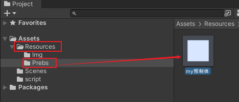
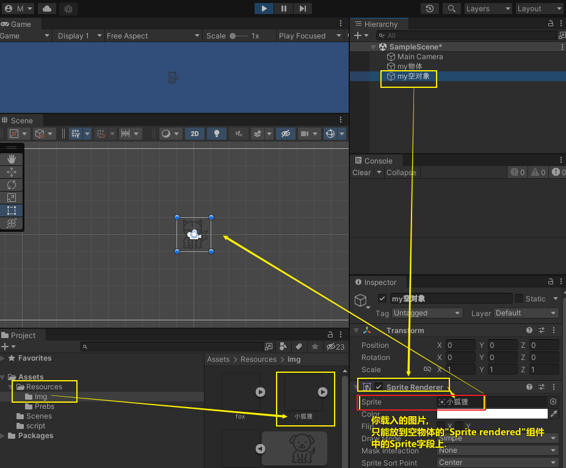
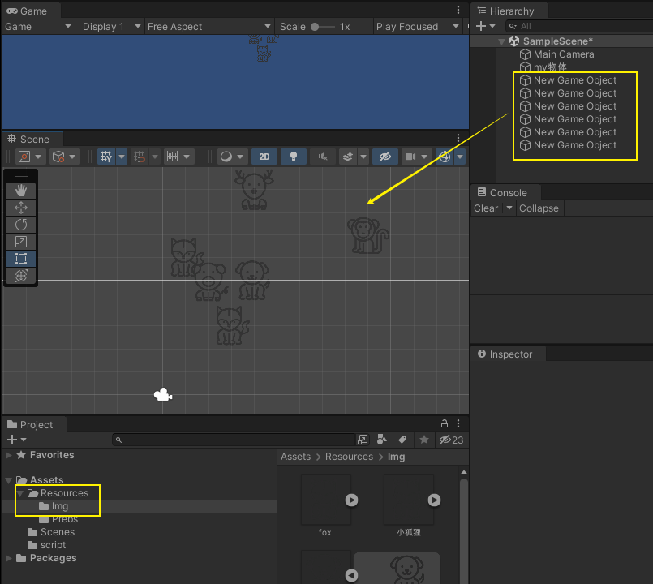

= 加载资源
:sectnums:
:toclevels: 3
:toc: left

'''

== 加载资源

Resources.Load 加载的资源必须放在  Resources 文件夹下。游戏打包时，Resources文件夹下文件会被全部压缩打包并进行加密，并且 Resources文件夹的目标将不存在，只能通过 Resources.Load 进行加载。

应用场景：

场景基本物体的加载

==== 加载预制体

把你的预制体文件, 放在 Resources/Prebs 目录下.

[,subs=+quotes]
----
//将资源加载到内存中
Object my预制体 = *Resources.Load("Prebs/my预制体", typeof(GameObject));*

//实例化它
*GameObject goMy预制体 = Instantiate(my预制体) as GameObject;*

Debug.Log(goMy预制体.transform.position);
----

'''

==== 加载图片

[,subs=+quotes]
----
string pathImg = "Img/小狐狸"; //注意, 路径要写相对于Resources目录下的相对路径. 即这里这张图片的实际路径是: Resources/Img/小狐狸.png

//先加载图片资源.
*Sprite ins精灵图片 = Resources.Load<Sprite>(pathImg);*

*//注意, 加载的精灵图片,无法直接实例化, 必须依附到一个空对象上来展示出来.*
//创建一个空对象
GameObject go空对象 = new GameObject("my空对象"); //字符串参数, 就是你给空对象起的名字.

*//将图片,添加到空对象上.*
*go空对象.AddComponent<SpriteRenderer>().sprite=ins精灵图片;*
----

Sprite Renderer是精灵渲染器，所有2D游戏中游戏资源（除UI外）都是通过Sprite Renderer让我们看到的.

即, unity中, 对2D对象的创建, 只有三种方式: +
1.直接拖入Sprite图片到hierachy窗口 +
2.右键创建Sprite +
3.*将图片, 通过空物体 添加Sprite Renderer脚本(组件)上.  我们的 Resources.Load() 代码, 就是通过这第三种方式来实现加载图片的.*

'''

==== 批量加载图片,每张图都放在一个空物体上,  并给空物体设置随机显示位置.

[,subs=+quotes]
----
string pathImg = "Img";  //所有图片的所在路径, 在Img目录下

*Sprite[] arr精灵图集 = Resources.LoadAll<Sprite>(pathImg);* //全加载进来

foreach (Sprite item in arr精灵图集) {

    GameObject ins空物体 = new GameObject();

     *ins空物体.AddComponent<SpriteRenderer>().sprite = item;*  //给空物体添加 SpriteRenderer组件, 然后图片才能添加到该组件的 sprite字段 上.

    ins空物体.transform.position =new Vector2(Random.Range(1, 10), Random.Range(1, 10)); //给空物体, 设置随机的坐标位置
}
----

再试试下面的代码

随机位置 随机时间生成敌人

[,subs=+quotes]
----
using UnityEngine;
/// 

/// 设计随机事件
/// 

public class CreatWolfs : MonoBehaviour {
    float CreatTime = 5f; //设计创造狼的时间
     GameObject Wolfs; //申请一个狼的模块

    void Update () {
        CreatTime -= Time.deltaTime;    //开始倒计时
        if (CreatTime<=0)    //如果倒计时为0 的时候
        {
            CreatTime = Random.Range(3, 10);     //随机3到9秒内
            GameObject obj = (GameObject)Resources.Load("Prefabs/WolfNormal");    //加载预制体到内存
            Wolfs = Instantiate<GameObject>(obj);    //实例化敌人
            Wolfs.transform.position = new Vector3(Random.Range(408f, 77f),21f,Random.Range(87f,397f));    //随机生成狼的位置
        }

    }
}
----

'''

