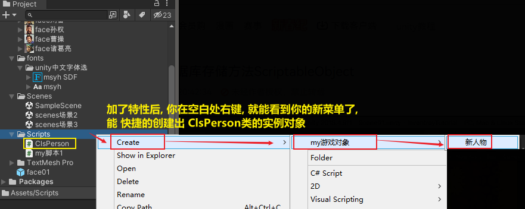

= 利用ScriptableObject实现数据持久化
:sectnums:
:toclevels: 3
:toc: left

'''

Monobehavior:每次重新打开游戏时，数据都会初始化为一开始的状态，而不会保存上一次游玩的数据。

ScriptableObject可以保存数据（在本地），即实现存档。而且它无需挂载在任何节点上，就可以生效。

*什么是ScriptableObject ?*
官方定义: *一个类，如果需要创建无需附加到游戏对象的对象时，可从该类派生。它对仅用于存储数据的资源最有用。*

首先ScriptableObject是继承Object的和MonoBehaviour一样的,但是又不一样,**MonoBehaviour是以组件形式挂在GameObject上的,而ScriptableObject则以Assets资源的形式存在的.**从官方给出的介绍大概是这样的,*如果你需要存储数据,继承ScriptableObject类或许是更好的选择,因为ScriptableObject可以存储数据,模型,shader,材质等等.*

总结就是, 在编辑器下可以保存和存储数据在本地Assets文件下,保存的数据可以共享,可以在当前整个项目进行引用或者其他项目共享,如果在真机运行情况下,是不可以操作的.

主要用途解析:

**脚本化对象就是一个数据容器，可以用来存储大量的数据，它是可序列化的，**这个特点也正决定了它的主要用途；一个主要用处就是 : 通过将数据存储在ScriptableObject对象中, 来减少工程以及游戏运行时, 因拷贝值所造成的内存占用；

关于使用ScriptableObject的优点和应用场景:

1 可以把数据真正的存储到资源文件中.

这句话最好的示例就是在Unity Editor运行的时候,常做一些运行时的修改,一般情况下**如果直接在inspector面板修改一些数据,取消运行之后, 会直接清空你运行时修改的数据,这是很麻烦的**,有经验的可能会Cope Component values 复制当前数据.**而使用ScriptableObject则可以在运行状态下动态的修改数据,取消运行之后也是运行时修改的数据.**ScriptableObject而且还有一个inspector面板,可以很好的去操作.*这里就体现到了ScriptableObject是一个assets,而MonoBehaviour这是以组件形式存在.*

2 做数据分离

这里给出一个简单的实例,例如在发射子弹的时候,子弹身上是有控制子弹运动的脚本的,而每个武器子弹是不同的,每个不同的子弹身上有不同的数据,有相同的,也有不同的.如果去创建脚本,把每个子弹的一些数据写入到当前子弹的脚本身上,大量的数据让这个脚本去实现,会越来越臃肿,不易管理,而且很多数据可能在unity Editor不断的调试,对策划是很操作的.如果把数据分离出来,去做成ScriptableObject脚本资源,而子弹脚本只需要去引用资源即可.

3 任务驱动型模块设计

任务驱动型模块设计是指在一些仿真类的开发中,经常遇到.一般在程序运行时,就在执行当前步骤所要完成的一些数据读取,**资源的加载,数据的读取和资源的加载会分离到以ScriptableObject的assets的资源文件中,在执行每次任务的时候也是通过读取资源文件的形式.**一般情况在大中型项目中会使用这种模块设计,而并不会以Res形式加载资源,因为配置资源表来的更加直观一些.附图:

通过状态机的形式控制每个资源。

4 资源被实例化之后是被引用,而不是被复制

这一点其实说的就是**MonoBehaviour痛点,每次实例化对象,都是完全复制,而非引用,对内存的消耗极大.而如果使用ScriptableObject实例化一次,他就会以资源的形式存储在asset文件中,其他地方如果使用的话直接引用就可以了.可以像Prefabs一样直接拖拽进去就可以了。**

5 可以在场景中引用,共享,在项目之间共享.

'''

[,subs=+quotes]
----
//下面, *给本类加上 CreateAssetMenu 特性. 它可以方便地为你在将本类实例化时, 设置一个快捷菜单*
*[CreateAssetMenu(fileName ="new insPerson",menuName ="my游戏对象/新人物")]*
public class ClsPerson : *ScriptableObject  //这里, 类要继承自ScriptableObject*
{
    public string name姓名;
    public int age;
    public Sprite imgFace;

    *[TextArea] //加上这个标签, 本字段就能变成多行输入框*
    public string info人物传记;

    public bool is是否活着;

    // Start is called before the first frame update
    void Start()
    {

    }

    // Update is called once per frame
    void Update()
    {

    }
}

----

image:img/0096.png[,]

再创建一个类, 专门用来管理所有的人物实例.

[,subs=+quotes]
----
*[CreateAssetMenu(fileName ="new 人事管理系统",menuName = "my游戏对象/人事管理系统")]*
public class Cls人事管理系统 : ScriptableObject //同样继承自ScriptableObject类
{
    *public List<ClsPerson> listPerson= new List<ClsPerson>(); //这个字段, 是个列表, 用来存储我们所有的人物实例.*

    // Start is called before the first frame update
    void Start()
    {

    }

    // Update is called once per frame
    void Update()
    {

    }
}
----

