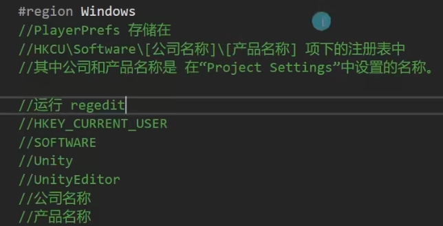
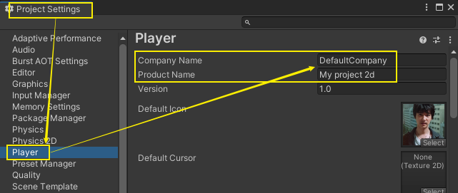
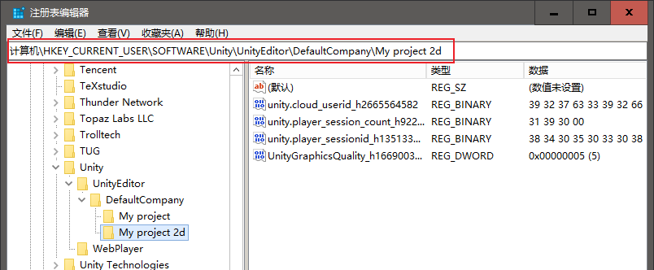

= 数据持久化
:sectnums:
:toclevels: 3
:toc: left

---

数据持久化, 就是将内存中的数据模型, 转换为存储模型,以及将存储模型, 转换为内存中的数据模型的统称.

也就是 : 将游戏数据存储到硬盘"存盘", 及, 将硬盘中数据读取到游戏中(读取存档) 的操作.

== playerPrefs

在使用unity过程中，我们经常需要将数据保存到本地，例如单机游戏的进度，分数等等。常用方法有：unity提供的PlayerPrefs、xml、json、序列化等等。

PlayerPrefs只能存储int，float，string这三种数据类型. 比较局限. 比如, 如果你想存 double类型的数据, 就只能降低精度, 转成float类型来存了.

其 key, 必须是 string类型的. 其value, 就是能放三种数据类型.

事实上, playerPrefs类, 就是个简陋版的 python的dict字典功能.

[,subs=+quotes]
----
public class my脚本1 : MonoBehaviour {

    // Start is called before the first frame update
    void Start() {

        *//PlayerPrefs类, 直接调用其set方法, 只会把数据(键值对)存到内存里.*
        *PlayerPrefs.SetInt("my年龄",19); //现在只是存到内存中.*
        // PlayerPrefs.SetFloat("my年龄",32.5f); //注意: 如果你设了两个key是同名的, 即使数值类型不同, 后面的也会覆盖掉前面的key同名的数据.
        *PlayerPrefs.SetFloat("my存款",8000.800f);*
        *PlayerPrefs.SetString("my名字", "zrx");*

        *//当游戏结束时, unity才会自动把这些数据,存到硬盘中. 但如果游戏没有正常关闭(比如bug退出,报错等), 则数据会丢失.*
        *//所以, 你想手动保存到硬盘的话, 就使用:*
        *PlayerPrefs.Save(); //将数据存到硬盘中.*

        *//运行时, 只要你set了对应的键值对, 即使没有马上存储save到硬盘中, 也能够从内存中读取出信息.*
        *int my年龄 = PlayerPrefs.GetInt("my年龄"); //读取出数据. 相当于以key取value.*
        float my存款 = PlayerPrefs.GetFloat("my存款");
        string my名字 = PlayerPrefs.GetString("my名字");

        *int myID = PlayerPrefs.GetInt("myID",-1); //如果你要读取的数据, 本身是不存在的, 则你可以设置第二个参数, 让程序一旦发现数据不存在, 就返回给你这个值作为提示. 比如, 你可以设为 -1.*
        *//如果你要读取的数据, 本身是存在的, 则unity就会忽略掉你第二个参数的值. 返回给你"数据本身存在的值".*

        Debug.Log(my名字);
        Debug.Log(my年龄);
        Debug.Log(my存款);
        Debug.Log(myID);

        *//判断数据是否存在*
        *Debug.Log(PlayerPrefs.HasKey("my名字"));* //True

        *//删除指定的键值对*
        *PlayerPrefs.DeleteKey("my存款");*
        Debug.Log(PlayerPrefs.GetFloat("my存款")); //0 ← 对于不存在的数据, get它, 会返回0

        *//删除所有的键值对*
        *PlayerPrefs.DeleteAll();*
        Debug.Log(PlayerPrefs.GetFloat("my年龄")); //0

    }

    // Update is called once per frame
    void Update() {

    }
}
----

PlayerPrefs  将数据, 存在硬盘哪里了呢?

[options="autowidth"]
|===
|Header 1 |Header 2

|Windows系统
|

打开Unity中Edit----->Project Settings---->Player

|mac系统
| 在Mac OS X上PlayerPrefs存储在～/Library/PlayerPrefs文件夹，名为unity.[company name].[product name].plist，这里company和product名是在Project Setting中设置的，相同的plist用于在编辑器中运行的工程和独立模式.On iOS, the PlayerPrefs can be found in 　　your app's plist file. It's located at:/Apps/ your app's folder /Library/Preferences/ your app's .plist
　　在Windows独立模式下，PlayerPrefs被存储在注册表的 HKCU\Software\[company name]\[product name]键下，这里company和product名是在Project Setting中设置的.在Windows编辑器模式下，PlayerPrefs被存储在注册表的 HKCU\Software\Unity\UnityEditor\　　　       [company name]\[product name]键下，这里company和product名是在Project Setting中设置的。

|Android 端
|apk安装在内置flash存储器上时，
　　PlayerPrefs的位置是\data\data\com.company.product\shared_prefs\com.company.product.xml

　　apk安装在内置SD卡存储器上时，PlayerPrefs的位置是/sdcard/Android/data/com.company.product\shared_prefs\com.company.product.xml

　　　　shared_prefs是SharedPreferences的缩写，是Android平台上一个轻量级的存储类，用来保存应用的一些常用配置，比如Activity状态，Activity暂停时，将此activity的状态保存到SharedPereferences中；当Activity重载，系统回调方法onSaveInstanceState时，再       从SharedPreferences中将值取出。SharedPreferences 可以用来进行数据的共享，包括应用程序之间，或者同一个应用程序中的不同组件。比如两个activity除了通过Intent传递数据之外，也可以通过ShreadPreferences来共享数据.Unity中通过PlayerPref来存储游戏的一些数据，特别是单机游戏。在android平台就是存储到上述位置。 另外，是否安装到sd卡可在PlayerSetting->Other Settings->Install Location 设置。
|===

