= AssetBundle
:sectnums:
:toclevels: 3
:toc: left
''''

== AssetBundle

AssetBundle 是一个压缩包文件，包含模型、贴图、预制体、声音、甚至整个场景，可以在游戏运行的时候被加载出来。

AssetBundle里面有什么? 可以归纳为两点：

1.它是一个存在硬盘的文件，可以称为压缩包。这个压缩包可以认为是一个文件夹。里面包含了多个文件。这些文件可以分为两类：

serialized file 和resource file(序列化文件和源文件)。

- serialized file ：资源被打碎放在一个对象中，最后统一被写进一个单独的文件。（只有一个）prefab,模型等.
- resource file 某些二进制资源（图片，声音）被单独保存，方便快速加载.

2.它是一个AssetBundle对象，我们可以通过代码从一个特定的压缩包加载出来的对象。这个对象包含了所有我们当初添加到这个压缩包里面的内容，我们可以把这个对象加载出来使用。

Resources 和 AB是两套不同倾向的资源管理策略，各自有适用的应用环境。

Resources可以看成一个默认加载的巨大AB，优点在于使用方便，不需要应用层维护资源依赖关系，**缺点在于对更新不友好，**内存敏感的场景下不便于细粒度控制资源的内存占用生命周期，此外还会影响游戏初始化速度。

AB可以提供更细粒度的资源控制策略，而且对于资源更新友好，但是缺点是管理麻烦，应用层需要维护依赖关系以及管理生命周期，稍不注意就容易出现资源泄露等问题。

Resources和AB之间有一条天然的鸿沟，那就是**AB无法依赖到Resources里的资源，反之亦然。**那么就带来一个问题，*如果Resources里一个资源a需要更新，除了更新这个资源a外，还需要更新依赖这个资源的资源bcde等，还要更新资源a依赖的资源xyz等，进而，bcdexyz所依赖的以及被依赖的资源都需要更新，牵一发而动全身，简直是更新的噩梦。*

**对于资源更新频繁的网游，尽可能使用AB是首选，Resources下可以放一些无需更新且启动时就需要的资源，**譬如登陆场景的loading图等，游戏启动的逻辑简洁不易出错。

*对于无资源更新的单机游戏，也需要尽可能控制Resources下的资源量，避免污染游戏启动时间。*

AssetBundle又称AB包，是Unity提供的一种用于存储资源的资源压缩包。

Unity中的AssetBundle系统是对资源管理的一种扩展，通过将资源分布在不同的AB包中可以最大程度地减少运行时的内存压力，可以动态地加载和卸载AB包，继而有选择地加载内容。

AssetBundle的优势
AB包存储位置自定义，继而可放入可读可写的路径下便于实现热更新

AB包自定义压缩方式，可以选择不压缩或选择LZMA和LZ4等压缩方式，减小包的大小，更快的进行网络传输。

资源可分布在不同的AB包中，最大程度减少运行时的内存压力， 可做到即用即加载，有选择的加载需要的内容。

AB包支持后期进行动态更新，显著减小初始安装包的大小，非核心资源以AB包形式上传服务器，后期运行时动态加载，提高用户体验。

AssetBundle和Resources的比较
AssetBundle		Resources
资源可分布在多个包中		所有资源打包成一个大包
存储位置自定义灵活		必须存放在Resources目录下
压缩方式灵活(LZMA,LZ4)		资源全部会压缩成二进制
支持后期进行动态更新		打包后资源只读无法动态更改

AssetBundle的特性
AB包可以存储绝大部分Unity资源但无法直接存储C#脚本，所以代码的热更新需要使用Lua或者存储编译后的DLL文件。

AB包不能重复进行加载，当AB包已经加载进内存后必须卸载后才能重新加载。

多个资源分布在不同的AB包可能会出现一个预制体的贴图等部分资源不在同一个包下，直接加载会出现部分资源丢失的情况，即AB包之间是存在依赖关系的，在加载当前AB包时需要一并加载其所依赖的包。

打包完成后，会自动生成一个主包(主包名称随平台不同而不同)，主包的manifest下会存储有版本号、校验码(CRC)、所有其它包的相关信息（名称、依赖关系）

'''

== 安装 AssetBundles-Browser

要用到官方的工具: AssetBundles-Browser

下载地址:
https://github.com/Unity-Technologies/AssetBundles-Browser

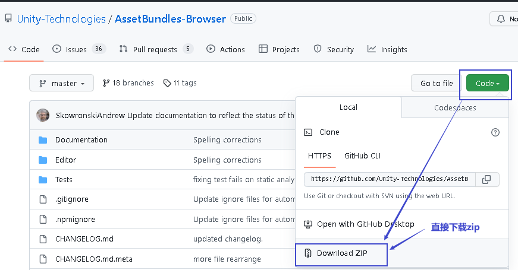

把下载下来的这个zip文件, 解压, 把文件夹直接拖到 你项目的Packages文件夹下.

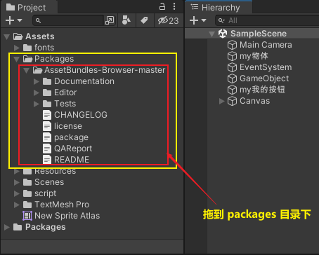

然后, 就可以在  Windows -> AssetBundle Browser 菜单中看到了. (如果没看到, 就重启 unity)

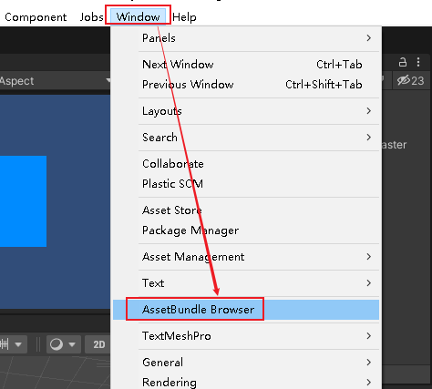

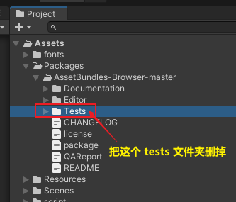

'''

== 生成 AB包

Configure面板 ：能查看当前AB包及其内部资源的基本情况（大小，资源，依赖情况等）

Build面板：负责AssetBundle打包的相关设置 按Build即可进行打包

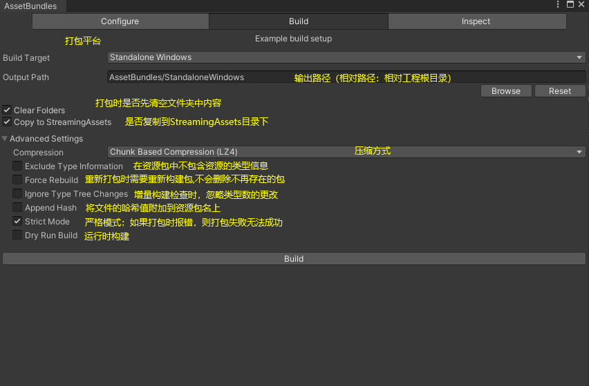

三种压缩方式:

- NoCompression:不压缩，解压快，包较大，不建议使用。
- LZMA: 压缩最小，解压慢，用一个资源要解压包下所有资源。
- LZ4: 压缩稍大，解压快，用什么解压什么，内存占用低，一般建议使用这种。

一般需要进行更改的设置即为图中勾选的相关选项设置。

Inspect面板：主要用来查看已经打包后的AB包文件的一些详细情况（大小，资源路径等）

3、设置资源所属的AssetBundle包

在需要打包的资源的Inspector面板下方即可选择其应放在哪个AB包下，也可通过New新建AB包将资源放入，放入后再次Build打包即可将此资源打入相应的AB包中。

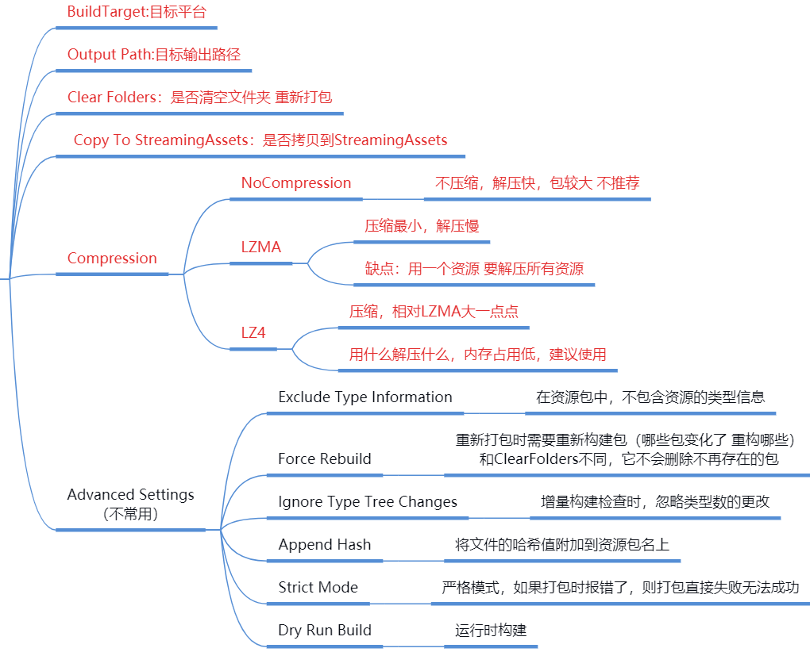

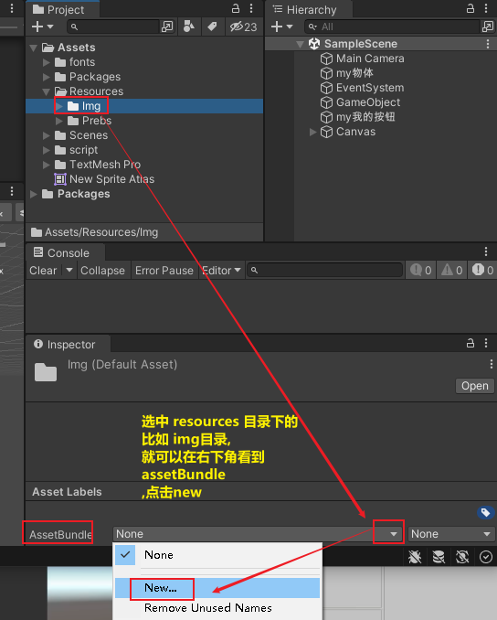

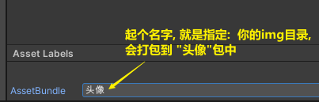

然后就能看到:

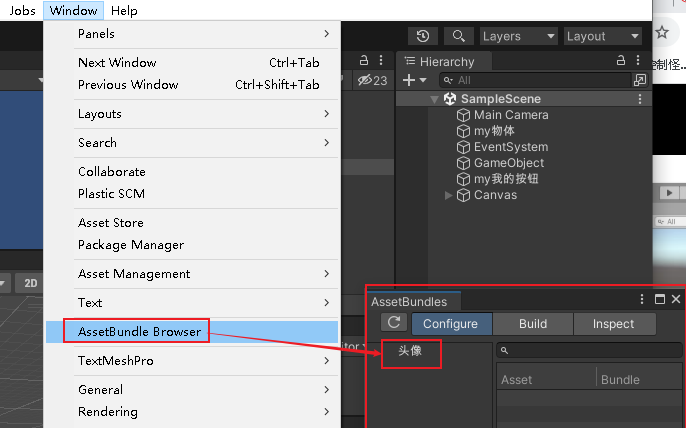

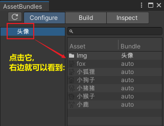

重复刚才的操作, 你就可以把不同的资源, 关联到不同的"你起名字的包"里面.

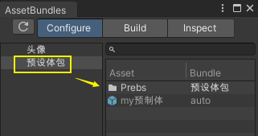

注意: c# 脚本, 是无法被打包到 AB包里的.

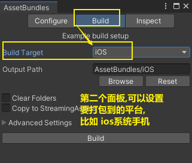

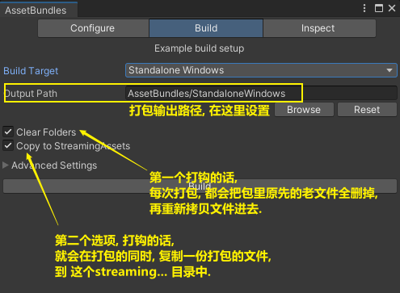

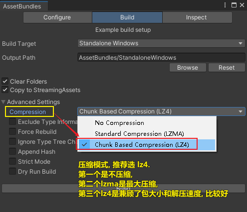

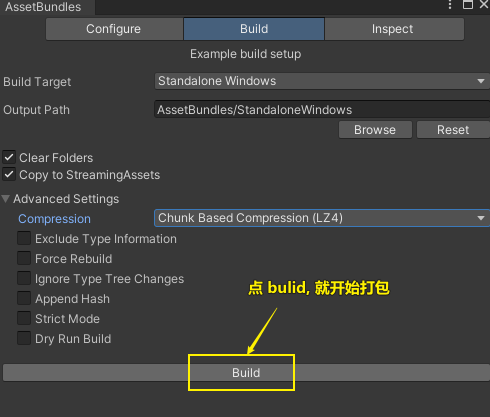

对中文字体的打包, 是最慢的.

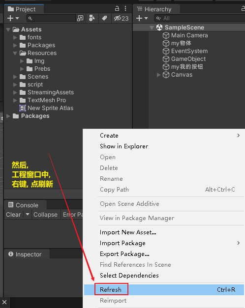

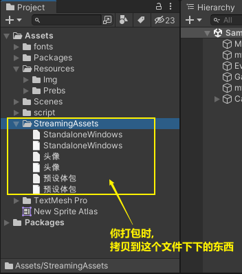

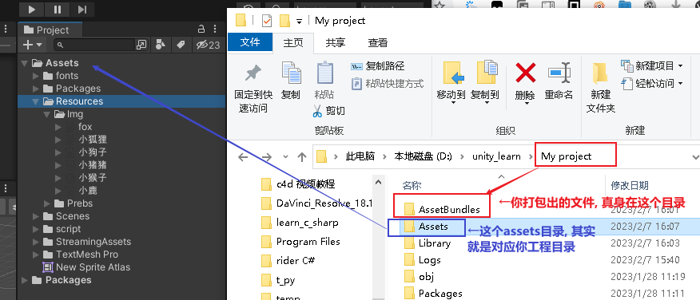

== 载入 AB 包

[,subs=+quotes]
----
//第1步:加载AB包
*AssetBundle ab包 = AssetBundle.LoadFromFile(UnityEngine.Application.streamingAssetsPath + "/" + "头像");* //因为我们的包, 同时拷贝到了streamingAssetsPath目录下, 所以,本例,  我们就加载这个目录中的包文件, 即"头像"包.

//第2步: 加载AB包中的资源
*GameObject go对象 = ab包.LoadAsset<GameObject>("小猴子.png");*  //指定LoadAsset()方法, 加载的是GameObject类型的东西.

//上面的代码, 也可以写成这种形式 : GameObject go对象2 = ab包.LoadAsset("小猴子", typeof(GameObject)) as GameObject;

//将加载出来的包里的资源, 实例化到屏幕上
*Instantiate(go对象);*
----

