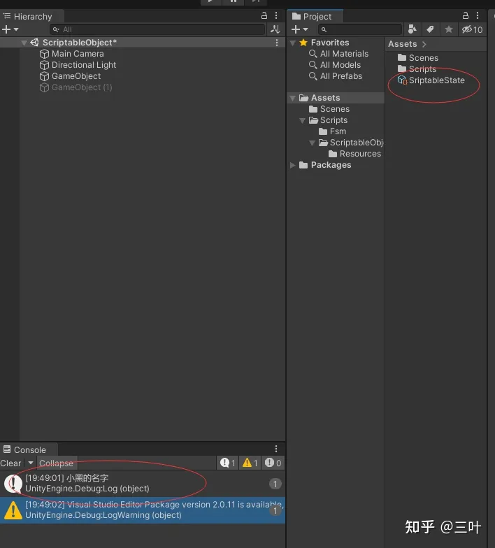
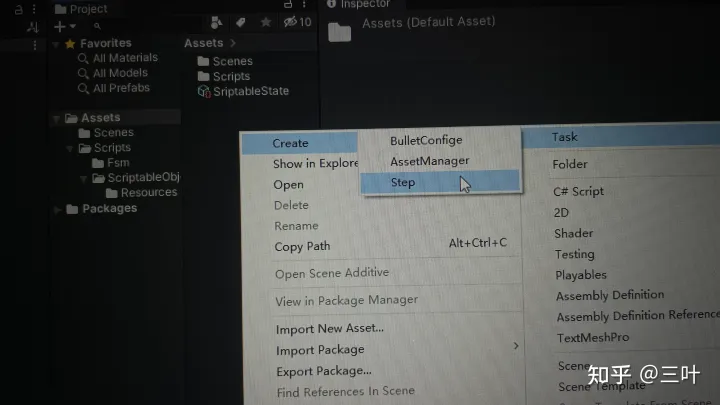
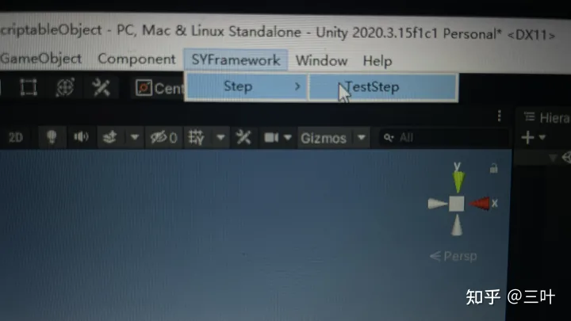
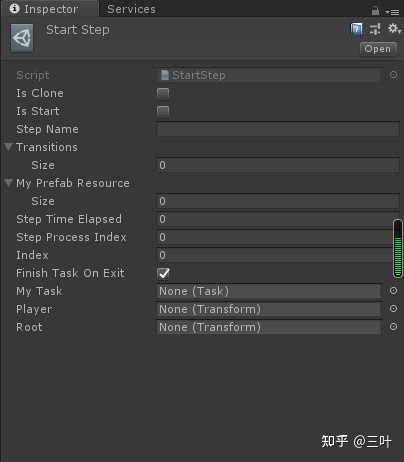
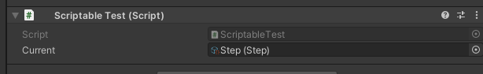
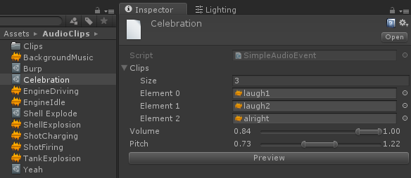
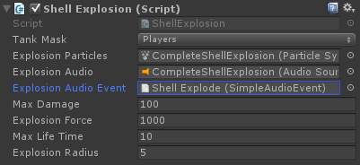
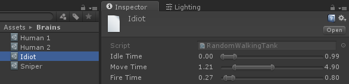
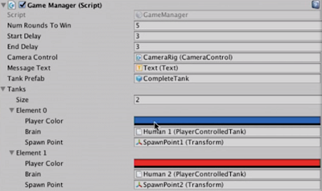

= ScriptableObject 类
:sectnums:
:toclevels: 3
:toc: left

---

== ScriptableObject类

ScriptableObject类, 它和MonoBehaviour是并列的，都继承自Object（但MonoBehaviour并不是直接继承自Object）

*脚本化对象(ScriptableObject)就是一个数据容器，可以用来存储大量的数据，它是可序列化的. 这个特点也正决定了它的主要用途；一个主要用处就是: 通过将数据存储在ScriptableObject对象中, 来减少工程以及游戏运行时, 因拷贝值所造成的内存占用；*

ScriptableObject是继承Object的, 和MonoBehaviour一样的,但是又不一样,*MonoBehaviour是以组件形式挂在GameObject上的,而ScriptableObject则以Assets资源的形式存在的. 如果你需要存储数据,继承ScriptableObject类或许是更好的选择,因为ScriptableObject可以存储数据,模型,shader,材质等等.*

总结就是: *在编辑器下, 可以保存和存储数据在本地Assets文件下,保存的数据可以共享,可以在当前整个项目进行引用或者其他项目共享,如果在真机运行情况下,是不可以操作的.*

== ScriptableObject 与 "预制体" 的区别:

当你有一个预制体，它附加了一些mono脚本，包含了一些数据. *每次我们实例化"预制体"的时候, 它都会拷贝assets下原预制体的值, 生成一份自己的拷贝*，然后我们可以修改场景内预制体的值, 而并不影响assets下预制体的值. 这是prefab的特性. 对于我们从一个prefab模板生成属性不同的游戏对象是很有用的.

*但是如果prefab里的脚本数据, 是不需要修改的，它就会造成很大的资源浪费，尤其在数据很多的时候.*

*为了避免这种问题，我们可以在不需要修改prefab里的脚本数据时，考虑使用ScriptableObject 来存储这些重复的数据. 然后其它所有预制体都可以使用引用的方式, 来访问这份数据.* 这就意味着不管场景中实例了多少预制体，在内存中就只需要有一份数据；它所带给我们的启示就是，*当预制体中的脚本里有大量重复数据时，我们就可以将数据抽离，单独保存在本地.*

*比如, 你做一个子弹的预制体, 并给它挂载一个派生自MonoBehaviour类的 Bullet类脚本. 你在里面添加一些属性. 就完成了一个子弹预制体的制作. 之后我们在场景中实例化新子弹物体的时候，这个实例也会挂载有一个Bullet脚本实例. 你复制出100个子弹预制体的克隆物体.每一个克隆体身上, 就会都带有一个Bullet脚本实例. 但问题是, 这100个Bullet脚本实例中的数据是相同的!*

*为了解决这个问题, 我们就可以把"Bullet脚本", 让它不继承MonoBehaviour类, 而是去继承ScriptableObject类. 这样, 这个"Bullet脚本"就能创建出一份Assets数据资源文件. 对它设置完数据后，在Bullet脚本中, 我们就定义一个指向该ScriptableOjbect对象的引用，这样, 你100个克隆出的子弹物体, 就仅仅指向同一个"Bullet脚本"了.*

== ScriptableObject类 的应用场景及方式

当使用编辑器运行游戏的时候，可以将数据保存到 ScriptableObject 里(当创建一个脚本化对象实例后使用AssetDatabase.CreateAsset()保存该资源)，*退出之后也不会丢失，因为它是作为Assets下的资源存在的*；*它是仅在编辑器中才可以保存修改的数据*（因为ScriptableObject对象虽然声明在UnityEngine中，但是它的Scriptable是通过UnityEditor命名空间下的类例, 如Editor类等来实现的），*所以在部署构建的时候, 不可以用于存储游戏运行时更改的数据，但是可以使用之前存储好的数据，也就是ScriptableObject生成的数据资源文件, 在Editor外具有"只读"属性*，这是非常需要注意的一点. *如果你需要在游戏中, 修改数据并存储下来，就不推荐使用ScriptableObject了*；

总结：*它就是用来在编辑器模式下, 保存和存储数据到本地Assets下的，数据保存以后是可以共享的*，就像纹理、shader等资源一样，*是可以共享于当前整个工程和其它工程的*. *这个ScriptableObject在真机上不可修改的*，就像我们不可以在游戏运行时修改一个shader资源的代码、不可以修改一个纹理资源的像素内容一样，而**在Unity Editor里, 可以修改ScriptableObject, 这是因为Unity的编辑器对它格式的支持**，就像使用vs code修改shader和使用ps修改一张纹理一样.

**ScriptableObject对象, 是不可以作为组件附加到对象上的，因为它的出现就是为了要让数据独立于具体的游戏对象.**

== ScriptableObject类里面的方法

属性

name：返回对象的名称

静态方法

CreateInstance：在游戏运行时创建一个Scriptable类型的实例，不使用时被GC回收；

....
//静态方法，使用了ScriptableObject类约束的泛型参数T
public static T CreateInstance<T>() where T : ScriptableObject;
....

Instantiate：实例化一个对象，返回一个实例；类似于GameObject的Instantiate()，其它函数也和GameObject类似；

....
public static T Instantiate(T original);
public static T Instantiate(T original, Transform parent);
public static T Instantiate(T original, Transform parent, bool worldPositionStays);
public static T Instantiate(T original, Vector3 position, Quaternion rotation);
public static T Instantiate(T original, Vector3 position, Quaternion rotation, Transform parent);
Parameters
....

ScriptableObject内部实现上也继承自MonoBehavior，它只有四个消息函数，Awake()、OnDestroy()、OnEnable()、OnDisable()；

ScriptableObject对象拥有非常少的回调函数:

- Awake()：创建一个对象实例时调用；
- OnEnable()：如下，创建或被加载时调用；
- OnDisable / OnDestroy：当调用销毁函数时，

== 案例使用

创建Scriptable并保存文件源:

[,subs=+quotes]
----
namespace SYFramework
{
	public class SriptableState:ScriptableObject
	{
		public string Name;
	}

}

namespace SYFramework
{
	public class ScriptableTest : MonoBehaviour
	{

		public SriptableState sriptableState;
		private void Awake()
		{

			*sriptableState= ScriptableObject.CreateInstance<SriptableState>(); //创建SriptableState资源对象 // ScriptableObject.CreateInstance() : 在游戏运行时创建一个Scriptable类型的实例，不使用时被GC回收*
			sriptableState.Name = "小黑的名字";

			string path ="Assets/SriptableState.asset"; //路径

			UnityEditor.AssetDatabase.CreateAsset(sriptableState, path); //创建好的对象保存到本地路径
			UnityEditor.AssetDatabase.SaveAssets();//保存资源
			UnityEditor.AssetDatabase.Refresh();//刷新
			Debug.Log(sriptableState.Name);

		}

	}

}
----

运行之后结果：

1.简单应用：创建Scriptable实例与保存到文件资源

在开发中如何去使用 ScriptableObject 脚本化对象:

- 第一种：*在游戏运行时, 创建"脚本化对象"实例，然后可以将数据保存到本地（如果不保存，它会在游戏结束后销毁）；*
- 第二种：在代码中, 引用Assets文件夹下的"脚本化对象"资源（也许是从游戏运行时保存下来的数据，也许是手动创建的数据）；

使用案例：游戏配置文件；商品清单；敌人统计数据等；

2.CreateAssetMenuAttribute-使用ScriptableObject

命名空间在UnityEngine的一个特性，它有三个属性filename，menuname，order，它用于标记一个派生自Scriptable的类，可以在Assets下的create下添加子菜单项，用于创建.asset资源文件(*Scriptable类是和.asset资源关联的*)；它和AddComponentMenu特性类似，只不过后者是将脚本组件添加到组件按钮的子菜单项，Unity中提供了很多用于编辑器菜单项扩展的属性例如MenuItem、ContextMenu等等，我们往往根据它的名称就可以大概知道它用在什么地方；

CreateAssetMenuAttribute类似于打标签. 一个继承ScriptableObject的类, 可以以CreatAssetMenu形式通过鼠标在Asset文件下直接创建,并且可以创建多个资源。这种情况是不需要填写资源路径，在Assets任何文件下都可以创建。

[,subs=+quotes]
----
namespace SYFramework
{
	/// 

	/// ScriptableObject
	///
	/// 

	[CreateAssetMenu(menuName ="Task/Step")]
	public class Step : ScriptableObject
	{
		public string Name;
	}

}
----

还有一种方式通过静态方法的形式，使用MenuItem特性可以在编辑器的状态栏中添加自己的标签，这种方法只能在编辑器情况下使用，并且创建的时候需要指明路径。

[,subs=+quotes]
----
	public class Test{

		[MenuItem("SYFramework/Step/TestStep")]
		public static void CreatScirptable()
		{
			Step step = ScriptableObject.CreateInstance<Step>();

			AssetDatabase.CreateAsset(step, "Assets/Step.asset");
			AssetDatabase.SaveAssets();
		}
	}
----

*注意：虽然使用MenuItem也可以在Assets/Create下创建一个菜单项，但是两种方式还是有区别；*

- 如果是使用MenuItem在静态方法中调用CreateAsset创建资源，那么需要指定创建的目录和资源名称，*如果资源已经存在，则不会创建新资源；*
- *而CreateAssetMenu则可以在Assets下任意目录创建资源，而且可以创建多个资源；*

[,subs=+quotes]
----

public class MakeScriptableObject {
    *[MenuItem("Assets/Create/My Scriptable Object")]*
    public static void CreateMyAsset()
    {
        MyScriptableObjectClass asset = ScriptableObject.CreateInstance<MyScriptableObjectClass>();

        AssetDatabase.CreateAsset(asset, "Assets/NewScripableObject.asset");
        AssetDatabase.SaveAssets();

        EditorUtility.FocusProjectWindow();

        Selection.activeObject = asset;
    }
}
----

[,subs=+quotes]
----

*[CreateAssetMenu(fileName = "data", menuName = "ScriptableObjects/SpawnManagerScriptableObject", order = 1)]*
*public class SpawnManagerScriptableObject : ScriptableObject*
{
    public string prefabName;
    public int numberOfPrefabsToCreate;
    public Vector3[] spawnPoints;
}
----

然后，在Assets下创建一个可编程对象资源，设置好所需数据；如果需要在其它脚本中获取该数据，是需要声明一个该类型变量，然后为其赋值或加载该数据资源；然后，就像使用用一个类中的公有变量一样使用即可；

[,subs=+quotes]
----
public SpawnManagerScriptableObject spawnManagerValues;
//spawnManagerValues.prefabName
----

提示：可以使用CustomEditor来为ScriptableOjbect创建自定义属性面板；

== 关于使用ScriptableObject的优点和应用场景

1 *可以把数据真正的存储到资源文件中.*

这句话最好的示例就是在Unity Editor运行的时候,常做一些运行时的修改,**一般情况下如果直接在inspector面板修改一些数据,取消运行之后会直接清空你运行时修改的数据,这是很麻烦的,**有经验的可能会Cope Component values 复制当前数据.**而使用ScriptableObject则可以在运行状态下动态的修改数据,取消运行之后也是运行时修改的数据.**

*ScriptableObject而且还有一个inspector面板,可以很好的去操作.这里就体现到了ScriptableObject是一个assets,而MonoBehaviour这是以组件形式存在.*

2 做数据分离

这里给出一个简单的实例,例如在发射子弹的时候,子弹身上是有控制子弹运动的脚本的,而每个武器子弹是不同的,每个不同的子弹身上有不同的数据,有相同的,也有不同的.如果去创建脚本,把每个子弹的一些数据写入到当前子弹的脚本身上,大量的数据让这个脚本去实现,会越来越臃肿,不易管理,而且很多数据可能在unity Editor不断的调试,对策划是很操作的.如果把数据分离出来,去做成ScriptableObject脚本资源,而子弹脚本只需要去引用资源即可.

3 任务驱动型模块设计

*任务驱动型模块设计, 是指: 资源的加载,数据的读取, 会分离到以ScriptableObject的assets的资源文件中,在执行每次任务的时候也是通过读取资源文件的形式.* 一般情况在大中型项目中会使用这种模块设计,*而并不会以Res形式加载资源*,因为配置资源表来的更加直观一些.附图:

通过状态机的形式控制每个资源。

4 *资源被实例化之后, 是被引用,而不是被复制*

*这一点其实说的就是MonoBehaviour痛点,每次实例化对象,都是完全复制,而非引用,对内存的消耗极大.而如果使用ScriptableObject实例化一次,他就会以资源的形式存储在asset文件中,其他地方如果使用的话直接引用就可以了.可以像Prefabs一样直接拖拽进去就可以了。*

ScriptableObject 的优点:

- *把数据真正存储在了资源文件中，可以像其他资源那样管理它，例如退出运行也一样会保持修改.*
- *可以在项目之间很好的复用，不用再制作Prefab那样导入导出.*

之前的做法一般都是[Serializable]一个class，然后在面板里配数据，做成prefab，但这种方法没有ScriptableObject 方便。 果有类似通过Serializable + Class + Prefab实现存储数据的想法的时候，都应该先考虑下能不能用ScriptableObject做成一个真正的资源文件。

[options="autowidth"  cols="1a,1a"]
|===
|Header 1 |Header 2

|为什么某些情况下使用**MonoBehaviour**很不好：
|- *运行时刻修改了数据一退出就全部丢失了。*
这个深有感触，目前都是靠Copy Component Values来解决，很麻烦。其实有这样的需求的时候大部分就说明**这个脚本存储的是很多数据，就应该考虑使用ScriptableObject，而不是MonoBehaviour。**说到底是因为这些MonoBehaviour对象不是Assets
- *当实例化新的对象的时候，这个MonoBehaviour也在内存中多了一份实例，浪费空间*
- *在场景和项目之间很难共享*
- *在概念上就很难定义这种对象，明明是为了存储一些数据和设置等，但却要作为一个Component附着在Gameobject或Prefab上，不能独立存在.*

|为什么使用C#的statics也无法解决这个问题：
|- 一旦退出运行仍然会重置所有数据
- 需要自己进行serialsation，而且不容易引用其他Unity对象（因为有Static限制）
- 显示面板也需要我们自己实现，很麻烦

|为什么Prefabs也不行：
|- Prefab的确可以在项目和场景之间贡献，但很容易被搞得乱七八糟，我们只需要实例化一个prefab，然后就可以随意更改数据了
- *会有额外的一些Component，但其实我们只是想要存储数据而已，这些没有任何意义*
- 仍然在概念上不能更好的fit

|ScriptableObject是我们的rescue！
|- 在内部实现上, 它仍然继承自MonoBehaviour，但它不必附着在某个对象上作为一个Component
- 我们也不能（当然初衷就是不愿意）把它赋给Gameobject或Prefab
- *可以被serialised，而且可以自动有类似MonoBehavior的面板，很方便*
- *可以被放到.asset文件中，也就是说我们可以自定义asset的类型。Unity内置的asset资源有材质、贴图、音频等等，现在依靠ScriptableObject我们可以自定义新的资源类型，来存储我们自己的数据*
- 可以解决某些多态问题

|ScriptableObject是如何解决我们的问题的：
|- **ScriptableObject的数据是存储在asset里的，因此它不会在退出时被重置数据，**这类似Unity里面的材质和纹理资源数据，我们在运行时刻改变它们的数值就是真的改变了
- *这些资源在实例化的时候, 是可以被引用，而非复制*
- *类似其他资源，它可以被任何场景引用，即场景间共享*
- *在项目之间共享*
- *没有其他多余的东西，例如多余的Component*

|当然ScriptableObject也有一些缺点：
|只有很少的回调函数:
OnEnable(),
OnDisable(),
OnDestroy()
- 真正意义上的共享，因此一旦修改数据都真的修改了
|===

总结：其实说明白点，ScriptableObject的优点和缺点都是因为它表现起来就像一个类似材质、纹理等类型的资源，存在于Assets文件夹下，只有唯一实例.

如何使用:
非常简单，只需要把平时的继承自MonoBehaviour改成ScriptableObject即可：

[,subs=+quotes]
----
using UnityEngine;

[CreateAssetMenu(menuName="MySubMenue/Create MyScriptableObject ")]
public class MyScriptableObject : ScriptableObject
{
    public int someVariable;
}
----

其中，CreateAssetMenu可以让我们在资源创建菜单中添加创建这个ScriptableObject的选项，类似创建脚本、材质等其他资源。

我们也可以在脚本中动态创建一个ScriptableObject：

[,subs=+quotes]
----
ScriptableObject.CreateInstance<MyScriptableObject >();
----

这会在内存中创建一个新的实例，用作临时修改等用途，然后在不使用的时候可以让GC回收。

create可以是从脚本中被创建，当有其他对象引用该ScriptableObject时它会被load。

生命周期:

其实ScriptableObject的生命周期和其他资源都是类似的：

- 当**它是被绑定到.asset文件或者AssetBundle等资源文件中的时候，它就是persistent的，这意味着**

.. *它可以通过Resources.UnloadUnusedAssets来被unload出内存*
.. 可以通过脚本引用或其他需要的时候被再次load到内存

- *如果是通过CreateInstance<>来创建的，它就是非persistent的，这意味着*

.. 它可以通过GC被直接destroy掉（如果没有任何引用的话）
.. 如果不想被GC的话，可以使用HideFlags.HideAndDontSave

什么时候使用

下面介绍一些常见的应用场景。

全文见: +
https://blog.csdn.net/Fenglele_Fans/article/details/77879295

Data Objects和Tables:
*第一种最常见的就是数据对象和表格数据，我们可以在Assets下创建一个.asset文件，并在编辑器面板中编辑修改它，再提交这个唯一的一份资源给版本控制器。例如，本地化数据、清单目录、表格、敌人配置等（这些真的非常常见，目前我接触过的大部分都是通过json、xml文件或是Monobehaviour来实现的，json和xml文件对策划并不友好，Monobehaviour的问题前面就说过了）。*

一个例子：

class EnemyInfo : ScriptableObject {
    public int MaximumHealth;
    public int DamagePerMeleeHit;
}
1
2
3
4
**记住，ScriptableObject的目的是只有一份，因此这里面不应该包括一些会根据实例不同而变化的数值。例如，我们在这个例子里没有声明敌人的生命值等变量，这是因为不同的敌人的生命值可能是不同的，这些属性应该在相应的MonoBehaviour里定义。**

然后，我们就可以在真正的MonoBehaviour脚本中声明对ScriptableObject的引用：

class Enemy : MonoBehaviour {
    public EnemyInfo info;
}
1
2
3
这保证所有的Enemy都会引用到同一个ScriptableObject对象。

Dual Serialisation
使用ScriptableObject的一个好处是你不需要考虑序列化的问题，但是我们也可以和Json这些进行配合（使用JsonUtility），既支持直接在编辑器里创建ScriptableObject，也支持在运行时刻通过读取Json文件来创建。例子是，内置 + 用户自定义的场景文件，我们可以在编辑器里设计一些场景存储成.asset文件，而在运行时刻玩家可以自己设计关卡存储在Json文件里，然后可以据此生成相应的ScriptableObject。

一个例子：

[CreateAssetMenu]
class LevelData : ScriptableObject { ... }

LevelData LoadLevelFromFile(string path) {
    string json = File.ReadAllText(path);
    LevelData result = CreateInstance<LevelData>();
    JsonUtility.FromJsonOverwrite(result, json);
    return result;
}
1
2
3
4
5
6
7
8
9
JsonUtility.FromJsonOverwrite会使用Json文件中的数据来更新LevelData。

Reload-proof Singleton
我们经常会需要一个可以在场景间共享的Singleton对象，有时候我们就可以使用ScriptableObject + static instance variable的方法来解决，当场景变换的时候，我们可以使用Resources.FindObjectsOfTypeAll<>来找到已有的instance（当然这需要在实例化第一个instance的时候把它标识为instance.hideFlags = HideFlags.HideAndDontSave）。一个例子就是游戏状态和游戏设置。

一个例子：

class GameState : ScriptableObject {
    public int lives, score;
    private static GameState _instance;
    public static GameState Instance {
        get {
            if (!_instance) {
                // 如果为空，先试着从Resource中找到该对象
                _instance = Resources.FindObjectOfType<GameState>();
            }
            if (!_instance) {
                // 如果仍然没有，就从默认状态中创建一个新的
                // CreateDefaultGameState函数可以是从JSON文件中读取，并且在实例化完后指明_instance.hideFlags = HideFlags.HideAndDontSave
                _instance = CreateDefaultGameState();
            }
            return _instance;
        }
    }
}
1
2
3
4
5
6
7
8
9
10
11
12
13
14
15
16
17
18
Delegate Objects
ScriptableObject除了可以存储数据外，我们还可以在ScriptableObject中定义一些方法，MonoBehaviour会把自身传递给ScriptableObject中的方法，然后ScriptableObject再进行一些工作。这类似于插槽设计模式，ScriptableObject提供一些槽，MonoBehaviour可以把自己插进去。适用于AI类型、加能量的buff或debuffs等

这种用法大概是最常见的。首先看一个加能量的例子（来源Unite 2016 Europe）。

一个例子：

abstract class PowerupEffect : ScriptableObject {
    public abstract void ApplyTo(GameObject go);
}

[CreateAssetMenu]
class HealthBooster : PowerupEffect {
    public int Amount;
    public override void ApplyTo(GameObject go) {
        go.GetComponent<Health>().currentValue += Amount;
    }
}

class Powerup : MonoBehaviour {
    public PowerupEffect effect;
    public void OnTriggerEnter(Collider other) {
        effect.ApplyTo(other.gameObject);
    }
}
1
2
3
4
5
6
7
8
9
10
11
12
13
14
15
16
17
18
我们先声明了一个PowerupEffect抽象类，来规定所有的加能量技能都需要定义一个ApplyTo函数作用于玩家。然后，我们定义一个HealthBooster类来管理那些专门加血的技能，我们可以通过创建资源的方式创建多个加血技能的资源实例，它们每个都可以有不同的加血量（Amount），当传进来一个GameObject的时候，就可以给它加血。我们又定义了Powerup的MonoBehaviour类，把它作为Component赋给各个可以触发加血技能的物体，它们可以接受一个PowerupEffect类型的加能量技能，然后靠碰撞体触发加血行为。

Tank Demo
在参考资料中的Tank Demo中有更多的例子。

Delegate Objects
这种是非常常见的一种ScriptableObject应用模式。

例子：音效事件资源
首先是播放音效被定义成一个ScriptableObject资源对象。

public abstract class AudioEvent : ScriptableObject
{
    public abstract void Play(AudioSource source);
}
1
2
3
4
上面的AudioEvent可以用于定义一个播放音效的事件资源。所有继承它的类都需要定义播放Play函数，以便其他MonoBehaviour在运行时刻可以传递一个AudioSource文件给它进行播放。

一个简单的例子是：

[CreateAssetMenu(menuName="Audio Events/Simple")]
public class SimpleAudioEvent : AudioEvent
{
    public AudioClip[] clips;

    public RangedFloat volume;

    [MinMaxRange(0, 2)]
    public RangedFloat pitch;

    public override void Play(AudioSource source)
    {
        if (clips.Length == 0) return;

        source.clip = clips[Random.Range(0, clips.Length)];
        source.volume = Random.Range(volume.minValue, volume.maxValue);
        source.pitch = Random.Range(pitch.minValue, pitch.maxValue);
        source.Play();
    }
}

1
2
3
4
5
6
7
8
9
10
11
12
13
14
15
16
17
18
19
20
SimpleAudioEvent可以管理一个音效列表，然后在播放时随机选取一个进行播放。RangedFloat和MinMaxRanges也是自定义的类型，同时我们也为SimpleAudioEvent和RangedFloat定义了面板显示编辑器类AudioEventEditor.cs和RangedFloatDrawer.cs，不再赘述。最终，我们可以通过创建资源菜单来创建一些真正的音效事件资源：

这里写图片描述
上面一共显示了4个音效播放资源，我们选中的是一个庆祝时会播放的音频事件Celebration，它会随机播放一个大笑的音效。我们可以点击Preview按钮来预览播放效果，这个也是在编辑器类AudioEventEditor.cs中定义的。

最后，我们可以把这些资源拖拽给需要播放音效的MonoBehaviour，例如子弹爆炸的脚本：

这里写图片描述
例子：AI
Tank游戏里面的坦克可以是由不同的AI控制的，一种是由玩家自己控制，一种是由电脑扮演，这种也可以有不同的行为。我们可以把控制坦克行为的brain也定义成一种ScriptableObject资源：

public abstract class TankBrain : ScriptableObject
{
    public virtual void Initialize(TankThinker tank) { }
    public abstract void Think(TankThinker tank);
}
1
2
3
4
5
TankBrain必须实现两个方法，一个是根据输入的坦克实体TankThinker（是一个MonoBehaviour类） 初始化自己，一个是根据TankThinker进行Think行为的函数。

然后，我们可以定义玩家控制类PlayerControlledTank：

[CreateAssetMenu(menuName="Brains/Player Controlled")]
public class PlayerControlledTank : TankBrain
{

    public int PlayerNumber;
    private string m_MovementAxisName;
    private string m_TurnAxisName;
    private string m_FireButton;

    public void OnEnable()
    {
        m_MovementAxisName = "Vertical" + PlayerNumber;
        m_TurnAxisName = "Horizontal" + PlayerNumber;
        m_FireButton = "Fire" + PlayerNumber;
    }

    public override void Think(TankThinker tank)
    {
        var movement = tank.GetComponent<TankMovement>();

        movement.Steer(Input.GetAxis(m_MovementAxisName), Input.GetAxis(m_TurnAxisName));

        var shooting = tank.GetComponent<TankShooting>();

        if (Input.GetButton(m_FireButton))
            shooting.BeginChargingShot();
        else
            shooting.FireChargedShot();
    }
}

1
2
3
4
5
6
7
8
9
10
11
12
13
14
15
16
17
18
19
20
21
22
23
24
25
26
27
28
29
30
31
类似的还可以定义直接由电脑控制的其他AI。在Think函数里我们可以进行和实现MonoBehaviour方法类似的功能，例如通过GetComponent、FindGameobject等函数来获取游戏对象。

然后，我们就可以在创建真正的Brain资源：

这里写图片描述
上面显示了一个Idiot类型AI的Brain资源。

然后，我们可以在游戏管理类GameManager里面定义两个玩家，并把需要的Tank Brain资源拖拽进去：

这里写图片描述
Reload-proof Singleton
例子：游戏设置
这个例子是说用户可以在开始菜单里定义Tank Brain的个数和类型，然后这个设置（GameSettings）会作为一个Singleton传递给后面的关卡中。GameSettings类我们很多时候其实都是直接用普通的Singleton类（值得说明的是Unity里面实现的Singleton类通常都是靠DonotDestroyOnLoad等“费劲的方法”来实现）来做的，它会在开始的时候读取Json文件，在必要的时候再写回Json进行保存。这里选择在ScriptableObject + Singleton的方法来实现的一个好处是我们不需要什么其他繁冗的步骤，就可以保证唯一性和在场景之间共享的目的，因为ScriptableObject本身可以认为是一种资源：

[CreateAssetMenu]
public class GameSettings : ScriptableObject
{
    [Serializable]
    public class PlayerInfo
    {
        public string Name;
        public Color Color;

        ...
    }

    public List<PlayerInfo> players;

    private static GameSettings _instance;
    public static GameSettings Instance
    {
        get
        {
            if (!_instance)
                _instance = Resources.FindObjectsOfTypeAll<GameSettings>().FirstOrDefault();
#if UNITY_EDITOR
            if (!_instance)
                InitializeFromDefault(UnityEditor.AssetDatabase.LoadAssetAtPath<GameSettings>("Assets/Test game settings.asset"));
#endif
            return _instance;
        }
    }

    public int NumberOfRounds;

    public static void LoadFromJSON(string path)
    {
        if (!_instance) DestroyImmediate(_instance);
        _instance = ScriptableObject.CreateInstance<GameSettings>();
        JsonUtility.FromJsonOverwrite(System.IO.File.ReadAllText(path), _instance);
        _instance.hideFlags = HideFlags.HideAndDontSave;
    }

    public void SaveToJSON(string path)
    {
        Debug.LogFormat("Saving game settings to {0}", path);
        System.IO.File.WriteAllText(path, JsonUtility.ToJson(this, true));
    }

    public static void InitializeFromDefault(GameSettings settings)
    {
        if (_instance) DestroyImmediate(_instance);
        _instance = Instantiate(settings);
        _instance.hideFlags = HideFlags.HideAndDontSave;
    }

#if UNITY_EDITOR
    [UnityEditor.MenuItem("Window/Game Settings")]
    public static void ShowGameSettings()
    {
        UnityEditor.Selection.activeObject = Instance;
    }
#endif

    ...
}

1
2
3
4
5
6
7
8
9
10
11
12
13
14
15
16
17
18
19
20
21
22
23
24
25
26
27
28
29
30
31
32
33
34
35
36
37
38
39
40
41
42
43
44
45
46
47
48
49
50
51
52
53
54
55
56
57
58
59
60
61
62
GameSettings继承了ScriptableObject，并支持我们在资源文件夹中创建一个资源文件，这个资源文件可以是在游戏第一次运行时候的一个默认的玩家配置。然后，它实现了LoadFromJSON和SaveToJSON函数来加载和存储硬盘上的数据。一个有趣的地方是上面的最后一个函数，这个函数允许我们在菜单栏上打开并显示当前的GameSettings资源，非常方便，不需要再自己写窗口类了。

在欢迎界面上，我们可以在控制类MainMenuController中获取GameSettings，并在进入下一关前保存数据到硬盘：

public class MainMenuController : MonoBehaviour
{
    public GameSettings GameSettingsTemplate;

    ...

    public string SavedSettingsPath {
        get {
            return System.IO.Path.Combine(Application.persistentDataPath, "tanks-settings.json");
        }
    }

    void Start () {
        if (System.IO.File.Exists(SavedSettingsPath))
            GameSettings.LoadFromJSON(SavedSettingsPath);
        else
            GameSettings.InitializeFromDefault(GameSettingsTemplate);

        foreach(var info in GetComponentsInChildren<PlayerInfoController>())
            info.Refresh();

        NumberOfRoundsSlider.value = GameSettings.Instance.NumberOfRounds;
    }

    public void Play()
    {
        GameSettings.Instance.SaveToJSON(SavedSettingsPath);
        GameState.CreateFromSettings(GameSettings.Instance);
        SceneManager.LoadScene(1, LoadSceneMode.Single);
    }

    ...
}

1
2
3
4
5
6
7
8
9
10
11
12
13
14
15
16
17
18
19
20
21
22
23
24
25
26
27
28
29
30
31
32
33
在之后的场景中，我们只需要GameSettings.Instance来访问就可以了。
