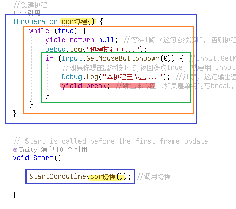
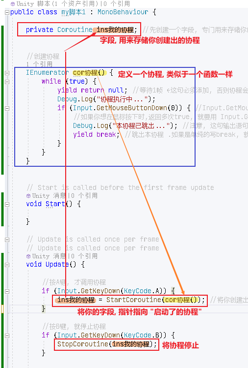

= 协程
:sectnums:
:toclevels: 3
:toc: left
''''

yield关键词是在 C# 2.0 中被引入的，我们都知道实现了 *IEnumerable 接口的类都可以用于被 foreach 迭代，这是因为 IEnumerable 接口中提供了一个可迭代的 GetEnumerator 方法*，代码定义如下：

[,subs=+quotes]
----
public interface IEnumerable{

    *IEnumerator GetEnumerator( ) ;*

}
----

现在你也**可以使用 yield 关键词, 来指定某些方法也是可以被迭代的**，通常 *C# 中有两种 yield 的语法格式： yield return <expression> 和 yield break 。*

为什么要使用 yield 关键词

yield关键词可以实现一种 状态迭代,  而不需要提前创建好一个临时集合，换句话说，**当你在迭代器中使用 yield return 时，在数据返回之前, 你不需要创建一个临时集合来存储数据，你可以利用 yield return , 一次性返回集合中的每项数据,**同时, 你也可以在方法和get访问器中, 使用带有迭代的 yield return 语句，值得注意的是，**当每次执行 yield return 语句后，控制权都会转交给调用者。**

yield关键字用于遍历循环中，yield return用于返回IEnumerable<T>，yield break用于终止循环遍历。

yield 从字面上理解有“退位，屈服”的意思，转一下弯就理解成“权限转移”，也就是将控制权交给别人，在这里就是把集合里满足条件（如果没有过滤条件，就是全体）的个体的操作转移给另一个对象。

*所有使用到yield的都是协程，协程不是线程，和update和start一样在主线程上运行。*

1.协程
（1）使用
本章的内容将紧扣unity中的协程进行讲解，先来看看一个协程应该怎么使用。

public class Cour : MonoBehaviour
{
    // Start is called before the first frame update
    private Coroutine c;
    private IEnumerator e;
    void Start()
    {
        //Coroutine c= StartCoroutine(count());
        //第一种调用方式

        //StartCoroutine("count");
        //第二种调用方式

        e = count();
        StartCoroutine(e);
        //第三种调用方式
    }

    private void Update()
    {
        if (Input.GetKeyDown(KeyCode.Space))
        {
            //StopCoroutine(c);
            //第一种调用方法的停止方式

            //StopCoroutine("count");
            //第二种调用方法的停止方式

            StopCoroutine(e);
            //第三种调用方法的停止方式
        }
    }

    IEnumerator count()
    {
        for (int i = 0; i < 10; i++)
        {
            Debug.Log(i);
            yield return new WaitForSeconds(2);
        }
    }
}
上面的就是协程的使用方式。

（2）优点
然后我们来聊一聊协程的好处，在搜资料的时候我看到一个有趣的例子，你去某个办事处办事，此时办事处是cpu每个人办的事就是一个一个线程，办事处只有一个员工（对应cpu在同一个时间只能进行一个线程），当这个员工要从一件事转头去做另一件事，自然要做许多事，比如先暂停上一件事，然后把上一件事资料整理好，方便下次做这件事的时候开始，然后要加载另一件事所需的资源，所以线程之间的切换是很耗费时间的，但是，如果你自己能仿制办事处的办事方法，就不需要再到办事处浪费时间了，这就是协程的好处。

让原来要使用异步 + 回调方式写的非人类代码, 可以用看似同步的方式写出来。能够分步做一个比较耗时的事情，如果需要大量的计算，将计算放到一个随时间进行的协程来处理，能分散计算压力

（3）缺点
我们可以看到我们上面的程序，需要再返回时new一个对象，如果再程序中大量的创造对象会引发GC，同时，如果激活的协程较多，就可能会造成多个协程挤在同一帧执行，导致卡顿。

（4）协程的运行时间

所有使用到yield的都是协程，协程不是线程，和update和start一样在主线程上运行。

（5）协程结束方式
1.StopCoroutine，不解释，上面有用法，别用错了

2.stopAllCoroutines暂停的是当前脚本下的所有协程

3.移除脚本，移除物体，禁用物体（实测禁用脚本屁用没有）

（6）中断函数类型
null 在下一帧所有的Update()函数调用过之后执行

WaitForSeconds() 等待指定秒数，在该帧（延迟过后的那一帧）所有update()函数调用完后执行。即等待给定时间周期， 受Time.timeScale影响，当Time.timeScale = 0f 时，yield return new WaitForSecond(x) 将不会满足。

WaitForFixedUpdate 等待一个固定帧，即等待物理周期循环结束后执行

WaitForEndOfFrame 等待帧结束，即等待渲染周期循环结束后执行

StartCoroutine 等待一个新协程暂停

WWW 等待一个加载完成，等待www的网络请求完成后，isDone=true后执行

（7）执行顺序
开始协程->执行协程->遇到中断指令中断协程->返回上层函数继续执行上层函数的下一行代码->中断指令结束后，继续执行中断指令之后的代码->协程结束

协程如果还有问题可以看看:https://zhuanlan.zhihu.com/p/59619632，我就是看这篇文章总结出来的。

== 定义协程, 并调用(执行)你写的协程

[,subs=+quotes]
----
public class my脚本1 : MonoBehaviour {

    *//创建协程*
    *IEnumerator cor协程() { //coroutine 协同程序*

        *//暂停的方法(以秒为单位)*
        *yield return new WaitForSeconds(1); //等待1秒钟.* 如果要等待0.5秒钟, 就写成 0.5f
        Debug.Log("等待了1秒");

        *//等待1帧的时间*
        *yield return null; //或也可写成 yield return 1;*
        Debug.Log("等待了1帧");

        *yield return new WaitForEndOfFrame();* //Waits until the end of the frame /after all cameras and GUI is rendered, just before displaying the frame on screen. 等待直到所有的摄像机和GUI被渲染完成后，在该帧显示在屏幕之前。
        Debug.Log("等待到了本帧帧末");

    }

    // Start is called before the first frame update
    void Start() {

        *//下面, 开始调用上面我们写的协程*
        //方法1:
        *StartCoroutine(nameof(cor协程));* // nameof是C#6新增的一个关键字运算符，主要作用是方便获取类型、成员和变量的简单字符串名称（非完全限定名），意义在于避免我们在代码中写下固定的一些字符串，这些固定的字符串在后续维护代码时是一个很繁琐的事情。

        //调用协程的方法2:
        *StartCoroutine(cor协程());*

    }

    // Update is called once per frame
    // Update is called once per frame
    void Update() {

    }

}
----

== 给协程传参

[,subs=+quotes]
----
public class my脚本1 : MonoBehaviour {

    *//创建协程, 可以像函数一样, 给它设置接收的参数*
    *IEnumerator cor协程(string str) {*
        yield return null; //等待1帧
        Debug.Log(str);
    }

    // Start is called before the first frame update
    void Start() {
        *StartCoroutine(cor协程("zrx")); //调用协程, 被给它传入实参.*
    }

    // Update is called once per frame
    // Update is called once per frame
    void Update() {

    }
}
----

'''

== 跳出协程 (注意: "跳出协程"不是"停止协程")

[,subs=+quotes]
----
public class my脚本1 : MonoBehaviour {

    //创建协程
    IEnumerator cor协程() {

        while (true) {
            *yield return null; //等待1帧 ← 在while语句里, 这句必须添加, 即一定要等1帧时间, 否则协程会卡死.*
            Debug.Log("协程执行中...");

            **if (Input.GetMouseButtonDown(0)) { //Input.GetMouseButtonDown()中的参数, 0是左键，1是右键，2是中键. 该方法, 会在鼠标按键按下时，返回一次true. **
                //如果你想在鼠标按下时,返回多次true, 就要用 Input.GetMouseButton()方法.

                Debug.Log("本协程已跳出..."); //注意, 这句输出语句, 一定要写在 yield 语句之前. 因为yield语句之后的代码都不会再被执行了.

                *yield break; //跳出本协程(注意! 只是跳出协程, 而不是停止协程) .如果是单纯的写break, 就只是跳出while循环而已.*
            }
        }
    }

    // Start is called before the first frame update
    void Start() {

        StartCoroutine(cor协程()); //调用协程

    }

    // Update is called once per frame
    // Update is called once per frame
    void Update() {

    }

}
----

'''

== 停止协程

[,subs=+quotes]
----
public class my脚本1 : MonoBehaviour {

    *private Coroutine ins我的协程; //先创建一个字段, 专门用来存储你创建处理的协程. 这样, 在关闭你的协程时, 就能调用这个字段, 来关闭协程了.*

    *//创建协程*
    IEnumerator cor协程() {
        while (true) {
            yield return null; //等待1帧 ←这句必须添加, 否则协程会卡死.
            Debug.Log("协程执行中...");

            if (Input.GetMouseButtonDown(0)) {
                Debug.Log("本协程已跳出...");
                yield break; //跳出本协程 .如果是单纯的写break, 就只是跳出while循环而已.
            }
        }
    }

    // Start is called before the first frame update
    void Start() {

    }

    *// 在Update函数中, 我们来创建协程, 和停止协程*
    void Update() {

        //按A键, 才调用协程
        if (Input.GetKeyDown(KeyCode.A)) {
            *ins我的协程 = StartCoroutine(cor协程()); //将你创建出来的协程, 赋值给ins我的协程字段上去. 即让该字段变量,来指针指向你创建出的这个协程实体.*
        }

        //按B键, 就停止协程
        if (Input.GetKeyDown(KeyCode.B)) {
            *StopCoroutine(ins我的协程);*
        }
    }
}
----

'''

== 停止多个协程

[,subs=+quotes]
----
//比如, 按B键, 就停止所有协程.
if (Input.GetKeyDown(KeyCode.B)) {
    *StopAllCoroutines(); //停止所有的协程*
}
----

'''

