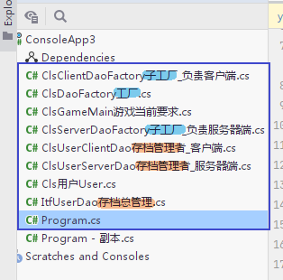
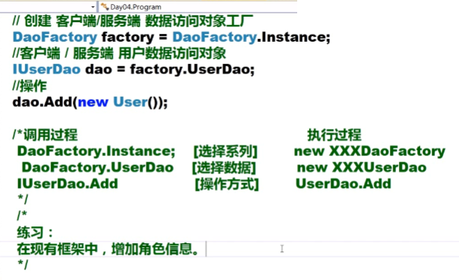

= 工厂模式
:sectnums:
:toclevels: 3
:toc: left
'''

== 工厂模式

用到了下面的几个类:

总框架如下:

image:img/0213.svg[,]

'''

==== Cls用户User

[,subs=+quotes]
----
namespace ConsoleApp3;

public class Cls用户User {

}
----

'''

==== ItfUserDao存档总管理

[,subs=+quotes]
----
namespace ConsoleApp3;

public interface ItfUserDao存档总管理
{
    public void fnAdd(Cls用户User ins用户);
}
----

'''

==== ClsUserClientDao存档管理者_客户端

[,subs=+quotes]
----
namespace ConsoleApp3;

public class ClsUserClientDao存档管理者_客户端 : ItfUserDao存档总管理
{

    public void fnAdd(Cls用户User ins用户)
    {
        System.Console.WriteLine("在客户端添加用户数据");
    }
}
----

'''

==== ClsUserServerDao存档管理者_服务器端

[,subs=+quotes]
----
namespace ConsoleApp3;

public class ClsUserServerDao存档管理者_服务器端: ItfUserDao存档总管理
{
    public void fnAdd(Cls用户User ins用户)
    {
        System.Console.WriteLine("在服务器端添加用户数据");
    }
}
----

'''

==== ClsGameMain游戏当前要求

[,subs=+quotes]
----
namespace ConsoleApp3;

public class ClsGameMain游戏当前要求
{
    public static string strType存档存在哪儿 = "Client"; //或"Server" ← 这个字符串, 用来指明, 你的游戏数据到底是存在本地客户端上, 还是网络服务器上.
}
----

'''

==== ClsDaoFactory工厂

[,subs=+quotes]
----
namespace ConsoleApp3;

//这个工厂, 会根据"ClsGameMain游戏当前要求"类中, 存储的"type存储类型"字段中的要求, 返回符合其要求的实例对象.
public abstract class ClsDaoFactory工厂
{
    //下面的代码是对的, 但还有一个问题. 下面说.
    //下面的这个属性, 会内装逻辑, 来决定到底是返回"客户端数据处理机器人", 还是返回"服务器端数据处理机器人".
    // public static ItfUserDao用户数据处理接口 field_UserDao用户数据处理属性
    // {
    //     get
    //     {
    //         //到底是返回哪个机器人, 由另一个类"ClsGameMain游戏当前要求"中的"type存储类型"字段中的值, 告诉我们.
    //         if (ClsGameMain游戏当前要求.type存储类型 == "Client")
    //         {
    //             return new Cls用户客户端数据访问对象UserClientDao();
    //         }
    //         else
    //         {
    //             return new Cls用户服务端数据访问对象UserServerDao();
    //         }
    //     }
    // }

    //上面, 我们只是成功返回了一个只能处理"数据存储在何处?"的机器实例. 但还有其他很多要处理的内容呢! 比如, 角色信息, 武器信息, 装备信息等等.  如果这些不同的信息, 每一个都要来判断它们到底是处于本地, 还是服务器上, 就会造成代码重复, 就很麻烦了. 所以, 我们要修改一下, 把这个属性, 变成能处理任何信息的"抽象"属性.
    public static ClsDaoFactory工厂 ins工厂类的实例
    {
        get
        {
            if (ClsGameMain游戏当前要求.strType存档存在哪儿 == "Client")
            {
                return new ClsClientDaoFactory子工厂_负责客户端();
            }
            else
            {
                return new ClsServerDaoFactory子工厂_负责服务器端();
            }
        }
    }

    //把下面这个属性, 也变成抽象的, 让本"抽象工厂类"的子类, 去实现这个属性.
    public abstract ItfUserDao存档总管理 field_UserDao存档管理者 { get; }

}
----

'''

====  ClsClientDaoFactory子工厂_负责客户端

[,subs=+quotes]
----
namespace ConsoleApp3;

//下面这个类, 专门作为"客户端数据访问对象"的工厂
public class ClsClientDaoFactory子工厂_负责客户端 : ClsDaoFactory工厂
{
    public override ItfUserDao存档总管理 field_UserDao存档管理者
    {
        get
        {
            return new ClsUserClientDao存档管理者_客户端();
        }
    }
}
----

'''

==== ClsServerDaoFactory子工厂_负责服务器端

[,subs=+quotes]
----
namespace ConsoleApp3;

public class ClsServerDaoFactory子工厂_负责服务器端 : ClsDaoFactory工厂
{
    public override ItfUserDao存档总管理 field_UserDao存档管理者
    {
        get { return new ClsUserServerDao存档管理者_服务器端(); }
    }
}
----

'''

==== main函数

[,subs=+quotes]
----
using System.Collections;
using System.Collections.Concurrent;
using System.Reflection;
using System.Security.Cryptography.X509Certificates;
using System.Text;
using System.Threading.Channels;
using Microsoft.Extensions.DependencyInjection;

namespace ConsoleApp3
{
//主函数
    internal class Program
    {
        static void Main(string[] args)
        {
            //先创建出总工厂(富士康)的实例
            ClsDaoFactory工厂 ins某子工厂 = ClsDaoFactory工厂.ins工厂类的实例;

            //然后拿到该实例身上的"ins某子工厂"属性, 里面存放的,就是该子工厂生产的产品 -- 存档管理者(完全符合"游戏当前要求"(即甲方要求, 即苹果公司的要求)的那个管理者.)
            ItfUserDao存档总管理 ins存档处理者 = ins某子工厂.field_UserDao存档管理者;

            //"存档处理者"实例对象, 身上有将"登录用户添加到数据库中"的函数方法存在.
            ins存档处理者.fnAdd(new Cls用户User()); //fnAdd()方法, 会打印出: "在客户端添加用户数据"

        }
    }
}
----

'''

== 再添加一个要管理的信息

框架变成了下图所示:

image:img/0215.svg[,]

下面几个文件, 是新添加或有改动的. 加粗部分, 就是改动的内容.

==== (新增) ItfCharacterDao角色总管理

[,subs=+quotes]
----
namespace ConsoleApp3;

public interface ItfCharacterDao角色总管理
{
    public void fnAdd添加角色(ClsCharacter角色类 ins角色);

}
----

'''

====  (新增)  ClsCharacterClientDao角色管理者_客户端

[,subs=+quotes]
----
namespace ConsoleApp3;

public class ClsCharacterClientDao角色管理者_客户端: ItfCharacterDao角色总管理
{
    public void fnAdd添加角色(ClsCharacter角色类 ins角色)
    {
        Console.WriteLine("在客户端, 添加角色数据");
    }
}
----

'''

====  (新增)  ClsCharacterServerDao角色管理者_服务器端

[,subs=+quotes]
----
namespace ConsoleApp3;

public class ClsCharacterServerDao角色管理者_服务器端 : ItfCharacterDao角色总管理
{
    public void fnAdd添加角色(ClsCharacter角色类 ins角色)
    {
        Console.WriteLine("在服务器端, 添加角色数据");
    }
}
----

'''

====  (改动)  ClsDaoFactory工厂

[,subs=+quotes]
----
namespace ConsoleApp3;

//这个工厂, 会根据"ClsGameMain游戏当前要求"类中, 存储的"type存储类型"字段中的要求, 返回符合其要求的实例对象.
public abstract class ClsDaoFactory工厂
{
    //下面的代码是对的, 但还有一个问题. 下面说.
    //下面的这个属性, 会内装逻辑, 来决定到底是返回"客户端数据处理机器人", 还是返回"服务器端数据处理机器人".
    // public static ItfUserDao用户数据处理接口 field_UserDao用户数据处理属性
    // {
    //     get
    //     {
    //         //到底是返回哪个机器人, 由另一个类"ClsGameMain游戏当前要求"中的"type存储类型"字段中的值, 告诉我们.
    //         if (ClsGameMain游戏当前要求.type存储类型 == "Client")
    //         {
    //             return new Cls用户客户端数据访问对象UserClientDao();
    //         }
    //         else
    //         {
    //             return new Cls用户服务端数据访问对象UserServerDao();
    //         }
    //     }
    // }

    //上面, 我们只是成功返回了一个只能处理"数据存储在何处?"的机器实例. 但还有其他很多要处理的内容呢! 比如, 角色信息, 武器信息, 装备信息等等.  如果这些不同的信息, 每一个都要来判断它们到底是处于本地, 还是服务器上, 就会造成代码重复, 就很麻烦了. 所以, 我们要修改一下, 把这个属性, 变成能处理任何信息的"抽象"属性.
    public static ClsDaoFactory工厂 ins工厂类的实例 //该属性中, 存储着的是本类的儿子类. 即具体的某个"子工厂类"的实例对象. 这些子工厂实例对象身上, 拥有着从"本父类工厂类"继承而来的"存档管理者", "角色管理者"这些管理者属性.
    {
        get
        {
            if (ClsGameMain游戏当前要求.strType存档存在哪儿 == "Client")
            {
                return new ClsClientDaoFactory子工厂_负责客户端();
            }
            else
            {
                return new ClsServerDaoFactory子工厂_负责服务器端();
            }
        }
    }

    //把下面这个属性, 也变成抽象的, 让本"抽象工厂类"的子类, 去实现这个属性.
    public abstract ItfUserDao存档总管理 field_UserDao存档管理者 { get; }

    *//这个属性, 会存储具体的某类"角色管理者"类的实例
    public abstract ItfCharacterDao角色总管理 field_CharacterDao角色管理者 { get; }*

}
----

'''

====  (改动)  ClsClientDaoFactory子工厂_负责客户端

[,subs=+quotes]
----
namespace ConsoleApp3;

//下面这个类, 专门作为"客户端数据访问对象"的工厂
public class ClsClientDaoFactory子工厂_负责客户端 : ClsDaoFactory工厂
{

    //实现其父类中的抽象属性 "field_UserDao存档管理者"
    public override ItfUserDao存档总管理 field_UserDao存档管理者
    {
        get
        {
            return new ClsUserClientDao存档管理者_客户端();
        }
    }

    *//实现其父类中的抽象属性 "field_CharacterDao角色管理者"
    public override ItfCharacterDao角色总管理 field_CharacterDao角色管理者
    {
        get
        {
            return new ClsCharacterClientDao角色管理者_客户端();
        }
    }*
}
----

'''

====   (改动)  ClsServerDaoFactory子工厂_负责服务器端

[,subs=+quotes]
----
namespace ConsoleApp3;

public class ClsServerDaoFactory子工厂_负责服务器端 : ClsDaoFactory工厂
{
    //实现其父类中的抽象属性 "field_UserDao存档管理者"
    public override ItfUserDao存档总管理 field_UserDao存档管理者
    {
        get { return new ClsUserServerDao存档管理者_服务器端(); }
    }

    *//实现其父类中的抽象属性 "field_CharacterDao角色管理者"
    public override ItfCharacterDao角色总管理 field_CharacterDao角色管理者
    {
        get { return new ClsCharacterServerDao角色管理者_服务器端(); }
    }*
}
----

'''

====  (改动) main函数

[,subs=+quotes]
----
using System.Collections;
using System.Collections.Concurrent;
using System.Reflection;
using System.Security.Cryptography.X509Certificates;
using System.Text;
using System.Threading.Channels;
using Microsoft.Extensions.DependencyInjection;

namespace ConsoleApp3
{
//主函数
    internal class Program
    {
        static void Main(string[] args)
        {
            //先创建出总工厂(富士康)的实例
            ClsDaoFactory工厂 ins某子工厂 = ClsDaoFactory工厂.ins工厂类的实例;

            //然后拿到该实例身上的"ins某子工厂"属性, 里面存放的,就是该子工厂生产的产品 -- 存档管理者(完全符合"游戏当前要求"(即甲方要求, 即苹果公司的要求)的那个管理者.)
            ItfUserDao存档总管理 ins存档处理者 = ins某子工厂.field_UserDao存档管理者;

            //"存档处理者"实例对象, 身上有将"登录用户添加到数据库中"的函数方法存在.
            ins存档处理者.fnAdd(new Cls用户User()); //fnAdd()方法, 会打印出: "在客户端添加用户数据"

            *//添加新角色.
            ClsDaoFactory工厂.ins工厂类的实例.field_CharacterDao角色管理者.fnAdd添加角色(new ClsCharacter角色类()); //打印输出: "在客户端, 添加角色数据". 因为根据苹果甲方的要求, 它要富士康母公司, 使用"客户端"子公司来开工.*

        }
    }
}
----

'''

==== 总结:

*你会发现, 到目前为止, 我们上面的这个框架, 还是有缺点的. 最大缺点就是: 为了添加一个需求(让它也能管理"游戏角色"), 我们不得不改动了无数class文件. 这导致随着需求的增多, 该框架会越来越繁琐. 所以, 如何搭建一个框架, 能让改动也少越好. 这就要使用到"反射"的技巧.*

