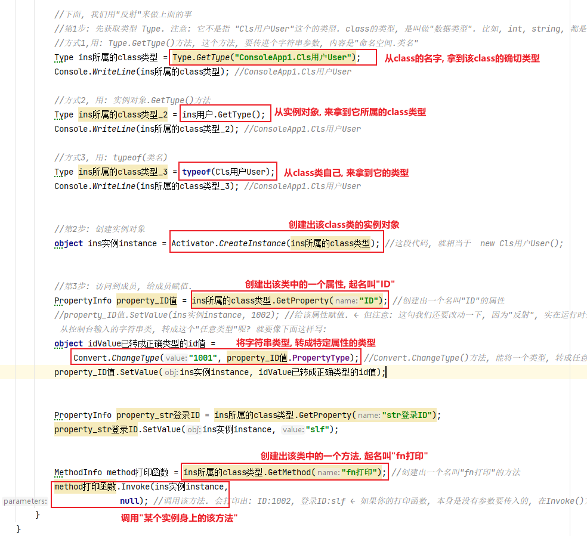
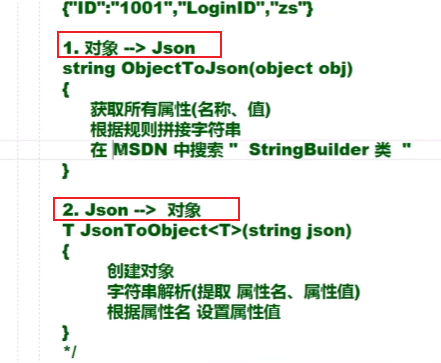
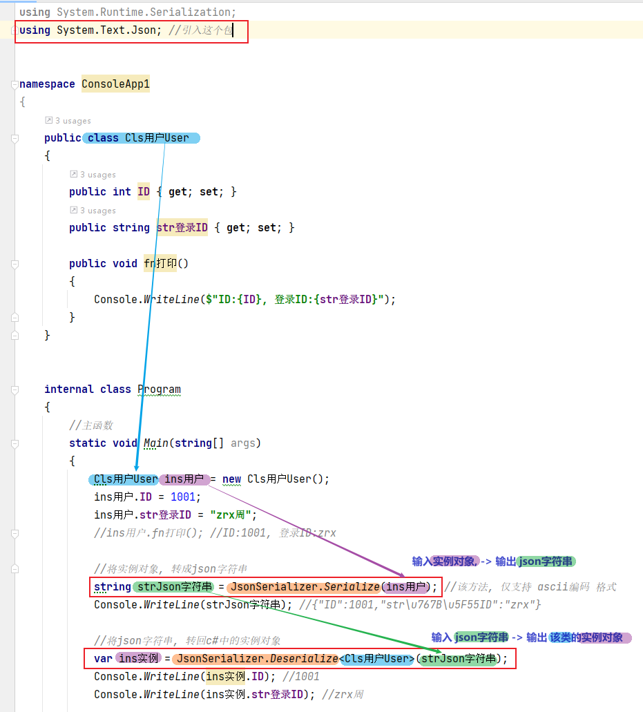
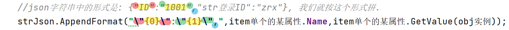

= 反射
:sectnums:
:toclevels: 3
:toc: left
''''

== 反射

定义: 动态获取类型信息,动态创建对象,动态访问成员的过程.

*作用: 在编译时无法了解类型，在运行时获取类型信息，创建对象，访问成员.*

流程: +
1.得到数据类型 +
2.动态创建对象 +
3．查看类型信息（了解本身信息, 成员信息）. +

'''

== 第1步: 如何获得数据的类型Type?

==== 方式一: Type.GetType(“类型全名”)

适合于类型的名称已知的情境下.

'''

==== 方式二: obj. GetType()

适合于"类型的名称"未知, "类型"也未知 , 但存在"已有对象"的情况下

'''

==== 方式三: typeof(类型)

适合于已知类型.

'''

==== 方式四: Assembly.Load(“XXX”). GetType(“名字”) ← 这个方法基本不使用它.

适合于类型在另一个程序集中。

'''

== 第2步:动态创建对象
== 第3步:查看类型信息

[,subs=+quotes]
----
using ConsoleApp2;
using System.Diagnostics;
using System.Reflection;
using System.Runtime.Serialization;

namespace ConsoleApp1 {
    //下面的类中, 会用到一个数据类型T, 该T类型到底是哪种具体的类型, 会由用户之后来自行指定.它可能是任何类型.

    public class Cls用户User {
        public int ID { get; set; }
        public string str登录ID { get; set; }

        public void fn打印() {
            Console.WriteLine($"ID:{ID}, 登录ID:{str登录ID}");
        }
    }

    internal class Program {
        //主函数
        static void Main(string[] args) {
            Cls用户User ins用户 = new Cls用户User();
            ins用户.ID = 1001;
            ins用户.str登录ID = "zrx";
            ins用户.fn打印(); //ID:1001, 登录ID:zrx

            //下面, 我们用"反射"来做上面的事
            *//第1步: 先获取类型 Type. 注意: 它不是指 "Cls用户User"这个的类型. class的类型, 是叫做"数据类型". 比如, int, string, 都是"数据类型". 而反射, 获取的是"类型 Type", 而不是"数据类型"!*
            *//方式1,用: Type.GetType()方法, 这个方法, 要传进个字符串参数, 内容是"命名空间.类名"*
            Type ins所属的class类型 = Type.GetType("ConsoleApp1.Cls用户User");
            Console.WriteLine(ins所属的class类型); //ConsoleApp1.Cls用户User

            *//方式2, 用: 实例对象.GetType()方法*
            Type ins所属的class类型_2 = ins用户.GetType();
            Console.WriteLine(ins所属的class类型_2); //ConsoleApp1.Cls用户User

            **//方式3, 用: typeof(类名) **
            Type ins所属的class类型_3 = typeof(Cls用户User);
            Console.WriteLine(ins所属的class类型_3); //ConsoleApp1.Cls用户User

            *//第2步: 创建实例对象*
            object ins实例instance = Activator.CreateInstance(ins所属的class类型); //这段代码, 就相当于  new Cls用户User();

            *//第3步: 访问到成员, 给成员赋值.*
            PropertyInfo property_ID值 = ins所属的class类型.GetProperty("ID"); //创建出一个名叫"ID"的属性
            //property_ID值.SetValue(ins实例instance, 1002); //给该属性赋值. ← 但注意: 这句我们还要改动一下, *因为"反射", 实在运行时来赋值的, 而运行时, 你只能在控制台传入(输入)字符串. 那如何把字符串的"1002", 转成int类型的1002呢? 更进一步, 你的"ID"属性, 可能也不是int类型, 而是任何类型都有可能, 那怎么把你从控制台输入的字符串类, 转成这个"任意类型"呢? 就要像下面这样写:*
            object idValue已转成正确类型的id值 =
                Convert.ChangeType("1001", property_ID值.PropertyType); *//Convert.ChangeType()方法, 能将一个类型, 转成任意类型.*
            property_ID值.SetValue(ins实例instance, idValue已转成正确类型的id值);

            PropertyInfo property_str登录ID = ins所属的class类型.GetProperty("str登录ID");
            property_str登录ID.SetValue(ins实例instance, "slf");

            MethodInfo method打印函数 = ins所属的class类型.GetMethod("fn打印"); *//创建出一个名叫"fn打印"的方法*
            method打印函数.Invoke(ins实例instance,
                null); *//调用该方法.* 会打印出: ID:1002, 登录ID:slf ← 如果你的打印函数, 本身是没有参数要传入的, 在Invoke()方法的第二个参数位置处, 就写null
        }
    }
}
----

有了反射, 我们就能利用 json文件, 来批量动态创建我们想要的"任何类型的实例对象"了.

'''

== "object对象", 和 "json字符串"之间的互相转换

==== ★ 方法1 : -> 用 System.Text.Json 命名空间中的函数.

[,subs=+quotes]
----
using ConsoleApp2;
using System.Diagnostics;
using System.Reflection;
using System.Runtime.Serialization;
*using System.Text.Json; //引入这个包*

namespace ConsoleApp1
{
    public class Cls用户User
    {
        public int ID { get; set; }
        public string str登录ID { get; set; }

        public void fn打印()
        {
            Console.WriteLine($"ID:{ID}, 登录ID:{str登录ID}");
        }
    }

    internal class Program
    {
        //主函数
        static void Main(string[] args)
        {
            Cls用户User ins用户 = new Cls用户User();
            ins用户.ID = 1001;
            ins用户.str登录ID = "zrx周";
            //ins用户.fn打印(); //ID:1001, 登录ID:zrx

            *//将实例对象, 转成json字符串*
            *string strJson字符串 = JsonSerializer.Serialize(ins用户); //该方法, 仅支持 ascii编码 格式*
            Console.WriteLine(strJson字符串); //{"ID":1001,"str\u767B\u5F55ID":"zrx"}

            *//将json字符串, 转回c#中的实例对象*
            *var ins实例 = JsonSerializer.Deserialize<Cls用户User>(strJson字符串);*
            Console.WriteLine(ins实例.ID); //1001
            Console.WriteLine(ins实例.str登录ID); //zrx周

        }
    }
}
----

'''

==== 实例对象, 和 json字符串, 互转 , 我们自己手动来编写代码

[,subs=+quotes]
----
using System.Reflection;
using System.Text;

namespace ConsoleApp2;

public class ClsJson与对象互转_JsonHelp
{
    *//对象转Json*
    public static string fnObject转Json(object obj实例)
    {
        Type classType = obj实例.GetType(); //通过反射, 先从该实例对象,来获取它所属的class类型

        //通过反射, 来获取该class类型里的所有属性
        PropertyInfo[] arr所有属性 = classType.GetProperties();

        StringBuilder strJson字符串 = new StringBuilder(); //创建出一个可变字符串变量, 用来存放下面会得到的"具体的某个实例对象"身上的某属性名, 和属性值.
        strJson字符串.Append("{");

        foreach (var item单个的某属性 in arr所有属性)
        {
            //item单个的某属性.Name; //拿到属性名
            //item单个的某属性.GetValue(obj实例); //拿到"该类的某个具体实例对象"身上的该属性的属性值
            //json字符串中的形式是: {"ID":"1001","str登录ID":"zrx"}, 我们就按这个形式拼.
            strJson字符串.AppendFormat("\"{0}\":\"{1}\",", item单个的某属性.Name,
                item单个的某属性.GetValue(obj实例));
            //StringBuilder类的AppendFormat()方法能够追加格式化的字符串，有了AppendFormat方法，就不必使用String类的Format方法了
        }

        //上面, 列表中的最后一个键值对元素, 后面会有一个逗号, 而json是不需要最后有逗号的. 所以我们还要把这最后一个键值对元素末尾多出来的逗号, 删除掉.
        strJson字符串.Remove(strJson字符串.Length - 1, 1); //该方法的两个参数是: (1)从哪个索引处开始删, (2)删几个? 那我们就从最后一个字符的索引位置处删, 就删它一个.
        strJson字符串.Append("}");

        return strJson字符串.ToString();
    }

    *//Json字符串,转成对象实例.* 步骤是: 1.先获取类型, 2.创建出该类型的实例对象, 3. 创建出该类的属性, 并给特定实例对象身上的属性赋值
    public static T fnJson转Object<T>(string json字符串) where T : new()
    //where T : *new() 这表明T必须有无参构造函数，且如果有多个where约束，new()放在最后面*
    {
        //返回一个泛型类型的对象, 即任意对象.
        *//下面的代码没问题, 但有点多此一举. 因为既然我们已经有了T类型, 那直接 new T() 不就行了吗?*
        // Type classType具体类型 = typeof(T); //获取T这个泛型类型的具体类型.
        // object insObj实例 = Activator.CreateInstance(classType具体类型); //创建出该class类的具体实例.

        T insObj实例 = new T(); //T现在依然是个泛型
        Type type具体类型 = insObj实例.GetType(); // 我们要拿到这个实例的具体类型

        //上面, 实例对象有了, 我们就要从json字符串中, 把属性名和属性值, 提取出来.
        //我们先把 " {"ID":"1001","str登录ID":"zrx"} " 这个字符串, 去掉里面的双引号和大括号, 变成 " ID:1001,str登录ID:zrx " 的这个字符串.
        string str我们想要的形式 = json字符串.Replace("\"", string.Empty).Replace("{", string.Empty).Replace("}", string.Empty);
        //Replace()方法, 作用是: 把第一个参数中的字符串, 替换成第二个字符串(本例是替换成空字符串).

        string[] arr字符串键值对 = str我们想要的形式.Split(':', ',');
        *//以冒号和逗号为切割处, 把一个字符串, 切割成几段, 放到一个数组中. ← String.Split() 可使用多个分隔符(切割处)*
        //这个"arr字符串键值对"数组中的值, 就是: {"属性1的名字","属性1的值","属性2的名字","属性2的值",...}, 即, 偶数索引处的元素,是存的"属性名"; 单数索引处的元素,是存的"属性值".

        for (int i = 0; i < arr字符串键值对.Length; i += 2)
        {
            PropertyInfo prp属性 = type具体类型.GetProperty(arr字符串键值对[i]);
            *//传入属性名字, 拿到该属性*

            object objValue属性值 = Convert.ChangeType(arr字符串键值对[i + 1], prp属性.PropertyType);
            prp属性.SetValue(insObj实例, objValue属性值);
            *//上面, 给特定的实例对象中的该属性, 赋值. 但注意: 实例对象中的属性值, 有可能是 int或其他类型的, 但你json字符串中的该"属性值", 却是以"字符串"形式存储的. 所以, 你还必须把字符串形式, 转成int等类型才行.*
        }

        return insObj实例;
    }
}
----

然后, 在main文件中调用上面的两个转换方法:

[,subs=+quotes]
----
public class Cls用户User
{
    public int ID { get; set; }
    public string str登录ID { get; set; }

    public void fn打印()
    {
        Console.WriteLine($"ID:{ID}, 登录ID:{str登录ID}");
    }
}

internal class Program
{
    //主函数
    static void Main(string[] args)
    {
        Cls用户User ins用户 = new Cls用户User();
        ins用户.ID = 1001;
        ins用户.str登录ID = "zrx周";
        //ins用户.fn打印(); //ID:1001, 登录ID:zrx

        //下面, 把 "ins用户"这个实例对象, 转成 Json字符串
        *string strJson字符串 = ClsJson与对象互转_JsonHelp.fnObject转Json(ins用户);*
        //Console.WriteLine(strJson字符串); //{"ID":"1001","str登录ID":"zrx"}

        //下面, 把Json字符串, 重新转回C#中的实例对象.
        *Cls用户User ins用户2 = ClsJson与对象互转_JsonHelp.fnJson转Object<Cls用户User>(strJson字符串);*
        Console.WriteLine(ins用户2.ID); //1001
        Console.WriteLine(ins用户2.str登录ID); //zrx周

    }
}
----

https://www.bilibili.com/video/BV1S4411C72d?p=22&vd_source=52c6cb2c1143f8e222795afbab2ab1b5

