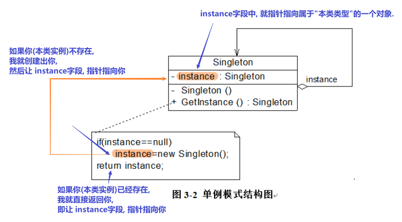
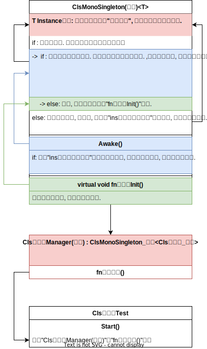
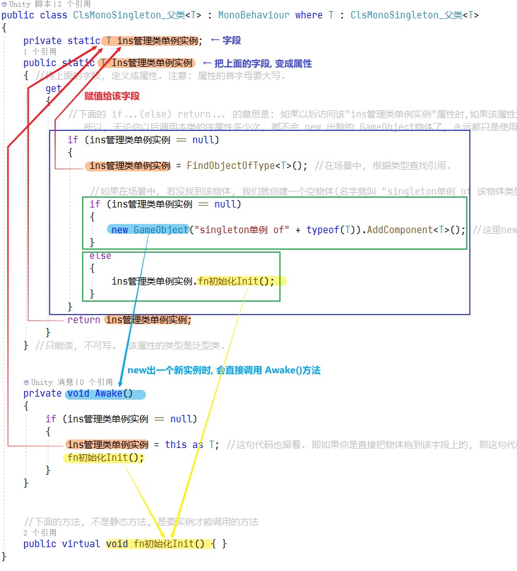
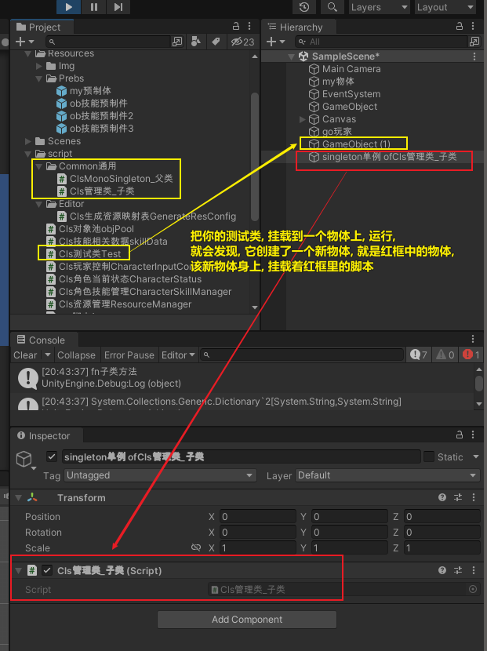

= 单例模式
:sectnums:
:toclevels: 3
:toc: left
''''

== 单例模式

某个class类, 用作"管理"其他东西的话, 那它就只需一个实例就行了.

[,subs=+quotes]
----
using System.Collections;
using System.Collections.Generic;
using UnityEngine;

//下面的类, 是个泛型类, 该泛型的具体类型, 其实是下面类的子类的类型.
public class ClsMonoSingleton_父类<T> : MonoBehaviour where T : ClsMonoSingleton_父类<T>
{
    private static T ins管理类单例实例;
    public static T Ins管理类单例实例
    { //将上面的字段, 定义成属性. 注意: 属性的首字母要大写.
        get
        {
            //下面的 if...(else) return... 的意思是: 如果以后访问该"ins管理类单例实例"属性时,如果该属性还没有值, 就创建一个值(即创建一个"GameObject物体1号"), 赋给它. 如果已经有值(有之前创建的"GameObject物体1号"存在了)了, 就不创键新的了(不创建2号,3号...了), 直接把"1号"返回. 所以, 无论你以后调用本类的该属性多少次, 都不会 new 出新的 GameObject物体了, 永远都只是使用"1号"物体.这个就是"单例".
            if (ins管理类单例实例 == null)
            {
                ins管理类单例实例 = FindObjectOfType<T>(); //在场景中, 根据类型查找引用.

                //如果在场景中, 若没找到该物体, 我们就创建一个空物体(名字就叫 "singleton单例 of 该物体类型的名字"),然后把本脚本, 挂载到该新物体上.
                if (ins管理类单例实例 == null)
                {
                    new GameObject("singleton单例 of" + typeof(T)).AddComponent<T>(); //这里new出游戏物体的时候, 会立即执行 Awake()方法, 就会执行 Awake()方法 里的 "ins管理类单例实例 = this as T;"语句, 就把本GameObject对象, 直接赋值给了"ins管理类单例实例"属性了.
                }
                else
                {
                    ins管理类单例实例.fn初始化Init();
                }
            }
            return ins管理类单例实例;
        }
    } //只能读, 不可写.  该属性的类型是泛型类.

    private void Awake()
    {
        if (ins管理类单例实例 == null)
        {
            ins管理类单例实例 = this as T; //这句代码也留着. 即如果你是直接把物体拖到该字段上的, 那这句代码就能生效了.
            fn初始化Init();
        }
    }

    //下面的方法, 不是静态方法, 是要实例才能调用的方法
    public virtual void fn初始化Init() { }
}

//下面的类, 继承自父类, 而父类中会用到一个"泛型类型", 该"泛型类型"是什么具体类型呢? 就是其"子类类型".
//那么, 由于子类继承了父类中的成员, 所以父类中的"ins管理类单例实例"属性,  根据"ins管理类单例实例 = this;"这句代码, this显然就是子类的实例了, 所以"ins管理类单例实例"属性中, 存放的就是"子类的实例".
public class Cls管理类_子类 : ClsMonoSingleton_父类<Cls管理类_子类>
{

    public void fn子类方法() {
        Debug.Log("fn子类方法");
}

    // Start is called before the first frame update
    void Start()
    {

    }

    // Update is called once per frame
    void Update()
    {

    }
}

public class Cls测试类Test : MonoBehaviour
{
    private void Start()
    {
        Cls管理类_子类.Ins管理类单例实例.fn子类方法(); //"ins管理类单例实例"属性, 是指向子类实例的, 所以能访问到子类中的方法.
    }
}
----

"ClsMonoSingleton_父类"这个类, 能在哪些场合使用到它呢?

*1.适用性: 当场景中存在唯一的对象时(即不需要多个该对象, 只需一个即可时)，即可让该对象, 继承自"ClsMonoSingleton_父类"类.*

2. 如何使用∶

*-> 继承时, 必须传递子类类型。* 即:
....
public class Cls子类 : ClsMonoSingleton_父类<Cls子类>
....

*-> 在任意脚本生命周期中，通过子类类型访问Instance属性(即"Ins管理类单例实例"属性).* 即:
....
Cls子类.Ins管理类单例实例.fn子类中的方法();
....

'''

