= 技能系统
:sectnums:
:toclevels: 3
:toc: left
''''

== unity 特殊路径/ 特殊目录

== 技能系统

==== [Serializable]

我们创建两个类:

[,subs=+quotes]
----
using System;
using System.Collections;
using System.Collections.Generic;
using UnityEngine;

public enum enm做事枚举类 {
    发展商业,
    发展农业,
    发展教育,
    发展医疗,
    发展养老,
    发展防灾,
    发展文化,
}

*[Serializable] //在unity里，自定义的数据类型, 无法显示在inspectior面板里，需要对定义数据类型的类, 或者结构体 ,使用 [System.Serializable].*
public class Cls做事 **//注意: 加了[Serializable] 的类, 千万不要继承 **默认的MonoBehaviour! 否则[Serializable]的功能就会失效.
{
    public int field_做事id;
    public enm做事枚举类 field_做事name;
    public string field_该做事id的介绍说明;
    public  float field_商业值增减;
    public  float field_农业值增减;
    public  float field_教育值增减;
    public  float field_医疗值增减;
    public  float field_养老值增减;
    public  float field_防灾值增减;
    public  float field_文化值增减;

}

----

对上面"做事类"的管理类
[,subs=+quotes]
----
using System;
using System.Collections;
using System.Collections.Generic;
using UnityEngine;

public class Cls做事管理器:MonoBehaviour
{
    public Cls做事[] arrCls做事;

}

----

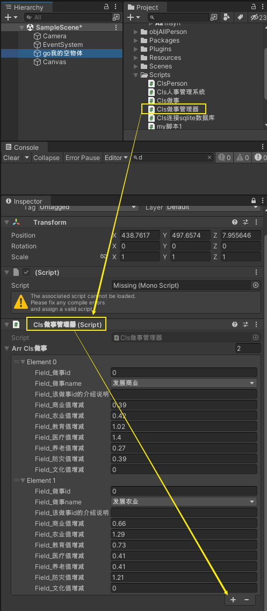

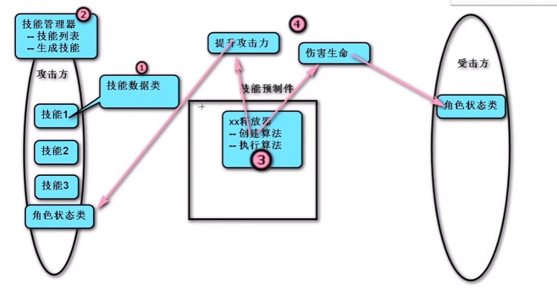

'''

== 按A键, 就释放一个技能(显示一张预制件的图片, 然后2秒后让它销毁)

文件结构如下. 脚本要不要挂载到物体上, 就看你的类, 有没有继承自 ": MonoBehaviour", 有继承, 就说明要挂载到物体上. 没有继承, 就说明不要挂载到物体上.

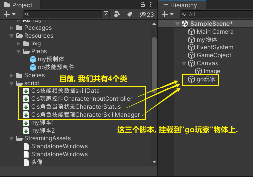

最终有下面这些类, 和所在目录:

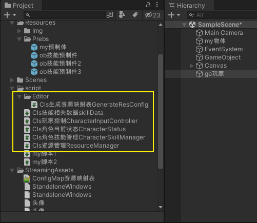

下面, 打 ★ 号的是最新版本.

==== (版本1) Cls技能相关数据skillData

[,subs=+quotes]
----
using System.Collections;
using System.Collections.Generic;
using UnityEngine;

[System.Serializable]
public class Cls技能相关数据skillData  //注意: 本类不需要继承自 MonoBehaviour类 !
{
    public int field_num技能id;
    public string field_str技能名称;

    [Tooltip("对技能详情的多行描述")] *//添加一个tooltip属性, 可以在 instpector面板上提示注释*
    public string field_技能介绍描述;

    public int field_技能所需冷却时间;
    public int field_技能冷却剩余时间;
    public int field_魔法消耗;
    public int field_攻击距离;
    public float field_攻击角度;

    public string[] field_arr攻击目标tags = { "敌人" };
    public Transform[] field_arr攻击目标对象数组;

    public string[] field_使用该技能会付出的成本 = { "魔法值", "健康度" };

    public float field_伤害比例;
    public float field_持续时间;
    public float field_伤害间隔;

    public GameObject field_技能所属的对象owner;
    public string field_技能预制件名称;
    public GameObject field_技能预制件对象;

    public string field_受到打击的预制件名称;
    public GameObject field_受到打击的预制件对象;

    public int field_技能等级;

    [Tooltip("攻击类型是指: 单攻, 还是群攻")]
    public enm技能攻击类型skillAttackType field_攻击类型;

    [Tooltip("选择类型是指: 技能释放出来的攻击形状, 是扇形, 还是矩形")]
    public enm技能形状选择类型 field_技能形状选择类型;

}

public enum enm技能攻击类型skillAttackType { }
public enum enm技能形状选择类型 { }
----

'''

==== ★ (版本2) Cls技能相关数据skillData

[,subs=+quotes]
----
using System.Collections;
using System.Collections.Generic;
using UnityEngine;

[System.Serializable]
public class Cls技能相关数据skillData  //注意: 本类不需要继承自 MonoBehaviour类 !
{
    public int field_num技能id;
    public string field_str技能名称;

    [Tooltip("对技能详情的多行描述")] //添加一个tooltip属性, 可以在 instpector面板上提示注释
    public string field_技能介绍描述;

    public int field_技能所需冷却时间;
    public int field_技能冷却剩余时间;
    public int field_魔法消耗;
    public int field_攻击距离;
    public float field_攻击角度;

    public string[] field_arr攻击目标tags = { "敌人" };
    public Transform[] field_arr攻击目标对象数组;

    public string[] field_使用该技能会付出的成本 = { "魔法值", "健康度" };

    public float field_伤害比例;
    public float field_持续时间;
    public float field_伤害间隔;

    public GameObject field_技能所属的对象owner;
    public string field_技能预制件名称;
    public GameObject field_技能预制件对象;

    public string field_受到打击的预制件名称;
    public GameObject field_受到打击的预制件对象;

    public int field_技能等级;

    [Tooltip("攻击类型是指: 单攻, 还是群攻")]
    public enm技能攻击类型skillAttackType field_攻击类型;

    [Tooltip("选择类型是指: 技能释放出来的攻击形状, 是扇形, 还是矩形")]
    public enm技能形状选择类型 field_技能形状选择类型;

}

public enum enm技能攻击类型skillAttackType { }
public enum enm技能形状选择类型 { }
----

==== (版本1) Cls角色技能管理CharacterSkillManager

[,subs=+quotes]
----
using System;
using System.Collections;
using System.Collections.Generic;
using UnityEngine;

*//这个脚本, 挂载在哪个物体上呢? 哪个角色会发技能, 本脚本就给谁. 我们挂到"go玩家"物体身上.*
public class Cls角色技能管理CharacterSkillManager : MonoBehaviour {
    //所有技能的数值列表. 具体数值会从外部的数据文件中来读取, 来赋值给该列表中的所有元素身上.
    public Cls技能相关数据skillData[] arr所有技能列表; //这个列表中, 存放了你所有的技能实例, 每个技能实例身上, 有一大堆字段数据.

    //对每条技能, 做数据上的初始化.
    public void fn初始化技能InitSkill(Cls技能相关数据skillData ins技能相关数据data) {

        //通过预制件的名字, 来找到该预制件的对象.
        ins技能相关数据data.field_技能预制件对象 = Resources.Load<GameObject>("Prebs/" + ins技能相关数据data.field_技能预制件名称); *//(1)预制件物体, 你存放在 Resources/Prebs/目录下. (2)该预制件物体的名字, 从你的 "Cls技能相关数据skillData"类的实例对象的"field_技能预制件名称"字段的值中来读取出来. 然后和路径拼在一起, 让unity来帮你找到这个预制件物体, (3)然后再把找到的预制件物体, 赋值给"field_技能预制件对象"字段上. (4)注意: 你想使用 Resources.Load()函数, 来帮你加载资源文件的话, 你的文件, 就必须放在Resources目录下! 而不能放在其他目录中.*

        //将本脚本挂载的组件, 赋值给 owner字段. 即本组件,就是技能的"释放者".
        ins技能相关数据data.field_技能所属的对象owner = gameObject;

    }

    //返回一个迭代器
    public IEnumerator fn技能冷却倒计时CoolTimeDown(Cls技能相关数据skillData ins技能相关数据data) {

        ins技能相关数据data.field_技能冷却剩余时间 = ins技能相关数据data.field_技能所需冷却时间; //先读出"技能所需冷却时间", 然后赋值给"技能冷却剩余时间".

        //只要"技能冷却剩余时间"还有, 就让它递减. 即剩余秒数越来越少. 秒数到0后, 就能重新释放下一次技能了(枪管就不热了, 就能重新开枪了)
        while (ins技能相关数据data.field_技能冷却剩余时间 > 0) {
            yield return new WaitForSeconds(1); //等待1秒钟.
            ins技能相关数据data.field_技能冷却剩余时间--;
        }
    }

    ////根据id,在技能列表中,查找到某种技能, 并返回该技能
    //public Cls技能相关数据skillData fn查找某技能Find(int num你要查找的技能id) {
    //    for (int i = 0; i < arr所有技能列表.Length; i++) {
    //        if (arr所有技能列表[i].field_num技能id == num你要查找的技能id) {
    //            return arr所有技能列表[i]; //如果列表中,发现了你要找的"那条技能的id值" 的话,就把该技能, 返回回去
    //        }
    //    }
    //    return null; //没找到, 就返回空.
    //}

    //上面的查找函数, 我们可以把它的参数, 写成一个"委托"类型的. Func<> 能用来引用"具有返回值的函数".Func<> 尖括号中的类型,就是其所指针指向的函数的返回值的类型.
    public Cls技能相关数据skillData fn查找某技能Find(Func<Cls技能相关数据skillData, bool> fn委托指针变量) { *//这里, 我们的函数指针, 会指向一个函数, 这个函数接收一个"Cls技能相关数据skillData"类型的数据, 并返回一个bool类型的值.*
        for (int i = 0; i < arr所有技能列表.Length; i++) {
            if (fn委托指针变量(arr所有技能列表[i]) == true) { *//我们给函数指针变量(假设叫a),所指向的函数(假设叫fnB), 传了个参数进去, 这个参数就是"arr所有技能列表[i]", 这样, fnB()就会处理这个传进来的参数. 然后返回一个bool值. 然后,本"fn查找某技能Find"函数就会根据bool值情况, 来决定是否返回具体的某条技能. 即返回"arr所有技能列表[i]". 这里的具体示意图, 见下面的图片.*
                return arr所有技能列表[i];
            }
        }
        return null;
    }

    //能技能释放, 是需要前提条件的,比如法力值够, 处在冷却状态中等.我们分三步做: (1)根据id,查找到某种技能, (2)判断该技能是否出满足"可释放"的条件. (3)若满足, 则返回该技能.
    public Cls技能相关数据skillData fn技能释放前的准备工作(int num你要查找的技能id) {
        Cls技能相关数据skillData ins找到的那条技能 = fn查找某技能Find(arg => arg.field_num技能id == num你要查找的技能id); *//如果在技能列表中, 找到了你想找那条id的技能, 就把该技能实例, 返回回来, 拿过来.*

        *//进行条件判断, 只有下面三个条件都满足后, 才能进行技能释放. 这三个条件是: (1)根据id查找到技能, 存在. (2)剩余冷却时间是0, 即枪管已冷, 可以重新开枪. (3),角色身上的魔法值, 数量大于技能释放的魔法消耗值.*
        if (ins找到的那条技能 != null && ins找到的那条技能.field_技能冷却剩余时间 <= 0 && ins找到的那条技能.field_魔法消耗 <= GetComponent<Cls角色当前状态CharacterStatus>().field_魔法值SP) { *//GetComponent<脚本名>(); 这句话的意思就是, 从这个脚本所挂载的物体(类的实例)身上, 获取某字段的值.*
            Debug.Log($"找到技能, id={num你要查找的技能id}");
            return ins找到的那条技能;
        }
        else {
            return null; //如果根据id,没找到相应技能, 就返回null
        }

    }

    public void fn生成技能GenerateSkill(Cls技能相关数据skillData ins技能相关数据data) {

        *//将"技能预制件物体", 实例化显示到界面上. 第二个参数是坐标位置, 第三个参数是旋转角度. 下面的语句就是直接用当前的位置和当前的角度.*
        GameObject go技能预制件物体skillGo = Instantiate(ins技能相关数据data.field_技能预制件对象, transform.position, transform.rotation); *//Instantiate(),进行实例化. 也就是对一个对象进行复制克隆操作. 注意: 你在游戏运行前, 把"技能预制件"物体拖到本字段上来的话, 在运行unity后, 该"预制件"物体会丢失, 你要重新给本字段把"预制体"物体拖进来才行.*
        Debug.Log($"获取到技能预制件, 名字是:{go技能预制件物体skillGo.name}");

        //销毁"技能预制件物体". 比如你技能释放完毕后, 就在视觉上消失了, 所以要把"技能预制件物体"销毁掉.
        Destroy(go技能预制件物体skillGo, ins技能相关数据data.field_持续时间); //第二个参数是, 指定多长时间后销毁. 比如我们的技能, 会持续2秒钟, 然后消失. 则, 销毁该预制体, 就要在生成它2秒后再来销毁.

        //开启"技能冷却".因为"fn技能冷却倒计时CoolTimeDown"函数返回一个迭代器, 所以我们要用协程来开启它,让该函数执行.
        StartCoroutine(fn技能冷却倒计时CoolTimeDown(ins技能相关数据data));

    }

    // Start is called before the first frame update
    void Start() {
        for (int i = 0; i < arr所有技能列表.Length; i++) {
            fn初始化技能InitSkill(arr所有技能列表[i]); //将技能列表中的每一条技能, 都给它的数据做初始化操作.
        }

    }

    // Update is called once per frame
    void Update() {

    }
}
----

上面里面, 有一个委托函数的用法, 要重点注意:

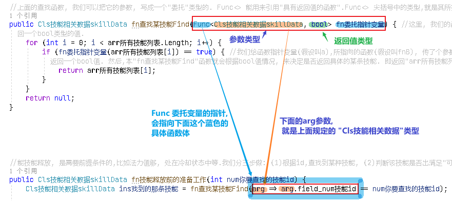

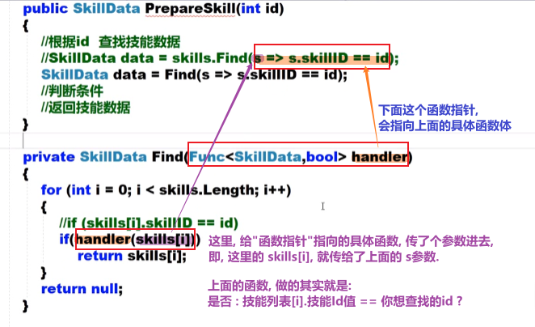

'''

==== ★ (版本2) Cls角色技能管理CharacterSkillManager

[,subs=+quotes]
----
using System;
using System.Collections;
using System.Collections.Generic;
using UnityEngine;

//这个脚本, 挂载在哪个物体上呢? 哪个角色会发技能, 本脚本就给谁. 我们挂到"go玩家"物体身上.
public class Cls角色技能管理CharacterSkillManager : MonoBehaviour {
    //所有技能的数值列表. 具体数值会从外部的数据文件中来读取, 来赋值给该列表中的所有元素身上.
    public Cls技能相关数据skillData[] arr所有技能列表; //这个列表中, 存放了你所有的技能实例, 每个技能实例身上, 有一大堆字段数据.

    //对每条技能, 做数据上的初始化.
    public void fn初始化技能InitSkill(Cls技能相关数据skillData ins技能相关数据data) {

        //通过预制件的名字, 来找到该预制件的对象.
        ins技能相关数据data.field_技能预制件对象 = Cls资源管理ResourceManager.fn加载Load<GameObject>(ins技能相关数据data.field_技能预制件名称); //把从"资源映射表"txt中, 该"技能名字"所对应的"物体路径", 加载到的该技能的GameObject物体 , 返回回来.

        //ins技能相关数据data.field_技能预制件对象 = Resources.Load<GameObject>("Prebs/" + ins技能相关数据data.field_技能预制件名称); //(1)预制件物体, 你存放在 Resources/Prebs/目录下. (2)该预制件物体的名字, 从你的 "Cls技能相关数据skillData"类的实例对象的"field_技能预制件名称"字段的值中来读取出来. 然后和路径拼在一起, 让unity来帮你找到这个预制件物体, (3)然后再把找到的预制件物体, 赋值给"field_技能预制件对象"字段上. (4)注意: 你想使用 Resources.Load()函数, 来帮你加载资源文件的话, 你的文件, 就必须放在Resources目录下! 而不能放在其他目录中.

        //将本脚本挂载的组件, 赋值给 owner字段. 即本组件,就是技能的"释放者".
        ins技能相关数据data.field_技能所属的对象owner = gameObject;

    }

    //返回一个迭代器
    public IEnumerator fn技能冷却倒计时CoolTimeDown(Cls技能相关数据skillData ins技能相关数据data) {

        ins技能相关数据data.field_技能冷却剩余时间 = ins技能相关数据data.field_技能所需冷却时间; //先读出"技能所需冷却时间", 然后赋值给"技能冷却剩余时间".

        //只要"技能冷却剩余时间"还有, 就让它递减. 即剩余秒数越来越少. 秒数到0后, 就能重新释放下一次技能了(枪管就不热了, 就能重新开枪了)
        while (ins技能相关数据data.field_技能冷却剩余时间 > 0) {
            yield return new WaitForSeconds(1); //等待1秒钟.
            ins技能相关数据data.field_技能冷却剩余时间--;
        }
    }

    ////根据id,在技能列表中,查找到某种技能, 并返回该技能
    //public Cls技能相关数据skillData fn查找某技能Find(int num你要查找的技能id) {
    //    for (int i = 0; i < arr所有技能列表.Length; i++) {
    //        if (arr所有技能列表[i].field_num技能id == num你要查找的技能id) {
    //            return arr所有技能列表[i]; //如果列表中,发现了你要找的"那条技能的id值" 的话,就把该技能, 返回回去
    //        }
    //    }
    //    return null; //没找到, 就返回空.
    //}

    //上面的查找函数, 我们可以把它的参数, 写成一个"委托"类型的. Func<> 能用来引用"具有返回值的函数".Func<> 尖括号中的类型,就是其所指针指向的函数的返回值的类型.
    public Cls技能相关数据skillData fn查找某技能Find(Func<Cls技能相关数据skillData, bool> fn委托指针变量) { //这里, 我们的函数指针, 会指向一个函数, 这个函数接收一个"Cls技能相关数据skillData"类型的数据, 并返回一个bool类型的值.
        for (int i = 0; i < arr所有技能列表.Length; i++) {
            if (fn委托指针变量(arr所有技能列表[i]) == true) { //我们给函数指针变量(假设叫a),所指向的函数(假设叫fnB), 传了个参数进去, 这个参数就是"arr所有技能列表[i]", 这样, fnB()就会处理这个传进来的参数. 然后返回一个bool值. 然后,本"fn查找某技能Find"函数就会根据bool值情况, 来决定是否返回具体的某条技能. 即返回"arr所有技能列表[i]". 这里的具体示意图, 见下面的图片.
                return arr所有技能列表[i];
            }
        }
        return null;
    }

    //能技能释放, 是需要前提条件的,比如法力值够, 处在冷却状态中等.我们分三步做: (1)根据id,查找到某种技能, (2)判断该技能是否出满足"可释放"的条件. (3)若满足, 则返回该技能.
    public Cls技能相关数据skillData fn技能释放前的准备工作(int num你要查找的技能id) {

        Cls技能相关数据skillData ins找到的那条技能 = fn查找某技能Find(arg => arg.field_num技能id == num你要查找的技能id); //如果在技能列表中, 找到了你想找那条id的技能, 就把该技能实例, 返回回来, 拿过来.

        //进行条件判断, 只有下面三个条件都满足后, 才能进行技能释放. 这三个条件是: (1)根据id查找到技能, 存在. (2)剩余冷却时间是0, 即枪管已冷, 可以重新开枪. (3),角色身上的魔法值, 数量大于技能释放的魔法消耗值.
        if (ins找到的那条技能 != null && ins找到的那条技能.field_技能冷却剩余时间 <= 0 && ins找到的那条技能.field_魔法消耗 <= GetComponent<Cls角色当前状态CharacterStatus>().field_魔法值SP) { //GetComponent<脚本名>(); 这句话的意思就是, 从这个脚本所挂载的物体(类的实例)身上, 获取某字段的值.
            Debug.Log($"找到技能, id={num你要查找的技能id}");
            return ins找到的那条技能;
        }
        else {
            return null; //如果根据id,没找到相应技能, 就返回null
        }

    }

    public void fn生成技能GenerateSkill(Cls技能相关数据skillData ins技能相关数据data) {

        //将"技能预制件物体", 实例化显示到界面上. 第二个参数是坐标位置, 第三个参数是旋转角度. 下面的语句就是直接用当前的位置和当前的角度.
        GameObject go技能预制件物体skillGo = Instantiate(ins技能相关数据data.field_技能预制件对象, transform.position, transform.rotation); //Instantiate(),进行实例化. 也就是对一个对象进行复制克隆操作. 注意: 你在游戏运行前, 把"技能预制件"物体拖到本字段上来的话, 在运行unity后, 该"预制件"物体会丢失, 你要重新给本字段把"预制体"物体拖进来才行.
        Debug.Log($"获取到技能预制件, 名字是:{go技能预制件物体skillGo.name}");

        //销毁"技能预制件物体". 比如你技能释放完毕后, 就在视觉上消失了, 所以要把"技能预制件物体"销毁掉.
        Destroy(go技能预制件物体skillGo, ins技能相关数据data.field_持续时间); //第二个参数是, 指定多长时间后销毁. 比如我们的技能, 会持续2秒钟, 然后消失. 则, 销毁该预制体, 就要在生成它2秒后再来销毁.

        //开启"技能冷却".因为"fn技能冷却倒计时CoolTimeDown"函数返回一个迭代器, 所以我们要用协程来开启它,让该函数执行.
        StartCoroutine(fn技能冷却倒计时CoolTimeDown(ins技能相关数据data));

    }

    // Start is called before the first frame update
    void Start() {
        for (int i = 0; i < arr所有技能列表.Length; i++) {
            fn初始化技能InitSkill(arr所有技能列表[i]); //将技能列表中的每一条技能, 都给它的数据做初始化操作.
        }

    }

    // Update is called once per frame
    void Update() {

    }
}

----

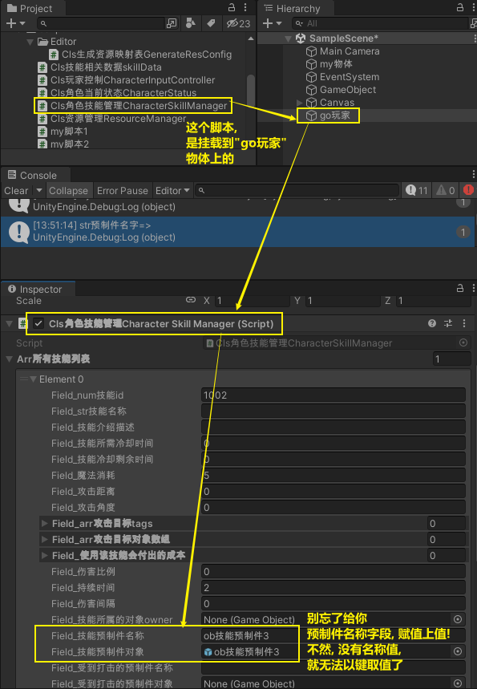

'''

==== ★ Cls角色当前状态CharacterStatus

[,subs=+quotes]
----
using System.Collections;
using System.Collections.Generic;
using UnityEngine;

public class Cls角色当前状态CharacterStatus : MonoBehaviour
{
    public int field_魔法值SP;

}

----

'''

==== (版本1) Cls玩家控制CharacterInputController

[,subs=+quotes]
----
using System.Collections;
using System.Collections.Generic;
using UnityEngine;

public class Cls玩家控制CharacterInputController : MonoBehaviour
{
    // Start is called before the first frame update
    void Start()
    {

    }

    // Update is called once per frame
    void Update()
    {
        fn按下按钮_释放技能();
    }

    public void fn按下按钮_释放技能() {
        //"技能的释放"管理, 在"Cls角色技能管理CharacterSkillManager"类里面
        Cls角色技能管理CharacterSkillManager ins角色技能管理器 = GetComponent<Cls角色技能管理CharacterSkillManager>(); //先获取到"Cls角色技能管理"组件

        if (Input.GetKeyDown(KeyCode.A)) {
            Debug.Log("A键已按下");
            //根据技能id, 来让"Cls角色技能管理"类 告诉我们, 该技能是否可以施放? 若可以, 就把该技能的实例返回给我们.
            Cls技能相关数据skillData ins找到的技能 = ins角色技能管理器.fn技能释放前的准备工作(num你要查找的技能id: 1002);

            if (ins找到的技能 != null) {
                ins角色技能管理器.fn生成技能GenerateSkill(ins找到的技能); //依然叫让"Cls角色技能管理"类,来帮我们释放这条技能.
                ;
            }
        }

    }
}

----

==== ★ (版本2) Cls玩家控制CharacterInputController

[,subs=+quotes]
----
using System.Collections;
using System.Collections.Generic;
using UnityEngine;

public class Cls玩家控制CharacterInputController : MonoBehaviour
{
    // Start is called before the first frame update
    void Start()
    {

    }

    // Update is called once per frame
    void Update()
    {
        fn按下按钮_释放技能();
    }

    public void fn按下按钮_释放技能()
    {
        //"技能的释放"管理, 在"Cls角色技能管理CharacterSkillManager"类里面
        Cls角色技能管理CharacterSkillManager ins角色技能管理器 = GetComponent<Cls角色技能管理CharacterSkillManager>(); //先获取到"Cls角色技能管理"组件

        if (Input.GetKeyDown(KeyCode.A))
        {
            Debug.Log("A键已按下");
            //根据技能id, 来让"Cls角色技能管理"类 告诉我们, 该技能是否可以施放? 若可以, 就把该技能的实例返回给我们.
            Cls技能相关数据skillData ins找到的技能 = ins角色技能管理器.fn技能释放前的准备工作(num你要查找的技能id: 1002);

            if (ins找到的技能 != null)
            {
                ins角色技能管理器.fn生成技能GenerateSkill(ins找到的技能); //依然叫让"Cls角色技能管理"类,来帮我们释放这条技能.
                ;
            }
        }

    }
}

----

'''

==== ★ Cls生成资源映射表GenerateResConfig

[,subs=+quotes]
----
using System.Collections;
using System.Collections.Generic;
using System.IO;
using UnityEditor;
using UnityEngine;

public class Cls生成资源映射表GenerateResConfig : Editor //本类, 必须继承自 Editor类
{
    [MenuItem("Tools/Resources/生成资源映射文件")] //这个特性, 能在你unity菜单上, 生成这个字符串中路径的菜单.
    public static void fn生成资源映射文件Generate() { //这个函数, 用来生成"资源配置文件"

        //第1步: 查找 Resources目录下, 所有预制件的完整路径
        string[] arr路径; //下面会找到的所有物体的路径, 会存到这个数组里.

        arr路径 = AssetDatabase.FindAssets("t:prefab", new string[] { "Assets/Resources" }); //第1个参数, t用来表示要查找类型, 类型是什么呢? 就是冒号后面的 扩展名是 .prefab 的所有文件. 即预制件文件. 第2个参数,就是在什么目录中查找. 该函数, 会返回找到的所有物体的 GUID值(全局唯一标识符), 就是ID值.

        //我们还要继续把该物体的GUID值,转成该物体所在的路径,后者才是我们想要的
        for (int i = 0; i < arr路径.Length; i++) {
            arr路径[i] = AssetDatabase.GUIDToAssetPath(arr路径[i]); //把guid值, 转成路径后, 重新覆盖掉数组中的当前元素值

            //现在, "arr路径"这个数组中, 每条元素的值就是如: "Assets/Resources/Prebs/my预制体.prefab".
            //那么它的"资源名称"是什么呢? 就是不带扩展名的"my预制体".
            //该资源的路径是什么呢? 从Resources下开始的路径,即 Prebs目录. 注意: Resources本身是不需要带在路径里的!

            //第2步: 生成对应关系, 即: 资源名称=其路径
            string str文件名 = Path.GetFileNameWithoutExtension(arr路径[i]); //拿到不带扩展名的文件名

            string str文件路径 = arr路径[i].Replace("Assets/Resources/", string.Empty).Replace(".prefab", string.Empty); //路径怎么提取出来呢? 直接把完整的路径, 把里面开头的"Assets/Resources"这部分字符串删了就行. 然后继续把末尾的".prefab"扩展名字符串也删了.

            arr路径[i] = str文件名 +"="+ str文件路径; //这里, 我们就以"my预制体=Prebs"的字符串形式, 来重新存到这个数组中, 覆盖掉"处理前的路径值".
            //现在, 数组中的元素, 就行如"my预制体=Prebs/my预制体"这种字符串了. 这正是我们想要的形式. 等号前面是物体文件名, 等号后面是它的路径.

        }

        //第3步: 把上面的映射关系, 写入文件中. 下面的 "File.WriteAllLines(写入路径, 数组)" 方法, 能将你给的数组, 每个元素写在一行上, 写到该路径中的文件中.
        File.WriteAllLines("Assets/StreamingAssets/ConfigMap资源映射表.txt", arr路径); //注意: 如果你想让你的资源, 被pc, ios, 安卓都能识别的话, 就必须存在 StreamingAssets 目录中. 像这种 unity特殊目录, 还有那些, 你可以去搜索.
        //下面, 如何生成这个txt呢? 就在你 unity中 菜单 Tools -> Resources -> 生成资源映射文件, 点击它, 就能生成txt了. 如果你看不到txt文件, 是因为unity刷新慢. 你可以在win10的自己的资源管理器中, 打开该目录, 就能看到这个txt.
        //每次你 unity中"预制件物体"数量有变化时, 就要点击这个按钮来更新本"资源映射表"txt文件.

        AssetDatabase.Refresh(); //也可以手动刷新unity. 加上这句代码即可.

    }

}

----

'''

==== ★ Cls资源管理ResourceManager

[,subs=+quotes]
----
using System.Collections;
using System.Collections.Generic;
using System.IO;
using UnityEngine;
using UnityEngine.Networking;

public class Cls资源管理ResourceManager
{
    static Dictionary<string, string> dict字典集合ConfigMap =new Dictionary<string, string>(); //这个字典, 会用来存放我们从"资源映射表"txt中,将里面的 string 转成 Dictionary类型 的数据. 注意: 这里不能只声明字典, 而不创建实例. 即,必须创建出字典实例, 否则, 下面给它添加元素时, 就会报错, 提示空引用. 这是很明显的, 如果字典连具象的身体都没有呢, 怎么添加元素呢?

    //下载并解析"资源映射表"txt文件. 这个我们要在本类的"静态构造方法"里来做. 类的"静态构造方法", 作用是: 初始化类中的静态成员. 它什么时候会做呢? 是在类被加载时, 就执行一次.
    static Cls资源管理ResourceManager()
    { //静态构造方法

        //先加载"资源映射表"文件
        string str资源映射表的文件名 = "ConfigMap资源映射表.txt";
        string str资源映射表文件中的内容 = fn加载映射表文件GetConfigFile(str资源映射表的文件名);

        //在解析该"资源映射表"文件, 把里面的内容(键值对), 装到一个字典中.
        fn构建出字典集合BuildMap(str资源映射表文件中的内容);

    }

    //下载"资源映射表"txt文件. 这个文件在StreamingAssets目录中,只能通过 UnityWebRequest 类, 来读取. 要使用这个类, 必须先引入它所在的命名空间: using UnityEngine.Networking;
    public static string fn加载映射表文件GetConfigFile(string str资源映射表的文件名)
    {

        //string url映射表所在路径 = "file://" + Application.streamingAssetsPath + "/ConfigMap资源映射表.txt"; //前面加上的"file://",表示加载的是本地的文件, 而不是http这种网络上的文件. 其实, 这行代码, 在某些手机里面, 可能也是不起作用的, 即读不到这个路径. 所以, 我们要分平台来操作, 重写写成:

        //if(Application.platform == RuntimePlatform.WindowsEditor) { ... }  //这句代码好理解, 但我们一般不会这样写, 而是用 unity宏来写. 如下:

        string url映射表所在路径;  //先声明一个字符串, 之后会给这个字符串赋值.

        //如果在编译器下, 怎么做...
#if UNITY_EDITOR || UNITY_STANDALONE //注意: 这些语句, 不是c#程序, 而是unity自带的宏标签
        url映射表所在路径 = "file://" + Application.dataPath + "/StreamingAssets/" + str资源映射表的文件名; //Application.dataPath此属性, 用于返回程序的数据文件所在文件夹的路径. 在pc上, 就是指 Assets目录

#elif UNITY_IPHONE   //否则如果在Iphone下
            url映射表所在路径 = "file://" + Application.dataPath + "/Raw/"+str资源映射表的文件名;

#elif UNITY_ANDROID  //否则如果在android下
            url映射表所在路径 = "jar:file://" + Application.dataPath + "!/assets/"+str资源映射表的文件名;
#endif

        //下面, 我们通过该映射表所在的文件路径,来拿到该txt文件里的字内容.
        UnityWebRequest ins网络请求 = UnityWebRequest.Get(url映射表所在路径);
        ins网络请求.SendWebRequest();//发起通信, 即发送所请求的要求

        while (true)
        {
            if (ins网络请求.downloadHandler.isDone)
            { //DownloadHandler u是从服务器接收(即下载)数据的对象. 这句代码的意思是, 如果读取完了数据的话
                return ins网络请求.downloadHandler.text;
            }
        }

    }

    //解析"资源映射表"txt文件. 即把 string 变成 Dictionary<string,string>
    public static void fn构建出字典集合BuildMap(string str资源映射表文件内容)
    {

        //这里, 我们要把读到的txt内容, 把它装到字典里. 即存到本类的静态字段 dict字典集合ConfigMap 中.

        //下面的这块代码, 是没问题的, 可以用. 不过教学里提供了另一种方法. 我们就来使用新方法了.
        //string[] arrStr = str资源映射表文件内容.Split("\r\n");

        //foreach (var str单条的映射 in arrStr) {
        //    string[] arr单条的映射键值对 = str单条的映射.Split("=");
        //    dict字典集合ConfigMap.Add(arr单条的映射键值对[0], arr单条的映射键值对[1]);
        //}

        Debug.Log(dict字典集合ConfigMap);

        //教学里的新方法如下. 我们来用 StringReader类, 即字符串读取器.改里面的 ReadLine()方法, 为我们提供了"逐行读取字符串"功能.
        //我们也会用到 using{}, 当退出using的{}代码块时,它能帮我们自动释放小括号()里的"ins字符串读取器"变量(既然是写在小括号里的, 就是说, 该变量即是作为 using的参数来用的). 即退出using{}时, 它会自动帮我们调用 "ins字符串读取器.Dispose()" 方法, 就释放它.
        using (StringReader ins字符串读取器 = new StringReader(str资源映射表文件内容))
        {

            //先读一行
            string str当前读取到的一行 = ins字符串读取器.ReadLine(); //该方法, 会每次只读取字符串(一个字符串可能包含很多行)中的一行内容. 再调一次, 就继续读取下一行. 现在, 读取到的一行, 内容是形如:"my预制体=Prebs/my预制体", 即类似键值对的形式.}

            while (str当前读取到的一行 != null)
            { //当读取到数据的时候,就继续做下面的操作. 如果读取到null时, 就说明整个文件已经都读完了,就跳出该while循环.
                string[] arr存有单行中的键值对 = str当前读取到的一行.Split("=");
                dict字典集合ConfigMap.Add(arr存有单行中的键值对[0], arr存有单行中的键值对[1]);

                str当前读取到的一行 = ins字符串读取器.ReadLine(); //继续读取下一行
            }

        }
    }

    //下面的函数, 根据你传入的预制件的名字, 来找到它所在的路径, 然后把该预制件物体, 返回回去. 注意: 下面的方法, 是静态方法, 而unity脚本生命周期函数, 都是实例来用的.
    public static T fn加载Load<T>(string str预制件名字) where T : Object
    {
        Debug.Log($"str预制件名字=>{str预制件名字}");

        foreach (var item in dict字典集合ConfigMap)
        {
            Debug.Log($"{item.Key}:{item.Value}");
        }

        //我们要把
        string path预制体物体的路径 = dict字典集合ConfigMap[str预制件名字]; //对字典, 以键取值. key就是"预制体的名字", value就是"该名字的预制体的所在路径"
        return Resources.Load<T>(path预制体物体的路径);
    }

}

----

'''

==== 总结: 结构图

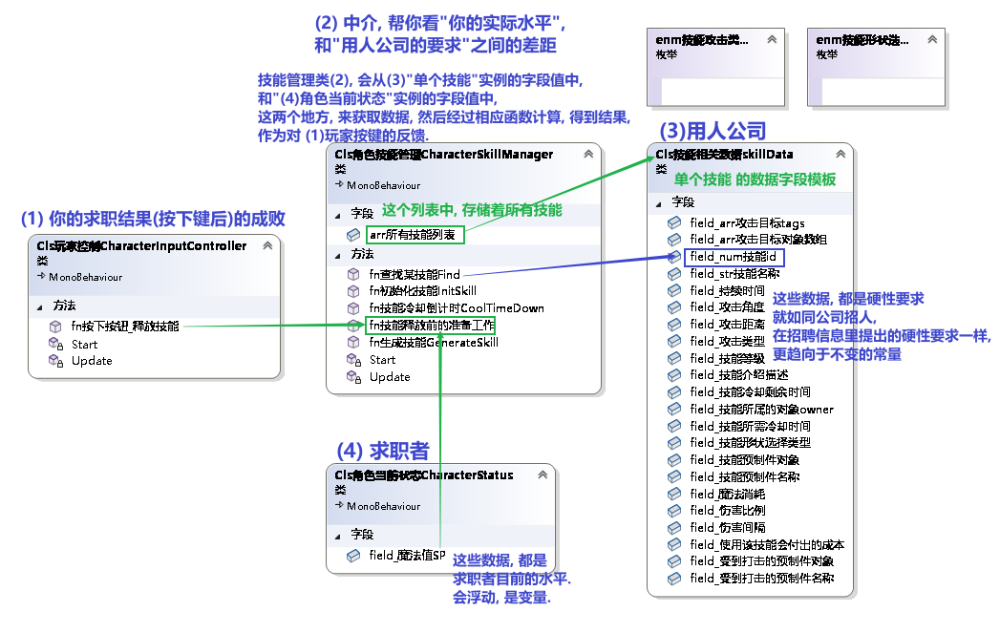

image:img/0185.svg[,]

'''

== 生成"资源映射表"txt文件

资源映射表, 里面存着: 1.资源名称, 和 2.该资源的完整路径.

在你的 script 目录中, 再建一个目录, 名字必须叫  Editor, 这个目录中的脚本文件, 在生成游戏时, 都不会被打包带走. 即它只运行在 unity编辑器中.

下面的类, 不需要加载在任何物体上, 我们会直接把它挂载到unity菜单中, 当做菜单来执行.

这个类"Cls生成资源映射表GenerateResConfig", 放在 Editor 目录下,注意, 必须是这个目录名!

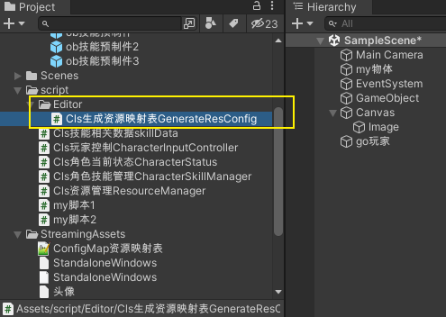

[,subs=+quotes]
----
using System.Collections;
using System.Collections.Generic;
using System.IO;
using UnityEditor;
using UnityEngine;

public class Cls生成资源映射表GenerateResConfig : Editor *//本类, 必须继承自 Editor类. 这个Editor类, 叫做"编译器类", 它只会在unity编译器中执行, 比如作为unity新菜单来用. 所以不需要打包到游戏中.*
{
    *[MenuItem("Tools/Resources/生成资源映射文件")] //这个特性, 能在你unity菜单上, 生成这个字符串中路径的菜单. 这个[MenuItem("...")]特性,就操作"菜单项特性", 用于修饰需要在Unity编译器中产生菜单按钮的函数方法.*
    public static void fn生成资源映射文件Generate() { //这个函数, 用来生成"资源配置文件"

        *//第1步: 查找 Resources目录下, 所有预制件的完整路径*
        string[] arr路径; //下面会找到的所有物体的路径, 会存到这个数组里.

        *arr路径 = AssetDatabase.FindAssets("t:prefab", new string[] { "Assets/Resources" }); //第1个参数, t用来表示要查找类型, 类型是什么呢? 就是冒号后面的 扩展名是 .prefab 的所有文件. 即预制件文件. 第2个参数,就是在什么目录中查找. 该函数, 会返回找到的所有物体的 GUID值(全局唯一标识符), 就是ID值.*
        *//这个AssetDatabase类,只适用于在unity编译器中执行,游戏发布后, 该类是无效的.*

        *//我们还要继续把该物体的GUID值,转成该物体所在的路径,后者才是我们想要的*
        for (int i = 0; i < arr路径.Length; i++) {
            *arr路径[i] = AssetDatabase.GUIDToAssetPath(arr路径[i]); //把guid值, 转成路径后, 重新覆盖掉数组中的当前元素值*

            //现在, "arr路径"这个数组中, 每条元素的值就是如: "Assets/Resources/Prebs/my预制体.prefab".
            *//那么它的"资源名称"是什么呢? 就是不带扩展名的"my预制体".*
            **//该资源的路径是什么呢? 从Resources下开始的路径,即 Prebs目录. 注意: Resources本身是不需要带在路径里的! **

            *//第2步: 生成对应关系, 即: 资源名称=其路径*
            *string str文件名 = Path.GetFileNameWithoutExtension(arr路径[i]); //拿到不带扩展名的文件名*

            *string str文件路径 = arr路径[i].Replace("Assets/Resources/", string.Empty).Replace(".prefab", string.Empty); //路径怎么提取出来呢? 直接把完整的路径, 把里面开头的"Assets/Resources"这部分字符串删了就行. 然后继续把末尾的".prefab"扩展名字符串也删了.*

            arr路径[i] = str文件名 +"="+ str文件路径; //这里, 我们就以"my预制体=Prebs"的字符串形式, 来重新存到这个数组中, 覆盖掉"处理前的路径值".
            //现在, 数组中的元素, 就行如"my预制体=Prebs/my预制体"这种字符串了. 这正是我们想要的形式. 等号前面是物体文件名, 等号后面是它的路径.
        }

        *//第3步: 把上面的映射关系, 写入文件中. 下面的 "File.WriteAllLines(写入路径, 数组)" 方法, 能将你给的数组, 每个元素写在一行上, 写到该路径中的文件中.*
        *File.WriteAllLines("Assets/StreamingAssets/ConfigMap资源映射表.txt", arr路径); //注意: 如果你想让你的资源, 被pc, ios, 安卓都能识别的话, 就必须存在 StreamingAssets 目录中. 像这种 unity特殊目录, 还有那些, 你可以去搜索.*
        *//下面, 如何生成这个txt呢? 就在你 unity中 菜单 Tools -> Resources -> 生成资源映射文件, 点击它, 就能生成txt了. 如果你看不到txt文件, 是因为unity刷新慢. 你可以在win10的自己的资源管理器中, 打开该目录, 就能看到这个txt.*
        //每次你 unity中"预制件物体"数量有变化时, 就要点击这个按钮来更新本"资源映射表"txt文件.

        AssetDatabase.Refresh(); //也可以手动刷新unity. 加上这句代码即可.

    }

}
----

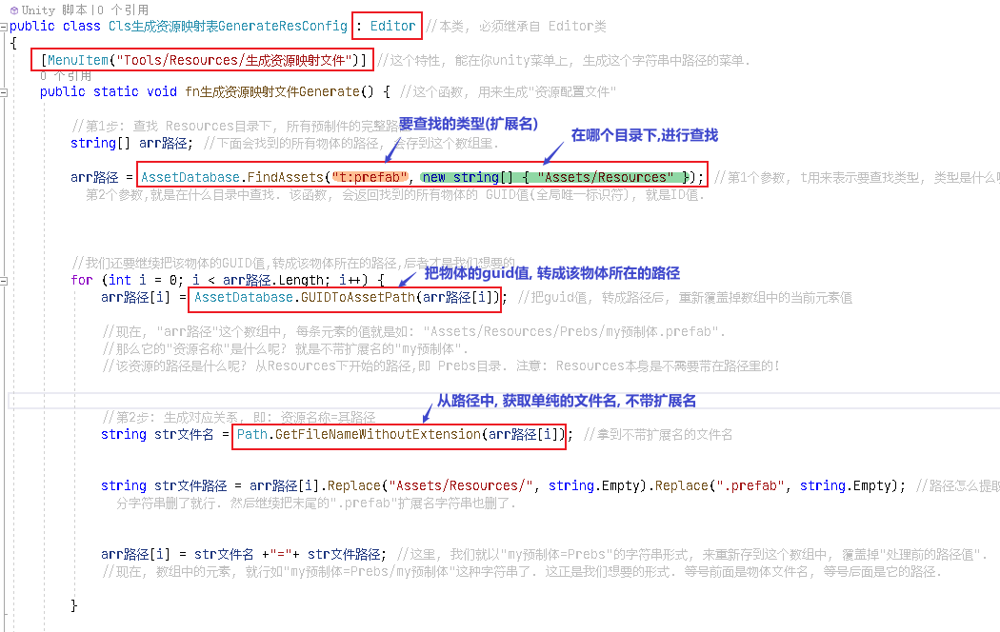

*StreamingAssets 目录, 是Unity特殊目录之一, 打包后, 该目录中的文件是不会被压缩的. 所以适合在移动端读取资源, 但在手机端上, 该目录会被改名, 而且该目录下的文件是只读的, 无法被写入. 它只在pc端才可以写入.*

*那么手机端上, 哪个目录, 才支持写入操作呢? 在 Application.persistentDataPath 这个目录中, 才行. 该目录可以在游戏运行时, 进行读写操作. 所以手机端游戏的数据库文件, 又读又写的,就是放在这个目录中的. 但该目录,只会你游戏发布后, app装在手机上后,才会在手机上存在. 在unity编辑器中, 是不存在的. 因为该目录只存在于手机上.*

*所以, 我们在pc端上能做的操作, 就是把 StreamingAssets 目录中的东西, 拷贝到 Application.persistentDataPath 目录中, 才能在手机上进行读写操作.*

'''

== 读取"资源映射表"txt文件

这个类"Cls资源管理ResourceManager", 放在这里:

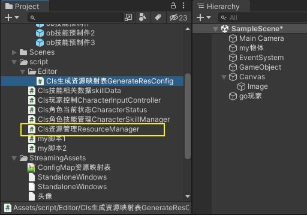

[,subs=+quotes]
----
using System.Collections;
using System.Collections.Generic;
using UnityEngine;

public class Cls资源管理ResourceManager
{
    static Dictionary<string, string> dict字典集合ConfigMap; //这个字典, 会用来存放我们从"资源映射表"txt中,将里面的 string 转成 Dictionary类型 的数据.

    //下载并解析"资源映射表"txt文件. 这个我们要在本类的"静态构造方法"里来做. 类的"静态构造方法", 作用是: 初始化类中的静态成员. 它什么时候会做呢? 是在类被加载时, 就执行一次.
    static Cls资源管理ResourceManager() { //静态构造方法

          string str资源映射表文件中的内容 = fn加载映射表文件GetConfigFile();
        fn构建出字典集合BuildMap(str资源映射表文件中的内容);

    }

    //下载"资源映射表"txt文件. 这个文件在StreamingAssets目录中,只能通过 WWW类中的方法来读取
    public static string fn加载映射表文件GetConfigFile() {

        string url映射表所在路径 ="file://"+ Application.streamingAssetsPath + "/ConfigMap资源映射表.txt"; //前面加上的"file://",表示加载的是本地的文件, 而不是http这种网络上的文件.

        //注意: 下面这块的代码要重写
        WWW.www = new WWW(url映射表所在路径); //注意: 现在WWW已经过时了, 不能用了, 要网上重新找教程了.
        while (true) {
            if (WWW.isDone) {
                return www.text;
            }
        }

    }

    //解析"资源映射表"txt文件. 即把 string 变成 Dictionary<string,string>
    public static string fn构建出字典集合BuildMap(string str资源映射表文件内容) {

        //这里, 我们要把读到的txt内容, 把它装到字典里. 即存到本类的静态字段 dict字典集合ConfigMap 中.
        ....

        dict字典集合ConfigMap = new Dictionary<string, string>();

    }

        //下面的函数, 根据你传入的预制件的名字, 来找到它所在的路径, 然后把该预制件物体, 返回回去. 注意: 下面的方法, 是静态方法, 而unity脚本生命周期函数, 都是实例来用的.
        public static T fn加载Load<T>(string str预制件名字) where T : Object {

        //我们要把
        string path预制体物体的路径 = dict字典集合ConfigMap[str预制体的名字]; //对字典, 以键取值. key就是"预制体的名字", value就是"该名字的预制体的所在路径"
        return Resources.Load<T>(path预制体物体的路径);
    }

}

----

'''
